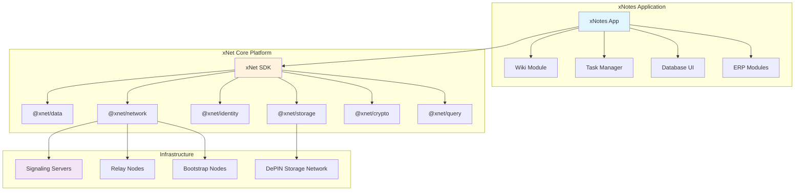
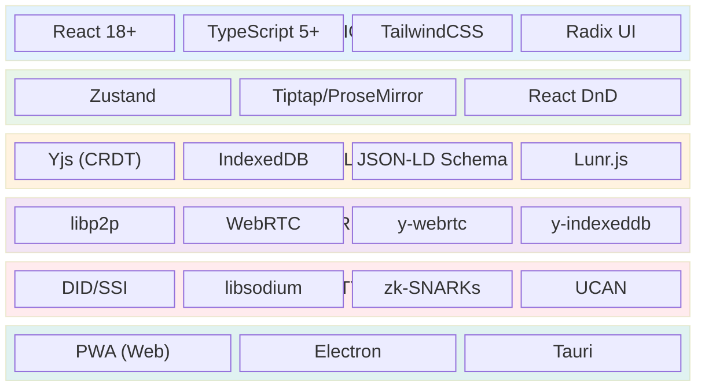
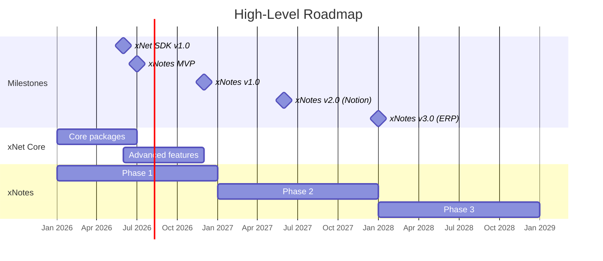
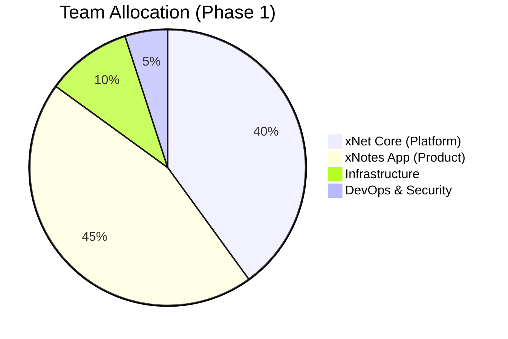

# xNet & xNotes Implementation Plan

> Building the Decentralized Internet and Its Flagship Productivity App

**Version**: 2.0 | **Last Updated**: January 2026

---

## Overview

This plan covers the parallel development of two interconnected projects:

| Project | Description | Role |
|---------|-------------|------|
| **xNet** | Decentralized internet infrastructure | Platform/SDK |
| **xNotes** | Collaborative productivity app | Flagship application |

---

## Plan Documents

| # | Document | Description |
|---|----------|-------------|
| 1 | [xNet Core Platform](./01-xnet-core-platform.md) | SDK architecture, packages, infrastructure |
| 2 | [Development Timeline](./02-development-timeline.md) | Parallel tracks, Gantt chart, milestones |
| 3 | [Phase 1: Wiki & Tasks](./03-phase-1-wiki-tasks.md) | MVP features, technical implementation |
| 4 | [Phase 2: Database UI](./04-phase-2-database-ui.md) | Notion-like databases, views, formulas |
| 5 | [Phase 3: ERP Platform](./05-phase-3-erp.md) | Modules, workflows, plugins |
| 6 | [Engineering Practices](./06-engineering-practices.md) | Security, testing, CI/CD, contributing |
| 7 | [Monetization & Adoption](./07-monetization-adoption.md) | Revenue model, growth strategy |
| 8 | [Appendix: Code Samples](./08-appendix-code-samples.md) | Reference implementations |

**Related Documentation:**
- [Persistence & Durability Architecture](../PERSISTENCE_ARCHITECTURE.md)

---

## Vision

**xNet** is a fully decentralized internet architecture designed for mass adoption—enabling applications where data is local-first, stored on user devices, with P2P syncing and no central servers.

**xNotes** is the flagship application built on xNet—a local-first, peer-to-peer collaborative productivity platform that evolves from a simple wiki and task manager into a fully customizable ERP system.

### Why Decentralized?

| Aspect | Traditional Apps | xNotes |
|--------|------------------|--------|
| Data Storage | Centralized servers | Local-first, user devices |
| Privacy | Vendor has access | E2E encrypted, user-controlled |
| Offline Support | Limited | Full functionality |
| Vendor Lock-in | High | Zero (open formats) |
| Customization | Limited | Fully extensible |
| Cost | Recurring SaaS fees | Free/self-hosted |

---

## Technology Stack

### Key Technology Choices

| Choice | Rationale |
|--------|-----------|
| **React + TypeScript** | Industry standard, massive ecosystem, strong typing |
| **Zustand** | Simpler than Redux, better TypeScript support, React 18 compatible |
| **Tiptap/ProseMirror** | Battle-tested, excellent Yjs integration, rich plugins |
| **Yjs** | Best CRDT for text, mature WebRTC integration, small bundle |
| **libp2p** | Standard for decentralized networking (IPFS/Filecoin) |
| **Tauri** | 10x smaller than Electron, better security, native performance |

---

## Roadmap Overview

| Phase | Duration | Goal | Key Deliverable |
|-------|----------|------|-----------------|
| **Phase 1** | Months 0-12 | Core productivity | Wiki + Task Manager |
| **Phase 2** | Months 12-24 | Database platform | Notion-like UI |
| **Phase 3** | Months 24+ | Enterprise platform | Open-source ERP |

---

## Team Structure

### Initial Team (5-10 developers)

| Role | Count | Focus |
|------|-------|-------|
| Tech Lead / Architect | 1 | System design, P2P infrastructure |
| Senior Frontend Engineers | 2 | React components, editor integration |
| Backend/P2P Engineers | 2 | libp2p, sync protocols, storage |
| Full-Stack Engineers | 2-3 | Features end-to-end |
| DevOps / Security | 1 | CI/CD, security audits |
| Product / UX Designer | 1 | User research, design system |

### Team Allocation by Track

---

## Budget Estimates

| Category | Phase 1 (12 mo) | Phase 2 (12 mo) | Phase 3 (12+ mo) |
|----------|-----------------|-----------------|------------------|
| Personnel (avg $150k/yr) | $1.2M - $1.5M | $1.8M - $2.4M | $3M+ |
| Infrastructure & Tools | $50k | $100k | $200k |
| Security Audits | $50k | $100k | $150k |
| Marketing & Community | $100k | $200k | $500k |
| Contingency (15%) | $210k | $360k | $580k |
| **Total** | **$1.6M - $1.9M** | **$2.6M - $3.2M** | **$4.4M+** |

---

## Success Metrics

| Phase | Primary Metric | Target |
|-------|---------------|--------|
| 1 | Monthly Active Users | 50,000 |
| 2 | Daily Active Users | 100,000 |
| 3 | Enterprise Deployments | 500+ |

### Key Performance Indicators

- **User Retention**: 40%+ monthly retention
- **P2P Sync Success Rate**: >99% message delivery
- **Offline Capability**: 100% features available offline
- **Sync Latency**: <500ms for real-time collaboration
- **Data Durability**: Zero data loss incidents

---

## Quick Links

- **Repository Structure**: See [01-xnet-core-platform.md](./01-xnet-core-platform.md#package-structure)
- **Development Timeline**: See [02-development-timeline.md](./02-development-timeline.md)
- **Getting Started**: See [06-engineering-practices.md](./06-engineering-practices.md#development-setup)
- **Contributing**: See [06-engineering-practices.md](./06-engineering-practices.md#contribution-guidelines)

---

*Document Version: 2.0 | Last Updated: January 2026*
