# 17: Next Steps - Future Vision

> Beyond MVP: Database UI, ERP, Federation, and Global Data Network

This document outlines the long-term vision for xNet beyond the MVP. These features build on the foundation established in phases 0-3.

## Overview

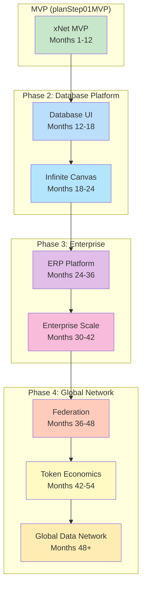

---

## Phase 2: Database Platform (Months 12-24)

Transform xNet into a full Notion-like database platform.

### 2.1 Database UI (Months 12-18)

#### Property Type System

Support 17 property types for structured data:

| Category | Types | Description |
|----------|-------|-------------|
| **Basic** | Text, Number, Checkbox | Simple data types |
| **Temporal** | Date, DateTime, DateRange | Time-based data |
| **Selection** | Select, Multi-Select | Enumerated options |
| **References** | Person, Relation, Rollup | Cross-document links |
| **Computed** | Formula, Created, Updated, CreatedBy | Auto-calculated |
| **Rich** | URL, Email, Phone, Files | Structured strings |

```typescript
// Property type interface
interface PropertyDefinition {
  id: string
  name: string
  type: PropertyType
  config: PropertyConfig
}

// Formula example
interface FormulaConfig {
  expression: string  // "prop('Price') * prop('Quantity')"
  returnType: 'number' | 'text' | 'date' | 'boolean'
}

// Relation example
interface RelationConfig {
  targetDatabase: string
  bidirectional: boolean
  reversePropertyName?: string
}
```

#### View Types

Six view types for data visualization:

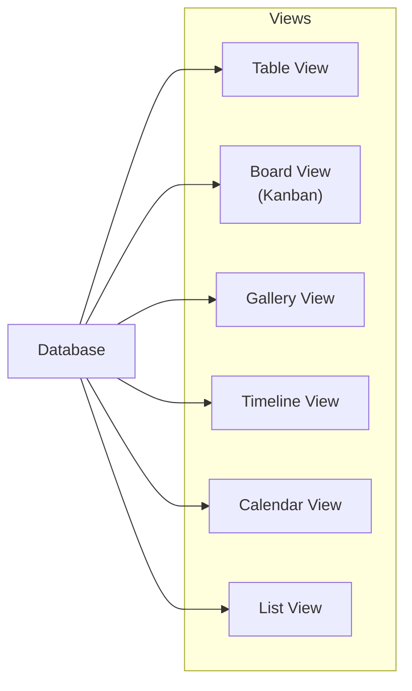

| View | Use Case | Key Features |
|------|----------|--------------|
| Table | Spreadsheet work | Column resize, sort, filter |
| Board | Kanban workflows | Drag-drop, swimlanes |
| Gallery | Visual content | Card layout, cover images |
| Timeline | Project planning | Gantt-style, dependencies |
| Calendar | Date-based items | Month/week/day views |
| List | Simple browsing | Grouped, nested |

#### Formula Engine

Built-in formula engine for computed properties:

```typescript
// Formula categories
const FORMULA_FUNCTIONS = {
  // Math
  math: ['add', 'subtract', 'multiply', 'divide', 'mod', 'pow', 'sqrt', 'abs', 'round', 'floor', 'ceil', 'min', 'max', 'sum', 'average'],

  // String
  string: ['concat', 'substring', 'replace', 'lower', 'upper', 'trim', 'length', 'contains', 'split', 'join'],

  // Date
  date: ['now', 'today', 'dateAdd', 'dateSub', 'dateDiff', 'year', 'month', 'day', 'formatDate'],

  // Logic
  logic: ['if', 'and', 'or', 'not', 'equal', 'empty', 'test'],

  // Rollup
  rollup: ['count', 'countAll', 'countValues', 'countUnique', 'sum', 'average', 'min', 'max', 'median', 'range']
}

// Example formula: Calculate project health
// if(prop("Status") == "At Risk", "🔴", if(prop("Progress") > 80, "🟢", "🟡"))
```

#### Vector Search

AI-powered semantic search:

```typescript
interface VectorSearchConfig {
  model: 'minilm-l6'  // TensorFlow.js compatible
  dimensions: 384
  index: 'hnsw'       // Hierarchical Navigable Small World
  similarity: 'cosine'
}

// Usage
const results = await database.semanticSearch({
  query: "project deadlines approaching",
  limit: 10,
  threshold: 0.7
})
```

### 2.2 Infinite Canvas (Months 18-24)

Transform the document graph into a spatial workspace.

#### Canvas Architecture

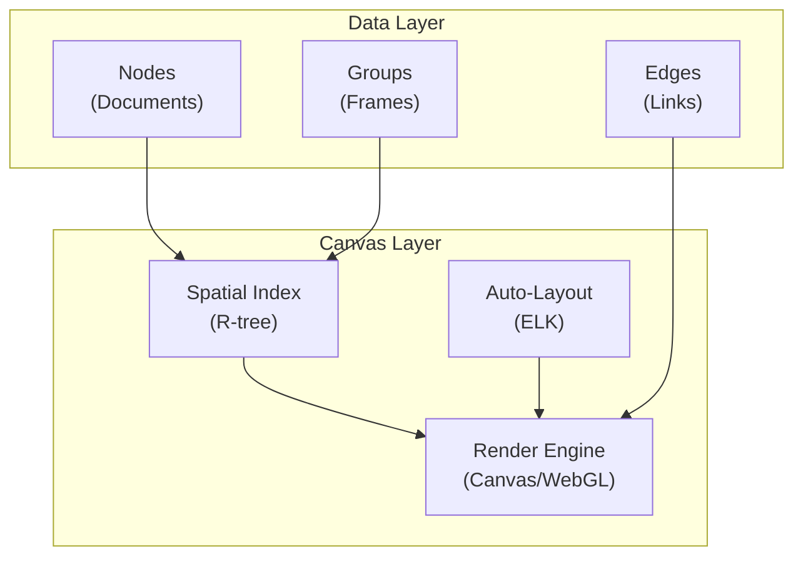

#### Spatial Indexing

R-tree for efficient spatial queries:

```typescript
interface CanvasNode {
  id: string
  documentId: string
  position: { x: number; y: number }
  size: { width: number; height: number }
  rotation: number
  zIndex: number
}

interface SpatialIndex {
  // Query nodes in viewport
  queryRect(bounds: Rect): CanvasNode[]

  // Find nearest nodes
  queryNearest(point: Point, k: number): CanvasNode[]

  // Collision detection
  findOverlaps(node: CanvasNode): CanvasNode[]
}
```

#### Procedural Edge Types

Automatically generated relationships:

| Edge Type | Source | Visual |
|-----------|--------|--------|
| Wikilink | `[[page]]` syntax | Solid arrow |
| Tag | `#tag` matches | Dashed line |
| Shared Attribute | Same property value | Dotted line |
| DB Relation | Relation property | Bold arrow |
| Temporal | Date proximity | Gradient line |

#### Auto-Layout with ELK

```typescript
// Layout algorithms
type LayoutAlgorithm =
  | 'layered'      // Hierarchical DAG
  | 'force'        // Force-directed
  | 'stress'       // Stress minimization
  | 'radial'       // Radial tree
  | 'mrtree'       // Multi-root tree

interface LayoutOptions {
  algorithm: LayoutAlgorithm
  spacing: { node: number; edge: number }
  direction: 'DOWN' | 'RIGHT' | 'UP' | 'LEFT'
  aspectRatio: number
}
```

---

## Phase 3: ERP Platform (Months 24-36)

Build a modular, workflow-driven enterprise platform.

### 3.1 Module System

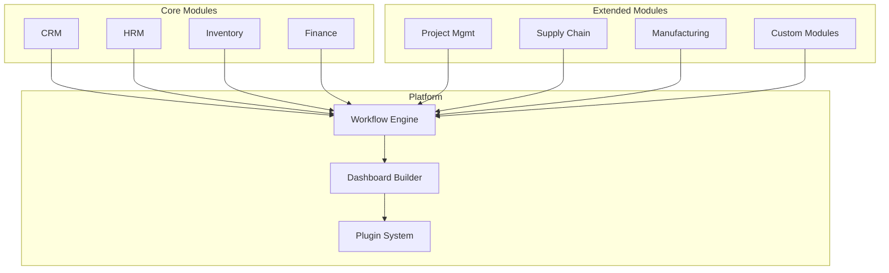

#### Module Definition

```typescript
interface ModuleDefinition {
  id: string
  name: string
  version: string

  // Database schemas this module provides
  schemas: DatabaseSchema[]

  // UI components
  components: {
    views: ComponentDefinition[]
    widgets: ComponentDefinition[]
    forms: FormDefinition[]
  }

  // Workflows this module enables
  workflows: WorkflowDefinition[]

  // Extension points
  hooks: {
    onRecordCreate?: HookHandler
    onRecordUpdate?: HookHandler
    onRecordDelete?: HookHandler
    onWorkflowComplete?: HookHandler
  }
}
```

#### Built-in Modules

| Module | Purpose | Key Databases |
|--------|---------|---------------|
| **CRM** | Customer relationships | Contacts, Companies, Deals, Activities |
| **HRM** | Human resources | Employees, Departments, Leave, Reviews |
| **Inventory** | Stock management | Products, Warehouses, Movements, Orders |
| **Finance** | Accounting | Accounts, Transactions, Invoices, Reports |
| **Project** | Project management | Projects, Tasks, Milestones, Resources |
| **Supply Chain** | Procurement | Suppliers, POs, Shipments, Receipts |

### 3.2 Workflow Engine

Visual workflow builder for automation.

#### Workflow Components

```typescript
// Trigger types
type WorkflowTrigger =
  | { type: 'manual' }
  | { type: 'schedule'; cron: string }
  | { type: 'propertyChange'; database: string; property: string }
  | { type: 'recordCreate'; database: string }
  | { type: 'recordUpdate'; database: string }
  | { type: 'recordDelete'; database: string }
  | { type: 'webhook'; path: string }
  | { type: 'email'; pattern: string }

// Condition types
type WorkflowCondition =
  | { type: 'propertyEquals'; property: string; value: unknown }
  | { type: 'propertyContains'; property: string; value: string }
  | { type: 'formula'; expression: string }
  | { type: 'and'; conditions: WorkflowCondition[] }
  | { type: 'or'; conditions: WorkflowCondition[] }

// Action types
type WorkflowAction =
  | { type: 'createRecord'; database: string; data: Record<string, unknown> }
  | { type: 'updateRecord'; recordId: string; data: Record<string, unknown> }
  | { type: 'deleteRecord'; recordId: string }
  | { type: 'sendEmail'; template: string; to: string }
  | { type: 'sendNotification'; message: string; users: string[] }
  | { type: 'callWebhook'; url: string; method: string; body: unknown }
  | { type: 'runScript'; code: string }  // Sandboxed
  | { type: 'delay'; duration: number }
  | { type: 'branch'; conditions: WorkflowCondition[]; actions: WorkflowAction[][] }
```

#### Workflow Example: Deal Won

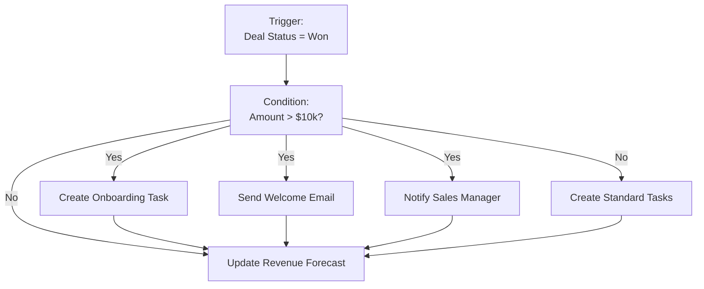

### 3.3 Dashboard Builder

Drag-and-drop dashboard creation.

#### Widget Types

| Widget | Purpose | Data Source |
|--------|---------|-------------|
| **Number** | Single metric | Aggregation query |
| **Chart** | Visualizations | Database query |
| **Table** | Data grid | Database view |
| **List** | Recent items | Filtered query |
| **Calendar** | Date-based | Date property |
| **Progress** | Goal tracking | Formula |
| **Map** | Geographic | Location property |
| **Custom** | Plugin widgets | Plugin API |

#### Dashboard Definition

```typescript
interface DashboardDefinition {
  id: string
  name: string
  layout: 'grid' | 'freeform'

  widgets: WidgetDefinition[]

  filters: {
    global: FilterDefinition[]  // Apply to all widgets
    linked: LinkedFilter[]       // Cross-filter between widgets
  }

  refresh: {
    interval: number  // Auto-refresh in seconds
    manual: boolean
  }
}

interface WidgetDefinition {
  id: string
  type: WidgetType
  position: { x: number; y: number; width: number; height: number }
  config: WidgetConfig
  dataSource: {
    database: string
    query: QueryDefinition
  }
}
```

### 3.4 Plugin System

Extend the platform with sandboxed plugins.

#### Plugin Architecture

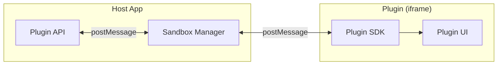

#### Plugin Permissions

```typescript
type PluginPermission =
  | 'database:read'      // Read any database
  | 'database:write'     // Write to databases
  | 'user:read'          // Read user info
  | 'network:fetch'      // Make HTTP requests
  | 'storage:local'      // Local plugin storage
  | 'ui:modal'           // Show modals
  | 'ui:sidebar'         // Render in sidebar
  | 'workflow:register'  // Register workflow actions

interface PluginManifest {
  id: string
  name: string
  version: string
  permissions: PluginPermission[]

  entrypoints: {
    main: string        // Main UI
    background?: string // Background script
  }

  contributions: {
    commands?: CommandDefinition[]
    widgets?: WidgetDefinition[]
    workflowActions?: WorkflowActionDefinition[]
  }
}
```

---

## Phase 4: Scaling & Federation (Months 30-48)

Scale from single-user to enterprise to global network.

### 4.1 Federation Architecture

Four-tier federation model:

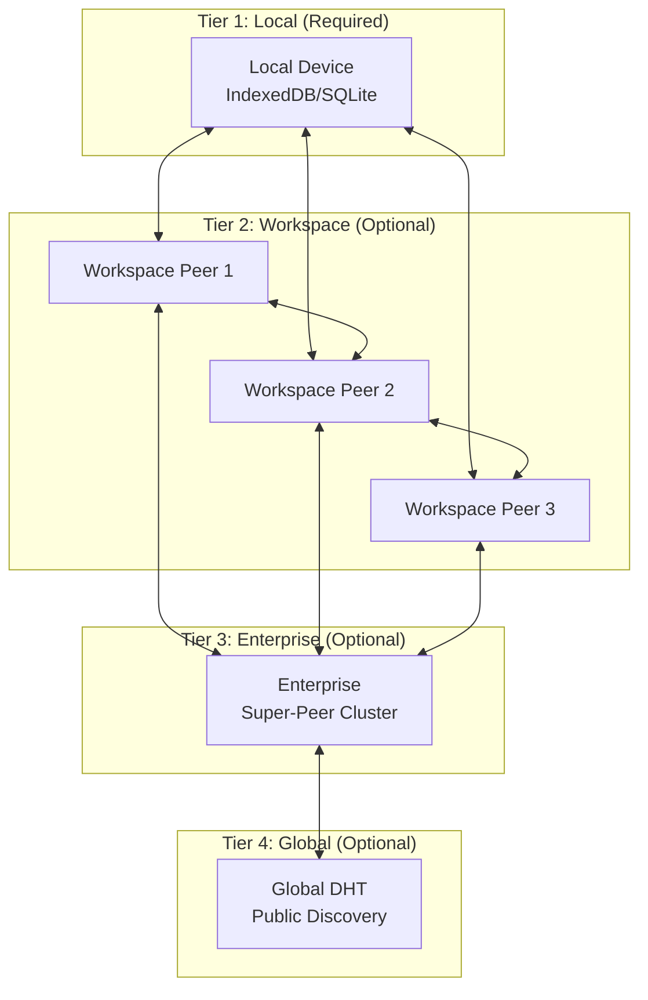

#### Federation Modes

| Mode | Description | Use Case |
|------|-------------|----------|
| **Isolated** | No federation | Personal notes |
| **Workspace** | Peers within workspace | Team collaboration |
| **Enterprise** | Cross-workspace within org | Department data |
| **Public** | Global DHT discovery | Public wikis |

### 4.2 GossipSub Mesh

Scalable P2P message propagation:

```typescript
interface GossipSubConfig {
  // Mesh parameters
  D: 6           // Target mesh degree
  D_lo: 4        // Low watermark
  D_hi: 12       // High watermark
  D_lazy: 6      // Lazy push peers

  // Timing
  heartbeatInterval: 1000  // ms
  fanoutTTL: 60000         // ms

  // Message validation
  validateMessage: (msg: Message) => ValidationResult

  // Score parameters
  scoring: {
    topicWeight: number
    timeInMesh: number
    deliveryRate: number
  }
}
```

### 4.3 Super-Peer Selection

Criteria for super-peer promotion:

| Criteria | Threshold | Weight |
|----------|-----------|--------|
| Upload bandwidth | >10 Mbps | 30% |
| Uptime | >80% last 30 days | 25% |
| Public IP | Required | 20% |
| Storage capacity | >10 GB | 15% |
| Peer reputation | >0.8 score | 10% |

```typescript
interface SuperPeerMetrics {
  bandwidth: { upload: number; download: number }
  uptime: number  // 0-1
  hasPublicIP: boolean
  storageCapacity: number
  reputation: number

  // Computed
  score: number
  eligibleForPromotion: boolean
}
```

### 4.4 Hybrid Sync Strategy

Combine CRDT with relational sync:

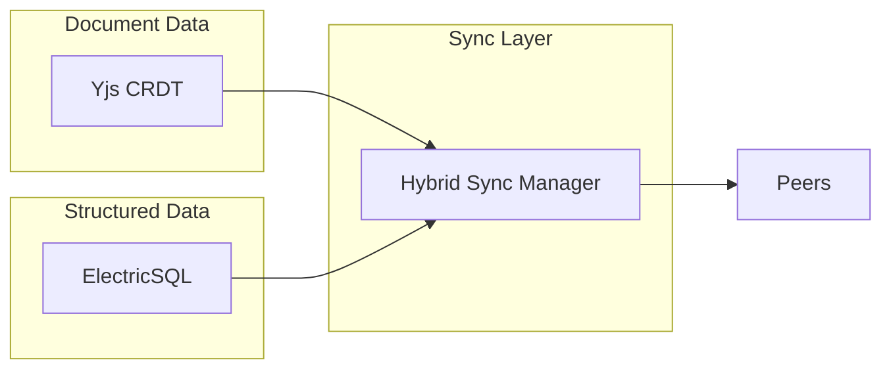

```typescript
interface HybridSyncConfig {
  // CRDT for rich text, collaborative editing
  crdt: {
    provider: 'yjs'
    transport: 'y-webrtc' | 'y-websocket'
  }

  // Relational sync for structured data
  relational: {
    provider: 'electric-sql'
    tables: string[]
    conflictResolution: 'lww' | 'custom'
  }

  // Coordination
  coordinator: {
    priority: 'crdt-first' | 'relational-first'
    consistencyLevel: 'eventual' | 'causal' | 'strong'
  }
}
```

---

## Phase 5: Enterprise Scale (Months 36-48)

Handle massive deployments (Tesla-scale: millions of devices, petabytes of data).

### 5.1 Tiered Architecture

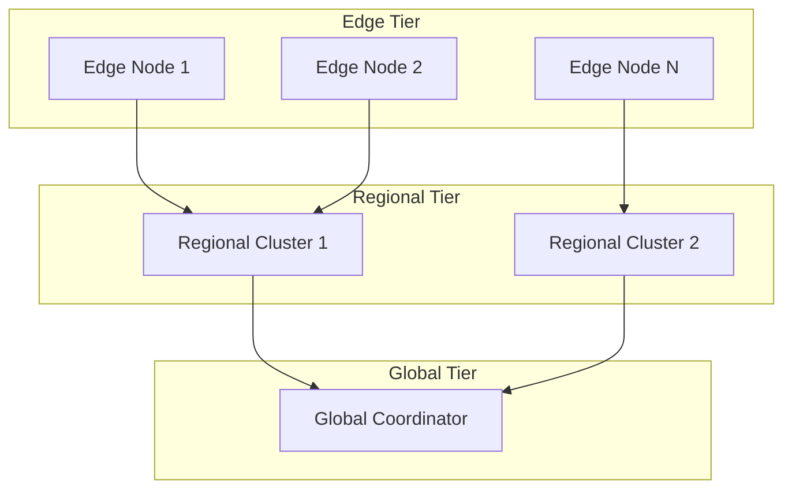

#### Tier Responsibilities

| Tier | Responsibility | Technology |
|------|----------------|------------|
| **Edge** | Local data, offline-first | SQLite, IndexedDB |
| **Regional** | Aggregation, caching | PostgreSQL, Redis |
| **Global** | Coordination, routing | CockroachDB, Kafka |

### 5.2 Event Streaming

High-throughput event processing:

```typescript
// Event schema
interface TelemetryEvent {
  id: string
  timestamp: number  // Microsecond precision
  source: {
    deviceId: string
    region: string
    version: string
  }
  event: {
    type: string
    category: 'system' | 'user' | 'sync' | 'error'
    payload: Record<string, unknown>
  }
}

// Event pipeline
interface EventPipeline {
  // Ingestion (Kafka/Redpanda)
  ingestion: {
    topic: string
    partitions: number
    replicationFactor: number
  }

  // Processing (Flink)
  processing: {
    windowSize: number  // seconds
    aggregations: AggregationDefinition[]
    alerts: AlertRule[]
  }

  // Storage (TimescaleDB/ClickHouse)
  storage: {
    retention: number  // days
    compression: 'lz4' | 'zstd'
    downsampling: DownsampleRule[]
  }
}
```

### 5.3 Cost Estimates (Tesla-Scale)

| Component | Specs | Monthly Cost |
|-----------|-------|--------------|
| Edge (millions) | Device storage | $0/device |
| Regional (10x) | 16 vCPU, 64GB RAM | $50,000 |
| Global (3x) | 32 vCPU, 128GB RAM | $30,000 |
| Kafka (3x) | Dedicated cluster | $20,000 |
| Storage | 1 PB ClickHouse | $40,000 |
| Network | 100TB egress | $10,000 |
| **Total** | | **~$150,000/mo** |

---

## Phase 6: Global Data Network (Months 48+)

Transform xNet into a decentralized global data network.

### 6.1 Global Namespace

Universal addressing scheme:

```
xnet://<did>/<workspace>/<path>

Examples:
xnet://did:key:z6Mk.../personal/journal/2024-01
xnet://did:key:z6Mk.../acme-corp/engineering/roadmap
xnet://did:key:z6Mk.../public/wiki/quantum-computing
```

### 6.2 Token Economics (XNT)

Incentivize network participation:

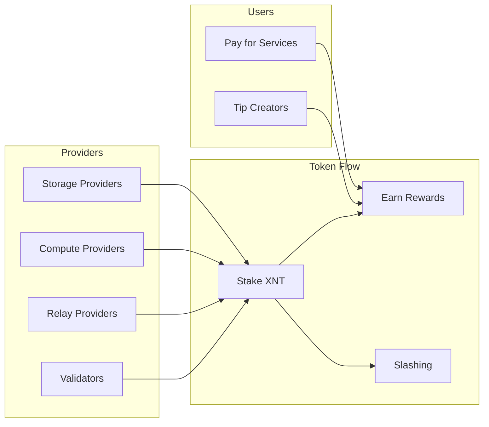

#### Provider Types

| Provider | Service | Rewards |
|----------|---------|---------|
| **Storage** | Host document snapshots | Per GB/month stored |
| **Compute** | Run federated queries | Per query processed |
| **Relay** | NAT traversal, routing | Per GB relayed |
| **Validator** | Verify proofs, consensus | Block rewards |

#### Tokenomics

```typescript
interface TokenConfig {
  // Supply
  totalSupply: 1_000_000_000  // 1 billion XNT

  // Distribution
  distribution: {
    providers: 0.40     // 40% - Network rewards
    team: 0.15          // 15% - Team (4-year vest)
    treasury: 0.20      // 20% - DAO treasury
    community: 0.15     // 15% - Airdrops, grants
    investors: 0.10     // 10% - Seed/private (2-year vest)
  }

  // Inflation/Deflation
  inflation: {
    initial: 0.05       // 5% year 1
    decay: 0.1          // 10% reduction per year
    minimum: 0.01       // 1% floor
  }

  // Burning
  burn: {
    queryFees: 0.5      // 50% of query fees burned
    storageFees: 0.3    // 30% of storage fees burned
  }
}
```

### 6.3 Federated Query Engine

Query across the global network:

```typescript
// Federated query example
const results = await xnet.query({
  // Query any public data in the network
  from: 'xnet://*/public/**/products',

  where: {
    category: 'electronics',
    price: { $lt: 1000 }
  },

  // Query planning
  options: {
    maxHops: 3,           // Federation depth
    timeout: 5000,        // ms
    maxResults: 100,
    payment: {
      maxCost: '0.01 XNT',
      preferredProviders: ['did:key:z6Mk...']
    }
  }
})
```

#### Query Flow

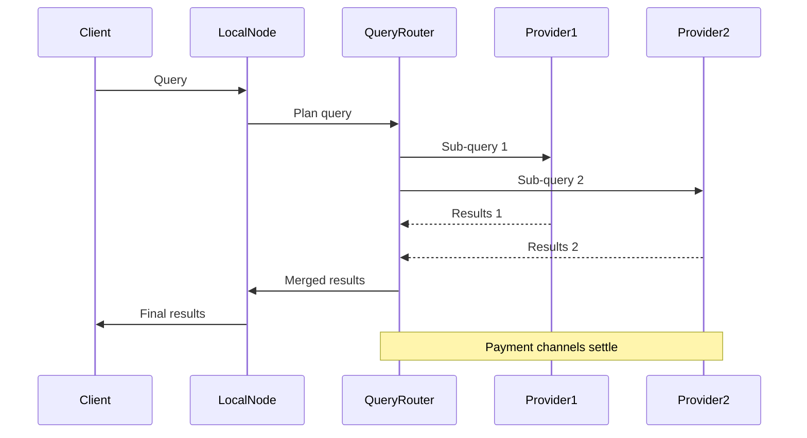

### 6.4 Proof of Storage

Verify data availability without full download:

```typescript
interface StorageProof {
  // Challenge
  challenge: {
    documentId: string
    blockIndex: number
    timestamp: number
  }

  // Response
  proof: {
    merkleProof: Uint8Array[]
    blockHash: string
    signature: string
  }

  // Verification
  verify(): boolean
}

// Proof schedule
interface ProofSchedule {
  frequency: 'hourly' | 'daily' | 'weekly'
  randomSeed: string  // VRF for unpredictable challenges
  slashingPenalty: number  // XNT
}
```

### 6.5 Governance

Decentralized decision-making:

```typescript
interface Proposal {
  id: string
  type: 'parameter' | 'upgrade' | 'treasury' | 'emergency'

  // Content
  title: string
  description: string
  changes: ProposedChange[]

  // Voting
  voting: {
    startBlock: number
    endBlock: number
    quorum: number      // % of staked XNT
    threshold: number   // % yes votes to pass
  }

  // Results
  results: {
    yes: number
    no: number
    abstain: number
    status: 'pending' | 'passed' | 'rejected' | 'executed'
  }
}

// Governance parameters (can be changed via governance)
interface GovernanceParams {
  proposalThreshold: 100_000  // XNT to create proposal
  votingPeriod: 7 * 24 * 60 * 60  // 7 days in seconds
  executionDelay: 2 * 24 * 60 * 60  // 2 days timelock
  quorum: 0.04  // 4% of total supply
}
```

---

## Implementation Priority

Recommended order after MVP:

### Near-Term (Year 2)
1. **Database UI** - Property types, views, formulas
2. **Basic Federation** - Workspace-level P2P sync
3. **Workflow Engine** - Automation basics

### Mid-Term (Year 3)
4. **Infinite Canvas** - Spatial graph visualization
5. **Module System** - CRM, basic ERP modules
6. **Enterprise Features** - Audit logs, compliance

### Long-Term (Year 4+)
7. **Global Federation** - Cross-organization queries
8. **Token Economics** - Provider incentives
9. **Decentralized Governance** - DAO structure

---

## Decision Points

### Before Database UI
- [ ] Property type prioritization (which 10 of 17 first?)
- [ ] View engine technology (custom vs. existing grid libraries)
- [ ] Formula sandbox approach (WASM vs. restricted JS)

### Before Federation
- [ ] DHT implementation (kad-dht vs. custom)
- [ ] Relay economics (free tier vs. paid)
- [ ] Privacy model for cross-org queries

### Before Token Economics
- [ ] Legal structure for token
- [ ] Initial distribution mechanism
- [ ] Exchange/DEX strategy

---

## Resources

### Detailed Specifications
- [planStep02DatabasePlatform](../planStep02DatabasePlatform/README.md) - Database UI implementation guide
- [docs/plan/05-phase-3-erp.md](../plan/05-phase-3-erp.md) - ERP platform
- [docs/plan/10-scaling-architecture.md](../plan/10-scaling-architecture.md) - Federation & scaling
- [docs/plan/15-enterprise-scale.md](../plan/15-enterprise-scale.md) - Enterprise architecture
- [docs/plan/16-global-data-network.md](../plan/16-global-data-network.md) - Token economics

### External References
- [UCAN Spec](https://ucan.xyz/) - Capability-based auth
- [Yjs](https://docs.yjs.dev/) - CRDT framework
- [ElectricSQL](https://electric-sql.com/) - Relational sync
- [libp2p](https://docs.libp2p.io/) - P2P networking
- [ELK](https://eclipse.dev/elk/) - Graph layout

---

[Back to README](./README.md) | [Timeline](./16-timeline.md)
