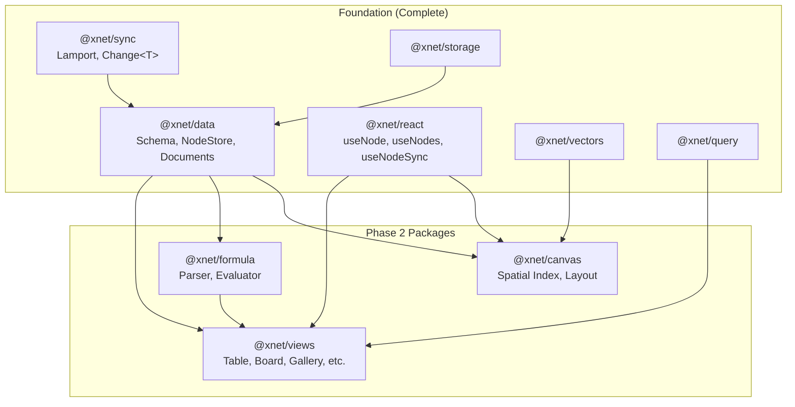
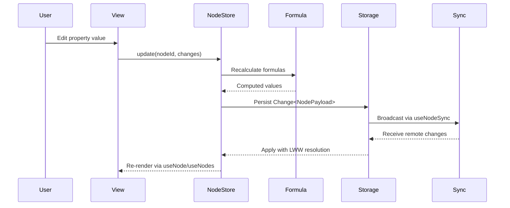
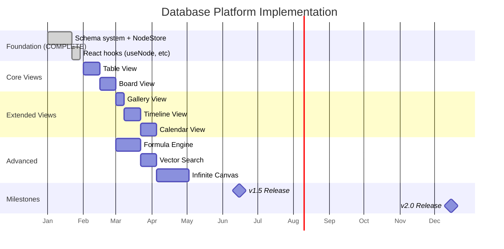

# 00: Database Platform Overview

> Architecture and goals for Phase 2

**Duration:** 6 months (Months 12-18 for v1.5, Months 18-24 for v2.0)
**Prerequisites:** planStep01MVP complete, planStep02_1DataModelConsolidation complete

## Goals

Transform xNet from a wiki/task manager into a full-featured database platform comparable to Notion.

| Milestone       | Target   | Key Features                                    |
| --------------- | -------- | ----------------------------------------------- |
| v1.5 (Month 18) | 50k DAU  | Property types, Table, Board, Basic formulas    |
| v2.0 (Month 24) | 100k DAU | All views, Full formulas, Vector search, Canvas |

## Architecture

### Foundation (Already Complete)

The schema system and NodeStore are already implemented in `@xnet/data`:

- **Schema system**: `defineSchema()` with 16 property types
- **NodeStore**: Event-sourced CRUD with LWW conflict resolution
- **React hooks**: `useNode`, `useNodes`, `useNodeSync`

### New Packages for Phase 2

```
packages/
  @xnet/views/         # View components (table, board, etc.)
  @xnet/formula/       # Formula parser and evaluator
  @xnet/canvas/        # Infinite canvas with spatial indexing
```

### Package Relationships



## Core Concepts

### Schema

A Schema defines a type of Node (like a database table definition). Schemas are defined using `defineSchema()`:

```typescript
// Already implemented in @xnet/data
const TaskSchema = defineSchema({
  name: 'Task',
  namespace: 'xnet://xnet.dev/',
  properties: {
    title: text({ required: true }),
    status: select({ options: ['todo', 'in-progress', 'done'] as const }),
    dueDate: date(),
    assignee: person()
  },
  hasContent: true // Enable rich text body
})

// Schema IRI: xnet://xnet.dev/Task
```

### Property Types (16 total)

Properties are defined using helper functions with full TypeScript inference:

```typescript
// Basic
text({ required?: boolean, maxLength?: number })
number({ format?: 'number' | 'percent' | 'currency' | 'progress' })
checkbox()

// Temporal
date({ includeTime?: boolean })
dateRange()

// Selection
select({ options: readonly string[] })
multiSelect({ options: readonly string[] })

// References
person()
relation({ target: SchemaIRI })

// Rich
url()
email()
phone()
file()

// Auto (read-only, computed)
created()
updated()
createdBy()
```

### Node

A Node is an instance of a Schema (like a database row). All structured data is stored as Nodes:

```typescript
interface Node {
  id: string // NanoID
  schemaId: SchemaIRI // e.g., 'xnet://xnet.dev/Task'
  properties: Record<string, PropertyValue>
  created: number
  updated: number
  createdBy: DID
}

// Create and update via NodeStore
const task = await store.create({
  schemaId: 'xnet://xnet.dev/Task',
  properties: { title: 'Fix bug', status: 'todo' }
})
```

### View

A View is a specific way to display and interact with Nodes of a Schema:

```typescript
interface View {
  id: ViewId
  name: string
  type: ViewType
  schemaId: SchemaIRI // Which schema this view displays

  // Which properties to show
  visibleProperties: string[]
  propertyWidths: Record<string, number>

  // Filtering and sorting
  filter?: FilterGroup
  sorts: Sort[]

  // Type-specific config
  config: ViewConfig
}

type ViewType = 'table' | 'board' | 'gallery' | 'timeline' | 'calendar' | 'list'
```

### Property

A property defines a column in the database with type-specific configuration.

```typescript
interface PropertyDefinition {
  id: PropertyId
  name: string
  type: PropertyType
  config: PropertyConfig // Type-specific
  required: boolean
  hidden: boolean
}

// 17 property types
type PropertyType =
  | 'text'
  | 'number'
  | 'checkbox' // Basic
  | 'date'
  | 'dateRange' // Temporal
  | 'select'
  | 'multiSelect' // Selection
  | 'person'
  | 'relation'
  | 'rollup' // References
  | 'formula' // Computed
  | 'url'
  | 'email'
  | 'phone'
  | 'file' // Rich
  | 'created'
  | 'updated'
  | 'createdBy' // Auto
```

### View

A view is a specific way to display and interact with database items.

```typescript
interface View {
  id: ViewId
  name: string
  type: ViewType

  // Which properties to show
  visibleProperties: PropertyId[]
  propertyWidths: Record<PropertyId, number>

  // Filtering and sorting
  filter?: FilterGroup
  sorts: Sort[]

  // Type-specific config
  config: ViewConfig
}

type ViewType = 'table' | 'board' | 'gallery' | 'timeline' | 'calendar' | 'list'
```

### Item

An item is a row in the database with property values.

```typescript
interface DatabaseItem {
  id: string
  databaseId: DatabaseId

  // Property values keyed by property ID
  properties: Record<PropertyId, PropertyValue>

  // Content (optional rich text body)
  content?: YDoc

  // Metadata
  created: number
  updated: number
  createdBy: DID
}
```

## Data Flow



## Technology Choices

| Component      | Technology          | Rationale                                      |
| -------------- | ------------------- | ---------------------------------------------- |
| Table View     | TanStack Table      | Headless, virtual scrolling, sorting/filtering |
| Board View     | dnd-kit             | Modern drag-drop, accessible, performant       |
| Calendar       | Custom              | Lightweight, match Notion UX                   |
| Timeline       | Custom with visx    | SVG-based, flexible                            |
| Formula Parser | Custom PEG          | Full control, Notion-compatible syntax         |
| Vector Index   | HNSW (usearch)      | Fast ANN search, WASM compatible               |
| Canvas         | React Flow / Custom | Node-based UI, or custom for performance       |
| Spatial Index  | rbush (R-tree)      | Fast spatial queries                           |

## Sync Architecture

### Structured Data (Nodes)

Node properties use event-sourced `Change<NodePayload>` with Lamport timestamps:

```typescript
// From @xnet/sync
interface Change<T> {
  id: string
  timestamp: LamportTimestamp // { counter, nodeId }
  authorDID: DID
  payload: T
  prevChangeId?: string // Hash chain
  signature?: string
}

// Node changes tracked per-property
interface NodePayload {
  type: 'create' | 'update' | 'delete'
  nodeId: string
  schemaId?: SchemaIRI
  properties?: Record<string, PropertyValue>
}
```

### Conflict Resolution

All property types use **Last-Writer-Wins (LWW)** per property, determined by Lamport timestamp:

```typescript
// NodeStore applies LWW automatically
if (compareLamportTimestamps(incoming, existing) > 0) {
  // Incoming change wins - newer timestamp
  applyChange(incoming)
}
```

### Rich Text Content

Documents with rich text (`hasContent: true`) use Yjs CRDT for character-level merging:

```typescript
// Hybrid approach:
// - Node metadata: LWW via NodeStore
// - Rich text body: Yjs CRDT for fine-grained merge
const doc = createDocument({
  id: node.id,
  workspace: workspaceId,
  type: 'page',
  title: node.properties.title,
  createdBy: did,
  signingKey
})
```

### Conflict Resolution

| Property Type          | Conflict Strategy |
| ---------------------- | ----------------- |
| text, number, checkbox | Last-write-wins   |
| select                 | Last-write-wins   |
| multiSelect            | Set union         |
| date, dateRange        | Last-write-wins   |
| person                 | Set union         |
| relation               | Set union         |
| formula                | N/A (computed)    |
| file                   | Set union         |

### Schema Changes

Schema changes (adding/removing properties) must be synchronized:

```typescript
// Schema stored in database document
interface DatabaseYDoc {
  // Y.Array<PropertyDefinition>
  properties: Y.Array<unknown>

  // Y.Array<View>
  views: Y.Array<unknown>
}
```

## Performance Targets

| Metric                        | Target | Measurement              |
| ----------------------------- | ------ | ------------------------ |
| Table render (1k rows)        | <100ms | First contentful paint   |
| Table render (10k rows)       | <200ms | With virtual scrolling   |
| Property edit                 | <50ms  | Input to display update  |
| Formula recalc (100 formulas) | <100ms | After dependency change  |
| View switch                   | <100ms | Tab click to render      |
| Filter apply                  | <50ms  | Filter change to results |
| Search (10k items)            | <100ms | Query to results         |
| Canvas render (1k nodes)      | 60fps  | During pan/zoom          |

## Implementation Order



## File Structure

```
packages/data/                    # ALREADY IMPLEMENTED
├── src/
│   ├── schema/
│   │   ├── define.ts             # defineSchema()
│   │   ├── properties/           # 16 property helpers
│   │   │   ├── text.ts
│   │   │   ├── number.ts
│   │   │   ├── select.ts
│   │   │   └── ... (all types)
│   │   └── types.ts
│   ├── store/
│   │   ├── store.ts              # NodeStore class
│   │   ├── types.ts              # NodePayload, NodeState
│   │   └── memory-adapter.ts     # In-memory storage
│   └── document.ts               # Yjs rich text

packages/react/                   # ALREADY IMPLEMENTED
├── src/
│   └── hooks/
│       ├── useNodeStore.ts       # Provider + context
│       ├── useNode.ts            # Single node CRUD
│       ├── useNodes.ts           # List with schema filter
│       └── useNodeSync.ts        # P2P sync

packages/views/                   # TO BUILD
├── src/
│   ├── index.ts
│   ├── types.ts
│   ├── table/
│   │   ├── TableView.tsx
│   │   ├── TableHeader.tsx
│   │   ├── TableRow.tsx
│   │   └── useTableState.ts
│   ├── board/
│   │   ├── BoardView.tsx
│   │   ├── BoardColumn.tsx
│   │   ├── BoardCard.tsx
│   │   └── useBoardState.ts
│   ├── gallery/
│   ├── timeline/
│   ├── calendar/
│   ├── shared/
│   │   ├── Filter.tsx
│   │   ├── Sort.tsx
│   │   ├── PropertyEditor.tsx
│   │   └── ViewSwitcher.tsx
│   └── hooks/
│       ├── useView.ts
│       └── useFilter.ts
└── package.json

packages/formula/                 # TO BUILD
├── src/
│   ├── index.ts
│   ├── lexer.ts                  # Tokenizer
│   ├── parser.ts                 # AST builder
│   ├── evaluator.ts              # Expression evaluation
│   ├── functions/
│   │   ├── math.ts
│   │   ├── string.ts
│   │   ├── date.ts
│   │   └── logic.ts
│   └── types.ts
└── package.json

packages/canvas/                  # TO BUILD
├── src/
│   ├── index.ts
│   ├── Canvas.tsx
│   ├── spatial/
│   │   ├── rtree.ts              # Spatial index
│   │   └── viewport.ts
│   ├── layout/
│   │   ├── elk.ts                # Auto-layout
│   │   └── force.ts
│   ├── nodes/
│   │   ├── DocumentNode.tsx
│   │   └── GroupNode.tsx
│   ├── edges/
│   │   ├── Edge.tsx
│   │   └── edge-types.ts
│   └── hooks/
│       ├── useCanvas.ts
│       └── useLayout.ts
└── package.json
```

---

[← Back to README](./README.md) | [Next: Property Types →](./01-property-types.md)
