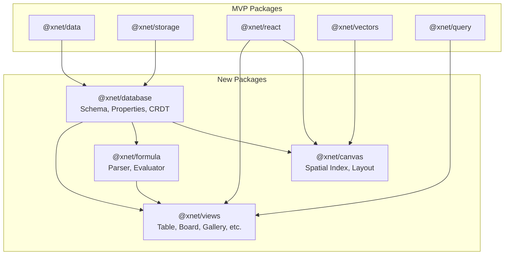
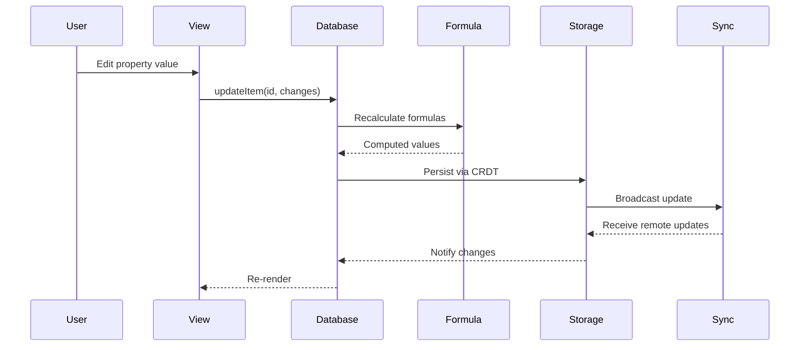
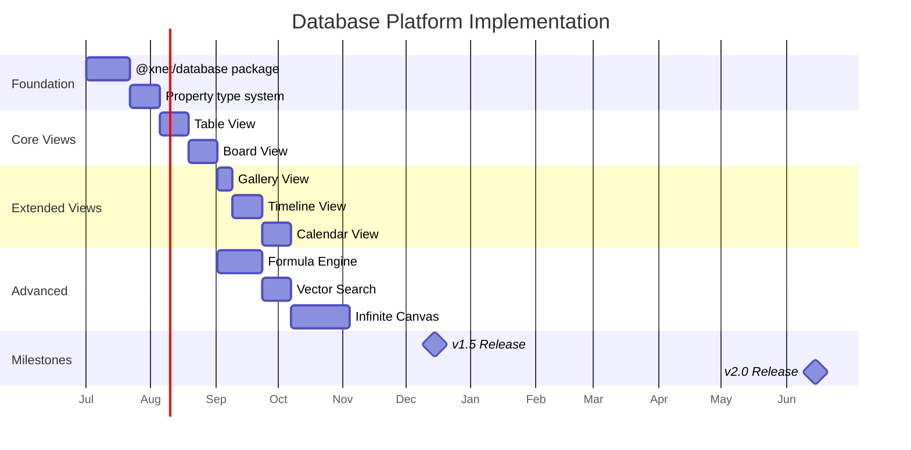

# 00: Database Platform Overview

> Architecture and goals for Phase 2

**Duration:** 6 months (Months 12-18 for v1.5, Months 18-24 for v2.0)
**Prerequisites:** planStep01MVP complete

## Goals

Transform xNotes from a wiki/task manager into a full-featured database platform comparable to Notion.

| Milestone | Target | Key Features |
|-----------|--------|--------------|
| v1.5 (Month 18) | 50k DAU | Property types, Table, Board, Basic formulas |
| v2.0 (Month 24) | 100k DAU | All views, Full formulas, Vector search, Canvas |

## Architecture

### New Packages

```
packages/
  @xnet/database/      # Database schema, property system
  @xnet/views/         # View components (table, board, etc.)
  @xnet/formula/       # Formula parser and evaluator
  @xnet/canvas/        # Infinite canvas with spatial indexing
```

### Package Relationships



## Core Concepts

### Database

A database is a collection of items (rows) with a defined schema (properties/columns).

```typescript
interface Database {
  id: DatabaseId
  name: string
  icon?: string
  cover?: string

  // Schema
  properties: PropertyDefinition[]

  // Views
  views: View[]
  defaultViewId: ViewId

  // Items are stored separately in @xnet/data
  // Referenced by: xnet://{did}/workspace/{ws}/db/{dbId}/item/{itemId}
}
```

### Property

A property defines a column in the database with type-specific configuration.

```typescript
interface PropertyDefinition {
  id: PropertyId
  name: string
  type: PropertyType
  config: PropertyConfig  // Type-specific
  required: boolean
  hidden: boolean
}

// 17 property types
type PropertyType =
  | 'text' | 'number' | 'checkbox'           // Basic
  | 'date' | 'dateRange'                      // Temporal
  | 'select' | 'multiSelect'                  // Selection
  | 'person' | 'relation' | 'rollup'          // References
  | 'formula'                                  // Computed
  | 'url' | 'email' | 'phone' | 'file'        // Rich
  | 'created' | 'updated' | 'createdBy'       // Auto
```

### View

A view is a specific way to display and interact with database items.

```typescript
interface View {
  id: ViewId
  name: string
  type: ViewType

  // Which properties to show
  visibleProperties: PropertyId[]
  propertyWidths: Record<PropertyId, number>

  // Filtering and sorting
  filter?: FilterGroup
  sorts: Sort[]

  // Type-specific config
  config: ViewConfig
}

type ViewType = 'table' | 'board' | 'gallery' | 'timeline' | 'calendar' | 'list'
```

### Item

An item is a row in the database with property values.

```typescript
interface DatabaseItem {
  id: string
  databaseId: DatabaseId

  // Property values keyed by property ID
  properties: Record<PropertyId, PropertyValue>

  // Content (optional rich text body)
  content?: YDoc

  // Metadata
  created: number
  updated: number
  createdBy: DID
}
```

## Data Flow



## Technology Choices

| Component | Technology | Rationale |
|-----------|------------|-----------|
| Table View | TanStack Table | Headless, virtual scrolling, sorting/filtering |
| Board View | dnd-kit | Modern drag-drop, accessible, performant |
| Calendar | Custom | Lightweight, match Notion UX |
| Timeline | Custom with visx | SVG-based, flexible |
| Formula Parser | Custom PEG | Full control, Notion-compatible syntax |
| Vector Index | HNSW (usearch) | Fast ANN search, WASM compatible |
| Canvas | React Flow / Custom | Node-based UI, or custom for performance |
| Spatial Index | rbush (R-tree) | Fast spatial queries |

## CRDT Considerations

### Property Values in CRDT

```typescript
// Property values are stored in Y.Map within the document
interface ItemYDoc {
  // Y.Map<PropertyId, PropertyValue>
  properties: Y.Map<string, unknown>

  // Y.XmlFragment for rich text content
  content: Y.XmlFragment
}
```

### Conflict Resolution

| Property Type | Conflict Strategy |
|---------------|-------------------|
| text, number, checkbox | Last-write-wins |
| select | Last-write-wins |
| multiSelect | Set union |
| date, dateRange | Last-write-wins |
| person | Set union |
| relation | Set union |
| formula | N/A (computed) |
| file | Set union |

### Schema Changes

Schema changes (adding/removing properties) must be synchronized:

```typescript
// Schema stored in database document
interface DatabaseYDoc {
  // Y.Array<PropertyDefinition>
  properties: Y.Array<unknown>

  // Y.Array<View>
  views: Y.Array<unknown>
}
```

## Performance Targets

| Metric | Target | Measurement |
|--------|--------|-------------|
| Table render (1k rows) | <100ms | First contentful paint |
| Table render (10k rows) | <200ms | With virtual scrolling |
| Property edit | <50ms | Input to display update |
| Formula recalc (100 formulas) | <100ms | After dependency change |
| View switch | <100ms | Tab click to render |
| Filter apply | <50ms | Filter change to results |
| Search (10k items) | <100ms | Query to results |
| Canvas render (1k nodes) | 60fps | During pan/zoom |

## Implementation Order



## File Structure

```
packages/database/
├── src/
│   ├── index.ts
│   ├── types.ts              # Core types
│   ├── schema/
│   │   ├── database.ts       # Database schema
│   │   ├── property.ts       # Property definitions
│   │   └── view.ts           # View definitions
│   ├── properties/
│   │   ├── index.ts
│   │   ├── text.ts
│   │   ├── number.ts
│   │   ├── date.ts
│   │   ├── select.ts
│   │   ├── relation.ts
│   │   ├── formula.ts
│   │   └── ... (each type)
│   ├── operations/
│   │   ├── create.ts
│   │   ├── update.ts
│   │   ├── delete.ts
│   │   └── query.ts
│   └── crdt/
│       ├── database-doc.ts   # CRDT bindings
│       └── item-doc.ts
├── test/
│   ├── properties/
│   └── operations/
└── package.json

packages/views/
├── src/
│   ├── index.ts
│   ├── types.ts
│   ├── table/
│   │   ├── TableView.tsx
│   │   ├── TableHeader.tsx
│   │   ├── TableRow.tsx
│   │   └── useTableState.ts
│   ├── board/
│   │   ├── BoardView.tsx
│   │   ├── BoardColumn.tsx
│   │   ├── BoardCard.tsx
│   │   └── useBoardState.ts
│   ├── gallery/
│   ├── timeline/
│   ├── calendar/
│   ├── shared/
│   │   ├── Filter.tsx
│   │   ├── Sort.tsx
│   │   ├── PropertyEditor.tsx
│   │   └── ViewSwitcher.tsx
│   └── hooks/
│       ├── useDatabase.ts
│       ├── useView.ts
│       └── useFilter.ts
└── package.json

packages/formula/
├── src/
│   ├── index.ts
│   ├── lexer.ts              # Tokenizer
│   ├── parser.ts             # AST builder
│   ├── evaluator.ts          # Expression evaluation
│   ├── functions/
│   │   ├── math.ts
│   │   ├── string.ts
│   │   ├── date.ts
│   │   └── logic.ts
│   └── types.ts
└── package.json

packages/canvas/
├── src/
│   ├── index.ts
│   ├── Canvas.tsx
│   ├── spatial/
│   │   ├── rtree.ts          # Spatial index
│   │   └── viewport.ts
│   ├── layout/
│   │   ├── elk.ts            # Auto-layout
│   │   └── force.ts
│   ├── nodes/
│   │   ├── DocumentNode.tsx
│   │   └── GroupNode.tsx
│   ├── edges/
│   │   ├── Edge.tsx
│   │   └── edge-types.ts
│   └── hooks/
│       ├── useCanvas.ts
│       └── useLayout.ts
└── package.json
```

---

[← Back to README](./README.md) | [Next: Property Types →](./01-property-types.md)
