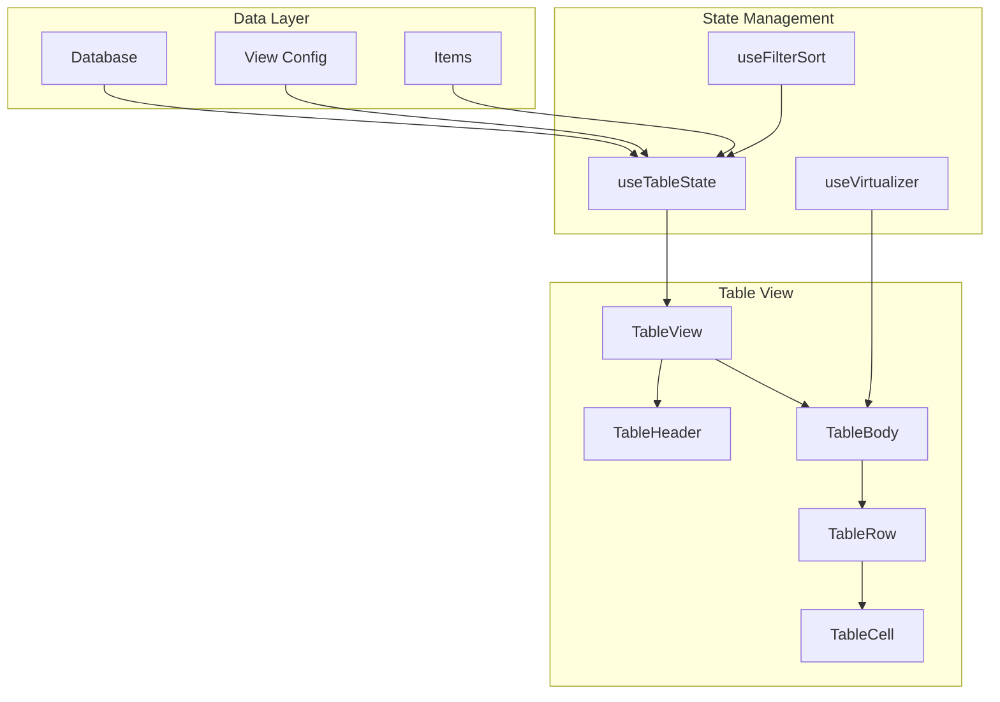

# 02: Table View

> Spreadsheet-like view with TanStack Table and virtual scrolling

**Duration:** 2 weeks
**Dependencies:** 01-property-types.md

## Overview

The table view is the foundational view for databases. It provides a spreadsheet-like interface with:
- Column resize and reorder
- Virtual scrolling for large datasets
- Inline cell editing
- Filtering and sorting
- Row selection

## Architecture



## Dependencies

```json
{
  "dependencies": {
    "@tanstack/react-table": "^8.x",
    "@tanstack/react-virtual": "^3.x"
  }
}
```

## Implementation

### Table State Hook

```typescript
// packages/views/src/table/useTableState.ts

import {
  useReactTable,
  getCoreRowModel,
  getSortedRowModel,
  getFilteredRowModel,
  ColumnDef,
  SortingState,
  ColumnFiltersState,
  VisibilityState,
  ColumnOrderState,
  ColumnSizingState,
} from '@tanstack/react-table'
import { useMemo, useState } from 'react'
import { Database, View, DatabaseItem, PropertyDefinition } from '@xnet/database'
import { getPropertyHandler } from '@xnet/database/properties'

export interface UseTableStateOptions {
  database: Database
  view: View
  items: DatabaseItem[]
  onUpdateItem: (itemId: string, changes: Record<string, unknown>) => void
  onUpdateView: (changes: Partial<View>) => void
}

export function useTableState({
  database,
  view,
  items,
  onUpdateItem,
  onUpdateView,
}: UseTableStateOptions) {
  // Table state
  const [sorting, setSorting] = useState<SortingState>(() =>
    view.sorts.map(s => ({ id: s.propertyId, desc: s.direction === 'desc' }))
  )

  const [columnFilters, setColumnFilters] = useState<ColumnFiltersState>([])

  const [columnVisibility, setColumnVisibility] = useState<VisibilityState>(() => {
    const visibility: VisibilityState = {}
    database.properties.forEach(prop => {
      visibility[prop.id] = view.visibleProperties.includes(prop.id)
    })
    return visibility
  })

  const [columnOrder, setColumnOrder] = useState<ColumnOrderState>(
    view.visibleProperties
  )

  const [columnSizing, setColumnSizing] = useState<ColumnSizingState>(
    view.propertyWidths || {}
  )

  // Generate columns from property definitions
  const columns = useMemo<ColumnDef<DatabaseItem>[]>(() => {
    return database.properties.map(prop => createColumn(prop, onUpdateItem))
  }, [database.properties, onUpdateItem])

  // Create table instance
  const table = useReactTable({
    data: items,
    columns,
    state: {
      sorting,
      columnFilters,
      columnVisibility,
      columnOrder,
      columnSizing,
    },
    onSortingChange: setSorting,
    onColumnFiltersChange: setColumnFilters,
    onColumnVisibilityChange: setColumnVisibility,
    onColumnOrderChange: setColumnOrder,
    onColumnSizingChange: (updater) => {
      setColumnSizing(updater)
      // Persist to view config
      const newSizing = typeof updater === 'function'
        ? updater(columnSizing)
        : updater
      onUpdateView({ propertyWidths: newSizing })
    },
    getCoreRowModel: getCoreRowModel(),
    getSortedRowModel: getSortedRowModel(),
    getFilteredRowModel: getFilteredRowModel(),
    columnResizeMode: 'onChange',
    enableColumnResizing: true,
  })

  return {
    table,
    sorting,
    setSorting,
    columnFilters,
    setColumnFilters,
    columnVisibility,
    setColumnVisibility,
    columnOrder,
    setColumnOrder,
    columnSizing,
  }
}

// Helper to create column definition from property
function createColumn(
  property: PropertyDefinition,
  onUpdateItem: (itemId: string, changes: Record<string, unknown>) => void
): ColumnDef<DatabaseItem> {
  const handler = getPropertyHandler(property.type)

  return {
    id: property.id,
    accessorFn: (row) => row.properties[property.id],
    header: property.name,
    size: 150,
    minSize: 100,
    maxSize: 500,

    // Cell rendering
    cell: ({ getValue, row }) => {
      const value = getValue()
      return handler.render(value, property.config)
    },

    // Sorting
    sortingFn: (rowA, rowB, columnId) => {
      const a = rowA.getValue(columnId)
      const b = rowB.getValue(columnId)
      return handler.compare(a, b, property.config)
    },

    // Filtering
    filterFn: (row, columnId, filterValue) => {
      const value = row.getValue(columnId)
      const { operator, value: filterVal } = filterValue
      return handler.applyFilter(value, operator, filterVal)
    },

    // Editing meta
    meta: {
      property,
      handler,
      onUpdate: (rowId: string, value: unknown) => {
        onUpdateItem(rowId, { [property.id]: value })
      },
    },
  }
}
```

### Table View Component

```typescript
// packages/views/src/table/TableView.tsx

import React, { useRef } from 'react'
import { useVirtualizer } from '@tanstack/react-virtual'
import { flexRender } from '@tanstack/react-table'
import { useTableState, UseTableStateOptions } from './useTableState'
import { TableHeader } from './TableHeader'
import { TableCell } from './TableCell'

export interface TableViewProps extends UseTableStateOptions {
  className?: string
}

export function TableView({ className, ...options }: TableViewProps) {
  const { table } = useTableState(options)
  const containerRef = useRef<HTMLDivElement>(null)

  const { rows } = table.getRowModel()

  // Virtual scrolling for rows
  const rowVirtualizer = useVirtualizer({
    count: rows.length,
    getScrollElement: () => containerRef.current,
    estimateSize: () => 36, // Row height
    overscan: 10,
  })

  const virtualRows = rowVirtualizer.getVirtualItems()
  const totalHeight = rowVirtualizer.getTotalSize()

  // Calculate padding for virtual scroll
  const paddingTop = virtualRows.length > 0 ? virtualRows[0].start : 0
  const paddingBottom = virtualRows.length > 0
    ? totalHeight - virtualRows[virtualRows.length - 1].end
    : 0

  return (
    <div className={`table-view ${className || ''}`}>
      <div
        ref={containerRef}
        className="table-scroll-container"
        style={{ height: '100%', overflow: 'auto' }}
      >
        <table className="table-view-table">
          <TableHeader table={table} />

          <tbody>
            {paddingTop > 0 && (
              <tr><td style={{ height: paddingTop }} /></tr>
            )}

            {virtualRows.map(virtualRow => {
              const row = rows[virtualRow.index]
              return (
                <tr key={row.id} className="table-row">
                  {row.getVisibleCells().map(cell => (
                    <TableCell key={cell.id} cell={cell} />
                  ))}
                </tr>
              )
            })}

            {paddingBottom > 0 && (
              <tr><td style={{ height: paddingBottom }} /></tr>
            )}
          </tbody>
        </table>
      </div>

      {/* Footer with row count */}
      <div className="table-footer">
        {rows.length} items
      </div>
    </div>
  )
}
```

### Table Header Component

```typescript
// packages/views/src/table/TableHeader.tsx

import React from 'react'
import { Table, flexRender, Header } from '@tanstack/react-table'
import { DatabaseItem } from '@xnet/database'

interface TableHeaderProps {
  table: Table<DatabaseItem>
}

export function TableHeader({ table }: TableHeaderProps) {
  return (
    <thead className="table-header">
      {table.getHeaderGroups().map(headerGroup => (
        <tr key={headerGroup.id}>
          {headerGroup.headers.map(header => (
            <HeaderCell key={header.id} header={header} table={table} />
          ))}

          {/* Add column button */}
          <th className="table-header-add">
            <button className="add-property-btn">+</button>
          </th>
        </tr>
      ))}
    </thead>
  )
}

interface HeaderCellProps {
  header: Header<DatabaseItem, unknown>
  table: Table<DatabaseItem>
}

function HeaderCell({ header, table }: HeaderCellProps) {
  const canSort = header.column.getCanSort()
  const sortDirection = header.column.getIsSorted()

  return (
    <th
      className="table-header-cell"
      style={{ width: header.getSize() }}
    >
      <div className="header-content">
        {/* Column name */}
        <span
          className={`header-name ${canSort ? 'sortable' : ''}`}
          onClick={header.column.getToggleSortingHandler()}
        >
          {flexRender(header.column.columnDef.header, header.getContext())}

          {/* Sort indicator */}
          {sortDirection && (
            <span className="sort-indicator">
              {sortDirection === 'asc' ? '↑' : '↓'}
            </span>
          )}
        </span>

        {/* Column menu */}
        <ColumnMenu header={header} />
      </div>

      {/* Resize handle */}
      <div
        className={`resize-handle ${header.column.getIsResizing() ? 'resizing' : ''}`}
        onMouseDown={header.getResizeHandler()}
        onTouchStart={header.getResizeHandler()}
      />
    </th>
  )
}

function ColumnMenu({ header }: { header: Header<DatabaseItem, unknown> }) {
  const [open, setOpen] = React.useState(false)

  return (
    <div className="column-menu">
      <button onClick={() => setOpen(!open)} className="column-menu-trigger">
        ⋮
      </button>

      {open && (
        <div className="column-menu-dropdown">
          <button onClick={() => header.column.toggleSorting(false)}>
            Sort ascending
          </button>
          <button onClick={() => header.column.toggleSorting(true)}>
            Sort descending
          </button>
          <hr />
          <button onClick={() => header.column.toggleVisibility()}>
            Hide column
          </button>
          <button>Edit property</button>
          <button className="danger">Delete property</button>
        </div>
      )}
    </div>
  )
}
```

### Table Cell Component

```typescript
// packages/views/src/table/TableCell.tsx

import React, { useState, useCallback, useRef, useEffect } from 'react'
import { Cell, flexRender } from '@tanstack/react-table'
import { DatabaseItem, PropertyHandler } from '@xnet/database'

interface TableCellProps {
  cell: Cell<DatabaseItem, unknown>
}

export function TableCell({ cell }: TableCellProps) {
  const [editing, setEditing] = useState(false)
  const cellRef = useRef<HTMLTableCellElement>(null)

  const meta = cell.column.columnDef.meta as {
    property: PropertyDefinition
    handler: PropertyHandler
    onUpdate: (rowId: string, value: unknown) => void
  }

  const value = cell.getValue()

  // Handle click to edit
  const handleClick = useCallback(() => {
    if (!editing && meta.property.type !== 'formula' && meta.property.type !== 'rollup') {
      setEditing(true)
    }
  }, [editing, meta.property.type])

  // Handle value change
  const handleChange = useCallback((newValue: unknown) => {
    meta.onUpdate(cell.row.id, newValue)
  }, [meta, cell.row.id])

  // Handle blur to exit editing
  const handleBlur = useCallback(() => {
    setEditing(false)
  }, [])

  // Handle keyboard navigation
  const handleKeyDown = useCallback((e: React.KeyboardEvent) => {
    if (e.key === 'Escape') {
      setEditing(false)
    } else if (e.key === 'Tab') {
      // Move to next cell
      setEditing(false)
    } else if (e.key === 'Enter' && !e.shiftKey) {
      setEditing(false)
    }
  }, [])

  return (
    <td
      ref={cellRef}
      className={`table-cell ${editing ? 'editing' : ''}`}
      style={{ width: cell.column.getSize() }}
      onClick={handleClick}
      onKeyDown={handleKeyDown}
    >
      {editing ? (
        <meta.handler.Editor
          value={value}
          config={meta.property.config}
          onChange={handleChange}
          onBlur={handleBlur}
          autoFocus
        />
      ) : (
        <div className="cell-content">
          {meta.handler.render(value, meta.property.config)}
        </div>
      )}
    </td>
  )
}
```

### Filter Builder

```typescript
// packages/views/src/shared/FilterBuilder.tsx

import React from 'react'
import { Database, PropertyDefinition, FilterGroup, Filter } from '@xnet/database'
import { getPropertyHandler } from '@xnet/database/properties'

interface FilterBuilderProps {
  database: Database
  filter: FilterGroup | null
  onChange: (filter: FilterGroup | null) => void
}

export function FilterBuilder({ database, filter, onChange }: FilterBuilderProps) {
  const addFilter = () => {
    const firstProp = database.properties[0]
    if (!firstProp) return

    const handler = getPropertyHandler(firstProp.type)
    const newFilter: Filter = {
      id: crypto.randomUUID(),
      propertyId: firstProp.id,
      operator: handler.filterOperators[0],
      value: null,
    }

    if (filter) {
      onChange({
        ...filter,
        filters: [...filter.filters, newFilter],
      })
    } else {
      onChange({
        type: 'and',
        filters: [newFilter],
      })
    }
  }

  const updateFilter = (filterId: string, updates: Partial<Filter>) => {
    if (!filter) return
    onChange({
      ...filter,
      filters: filter.filters.map(f =>
        f.id === filterId ? { ...f, ...updates } : f
      ),
    })
  }

  const removeFilter = (filterId: string) => {
    if (!filter) return
    const newFilters = filter.filters.filter(f => f.id !== filterId)
    if (newFilters.length === 0) {
      onChange(null)
    } else {
      onChange({ ...filter, filters: newFilters })
    }
  }

  return (
    <div className="filter-builder">
      {filter?.filters.map((f, index) => (
        <FilterRow
          key={f.id}
          filter={f}
          database={database}
          isFirst={index === 0}
          conjunction={filter.type}
          onUpdate={(updates) => updateFilter(f.id, updates)}
          onRemove={() => removeFilter(f.id)}
          onConjunctionChange={(type) => onChange({ ...filter, type })}
        />
      ))}

      <button onClick={addFilter} className="add-filter-btn">
        + Add filter
      </button>
    </div>
  )
}

interface FilterRowProps {
  filter: Filter
  database: Database
  isFirst: boolean
  conjunction: 'and' | 'or'
  onUpdate: (updates: Partial<Filter>) => void
  onRemove: () => void
  onConjunctionChange: (type: 'and' | 'or') => void
}

function FilterRow({
  filter,
  database,
  isFirst,
  conjunction,
  onUpdate,
  onRemove,
  onConjunctionChange,
}: FilterRowProps) {
  const property = database.properties.find(p => p.id === filter.propertyId)
  if (!property) return null

  const handler = getPropertyHandler(property.type)

  return (
    <div className="filter-row">
      {/* Conjunction */}
      {!isFirst && (
        <select
          value={conjunction}
          onChange={(e) => onConjunctionChange(e.target.value as 'and' | 'or')}
          className="filter-conjunction"
        >
          <option value="and">And</option>
          <option value="or">Or</option>
        </select>
      )}

      {/* Property selector */}
      <select
        value={filter.propertyId}
        onChange={(e) => {
          const newProp = database.properties.find(p => p.id === e.target.value)
          if (newProp) {
            const newHandler = getPropertyHandler(newProp.type)
            onUpdate({
              propertyId: e.target.value,
              operator: newHandler.filterOperators[0],
              value: null,
            })
          }
        }}
        className="filter-property"
      >
        {database.properties.map(p => (
          <option key={p.id} value={p.id}>{p.name}</option>
        ))}
      </select>

      {/* Operator selector */}
      <select
        value={filter.operator}
        onChange={(e) => onUpdate({ operator: e.target.value })}
        className="filter-operator"
      >
        {handler.filterOperators.map(op => (
          <option key={op} value={op}>{formatOperator(op)}</option>
        ))}
      </select>

      {/* Value input */}
      {!['isEmpty', 'isNotEmpty'].includes(filter.operator) && (
        <FilterValueInput
          property={property}
          value={filter.value}
          onChange={(value) => onUpdate({ value })}
        />
      )}

      {/* Remove button */}
      <button onClick={onRemove} className="filter-remove">×</button>
    </div>
  )
}

function formatOperator(op: string): string {
  const labels: Record<string, string> = {
    equals: 'is',
    notEquals: 'is not',
    contains: 'contains',
    notContains: 'does not contain',
    startsWith: 'starts with',
    endsWith: 'ends with',
    greaterThan: '>',
    lessThan: '<',
    greaterOrEqual: '>=',
    lessOrEqual: '<=',
    isEmpty: 'is empty',
    isNotEmpty: 'is not empty',
    before: 'is before',
    after: 'is after',
  }
  return labels[op] || op
}
```

### Styles

```css
/* packages/views/src/table/table.css */

.table-view {
  display: flex;
  flex-direction: column;
  height: 100%;
  background: var(--bg-primary);
}

.table-scroll-container {
  flex: 1;
  overflow: auto;
}

.table-view-table {
  width: 100%;
  border-collapse: collapse;
  table-layout: fixed;
}

/* Header */
.table-header {
  position: sticky;
  top: 0;
  z-index: 10;
  background: var(--bg-secondary);
}

.table-header-cell {
  position: relative;
  padding: 8px 12px;
  text-align: left;
  font-weight: 500;
  font-size: 12px;
  color: var(--text-secondary);
  border-bottom: 1px solid var(--border);
  user-select: none;
}

.header-content {
  display: flex;
  align-items: center;
  gap: 4px;
}

.header-name.sortable {
  cursor: pointer;
}

.header-name.sortable:hover {
  color: var(--text-primary);
}

.sort-indicator {
  font-size: 10px;
  margin-left: 4px;
}

/* Resize handle */
.resize-handle {
  position: absolute;
  right: 0;
  top: 0;
  bottom: 0;
  width: 4px;
  cursor: col-resize;
  background: transparent;
}

.resize-handle:hover,
.resize-handle.resizing {
  background: var(--accent);
}

/* Rows */
.table-row {
  border-bottom: 1px solid var(--border-light);
}

.table-row:hover {
  background: var(--bg-hover);
}

/* Cells */
.table-cell {
  padding: 0;
  height: 36px;
  overflow: hidden;
}

.cell-content {
  padding: 8px 12px;
  overflow: hidden;
  text-overflow: ellipsis;
  white-space: nowrap;
}

.table-cell.editing {
  padding: 0;
}

.table-cell.editing input,
.table-cell.editing select {
  width: 100%;
  height: 100%;
  padding: 8px 12px;
  border: 2px solid var(--accent);
  outline: none;
}

/* Footer */
.table-footer {
  padding: 8px 12px;
  font-size: 12px;
  color: var(--text-secondary);
  border-top: 1px solid var(--border);
}
```

## Performance Optimizations

### Virtual Scrolling

Already implemented with `@tanstack/react-virtual`. Key settings:

```typescript
const rowVirtualizer = useVirtualizer({
  count: rows.length,
  getScrollElement: () => containerRef.current,
  estimateSize: () => 36,
  overscan: 10, // Render 10 extra rows above/below viewport
})
```

### Memoization

```typescript
// Memoize expensive computations
const columns = useMemo(() => {
  return database.properties.map(prop => createColumn(prop, onUpdateItem))
}, [database.properties, onUpdateItem])

// Memoize row data
const data = useMemo(() => items, [items])
```

### Debounced Updates

```typescript
// Debounce column resize updates to view config
const debouncedUpdateView = useMemo(
  () => debounce((changes: Partial<View>) => onUpdateView(changes), 200),
  [onUpdateView]
)
```

## Tests

```typescript
// packages/views/test/table/TableView.test.tsx

import { describe, it, expect, vi } from 'vitest'
import { render, screen, fireEvent } from '@testing-library/react'
import { TableView } from '../../src/table/TableView'

describe('TableView', () => {
  const mockDatabase = {
    id: 'db-1',
    name: 'Test DB',
    properties: [
      { id: 'name', name: 'Name', type: 'text', config: {} },
      { id: 'count', name: 'Count', type: 'number', config: { format: 'number' } },
    ],
    views: [],
    defaultViewId: 'view-1',
  }

  const mockView = {
    id: 'view-1',
    name: 'Table',
    type: 'table',
    visibleProperties: ['name', 'count'],
    propertyWidths: {},
    sorts: [],
  }

  const mockItems = [
    { id: '1', databaseId: 'db-1', properties: { name: 'Item 1', count: 10 } },
    { id: '2', databaseId: 'db-1', properties: { name: 'Item 2', count: 20 } },
  ]

  it('renders table with items', () => {
    render(
      <TableView
        database={mockDatabase}
        view={mockView}
        items={mockItems}
        onUpdateItem={vi.fn()}
        onUpdateView={vi.fn()}
      />
    )

    expect(screen.getByText('Name')).toBeInTheDocument()
    expect(screen.getByText('Item 1')).toBeInTheDocument()
    expect(screen.getByText('10')).toBeInTheDocument()
  })

  it('sorts by column on header click', async () => {
    render(
      <TableView
        database={mockDatabase}
        view={mockView}
        items={mockItems}
        onUpdateItem={vi.fn()}
        onUpdateView={vi.fn()}
      />
    )

    fireEvent.click(screen.getByText('Name'))

    // Check sort indicator appears
    expect(screen.getByText('↑')).toBeInTheDocument()
  })

  it('enables editing on cell click', () => {
    const onUpdateItem = vi.fn()
    render(
      <TableView
        database={mockDatabase}
        view={mockView}
        items={mockItems}
        onUpdateItem={onUpdateItem}
        onUpdateView={vi.fn()}
      />
    )

    fireEvent.click(screen.getByText('Item 1'))

    // Check input appears
    const input = screen.getByRole('textbox')
    expect(input).toBeInTheDocument()
    expect(input).toHaveValue('Item 1')
  })

  it('renders 10k rows with virtual scrolling', () => {
    const manyItems = Array.from({ length: 10000 }, (_, i) => ({
      id: String(i),
      databaseId: 'db-1',
      properties: { name: `Item ${i}`, count: i },
    }))

    const { container } = render(
      <TableView
        database={mockDatabase}
        view={mockView}
        items={manyItems}
        onUpdateItem={vi.fn()}
        onUpdateView={vi.fn()}
      />
    )

    // Should not render all 10k rows
    const rows = container.querySelectorAll('.table-row')
    expect(rows.length).toBeLessThan(100)
  })
})
```

## Checklist

### Week 1: Core Table
- [ ] useTableState hook with TanStack Table
- [ ] TableView component
- [ ] TableHeader with sort indicators
- [ ] TableCell with display mode
- [ ] Column resize functionality
- [ ] Virtual scrolling with 10k rows
- [ ] Basic styling

### Week 2: Editing & Features
- [ ] Inline cell editing for all property types
- [ ] Column reorder (drag-drop)
- [ ] Column visibility toggle
- [ ] Filter builder component
- [ ] Sort controls
- [ ] Row selection
- [ ] Keyboard navigation (Tab, Enter, Escape)
- [ ] Add row button
- [ ] Add column button
- [ ] All tests pass

---

[← Back to Property Types](./01-property-types.md) | [Next: Board View →](./03-view-board.md)
