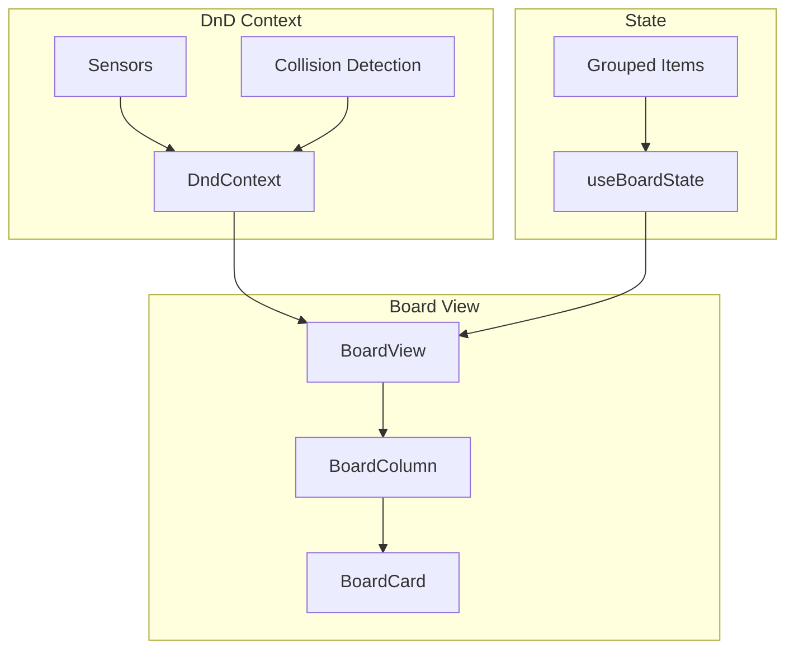

# 03: Board View

> Kanban board with drag-and-drop using dnd-kit

**Duration:** 2 weeks
**Dependencies:** 01-property-types.md, 02-view-table.md

## Overview

The board (Kanban) view displays items as cards grouped by a select or multi-select property. Features:
- Drag-and-drop between columns
- Card customization
- Column collapsing
- Swimlanes (optional grouping)

## Architecture



## Dependencies

```json
{
  "dependencies": {
    "@dnd-kit/core": "^6.x",
    "@dnd-kit/sortable": "^8.x",
    "@dnd-kit/utilities": "^3.x"
  }
}
```

## Implementation

### Board State Hook

```typescript
// packages/views/src/board/useBoardState.ts

import { useMemo, useState, useCallback } from 'react'
import { Database, View, DatabaseItem, PropertyDefinition } from '@xnet/database'

export interface BoardColumn {
  id: string
  name: string
  color: string
  items: DatabaseItem[]
  collapsed: boolean
}

export interface UseBoardStateOptions {
  database: Database
  view: View
  items: DatabaseItem[]
  onUpdateItem: (itemId: string, changes: Record<string, unknown>) => void
  onUpdateView: (changes: Partial<View>) => void
}

export interface BoardConfig {
  groupByPropertyId: string
  cardProperties: string[]  // Properties to show on card
  showEmptyColumns: boolean
  columnOrder?: string[]    // Custom column order
}

export function useBoardState({
  database,
  view,
  items,
  onUpdateItem,
  onUpdateView,
}: UseBoardStateOptions) {
  const config = view.config as BoardConfig

  // Get the group-by property
  const groupByProperty = database.properties.find(
    p => p.id === config.groupByPropertyId
  )

  if (!groupByProperty || !['select', 'multiSelect'].includes(groupByProperty.type)) {
    throw new Error('Board view requires a select or multi-select property for grouping')
  }

  const options = groupByProperty.config.options as Array<{
    id: string
    name: string
    color: string
  }>

  // Track collapsed columns
  const [collapsedColumns, setCollapsedColumns] = useState<Set<string>>(new Set())

  // Group items by property value
  const columns = useMemo<BoardColumn[]>(() => {
    const columnMap = new Map<string, DatabaseItem[]>()

    // Initialize columns from options
    options.forEach(opt => {
      columnMap.set(opt.id, [])
    })

    // Add "No value" column
    columnMap.set('__none__', [])

    // Group items
    items.forEach(item => {
      const value = item.properties[config.groupByPropertyId]

      if (groupByProperty.type === 'multiSelect' && Array.isArray(value)) {
        // Multi-select: item appears in multiple columns
        if (value.length === 0) {
          columnMap.get('__none__')?.push(item)
        } else {
          value.forEach(v => {
            columnMap.get(v)?.push(item)
          })
        }
      } else {
        // Single select
        const colId = value || '__none__'
        columnMap.get(colId)?.push(item)
      }
    })

    // Build column array
    const cols: BoardColumn[] = []

    // Add "No value" column first if it has items
    const noValueItems = columnMap.get('__none__') || []
    if (noValueItems.length > 0 || config.showEmptyColumns) {
      cols.push({
        id: '__none__',
        name: 'No value',
        color: '#e0e0e0',
        items: noValueItems,
        collapsed: collapsedColumns.has('__none__'),
      })
    }

    // Add option columns
    const orderedOptions = config.columnOrder
      ? config.columnOrder.map(id => options.find(o => o.id === id)).filter(Boolean)
      : options

    orderedOptions.forEach(opt => {
      if (!opt) return
      const colItems = columnMap.get(opt.id) || []
      if (colItems.length > 0 || config.showEmptyColumns) {
        cols.push({
          id: opt.id,
          name: opt.name,
          color: opt.color,
          items: colItems,
          collapsed: collapsedColumns.has(opt.id),
        })
      }
    })

    return cols
  }, [items, options, config, collapsedColumns, groupByProperty.type])

  // Handle card move between columns
  const moveCard = useCallback((
    itemId: string,
    fromColumnId: string,
    toColumnId: string,
    newIndex: number
  ) => {
    const newValue = toColumnId === '__none__' ? null : toColumnId

    if (groupByProperty.type === 'multiSelect') {
      // For multi-select, update the array
      const item = items.find(i => i.id === itemId)
      if (!item) return

      const currentValues = (item.properties[config.groupByPropertyId] as string[]) || []

      // Remove from old column, add to new
      let newValues = currentValues.filter(v => v !== fromColumnId)
      if (newValue) {
        newValues = [...newValues, newValue]
      }

      onUpdateItem(itemId, { [config.groupByPropertyId]: newValues })
    } else {
      // Single select: just set the new value
      onUpdateItem(itemId, { [config.groupByPropertyId]: newValue })
    }
  }, [groupByProperty.type, config.groupByPropertyId, items, onUpdateItem])

  // Toggle column collapse
  const toggleColumnCollapse = useCallback((columnId: string) => {
    setCollapsedColumns(prev => {
      const next = new Set(prev)
      if (next.has(columnId)) {
        next.delete(columnId)
      } else {
        next.add(columnId)
      }
      return next
    })
  }, [])

  return {
    columns,
    groupByProperty,
    config,
    moveCard,
    toggleColumnCollapse,
  }
}
```

### Board View Component

```typescript
// packages/views/src/board/BoardView.tsx

import React from 'react'
import {
  DndContext,
  DragOverlay,
  closestCorners,
  KeyboardSensor,
  PointerSensor,
  useSensor,
  useSensors,
  DragStartEvent,
  DragEndEvent,
  DragOverEvent,
} from '@dnd-kit/core'
import {
  SortableContext,
  horizontalListSortingStrategy,
} from '@dnd-kit/sortable'
import { useBoardState, UseBoardStateOptions } from './useBoardState'
import { BoardColumn } from './BoardColumn'
import { BoardCard } from './BoardCard'

export interface BoardViewProps extends UseBoardStateOptions {
  className?: string
}

export function BoardView({ className, ...options }: BoardViewProps) {
  const {
    columns,
    groupByProperty,
    config,
    moveCard,
    toggleColumnCollapse,
  } = useBoardState(options)

  const [activeItem, setActiveItem] = React.useState<DatabaseItem | null>(null)
  const [activeColumnId, setActiveColumnId] = React.useState<string | null>(null)

  // Sensors for drag detection
  const sensors = useSensors(
    useSensor(PointerSensor, {
      activationConstraint: {
        distance: 8, // 8px movement before drag starts
      },
    }),
    useSensor(KeyboardSensor)
  )

  const handleDragStart = (event: DragStartEvent) => {
    const { active } = event
    const itemId = active.id as string

    // Find the item and its column
    for (const column of columns) {
      const item = column.items.find(i => i.id === itemId)
      if (item) {
        setActiveItem(item)
        setActiveColumnId(column.id)
        break
      }
    }
  }

  const handleDragOver = (event: DragOverEvent) => {
    const { active, over } = event
    if (!over) return

    const activeId = active.id as string
    const overId = over.id as string

    // Find source and destination columns
    const activeColumn = columns.find(c =>
      c.items.some(i => i.id === activeId) || c.id === activeId
    )
    const overColumn = columns.find(c =>
      c.items.some(i => i.id === overId) || c.id === overId
    )

    if (!activeColumn || !overColumn || activeColumn.id === overColumn.id) {
      return
    }

    // Update active column for visual feedback
    setActiveColumnId(overColumn.id)
  }

  const handleDragEnd = (event: DragEndEvent) => {
    const { active, over } = event

    setActiveItem(null)
    setActiveColumnId(null)

    if (!over) return

    const activeId = active.id as string
    const overId = over.id as string

    // Find source column
    const sourceColumn = columns.find(c =>
      c.items.some(i => i.id === activeId)
    )
    if (!sourceColumn) return

    // Find destination column
    let destColumn = columns.find(c => c.id === overId)
    if (!destColumn) {
      // Dropped on another card, find its column
      destColumn = columns.find(c => c.items.some(i => i.id === overId))
    }
    if (!destColumn) return

    // Calculate new index
    const overIndex = destColumn.items.findIndex(i => i.id === overId)
    const newIndex = overIndex >= 0 ? overIndex : destColumn.items.length

    // Move the card
    moveCard(activeId, sourceColumn.id, destColumn.id, newIndex)
  }

  return (
    <div className={`board-view ${className || ''}`}>
      <DndContext
        sensors={sensors}
        collisionDetection={closestCorners}
        onDragStart={handleDragStart}
        onDragOver={handleDragOver}
        onDragEnd={handleDragEnd}
      >
        <div className="board-columns">
          {columns.map(column => (
            <BoardColumn
              key={column.id}
              column={column}
              database={options.database}
              cardProperties={config.cardProperties}
              onToggleCollapse={() => toggleColumnCollapse(column.id)}
              isDropTarget={activeColumnId === column.id}
            />
          ))}

          {/* Add column button */}
          <div className="board-add-column">
            <button className="add-column-btn">
              + Add column
            </button>
          </div>
        </div>

        {/* Drag overlay */}
        <DragOverlay>
          {activeItem && (
            <BoardCard
              item={activeItem}
              database={options.database}
              cardProperties={config.cardProperties}
              isDragging
            />
          )}
        </DragOverlay>
      </DndContext>
    </div>
  )
}
```

### Board Column Component

```typescript
// packages/views/src/board/BoardColumn.tsx

import React from 'react'
import { useDroppable } from '@dnd-kit/core'
import {
  SortableContext,
  verticalListSortingStrategy,
} from '@dnd-kit/sortable'
import { BoardColumn as BoardColumnType } from './useBoardState'
import { BoardCard } from './BoardCard'
import { Database, DatabaseItem } from '@xnet/database'

interface BoardColumnProps {
  column: BoardColumnType
  database: Database
  cardProperties: string[]
  onToggleCollapse: () => void
  isDropTarget: boolean
}

export function BoardColumn({
  column,
  database,
  cardProperties,
  onToggleCollapse,
  isDropTarget,
}: BoardColumnProps) {
  const { setNodeRef, isOver } = useDroppable({
    id: column.id,
  })

  return (
    <div
      className={`board-column ${column.collapsed ? 'collapsed' : ''} ${isOver || isDropTarget ? 'drop-target' : ''}`}
    >
      {/* Column header */}
      <div className="column-header">
        <div className="column-header-left">
          <span
            className="column-color"
            style={{ backgroundColor: column.color }}
          />
          <span className="column-name">{column.name}</span>
          <span className="column-count">{column.items.length}</span>
        </div>

        <div className="column-header-actions">
          <button
            className="collapse-btn"
            onClick={onToggleCollapse}
            title={column.collapsed ? 'Expand' : 'Collapse'}
          >
            {column.collapsed ? '→' : '←'}
          </button>
          <button className="column-menu-btn">⋮</button>
        </div>
      </div>

      {/* Column content */}
      {!column.collapsed && (
        <div ref={setNodeRef} className="column-content">
          <SortableContext
            items={column.items.map(i => i.id)}
            strategy={verticalListSortingStrategy}
          >
            {column.items.map(item => (
              <BoardCard
                key={item.id}
                item={item}
                database={database}
                cardProperties={cardProperties}
              />
            ))}
          </SortableContext>

          {/* Add card button */}
          <button className="add-card-btn">
            + New
          </button>
        </div>
      )}

      {/* Collapsed state */}
      {column.collapsed && (
        <div className="column-collapsed-content">
          <span className="collapsed-count">{column.items.length}</span>
        </div>
      )}
    </div>
  )
}
```

### Board Card Component

```typescript
// packages/views/src/board/BoardCard.tsx

import React from 'react'
import { useSortable } from '@dnd-kit/sortable'
import { CSS } from '@dnd-kit/utilities'
import { Database, DatabaseItem } from '@xnet/database'
import { getPropertyHandler } from '@xnet/database/properties'

interface BoardCardProps {
  item: DatabaseItem
  database: Database
  cardProperties: string[]
  isDragging?: boolean
}

export function BoardCard({
  item,
  database,
  cardProperties,
  isDragging,
}: BoardCardProps) {
  const {
    attributes,
    listeners,
    setNodeRef,
    transform,
    transition,
    isDragging: isSortableDragging,
  } = useSortable({ id: item.id })

  const style = {
    transform: CSS.Transform.toString(transform),
    transition,
  }

  // Get title property (usually first text property)
  const titleProperty = database.properties.find(p => p.type === 'text')
  const title = titleProperty
    ? item.properties[titleProperty.id] as string
    : item.id

  return (
    <div
      ref={setNodeRef}
      style={style}
      className={`board-card ${isDragging || isSortableDragging ? 'dragging' : ''}`}
      {...attributes}
      {...listeners}
    >
      {/* Card title */}
      <div className="card-title">{title || 'Untitled'}</div>

      {/* Card properties */}
      <div className="card-properties">
        {cardProperties.map(propId => {
          const property = database.properties.find(p => p.id === propId)
          if (!property || property.id === titleProperty?.id) return null

          const value = item.properties[propId]
          if (value === null || value === undefined) return null

          const handler = getPropertyHandler(property.type)

          return (
            <div key={propId} className="card-property">
              {handler.render(value, property.config)}
            </div>
          )
        })}
      </div>
    </div>
  )
}
```

### Styles

```css
/* packages/views/src/board/board.css */

.board-view {
  height: 100%;
  overflow-x: auto;
  padding: 16px;
}

.board-columns {
  display: flex;
  gap: 12px;
  height: 100%;
  align-items: flex-start;
}

/* Column */
.board-column {
  flex-shrink: 0;
  width: 280px;
  max-height: 100%;
  display: flex;
  flex-direction: column;
  background: var(--bg-secondary);
  border-radius: 8px;
}

.board-column.collapsed {
  width: 40px;
}

.board-column.drop-target {
  background: var(--bg-accent-light);
}

/* Column header */
.column-header {
  display: flex;
  justify-content: space-between;
  align-items: center;
  padding: 12px;
  border-bottom: 1px solid var(--border-light);
}

.column-header-left {
  display: flex;
  align-items: center;
  gap: 8px;
}

.column-color {
  width: 8px;
  height: 8px;
  border-radius: 50%;
}

.column-name {
  font-weight: 500;
  font-size: 14px;
}

.column-count {
  font-size: 12px;
  color: var(--text-secondary);
  background: var(--bg-tertiary);
  padding: 2px 6px;
  border-radius: 4px;
}

/* Column content */
.column-content {
  flex: 1;
  overflow-y: auto;
  padding: 8px;
  display: flex;
  flex-direction: column;
  gap: 8px;
}

/* Cards */
.board-card {
  background: var(--bg-primary);
  border-radius: 6px;
  padding: 12px;
  box-shadow: 0 1px 2px rgba(0, 0, 0, 0.1);
  cursor: grab;
  transition: box-shadow 0.2s, transform 0.2s;
}

.board-card:hover {
  box-shadow: 0 2px 8px rgba(0, 0, 0, 0.15);
}

.board-card.dragging {
  cursor: grabbing;
  box-shadow: 0 8px 24px rgba(0, 0, 0, 0.2);
  transform: rotate(2deg);
}

.card-title {
  font-weight: 500;
  margin-bottom: 8px;
}

.card-properties {
  display: flex;
  flex-wrap: wrap;
  gap: 4px;
}

.card-property {
  font-size: 12px;
}

/* Add buttons */
.add-card-btn,
.add-column-btn {
  width: 100%;
  padding: 8px;
  background: transparent;
  border: none;
  color: var(--text-secondary);
  cursor: pointer;
  text-align: left;
  border-radius: 4px;
}

.add-card-btn:hover,
.add-column-btn:hover {
  background: var(--bg-hover);
  color: var(--text-primary);
}

.board-add-column {
  flex-shrink: 0;
  width: 280px;
}
```

## Tests

```typescript
// packages/views/test/board/BoardView.test.tsx

import { describe, it, expect, vi } from 'vitest'
import { render, screen, fireEvent } from '@testing-library/react'
import { BoardView } from '../../src/board/BoardView'

describe('BoardView', () => {
  const mockDatabase = {
    id: 'db-1',
    name: 'Test DB',
    properties: [
      { id: 'name', name: 'Name', type: 'text', config: {} },
      {
        id: 'status',
        name: 'Status',
        type: 'select',
        config: {
          options: [
            { id: 'todo', name: 'To Do', color: '#e0e0e0' },
            { id: 'doing', name: 'Doing', color: '#ffd54f' },
            { id: 'done', name: 'Done', color: '#81c784' },
          ]
        }
      },
    ],
    views: [],
    defaultViewId: 'view-1',
  }

  const mockView = {
    id: 'view-1',
    name: 'Board',
    type: 'board',
    visibleProperties: ['name', 'status'],
    propertyWidths: {},
    sorts: [],
    config: {
      groupByPropertyId: 'status',
      cardProperties: ['name'],
      showEmptyColumns: true,
    }
  }

  const mockItems = [
    { id: '1', databaseId: 'db-1', properties: { name: 'Task 1', status: 'todo' } },
    { id: '2', databaseId: 'db-1', properties: { name: 'Task 2', status: 'doing' } },
    { id: '3', databaseId: 'db-1', properties: { name: 'Task 3', status: 'done' } },
  ]

  it('renders columns based on select options', () => {
    render(
      <BoardView
        database={mockDatabase}
        view={mockView}
        items={mockItems}
        onUpdateItem={vi.fn()}
        onUpdateView={vi.fn()}
      />
    )

    expect(screen.getByText('To Do')).toBeInTheDocument()
    expect(screen.getByText('Doing')).toBeInTheDocument()
    expect(screen.getByText('Done')).toBeInTheDocument()
  })

  it('groups items into correct columns', () => {
    render(
      <BoardView
        database={mockDatabase}
        view={mockView}
        items={mockItems}
        onUpdateItem={vi.fn()}
        onUpdateView={vi.fn()}
      />
    )

    expect(screen.getByText('Task 1')).toBeInTheDocument()
    expect(screen.getByText('Task 2')).toBeInTheDocument()
    expect(screen.getByText('Task 3')).toBeInTheDocument()
  })

  it('updates item on drag between columns', async () => {
    const onUpdateItem = vi.fn()

    render(
      <BoardView
        database={mockDatabase}
        view={mockView}
        items={mockItems}
        onUpdateItem={onUpdateItem}
        onUpdateView={vi.fn()}
      />
    )

    // Drag Task 1 from Todo to Done
    // (dnd-kit testing requires more setup, simplified here)
    // In real tests, use @dnd-kit/utilities for testing
  })
})
```

## Checklist

### Week 1: Core Board
- [ ] useBoardState hook
- [ ] BoardView with DndContext
- [ ] BoardColumn component
- [ ] BoardCard component
- [ ] Basic drag-and-drop
- [ ] Column grouping by select
- [ ] Styling

### Week 2: Features & Polish
- [ ] Multi-select grouping (item in multiple columns)
- [ ] Column collapse/expand
- [ ] Column reorder
- [ ] Card property display customization
- [ ] Add new card inline
- [ ] Add new column (create option)
- [ ] Empty state handling
- [ ] Keyboard navigation
- [ ] All tests pass

---

[← Back to Table View](./02-view-table.md) | [Next: Gallery View →](./04-view-gallery.md)
