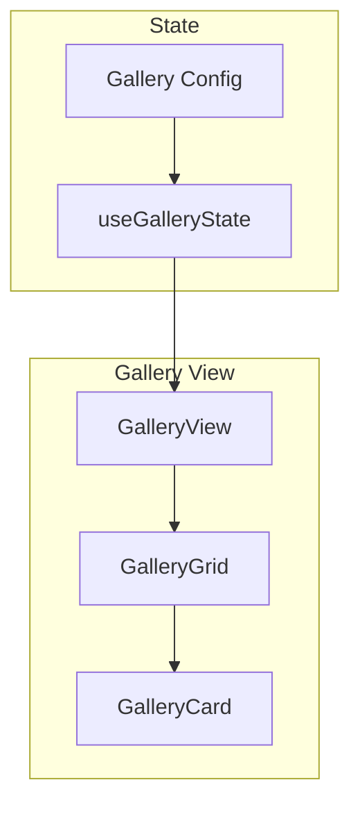

# 04: Gallery View

> Card-based gallery layout with cover images

**Duration:** 1 week
**Dependencies:** 01-property-types.md

## Overview

The gallery view displays items as visual cards in a grid layout. Features:
- Cover image from file property
- Customizable card size
- Property display on cards
- Responsive grid

## Architecture



## Implementation

### Gallery Config

```typescript
// packages/views/src/gallery/types.ts

export interface GalleryConfig {
  coverPropertyId?: string    // File property for cover image
  cardSize: 'small' | 'medium' | 'large'
  cardProperties: string[]    // Properties to show on card
  fitImage: 'cover' | 'contain'
  showTitle: boolean
}

export const CARD_SIZES = {
  small: { width: 180, height: 200 },
  medium: { width: 240, height: 280 },
  large: { width: 320, height: 360 },
}
```

### Gallery State Hook

```typescript
// packages/views/src/gallery/useGalleryState.ts

import { useMemo } from 'react'
import { Database, View, DatabaseItem } from '@xnet/database'
import { GalleryConfig, CARD_SIZES } from './types'

export interface UseGalleryStateOptions {
  database: Database
  view: View
  items: DatabaseItem[]
}

export function useGalleryState({
  database,
  view,
  items,
}: UseGalleryStateOptions) {
  const config = view.config as GalleryConfig

  // Get cover property
  const coverProperty = config.coverPropertyId
    ? database.properties.find(p => p.id === config.coverPropertyId)
    : null

  // Get title property (first text property)
  const titleProperty = database.properties.find(p => p.type === 'text')

  // Get display properties
  const displayProperties = useMemo(() => {
    return config.cardProperties
      .map(id => database.properties.find(p => p.id === id))
      .filter(Boolean)
  }, [config.cardProperties, database.properties])

  // Card dimensions
  const cardDimensions = CARD_SIZES[config.cardSize]

  return {
    config,
    coverProperty,
    titleProperty,
    displayProperties,
    cardDimensions,
    items,
  }
}
```

### Gallery View Component

```typescript
// packages/views/src/gallery/GalleryView.tsx

import React from 'react'
import { useGalleryState, UseGalleryStateOptions } from './useGalleryState'
import { GalleryCard } from './GalleryCard'

export interface GalleryViewProps extends UseGalleryStateOptions {
  className?: string
  onItemClick?: (itemId: string) => void
  onUpdateItem?: (itemId: string, changes: Record<string, unknown>) => void
}

export function GalleryView({
  className,
  onItemClick,
  onUpdateItem,
  ...options
}: GalleryViewProps) {
  const {
    config,
    coverProperty,
    titleProperty,
    displayProperties,
    cardDimensions,
    items,
  } = useGalleryState(options)

  return (
    <div className={`gallery-view ${className || ''}`}>
      <div
        className="gallery-grid"
        style={{
          gridTemplateColumns: `repeat(auto-fill, minmax(${cardDimensions.width}px, 1fr))`,
        }}
      >
        {items.map(item => (
          <GalleryCard
            key={item.id}
            item={item}
            config={config}
            coverProperty={coverProperty}
            titleProperty={titleProperty}
            displayProperties={displayProperties}
            cardDimensions={cardDimensions}
            onClick={() => onItemClick?.(item.id)}
          />
        ))}

        {/* Add new card */}
        <button
          className="gallery-add-card"
          style={{
            width: cardDimensions.width,
            height: cardDimensions.height,
          }}
        >
          + New
        </button>
      </div>
    </div>
  )
}
```

### Gallery Card Component

```typescript
// packages/views/src/gallery/GalleryCard.tsx

import React from 'react'
import { DatabaseItem, PropertyDefinition } from '@xnet/database'
import { getPropertyHandler } from '@xnet/database/properties'
import { GalleryConfig } from './types'

interface GalleryCardProps {
  item: DatabaseItem
  config: GalleryConfig
  coverProperty: PropertyDefinition | null
  titleProperty: PropertyDefinition | null
  displayProperties: PropertyDefinition[]
  cardDimensions: { width: number; height: number }
  onClick?: () => void
}

export function GalleryCard({
  item,
  config,
  coverProperty,
  titleProperty,
  displayProperties,
  cardDimensions,
  onClick,
}: GalleryCardProps) {
  // Get cover image URL
  const coverUrl = coverProperty
    ? getCoverUrl(item.properties[coverProperty.id])
    : null

  // Get title
  const title = titleProperty
    ? (item.properties[titleProperty.id] as string)
    : 'Untitled'

  // Calculate cover height (60% of card)
  const coverHeight = Math.round(cardDimensions.height * 0.6)

  return (
    <div
      className="gallery-card"
      style={{
        width: cardDimensions.width,
        height: cardDimensions.height,
      }}
      onClick={onClick}
    >
      {/* Cover image */}
      <div
        className="card-cover"
        style={{ height: coverHeight }}
      >
        {coverUrl ? (
          
        ) : (
          <div className="cover-placeholder" />
        )}
      </div>

      {/* Card content */}
      <div className="card-content">
        {config.showTitle && (
          <div className="card-title">{title}</div>
        )}

        <div className="card-properties">
          {displayProperties.map(prop => {
            const value = item.properties[prop.id]
            if (value === null || value === undefined) return null

            const handler = getPropertyHandler(prop.type)

            return (
              <div key={prop.id} className="card-property">
                <span className="property-name">{prop.name}</span>
                <span className="property-value">
                  {handler.render(value, prop.config)}
                </span>
              </div>
            )
          })}
        </div>
      </div>
    </div>
  )
}

function getCoverUrl(value: unknown): string | null {
  if (!value) return null

  // Handle file property value
  if (typeof value === 'object' && value !== null) {
    const file = value as { url?: string; thumbnailUrl?: string }
    return file.thumbnailUrl || file.url || null
  }

  // Handle direct URL string
  if (typeof value === 'string' && value.startsWith('http')) {
    return value
  }

  return null
}
```

### Styles

```css
/* packages/views/src/gallery/gallery.css */

.gallery-view {
  height: 100%;
  overflow-y: auto;
  padding: 16px;
}

.gallery-grid {
  display: grid;
  gap: 16px;
  justify-content: start;
}

/* Card */
.gallery-card {
  display: flex;
  flex-direction: column;
  background: var(--bg-primary);
  border-radius: 8px;
  overflow: hidden;
  box-shadow: 0 1px 3px rgba(0, 0, 0, 0.1);
  cursor: pointer;
  transition: box-shadow 0.2s, transform 0.2s;
}

.gallery-card:hover {
  box-shadow: 0 4px 12px rgba(0, 0, 0, 0.15);
  transform: translateY(-2px);
}

/* Cover */
.card-cover {
  position: relative;
  background: var(--bg-secondary);
  overflow: hidden;
}

.cover-image {
  width: 100%;
  height: 100%;
  object-fit: cover;
}

.cover-image.contain {
  object-fit: contain;
}

.cover-placeholder {
  width: 100%;
  height: 100%;
  background: linear-gradient(135deg, var(--bg-secondary) 0%, var(--bg-tertiary) 100%);
}

/* Content */
.card-content {
  flex: 1;
  padding: 12px;
  display: flex;
  flex-direction: column;
  gap: 8px;
}

.card-title {
  font-weight: 500;
  font-size: 14px;
  overflow: hidden;
  text-overflow: ellipsis;
  white-space: nowrap;
}

.card-properties {
  display: flex;
  flex-direction: column;
  gap: 4px;
}

.card-property {
  display: flex;
  justify-content: space-between;
  font-size: 12px;
}

.property-name {
  color: var(--text-secondary);
}

.property-value {
  color: var(--text-primary);
}

/* Add card button */
.gallery-add-card {
  display: flex;
  align-items: center;
  justify-content: center;
  background: transparent;
  border: 2px dashed var(--border);
  border-radius: 8px;
  color: var(--text-secondary);
  font-size: 14px;
  cursor: pointer;
  transition: border-color 0.2s, color 0.2s;
}

.gallery-add-card:hover {
  border-color: var(--accent);
  color: var(--accent);
}
```

## Tests

```typescript
// packages/views/test/gallery/GalleryView.test.tsx

import { describe, it, expect, vi } from 'vitest'
import { render, screen } from '@testing-library/react'
import { GalleryView } from '../../src/gallery/GalleryView'

describe('GalleryView', () => {
  const mockDatabase = {
    id: 'db-1',
    name: 'Test DB',
    properties: [
      { id: 'name', name: 'Name', type: 'text', config: {} },
      { id: 'cover', name: 'Cover', type: 'file', config: {} },
    ],
    views: [],
    defaultViewId: 'view-1',
  }

  const mockView = {
    id: 'view-1',
    name: 'Gallery',
    type: 'gallery',
    visibleProperties: ['name', 'cover'],
    propertyWidths: {},
    sorts: [],
    config: {
      coverPropertyId: 'cover',
      cardSize: 'medium',
      cardProperties: ['name'],
      fitImage: 'cover',
      showTitle: true,
    }
  }

  const mockItems = [
    { id: '1', databaseId: 'db-1', properties: { name: 'Item 1', cover: { url: 'https://example.com/1.jpg' } } },
    { id: '2', databaseId: 'db-1', properties: { name: 'Item 2', cover: null } },
  ]

  it('renders cards with titles', () => {
    render(
      <GalleryView
        database={mockDatabase}
        view={mockView}
        items={mockItems}
      />
    )

    expect(screen.getByText('Item 1')).toBeInTheDocument()
    expect(screen.getByText('Item 2')).toBeInTheDocument()
  })

  it('renders cover images', () => {
    render(
      <GalleryView
        database={mockDatabase}
        view={mockView}
        items={mockItems}
      />
    )

    const images = screen.getAllByRole('img')
    expect(images).toHaveLength(1)
    expect(images[0]).toHaveAttribute('src', 'https://example.com/1.jpg')
  })

  it('shows placeholder for items without cover', () => {
    const { container } = render(
      <GalleryView
        database={mockDatabase}
        view={mockView}
        items={mockItems}
      />
    )

    const placeholders = container.querySelectorAll('.cover-placeholder')
    expect(placeholders).toHaveLength(1)
  })
})
```

## Checklist

- [ ] GalleryView component
- [ ] GalleryCard with cover image
- [ ] Card size options (small, medium, large)
- [ ] Image fit options (cover, contain)
- [ ] Property display on cards
- [ ] Responsive grid layout
- [ ] Add new card button
- [ ] Click to open item
- [ ] Placeholder for missing covers
- [ ] Lazy loading for images
- [ ] All tests pass

---

[← Back to Board View](./03-view-board.md) | [Next: Timeline View →](./05-view-timeline.md)
