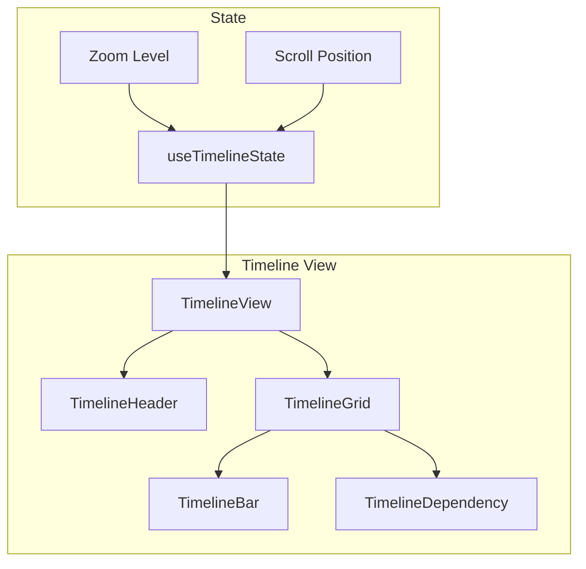

# 05: Timeline View

> Gantt-style timeline with date ranges and dependencies

**Duration:** 2 weeks
**Dependencies:** 01-property-types.md

## Overview

The timeline (Gantt) view displays items as bars on a horizontal timeline. Features:
- Date range visualization
- Zoom levels (day, week, month, quarter)
- Dependencies between items
- Drag to adjust dates
- Today marker

## Architecture



## Implementation

### Timeline Config

```typescript
// packages/views/src/timeline/types.ts

export interface TimelineConfig {
  startDatePropertyId: string
  endDatePropertyId?: string    // Optional, uses startDate if not set
  titlePropertyId?: string
  colorPropertyId?: string      // Select property for bar color
  showDependencies: boolean
  defaultZoom: ZoomLevel
}

export type ZoomLevel = 'day' | 'week' | 'month' | 'quarter'

export interface TimelineRange {
  start: Date
  end: Date
}

export const ZOOM_CONFIG = {
  day: {
    unitWidth: 40,      // pixels per day
    headerFormat: 'MMM D',
    subHeaderFormat: 'ddd',
    gridInterval: 1,    // days
  },
  week: {
    unitWidth: 120,     // pixels per week
    headerFormat: 'MMM YYYY',
    subHeaderFormat: 'Week W',
    gridInterval: 7,
  },
  month: {
    unitWidth: 100,     // pixels per month
    headerFormat: 'YYYY',
    subHeaderFormat: 'MMM',
    gridInterval: 30,
  },
  quarter: {
    unitWidth: 150,     // pixels per quarter
    headerFormat: 'YYYY',
    subHeaderFormat: 'Q#',
    gridInterval: 90,
  },
}
```

### Timeline State Hook

```typescript
// packages/views/src/timeline/useTimelineState.ts

import { useMemo, useState, useCallback } from 'react'
import { Database, View, DatabaseItem } from '@xnet/database'
import { TimelineConfig, ZoomLevel, TimelineRange, ZOOM_CONFIG } from './types'

export interface TimelineItem {
  id: string
  item: DatabaseItem
  title: string
  startDate: Date
  endDate: Date
  color: string
  dependencies: string[]  // IDs of items this depends on
}

export interface UseTimelineStateOptions {
  database: Database
  view: View
  items: DatabaseItem[]
  onUpdateItem: (itemId: string, changes: Record<string, unknown>) => void
}

export function useTimelineState({
  database,
  view,
  items,
  onUpdateItem,
}: UseTimelineStateOptions) {
  const config = view.config as TimelineConfig

  const [zoom, setZoom] = useState<ZoomLevel>(config.defaultZoom)
  const [scrollLeft, setScrollLeft] = useState(0)

  // Get property definitions
  const startDateProp = database.properties.find(p => p.id === config.startDatePropertyId)
  const endDateProp = config.endDatePropertyId
    ? database.properties.find(p => p.id === config.endDatePropertyId)
    : null
  const titleProp = config.titlePropertyId
    ? database.properties.find(p => p.id === config.titlePropertyId)
    : database.properties.find(p => p.type === 'text')
  const colorProp = config.colorPropertyId
    ? database.properties.find(p => p.id === config.colorPropertyId)
    : null

  // Process items into timeline items
  const timelineItems = useMemo<TimelineItem[]>(() => {
    return items
      .filter(item => {
        const startDate = item.properties[config.startDatePropertyId]
        return startDate != null
      })
      .map(item => {
        const startTimestamp = item.properties[config.startDatePropertyId] as number
        const endTimestamp = config.endDatePropertyId
          ? (item.properties[config.endDatePropertyId] as number)
          : startTimestamp + 86400000 // Default 1 day duration

        const title = titleProp
          ? (item.properties[titleProp.id] as string) || 'Untitled'
          : 'Untitled'

        // Get color from select property
        let color = '#4a90d9'
        if (colorProp && colorProp.type === 'select') {
          const optionId = item.properties[colorProp.id] as string
          const option = colorProp.config.options?.find(o => o.id === optionId)
          if (option) color = option.color
        }

        return {
          id: item.id,
          item,
          title,
          startDate: new Date(startTimestamp),
          endDate: new Date(endTimestamp),
          color,
          dependencies: [], // TODO: implement dependencies
        }
      })
      .sort((a, b) => a.startDate.getTime() - b.startDate.getTime())
  }, [items, config, titleProp, colorProp])

  // Calculate visible range
  const range = useMemo<TimelineRange>(() => {
    if (timelineItems.length === 0) {
      const today = new Date()
      return {
        start: new Date(today.getTime() - 7 * 86400000),
        end: new Date(today.getTime() + 30 * 86400000),
      }
    }

    const minDate = Math.min(...timelineItems.map(i => i.startDate.getTime()))
    const maxDate = Math.max(...timelineItems.map(i => i.endDate.getTime()))

    // Add padding
    const padding = 7 * 86400000 // 7 days
    return {
      start: new Date(minDate - padding),
      end: new Date(maxDate + padding),
    }
  }, [timelineItems])

  // Calculate timeline dimensions
  const zoomConfig = ZOOM_CONFIG[zoom]
  const totalDays = Math.ceil((range.end.getTime() - range.start.getTime()) / 86400000)
  const totalWidth = totalDays * (zoomConfig.unitWidth / zoomConfig.gridInterval) * zoomConfig.gridInterval

  // Update item dates
  const updateItemDates = useCallback((
    itemId: string,
    newStart: Date,
    newEnd: Date
  ) => {
    onUpdateItem(itemId, {
      [config.startDatePropertyId]: newStart.getTime(),
      ...(config.endDatePropertyId && {
        [config.endDatePropertyId]: newEnd.getTime(),
      }),
    })
  }, [onUpdateItem, config])

  return {
    config,
    zoom,
    setZoom,
    scrollLeft,
    setScrollLeft,
    timelineItems,
    range,
    totalWidth,
    zoomConfig,
    updateItemDates,
  }
}
```

### Timeline View Component

```typescript
// packages/views/src/timeline/TimelineView.tsx

import React, { useRef } from 'react'
import { useTimelineState, UseTimelineStateOptions } from './useTimelineState'
import { TimelineHeader } from './TimelineHeader'
import { TimelineGrid } from './TimelineGrid'
import { TimelineBar } from './TimelineBar'

export interface TimelineViewProps extends UseTimelineStateOptions {
  className?: string
}

export function TimelineView({ className, ...options }: TimelineViewProps) {
  const {
    zoom,
    setZoom,
    scrollLeft,
    setScrollLeft,
    timelineItems,
    range,
    totalWidth,
    zoomConfig,
    updateItemDates,
  } = useTimelineState(options)

  const containerRef = useRef<HTMLDivElement>(null)

  const handleScroll = (e: React.UIEvent<HTMLDivElement>) => {
    setScrollLeft(e.currentTarget.scrollLeft)
  }

  // Row height
  const ROW_HEIGHT = 40

  return (
    <div className={`timeline-view ${className || ''}`}>
      {/* Toolbar */}
      <div className="timeline-toolbar">
        <div className="zoom-controls">
          <button
            className={zoom === 'day' ? 'active' : ''}
            onClick={() => setZoom('day')}
          >
            Day
          </button>
          <button
            className={zoom === 'week' ? 'active' : ''}
            onClick={() => setZoom('week')}
          >
            Week
          </button>
          <button
            className={zoom === 'month' ? 'active' : ''}
            onClick={() => setZoom('month')}
          >
            Month
          </button>
          <button
            className={zoom === 'quarter' ? 'active' : ''}
            onClick={() => setZoom('quarter')}
          >
            Quarter
          </button>
        </div>

        <button className="today-btn" onClick={() => scrollToToday()}>
          Today
        </button>
      </div>

      {/* Main timeline area */}
      <div className="timeline-container">
        {/* Left sidebar with item names */}
        <div className="timeline-sidebar">
          <div className="sidebar-header">Items</div>
          <div className="sidebar-items">
            {timelineItems.map(item => (
              <div
                key={item.id}
                className="sidebar-item"
                style={{ height: ROW_HEIGHT }}
              >
                {item.title}
              </div>
            ))}
          </div>
        </div>

        {/* Scrollable timeline */}
        <div
          ref={containerRef}
          className="timeline-scroll"
          onScroll={handleScroll}
        >
          <div
            className="timeline-content"
            style={{ width: totalWidth }}
          >
            {/* Header with dates */}
            <TimelineHeader
              range={range}
              zoom={zoom}
              zoomConfig={zoomConfig}
              totalWidth={totalWidth}
            />

            {/* Grid and bars */}
            <div className="timeline-body">
              <TimelineGrid
                range={range}
                zoom={zoom}
                zoomConfig={zoomConfig}
                totalWidth={totalWidth}
                rowCount={timelineItems.length}
                rowHeight={ROW_HEIGHT}
              />

              {/* Bars */}
              {timelineItems.map((item, index) => (
                <TimelineBar
                  key={item.id}
                  item={item}
                  range={range}
                  zoomConfig={zoomConfig}
                  rowIndex={index}
                  rowHeight={ROW_HEIGHT}
                  onUpdate={(start, end) => updateItemDates(item.id, start, end)}
                />
              ))}

              {/* Today marker */}
              <TodayMarker
                range={range}
                zoomConfig={zoomConfig}
                height={timelineItems.length * ROW_HEIGHT}
              />
            </div>
          </div>
        </div>
      </div>
    </div>
  )

  function scrollToToday() {
    if (!containerRef.current) return
    const today = new Date()
    const dayOffset = Math.floor((today.getTime() - range.start.getTime()) / 86400000)
    const scrollPos = dayOffset * (zoomConfig.unitWidth / zoomConfig.gridInterval)
    containerRef.current.scrollLeft = scrollPos - containerRef.current.clientWidth / 2
  }
}

function TodayMarker({
  range,
  zoomConfig,
  height,
}: {
  range: { start: Date; end: Date }
  zoomConfig: { unitWidth: number; gridInterval: number }
  height: number
}) {
  const today = new Date()
  const dayOffset = Math.floor((today.getTime() - range.start.getTime()) / 86400000)
  const left = dayOffset * (zoomConfig.unitWidth / zoomConfig.gridInterval)

  return (
    <div
      className="today-marker"
      style={{ left, height }}
    />
  )
}
```

### Timeline Bar Component

```typescript
// packages/views/src/timeline/TimelineBar.tsx

import React, { useState, useCallback } from 'react'
import { TimelineItem } from './useTimelineState'

interface TimelineBarProps {
  item: TimelineItem
  range: { start: Date; end: Date }
  zoomConfig: { unitWidth: number; gridInterval: number }
  rowIndex: number
  rowHeight: number
  onUpdate: (start: Date, end: Date) => void
}

export function TimelineBar({
  item,
  range,
  zoomConfig,
  rowIndex,
  rowHeight,
  onUpdate,
}: TimelineBarProps) {
  const [isDragging, setIsDragging] = useState(false)
  const [isResizing, setIsResizing] = useState<'start' | 'end' | null>(null)

  // Calculate position
  const startDays = Math.floor((item.startDate.getTime() - range.start.getTime()) / 86400000)
  const durationDays = Math.ceil((item.endDate.getTime() - item.startDate.getTime()) / 86400000)

  const pixelsPerDay = zoomConfig.unitWidth / zoomConfig.gridInterval
  const left = startDays * pixelsPerDay
  const width = Math.max(durationDays * pixelsPerDay, 20)
  const top = rowIndex * rowHeight + 4
  const height = rowHeight - 8

  // Drag handling
  const handleMouseDown = useCallback((e: React.MouseEvent) => {
    if (e.target !== e.currentTarget) return
    setIsDragging(true)

    const startX = e.clientX
    const originalStart = item.startDate.getTime()
    const originalEnd = item.endDate.getTime()
    const duration = originalEnd - originalStart

    const handleMouseMove = (moveEvent: MouseEvent) => {
      const deltaX = moveEvent.clientX - startX
      const deltaDays = Math.round(deltaX / pixelsPerDay)
      const deltaMs = deltaDays * 86400000

      const newStart = new Date(originalStart + deltaMs)
      const newEnd = new Date(originalEnd + deltaMs)

      onUpdate(newStart, newEnd)
    }

    const handleMouseUp = () => {
      setIsDragging(false)
      document.removeEventListener('mousemove', handleMouseMove)
      document.removeEventListener('mouseup', handleMouseUp)
    }

    document.addEventListener('mousemove', handleMouseMove)
    document.addEventListener('mouseup', handleMouseUp)
  }, [item, pixelsPerDay, onUpdate])

  // Resize handling
  const handleResizeStart = useCallback((e: React.MouseEvent, edge: 'start' | 'end') => {
    e.stopPropagation()
    setIsResizing(edge)

    const startX = e.clientX
    const originalStart = item.startDate.getTime()
    const originalEnd = item.endDate.getTime()

    const handleMouseMove = (moveEvent: MouseEvent) => {
      const deltaX = moveEvent.clientX - startX
      const deltaDays = Math.round(deltaX / pixelsPerDay)
      const deltaMs = deltaDays * 86400000

      if (edge === 'start') {
        const newStart = new Date(Math.min(originalStart + deltaMs, originalEnd - 86400000))
        onUpdate(newStart, item.endDate)
      } else {
        const newEnd = new Date(Math.max(originalEnd + deltaMs, originalStart + 86400000))
        onUpdate(item.startDate, newEnd)
      }
    }

    const handleMouseUp = () => {
      setIsResizing(null)
      document.removeEventListener('mousemove', handleMouseMove)
      document.removeEventListener('mouseup', handleMouseUp)
    }

    document.addEventListener('mousemove', handleMouseMove)
    document.addEventListener('mouseup', handleMouseUp)
  }, [item, pixelsPerDay, onUpdate])

  return (
    <div
      className={`timeline-bar ${isDragging ? 'dragging' : ''} ${isResizing ? 'resizing' : ''}`}
      style={{
        left,
        width,
        top,
        height,
        backgroundColor: item.color,
      }}
      onMouseDown={handleMouseDown}
    >
      {/* Start resize handle */}
      <div
        className="resize-handle start"
        onMouseDown={(e) => handleResizeStart(e, 'start')}
      />

      {/* Bar content */}
      <div className="bar-content">
        <span className="bar-title">{item.title}</span>
      </div>

      {/* End resize handle */}
      <div
        className="resize-handle end"
        onMouseDown={(e) => handleResizeStart(e, 'end')}
      />
    </div>
  )
}
```

### Styles

```css
/* packages/views/src/timeline/timeline.css */

.timeline-view {
  height: 100%;
  display: flex;
  flex-direction: column;
}

.timeline-toolbar {
  display: flex;
  justify-content: space-between;
  padding: 8px 16px;
  border-bottom: 1px solid var(--border);
}

.zoom-controls {
  display: flex;
  gap: 4px;
}

.zoom-controls button {
  padding: 4px 12px;
  border: 1px solid var(--border);
  background: var(--bg-primary);
  border-radius: 4px;
  cursor: pointer;
}

.zoom-controls button.active {
  background: var(--accent);
  color: white;
  border-color: var(--accent);
}

.timeline-container {
  flex: 1;
  display: flex;
  overflow: hidden;
}

/* Sidebar */
.timeline-sidebar {
  width: 200px;
  flex-shrink: 0;
  border-right: 1px solid var(--border);
}

.sidebar-header {
  height: 60px;
  padding: 0 16px;
  display: flex;
  align-items: center;
  font-weight: 500;
  border-bottom: 1px solid var(--border);
}

.sidebar-item {
  padding: 0 16px;
  display: flex;
  align-items: center;
  overflow: hidden;
  text-overflow: ellipsis;
  white-space: nowrap;
  font-size: 13px;
  border-bottom: 1px solid var(--border-light);
}

/* Timeline scroll area */
.timeline-scroll {
  flex: 1;
  overflow-x: auto;
  overflow-y: hidden;
}

.timeline-content {
  position: relative;
}

.timeline-body {
  position: relative;
}

/* Timeline bar */
.timeline-bar {
  position: absolute;
  border-radius: 4px;
  cursor: grab;
  display: flex;
  align-items: center;
  padding: 0 8px;
  font-size: 12px;
  color: white;
  user-select: none;
}

.timeline-bar.dragging {
  cursor: grabbing;
  opacity: 0.8;
}

.bar-title {
  overflow: hidden;
  text-overflow: ellipsis;
  white-space: nowrap;
}

/* Resize handles */
.resize-handle {
  position: absolute;
  top: 0;
  bottom: 0;
  width: 8px;
  cursor: ew-resize;
}

.resize-handle.start {
  left: 0;
}

.resize-handle.end {
  right: 0;
}

/* Today marker */
.today-marker {
  position: absolute;
  top: 0;
  width: 2px;
  background: var(--danger);
  z-index: 10;
  pointer-events: none;
}
```

## Checklist

### Week 1: Core Timeline
- [ ] useTimelineState hook
- [ ] TimelineView component
- [ ] TimelineHeader with date labels
- [ ] TimelineGrid with vertical lines
- [ ] TimelineBar rendering
- [ ] Zoom levels (day, week, month, quarter)
- [ ] Today marker

### Week 2: Interactions
- [ ] Drag bar to move dates
- [ ] Resize bar edges
- [ ] Scroll to today
- [ ] Keyboard navigation
- [ ] Dependencies visualization
- [ ] Row hover highlighting
- [ ] Click to open item
- [ ] All tests pass

---

[← Back to Gallery View](./04-view-gallery.md) | [Next: Calendar View →](./06-view-calendar.md)
