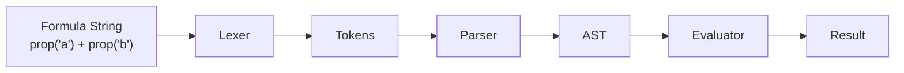

# 07: Formula Engine

> Expression parser and evaluator for computed properties

**Duration:** 3 weeks
**Dependencies:** 01-property-types.md

## Overview

The formula engine enables computed properties with Notion-compatible syntax. Components:
- Lexer (tokenizer)
- Parser (AST builder)
- Evaluator (expression execution)
- Function library

## Architecture



## Implementation

### Token Types

```typescript
// packages/formula/src/lexer.ts

export type TokenType =
  | 'NUMBER'
  | 'STRING'
  | 'BOOLEAN'
  | 'IDENTIFIER'
  | 'OPERATOR'
  | 'LPAREN'
  | 'RPAREN'
  | 'COMMA'
  | 'EOF'

export interface Token {
  type: TokenType
  value: string | number | boolean
  position: number
}

export class Lexer {
  private input: string
  private position = 0

  constructor(input: string) {
    this.input = input
  }

  tokenize(): Token[] {
    const tokens: Token[] = []

    while (this.position < this.input.length) {
      this.skipWhitespace()
      if (this.position >= this.input.length) break

      const char = this.input[this.position]

      // Numbers
      if (this.isDigit(char)) {
        tokens.push(this.readNumber())
        continue
      }

      // Strings
      if (char === '"' || char === "'") {
        tokens.push(this.readString(char))
        continue
      }

      // Identifiers and keywords
      if (this.isAlpha(char)) {
        tokens.push(this.readIdentifier())
        continue
      }

      // Operators
      if (this.isOperatorStart(char)) {
        tokens.push(this.readOperator())
        continue
      }

      // Parentheses
      if (char === '(') {
        tokens.push({ type: 'LPAREN', value: '(', position: this.position++ })
        continue
      }
      if (char === ')') {
        tokens.push({ type: 'RPAREN', value: ')', position: this.position++ })
        continue
      }

      // Comma
      if (char === ',') {
        tokens.push({ type: 'COMMA', value: ',', position: this.position++ })
        continue
      }

      throw new Error(`Unexpected character '${char}' at position ${this.position}`)
    }

    tokens.push({ type: 'EOF', value: '', position: this.position })
    return tokens
  }

  private skipWhitespace() {
    while (this.position < this.input.length && /\s/.test(this.input[this.position])) {
      this.position++
    }
  }

  private isDigit(char: string): boolean {
    return /[0-9]/.test(char)
  }

  private isAlpha(char: string): boolean {
    return /[a-zA-Z_]/.test(char)
  }

  private isOperatorStart(char: string): boolean {
    return ['+', '-', '*', '/', '%', '=', '!', '<', '>', '&', '|'].includes(char)
  }

  private readNumber(): Token {
    const start = this.position
    let hasDecimal = false

    while (this.position < this.input.length) {
      const char = this.input[this.position]
      if (this.isDigit(char)) {
        this.position++
      } else if (char === '.' && !hasDecimal) {
        hasDecimal = true
        this.position++
      } else {
        break
      }
    }

    return {
      type: 'NUMBER',
      value: parseFloat(this.input.slice(start, this.position)),
      position: start,
    }
  }

  private readString(quote: string): Token {
    const start = this.position
    this.position++ // Skip opening quote

    let value = ''
    while (this.position < this.input.length) {
      const char = this.input[this.position]
      if (char === quote) {
        this.position++
        return { type: 'STRING', value, position: start }
      }
      if (char === '\\') {
        this.position++
        value += this.readEscapeSequence()
      } else {
        value += char
        this.position++
      }
    }

    throw new Error(`Unterminated string at position ${start}`)
  }

  private readEscapeSequence(): string {
    const char = this.input[this.position++]
    switch (char) {
      case 'n': return '\n'
      case 't': return '\t'
      case 'r': return '\r'
      case '\\': return '\\'
      case '"': return '"'
      case "'": return "'"
      default: return char
    }
  }

  private readIdentifier(): Token {
    const start = this.position

    while (this.position < this.input.length) {
      const char = this.input[this.position]
      if (this.isAlpha(char) || this.isDigit(char)) {
        this.position++
      } else {
        break
      }
    }

    const value = this.input.slice(start, this.position)

    // Check for boolean keywords
    if (value === 'true') return { type: 'BOOLEAN', value: true, position: start }
    if (value === 'false') return { type: 'BOOLEAN', value: false, position: start }

    return { type: 'IDENTIFIER', value, position: start }
  }

  private readOperator(): Token {
    const start = this.position
    const char = this.input[this.position++]

    // Two-character operators
    const next = this.input[this.position]
    const twoChar = char + next
    if (['==', '!=', '<=', '>=', '&&', '||'].includes(twoChar)) {
      this.position++
      return { type: 'OPERATOR', value: twoChar, position: start }
    }

    return { type: 'OPERATOR', value: char, position: start }
  }
}
```

### AST Types

```typescript
// packages/formula/src/ast.ts

export type ASTNode =
  | NumberLiteral
  | StringLiteral
  | BooleanLiteral
  | Identifier
  | BinaryExpression
  | UnaryExpression
  | CallExpression

export interface NumberLiteral {
  type: 'NumberLiteral'
  value: number
}

export interface StringLiteral {
  type: 'StringLiteral'
  value: string
}

export interface BooleanLiteral {
  type: 'BooleanLiteral'
  value: boolean
}

export interface Identifier {
  type: 'Identifier'
  name: string
}

export interface BinaryExpression {
  type: 'BinaryExpression'
  operator: string
  left: ASTNode
  right: ASTNode
}

export interface UnaryExpression {
  type: 'UnaryExpression'
  operator: string
  argument: ASTNode
}

export interface CallExpression {
  type: 'CallExpression'
  callee: string
  arguments: ASTNode[]
}
```

### Parser

```typescript
// packages/formula/src/parser.ts

import { Token, TokenType } from './lexer'
import { ASTNode } from './ast'

export class Parser {
  private tokens: Token[]
  private position = 0

  constructor(tokens: Token[]) {
    this.tokens = tokens
  }

  parse(): ASTNode {
    return this.parseExpression()
  }

  private current(): Token {
    return this.tokens[this.position]
  }

  private consume(type: TokenType): Token {
    const token = this.current()
    if (token.type !== type) {
      throw new Error(`Expected ${type} but got ${token.type} at position ${token.position}`)
    }
    this.position++
    return token
  }

  private parseExpression(): ASTNode {
    return this.parseOr()
  }

  private parseOr(): ASTNode {
    let left = this.parseAnd()

    while (this.current().type === 'OPERATOR' && this.current().value === '||') {
      const operator = this.consume('OPERATOR').value as string
      const right = this.parseAnd()
      left = { type: 'BinaryExpression', operator, left, right }
    }

    return left
  }

  private parseAnd(): ASTNode {
    let left = this.parseEquality()

    while (this.current().type === 'OPERATOR' && this.current().value === '&&') {
      const operator = this.consume('OPERATOR').value as string
      const right = this.parseEquality()
      left = { type: 'BinaryExpression', operator, left, right }
    }

    return left
  }

  private parseEquality(): ASTNode {
    let left = this.parseComparison()

    while (this.current().type === 'OPERATOR' && ['==', '!='].includes(this.current().value as string)) {
      const operator = this.consume('OPERATOR').value as string
      const right = this.parseComparison()
      left = { type: 'BinaryExpression', operator, left, right }
    }

    return left
  }

  private parseComparison(): ASTNode {
    let left = this.parseAdditive()

    while (this.current().type === 'OPERATOR' && ['<', '>', '<=', '>='].includes(this.current().value as string)) {
      const operator = this.consume('OPERATOR').value as string
      const right = this.parseAdditive()
      left = { type: 'BinaryExpression', operator, left, right }
    }

    return left
  }

  private parseAdditive(): ASTNode {
    let left = this.parseMultiplicative()

    while (this.current().type === 'OPERATOR' && ['+', '-'].includes(this.current().value as string)) {
      const operator = this.consume('OPERATOR').value as string
      const right = this.parseMultiplicative()
      left = { type: 'BinaryExpression', operator, left, right }
    }

    return left
  }

  private parseMultiplicative(): ASTNode {
    let left = this.parseUnary()

    while (this.current().type === 'OPERATOR' && ['*', '/', '%'].includes(this.current().value as string)) {
      const operator = this.consume('OPERATOR').value as string
      const right = this.parseUnary()
      left = { type: 'BinaryExpression', operator, left, right }
    }

    return left
  }

  private parseUnary(): ASTNode {
    if (this.current().type === 'OPERATOR' && ['-', '!'].includes(this.current().value as string)) {
      const operator = this.consume('OPERATOR').value as string
      const argument = this.parseUnary()
      return { type: 'UnaryExpression', operator, argument }
    }

    return this.parseCall()
  }

  private parseCall(): ASTNode {
    const primary = this.parsePrimary()

    // Check for function call
    if (primary.type === 'Identifier' && this.current().type === 'LPAREN') {
      this.consume('LPAREN')
      const args: ASTNode[] = []

      if (this.current().type !== 'RPAREN') {
        args.push(this.parseExpression())
        while (this.current().type === 'COMMA') {
          this.consume('COMMA')
          args.push(this.parseExpression())
        }
      }

      this.consume('RPAREN')
      return { type: 'CallExpression', callee: primary.name, arguments: args }
    }

    return primary
  }

  private parsePrimary(): ASTNode {
    const token = this.current()

    switch (token.type) {
      case 'NUMBER':
        this.position++
        return { type: 'NumberLiteral', value: token.value as number }

      case 'STRING':
        this.position++
        return { type: 'StringLiteral', value: token.value as string }

      case 'BOOLEAN':
        this.position++
        return { type: 'BooleanLiteral', value: token.value as boolean }

      case 'IDENTIFIER':
        this.position++
        return { type: 'Identifier', name: token.value as string }

      case 'LPAREN':
        this.consume('LPAREN')
        const expr = this.parseExpression()
        this.consume('RPAREN')
        return expr

      default:
        throw new Error(`Unexpected token ${token.type} at position ${token.position}`)
    }
  }
}
```

### Evaluator

```typescript
// packages/formula/src/evaluator.ts

import { ASTNode } from './ast'
import { functions } from './functions'

export interface EvaluatorContext {
  props: Record<string, unknown>
  getRelation?: (propertyId: string) => unknown[]
}

export class Evaluator {
  private context: EvaluatorContext

  constructor(context: EvaluatorContext) {
    this.context = context
  }

  evaluate(node: ASTNode): unknown {
    switch (node.type) {
      case 'NumberLiteral':
        return node.value

      case 'StringLiteral':
        return node.value

      case 'BooleanLiteral':
        return node.value

      case 'Identifier':
        return this.context.props[node.name]

      case 'BinaryExpression':
        return this.evaluateBinary(node)

      case 'UnaryExpression':
        return this.evaluateUnary(node)

      case 'CallExpression':
        return this.evaluateCall(node)

      default:
        throw new Error(`Unknown node type: ${(node as any).type}`)
    }
  }

  private evaluateBinary(node: { operator: string; left: ASTNode; right: ASTNode }): unknown {
    const left = this.evaluate(node.left)
    const right = this.evaluate(node.right)

    switch (node.operator) {
      // Arithmetic
      case '+':
        if (typeof left === 'string' || typeof right === 'string') {
          return String(left) + String(right)
        }
        return (left as number) + (right as number)
      case '-': return (left as number) - (right as number)
      case '*': return (left as number) * (right as number)
      case '/': return (left as number) / (right as number)
      case '%': return (left as number) % (right as number)

      // Comparison
      case '==': return left === right
      case '!=': return left !== right
      case '<': return (left as number) < (right as number)
      case '>': return (left as number) > (right as number)
      case '<=': return (left as number) <= (right as number)
      case '>=': return (left as number) >= (right as number)

      // Logical
      case '&&': return Boolean(left) && Boolean(right)
      case '||': return Boolean(left) || Boolean(right)

      default:
        throw new Error(`Unknown operator: ${node.operator}`)
    }
  }

  private evaluateUnary(node: { operator: string; argument: ASTNode }): unknown {
    const arg = this.evaluate(node.argument)

    switch (node.operator) {
      case '-': return -(arg as number)
      case '!': return !arg
      default:
        throw new Error(`Unknown unary operator: ${node.operator}`)
    }
  }

  private evaluateCall(node: { callee: string; arguments: ASTNode[] }): unknown {
    const fn = functions[node.callee]
    if (!fn) {
      throw new Error(`Unknown function: ${node.callee}`)
    }

    const args = node.arguments.map(arg => this.evaluate(arg))
    return fn(args, this.context)
  }
}
```

### Functions Library

```typescript
// packages/formula/src/functions/index.ts

import { EvaluatorContext } from '../evaluator'

export type FormulaFunction = (args: unknown[], context: EvaluatorContext) => unknown

export const functions: Record<string, FormulaFunction> = {
  // Property access
  prop: (args, context) => {
    const propName = args[0] as string
    return context.props[propName]
  },

  // Math functions
  abs: (args) => Math.abs(args[0] as number),
  ceil: (args) => Math.ceil(args[0] as number),
  floor: (args) => Math.floor(args[0] as number),
  round: (args) => Math.round(args[0] as number),
  sqrt: (args) => Math.sqrt(args[0] as number),
  pow: (args) => Math.pow(args[0] as number, args[1] as number),
  min: (args) => Math.min(...(args as number[])),
  max: (args) => Math.max(...(args as number[])),
  sum: (args) => (args as number[]).reduce((a, b) => a + b, 0),
  average: (args) => {
    const nums = args as number[]
    return nums.reduce((a, b) => a + b, 0) / nums.length
  },

  // String functions
  concat: (args) => args.map(String).join(''),
  lower: (args) => String(args[0]).toLowerCase(),
  upper: (args) => String(args[0]).toUpperCase(),
  length: (args) => String(args[0]).length,
  contains: (args) => String(args[0]).includes(String(args[1])),
  replace: (args) => String(args[0]).replace(String(args[1]), String(args[2])),
  slice: (args) => String(args[0]).slice(args[1] as number, args[2] as number),
  trim: (args) => String(args[0]).trim(),
  split: (args) => String(args[0]).split(String(args[1])),
  join: (args) => (args[0] as string[]).join(String(args[1])),

  // Date functions
  now: () => Date.now(),
  today: () => {
    const d = new Date()
    d.setHours(0, 0, 0, 0)
    return d.getTime()
  },
  dateAdd: (args) => {
    const date = new Date(args[0] as number)
    const amount = args[1] as number
    const unit = args[2] as string
    switch (unit) {
      case 'days': date.setDate(date.getDate() + amount); break
      case 'weeks': date.setDate(date.getDate() + amount * 7); break
      case 'months': date.setMonth(date.getMonth() + amount); break
      case 'years': date.setFullYear(date.getFullYear() + amount); break
    }
    return date.getTime()
  },
  dateDiff: (args) => {
    const date1 = new Date(args[0] as number)
    const date2 = new Date(args[1] as number)
    const unit = args[2] as string
    const diff = date1.getTime() - date2.getTime()
    switch (unit) {
      case 'days': return Math.floor(diff / 86400000)
      case 'weeks': return Math.floor(diff / 604800000)
      case 'months': return Math.floor(diff / 2592000000)
      case 'years': return Math.floor(diff / 31536000000)
      default: return diff
    }
  },
  year: (args) => new Date(args[0] as number).getFullYear(),
  month: (args) => new Date(args[0] as number).getMonth() + 1,
  day: (args) => new Date(args[0] as number).getDate(),
  formatDate: (args) => {
    const date = new Date(args[0] as number)
    return date.toLocaleDateString()
  },

  // Logic functions
  if: (args) => args[0] ? args[1] : args[2],
  and: (args) => args.every(Boolean),
  or: (args) => args.some(Boolean),
  not: (args) => !args[0],
  empty: (args) => args[0] == null || args[0] === '' || (Array.isArray(args[0]) && args[0].length === 0),
  test: (args) => new RegExp(String(args[1])).test(String(args[0])),

  // Type conversion
  toNumber: (args) => Number(args[0]),
  toString: (args) => String(args[0]),
}
```

### Main Entry Point

```typescript
// packages/formula/src/index.ts

import { Lexer } from './lexer'
import { Parser } from './parser'
import { Evaluator, EvaluatorContext } from './evaluator'
import { ASTNode } from './ast'

export function parseFormula(expression: string): ASTNode {
  const lexer = new Lexer(expression)
  const tokens = lexer.tokenize()
  const parser = new Parser(tokens)
  return parser.parse()
}

export function evaluateFormula(expression: string, context: EvaluatorContext): unknown {
  const ast = parseFormula(expression)
  const evaluator = new Evaluator(context)
  return evaluator.evaluate(ast)
}

// Validate formula syntax without evaluating
export function validateFormula(expression: string): { valid: boolean; error?: string } {
  try {
    parseFormula(expression)
    return { valid: true }
  } catch (e) {
    return { valid: false, error: (e as Error).message }
  }
}

export { Lexer, Parser, Evaluator }
export type { ASTNode, EvaluatorContext }
```

## Tests

```typescript
// packages/formula/test/formula.test.ts

import { describe, it, expect } from 'vitest'
import { evaluateFormula, parseFormula, validateFormula } from '../src'

describe('Formula Engine', () => {
  describe('Lexer', () => {
    it('tokenizes numbers', () => {
      const ast = parseFormula('42')
      expect(ast).toEqual({ type: 'NumberLiteral', value: 42 })
    })

    it('tokenizes strings', () => {
      const ast = parseFormula('"hello"')
      expect(ast).toEqual({ type: 'StringLiteral', value: 'hello' })
    })
  })

  describe('Parser', () => {
    it('parses arithmetic', () => {
      const ast = parseFormula('1 + 2 * 3')
      // Should be 1 + (2 * 3) due to precedence
      expect(ast.type).toBe('BinaryExpression')
    })

    it('parses function calls', () => {
      const ast = parseFormula('abs(-5)')
      expect(ast).toEqual({
        type: 'CallExpression',
        callee: 'abs',
        arguments: [{ type: 'UnaryExpression', operator: '-', argument: { type: 'NumberLiteral', value: 5 } }]
      })
    })
  })

  describe('Evaluator', () => {
    const context = {
      props: { price: 100, quantity: 5, name: 'Test' }
    }

    it('evaluates arithmetic', () => {
      expect(evaluateFormula('1 + 2', context)).toBe(3)
      expect(evaluateFormula('10 * 5', context)).toBe(50)
      expect(evaluateFormula('10 / 2', context)).toBe(5)
    })

    it('evaluates property access', () => {
      expect(evaluateFormula('prop("price")', context)).toBe(100)
      expect(evaluateFormula('prop("price") * prop("quantity")', context)).toBe(500)
    })

    it('evaluates math functions', () => {
      expect(evaluateFormula('abs(-5)', context)).toBe(5)
      expect(evaluateFormula('round(3.7)', context)).toBe(4)
      expect(evaluateFormula('max(1, 5, 3)', context)).toBe(5)
    })

    it('evaluates string functions', () => {
      expect(evaluateFormula('upper("hello")', context)).toBe('HELLO')
      expect(evaluateFormula('concat("a", "b", "c")', context)).toBe('abc')
    })

    it('evaluates conditionals', () => {
      expect(evaluateFormula('if(true, "yes", "no")', context)).toBe('yes')
      expect(evaluateFormula('if(prop("price") > 50, "expensive", "cheap")', context)).toBe('expensive')
    })
  })

  describe('Validation', () => {
    it('validates correct formulas', () => {
      expect(validateFormula('1 + 2').valid).toBe(true)
      expect(validateFormula('prop("name")').valid).toBe(true)
    })

    it('rejects invalid formulas', () => {
      expect(validateFormula('1 +').valid).toBe(false)
      expect(validateFormula('((1)').valid).toBe(false)
    })
  })
})
```

## Checklist

### Week 1: Lexer & Parser
- [ ] Lexer with all token types
- [ ] Parser with operator precedence
- [ ] AST types
- [ ] Parentheses handling
- [ ] Function call parsing
- [ ] Syntax validation

### Week 2: Evaluator & Functions
- [ ] Evaluator with context
- [ ] Math functions (15)
- [ ] String functions (10)
- [ ] Date functions (8)
- [ ] Logic functions (6)
- [ ] prop() function

### Week 3: Integration & Edge Cases
- [ ] Circular reference detection
- [ ] Error messages with position
- [ ] Performance optimization
- [ ] Integration with property system
- [ ] Editor autocomplete data
- [ ] All tests pass (>95% coverage)

---

[← Back to Calendar View](./06-view-calendar.md) | [Next: Vector Search →](./08-vector-search.md)
