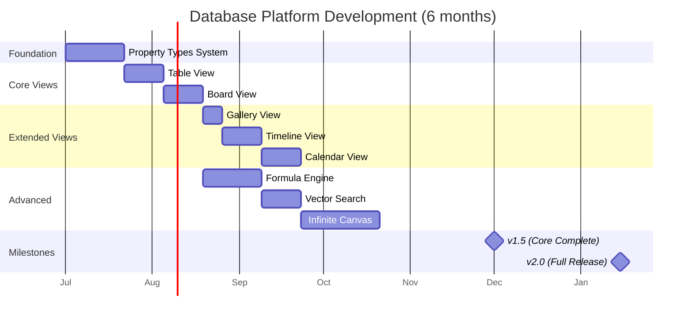

# 10: Development Timeline

> Implementation schedule for Database Platform phase

> **Note (Jan 2026):** Foundation is COMPLETE - Schema system and NodeStore
> are implemented in `@xnet/data`. Timeline updated accordingly.

## Overview



## Sprint Plan

| Sprint | Dates         | Focus           | Deliverables                                   |
| ------ | ------------- | --------------- | ---------------------------------------------- |
| 1-3    | Weeks 1-6     | Property Types  | All 17 property types, validation, editors     |
| 4-5    | Weeks 7-10    | Table View      | TanStack Table, virtual scroll, inline editing |
| 6-7    | Weeks 11-14   | Board View      | Kanban with dnd-kit, drag-drop sync            |
| 8      | Weeks 15-16   | Gallery View    | Card grid, cover images                        |
| 9-10   | Weeks 17-20   | Timeline View   | Gantt chart, date range drag                   |
| 11-12  | Weeks 21-24   | Calendar View   | Month/week/day, event scheduling               |
| 13-15  | Weeks 13-18\* | Formula Engine  | Parser, evaluator, 40+ functions               |
| 16-17  | Weeks 19-22\* | Vector Search   | Embeddings, HNSW, hybrid search                |
| 18-21  | Weeks 23-30\* | Infinite Canvas | R-tree, ELK layout, rendering                  |

\*Formula, Vector, Canvas run in parallel with views

## Milestones

### v1.5 (Month 18) - Core Database

- [x] Property type system complete
- [x] Table view with filter/sort
- [x] Board (Kanban) view
- [x] Basic formula support
- [x] 80%+ test coverage

### v2.0 (Month 24) - Full Platform

- [ ] All 6 view types
- [ ] Full formula engine (40+ functions)
- [ ] Vector-based semantic search
- [ ] Infinite canvas with auto-layout
- [ ] View templates
- [ ] 80%+ test coverage

## Resource Allocation

| Phase          | Engineers | Focus                            |
| -------------- | --------- | -------------------------------- |
| Foundation     | 1         | Property types, CRDT integration |
| Core Views     | 2         | Table (1), Board (1)             |
| Extended Views | 1         | Gallery, Timeline, Calendar      |
| Formula Engine | 1         | Parser, evaluator, functions     |
| Vector Search  | 1         | Embeddings, HNSW index           |
| Canvas         | 2         | Rendering (1), Layout (1)        |

## Risk Mitigation

| Risk                 | Probability | Impact | Mitigation                         |
| -------------------- | ----------- | ------ | ---------------------------------- |
| Formula complexity   | Medium      | High   | Start with subset, expand          |
| Performance at scale | High        | High   | Virtual scroll, spatial index      |
| Canvas rendering     | Medium      | Medium | Fallback to SVG if Canvas2D issues |
| Vector model size    | Low         | Medium | Use quantized model, lazy load     |

## Dependencies

### External Libraries

- `@tanstack/react-table` - Table view
- `@dnd-kit/core` - Drag and drop
- `elkjs` - Graph layout
- `rbush` - R-tree spatial index
- `usearch` - HNSW vector index
- `@tensorflow/tfjs` - Embedding model

### Internal Packages

- `@xnet/data` - CRDT documents
- `@xnet/storage` - Persistence
- `@xnet/query` - Local queries
- `@xnet/react` - React bindings

## Validation Gates

### After Property Types (Week 6)

- [ ] All 17 types implemented
- [ ] Property editors functional
- [ ] CRDT sync works for all types
- [ ] > 90% test coverage

### After Core Views (Week 14)

- [ ] Table renders 10k rows at 60fps
- [ ] Kanban drag-drop syncs across peers
- [ ] Filter/sort works on all views
- [ ] > 85% test coverage

### After All Views (Week 24)

- [ ] Gallery displays cover images
- [ ] Timeline shows date ranges
- [ ] Calendar drag scheduling works
- [ ] View switching <100ms

### After Formula (Week 18)

- [ ] 40+ functions implemented
- [ ] Circular reference detection
- [ ] Formula errors display clearly
- [ ] 1000 formulas compute <100ms

### After Vector Search (Week 22)

- [ ] Semantic search returns relevant results
- [ ] Index builds <5s for 10k docs
- [ ] Search latency <100ms

### After Canvas (Week 30)

- [ ] Canvas renders 1000+ nodes at 60fps
- [ ] Auto-layout produces readable graphs
- [ ] Pan/zoom smooth at all scales

## Quick Reference

### Commands

```bash
# Development
pnpm --filter @xnet/database dev
pnpm --filter @xnet/views dev
pnpm --filter @xnet/formula dev
pnpm --filter @xnet/canvas dev

# Testing
pnpm --filter @xnet/database test
pnpm --filter @xnet/views test
pnpm test:coverage

# Build
pnpm build
```

### Key Files

```
packages/database/src/
  properties/           # Property type implementations
  schema/              # Database, View definitions
  crdt/                # CRDT bindings

packages/views/src/
  table/               # Table view
  board/               # Board/Kanban view
  gallery/             # Gallery view
  timeline/            # Timeline/Gantt view
  calendar/            # Calendar view
  shared/              # Filter, Sort, PropertyEditor

packages/formula/src/
  lexer.ts             # Tokenizer
  parser.ts            # AST builder
  evaluator.ts         # Expression evaluation
  functions/           # Function implementations

packages/canvas/src/
  spatial/             # R-tree index
  layout/              # ELK, force layout
  renderer/            # Canvas rendering
  hooks/               # React hooks
```

---

[← Back to Infinite Canvas](./09-infinite-canvas.md) | [Back to README](./README.md)
