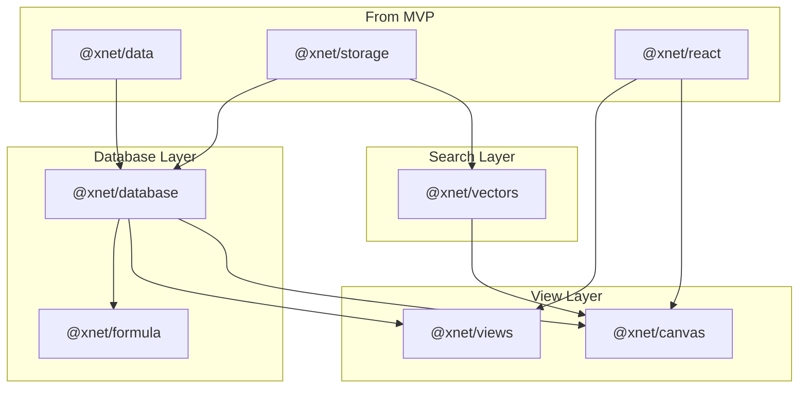

# xNet Implementation Plan - Step 02: Database Platform

> AI-agent-actionable implementation guide for Phase 2

## Prerequisites

Before starting this phase, ensure planStep01MVP is complete:
- [ ] All @xnet/* core packages working
- [ ] Platform POCs functional (Electron, Expo, Web)
- [ ] Basic wiki/editor features working
- [ ] P2P sync operational
- [ ] >80% test coverage on core packages

## Implementation Order

Execute these documents in order. Each builds on the previous.

| # | Document | Description | Est. Time |
|---|----------|-------------|-----------|
| 00 | [Overview](./00-overview.md) | Architecture, prerequisites, goals | Reference |
| 01 | [Property Types](./01-property-types.md) | 17 property types system | 3 weeks |
| 02 | [Table View](./02-view-table.md) | Spreadsheet view with TanStack Table | 2 weeks |
| 03 | [Board View](./03-view-board.md) | Kanban board with drag-drop | 2 weeks |
| 04 | [Gallery View](./04-view-gallery.md) | Card-based gallery layout | 1 week |
| 05 | [Timeline View](./05-view-timeline.md) | Gantt chart with dependencies | 2 weeks |
| 06 | [Calendar View](./06-view-calendar.md) | Month/week/day calendar | 2 weeks |
| 07 | [Formula Engine](./07-formula-engine.md) | Expression parser and evaluator | 3 weeks |
| 08 | [Vector Search](./08-vector-search.md) | Semantic search with embeddings | 2 weeks |
| 09 | [Infinite Canvas](./09-infinite-canvas.md) | Spatial graph visualization | 4 weeks |
| 10 | [Timeline](./10-timeline.md) | Development schedule and milestones | Reference |

## Validation Gates

### After Property Types
- [ ] All 17 property types functional
- [ ] Property validation works
- [ ] CRDT sync for properties works
- [ ] Tests pass (>80% coverage)

### After Core Views (Table + Board)
- [ ] Table view renders 10k rows smoothly
- [ ] Virtual scrolling works
- [ ] Kanban drag-drop syncs across peers
- [ ] Filter/sort works on all views

### After All Views
- [ ] Gallery renders with cover images
- [ ] Timeline shows date ranges
- [ ] Calendar supports drag scheduling
- [ ] View switching is instant

### After Formula Engine
- [ ] All formula categories work (math, string, date, logic)
- [ ] Formula errors display clearly
- [ ] Circular reference detection works
- [ ] Performance acceptable for 1000+ formulas

### After Vector Search
- [ ] Semantic search returns relevant results
- [ ] Index builds in <5s for 10k documents
- [ ] Search latency <100ms

### After Infinite Canvas
- [ ] Canvas renders 1000+ nodes smoothly
- [ ] Auto-layout produces readable graphs
- [ ] Pan/zoom performance is smooth
- [ ] Links render correctly

## Quick Reference

### Package Dependencies (New)
```
@xnet/database ──> @xnet/data, @xnet/storage
@xnet/views ────> @xnet/database, @xnet/react
@xnet/formula ──> @xnet/database
@xnet/vectors ──> @xnet/storage (already in MVP)
@xnet/canvas ───> @xnet/database, @xnet/vectors
```

### Key Types
```typescript
// Database
DatabaseId = `db:${string}`
PropertyId = `prop:${string}`
ViewId = `view:${string}`

// Property Types
PropertyType = 'text' | 'number' | 'date' | 'select' | 'multi-select'
             | 'person' | 'relation' | 'formula' | 'rollup' | 'checkbox'
             | 'url' | 'email' | 'phone' | 'file' | 'created' | 'updated' | 'createdBy'

// View Types
ViewType = 'table' | 'board' | 'gallery' | 'timeline' | 'calendar' | 'list'
```

### Test Commands
```bash
pnpm test                           # All tests
pnpm --filter @xnet/database test   # Database package
pnpm --filter @xnet/views test      # Views package
pnpm --filter @xnet/formula test    # Formula engine
pnpm test:coverage                  # With coverage
```

## Architecture Overview



---

[Back to planStep01MVP](../planStep01MVP/README.md) | [Start with Overview →](./00-overview.md)
