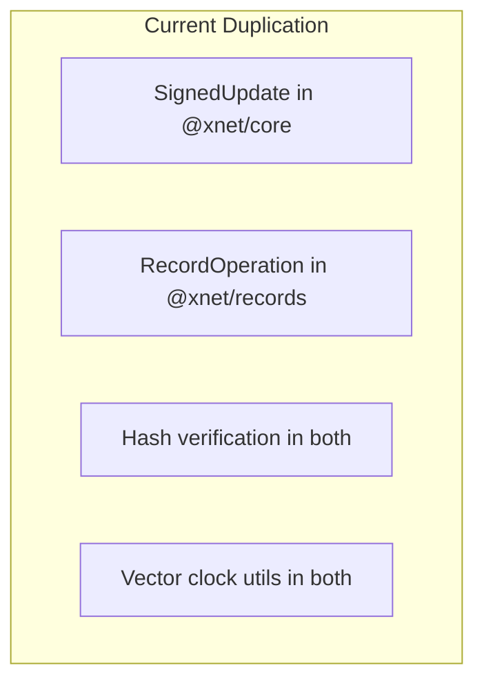
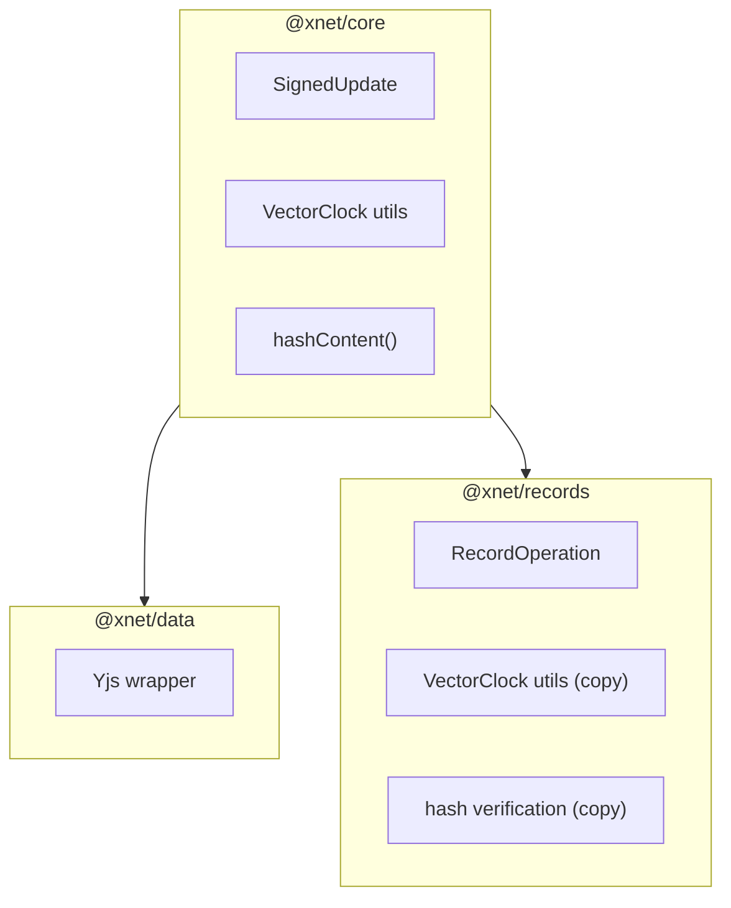
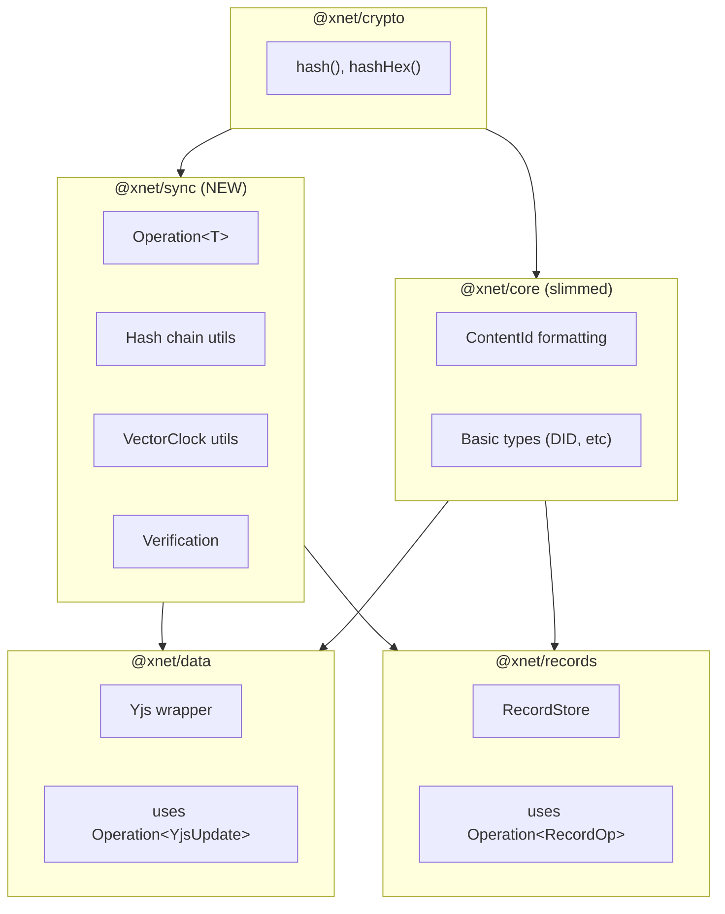
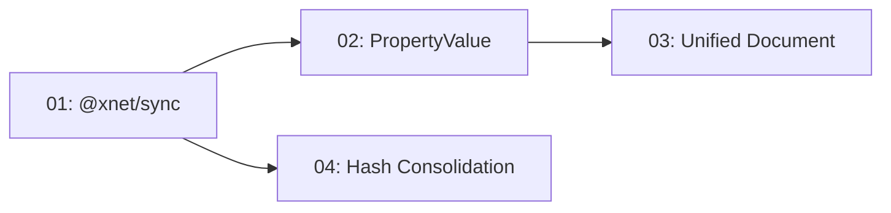

# 00: Data Model Consolidation Overview

> Goals, non-goals, and success criteria

**Duration:** 2-3 weeks total
**Risk Level:** Low-Medium (refactoring, not rebuilding)

## Background

The xNet codebase evolved organically with two sync mechanisms:

1. **@xnet/data** - Yjs CRDT for rich text (character-level merge)
2. **@xnet/records** - Event-sourcing for tabular data (field-level LWW)

This was a **deliberate architectural choice** (see [TRADEOFFS.md](../TRADEOFFS.md)) - rich text genuinely needs fine-grained CRDT, while databases work better with last-writer-wins per field.

However, the implementation created unnecessary duplication:



## Goals

### Primary Goal: Single Mental Model

Create a unified `Operation<T>` type that both sync mechanisms use:

```typescript
// One type to rule them all
interface Operation<T = unknown> {
  id: string
  type: string
  payload: T
  hash: ContentId
  parentHash: ContentId | null
  authorDID: DID
  signature: Uint8Array
  timestamp: number
  vectorClock: VectorClock
}

// @xnet/data uses: Operation<YjsUpdate>
// @xnet/records uses: Operation<CreateItem | UpdateItem | DeleteItem>
```

### Secondary Goal: JSON-Friendly Types

Simplify `PropertyValue` to be purely JSON-serializable:

```typescript
// Before: Complex union with Date objects
type PropertyValue = string | number | boolean | Date | null | string[] | DateRange | FileValue[]

// After: JSON-only
type PropertyValue =
  | string
  | number
  | boolean
  | null
  | PropertyValue[]
  | { [key: string]: PropertyValue }
```

### Tertiary Goal: Eliminate Duplication

- Single `bytesToHex` implementation
- Single source for hash verification
- Vector clock utils in one place

## Non-Goals

This consolidation explicitly does NOT:

| Non-Goal                           | Rationale                                         |
| ---------------------------------- | ------------------------------------------------- |
| Merge @xnet/data and @xnet/records | Keep packages separate for clear responsibilities |
| Replace Yjs with event-sourcing    | Yjs is optimal for rich text                      |
| Replace event-sourcing with Yjs    | LWW is optimal for tabular data                   |
| Break existing APIs                | All changes must be backward compatible           |
| Rewrite working sync code          | Refactor abstractions, don't rebuild mechanisms   |

## Success Criteria

### Measurable Outcomes

| Criterion        | Measurement              | Target           |
| ---------------- | ------------------------ | ---------------- |
| Test pass rate   | `pnpm test`              | 100%             |
| Test coverage    | `pnpm test:coverage`     | >80%             |
| Type duplication | Grep for duplicate types | 0                |
| Mental models    | Types to learn for sync  | 1 (Operation<T>) |

### Qualitative Outcomes

- [ ] New developers can understand sync in <30 minutes
- [ ] CLAUDE.md accurately describes architecture
- [ ] No "which hash function do I use?" confusion

## Architecture Before & After

### Before



### After



## Risk Assessment

| Risk                    | Likelihood | Impact | Mitigation                        |
| ----------------------- | ---------- | ------ | --------------------------------- |
| Breaking existing tests | Low        | High   | Run tests after each change       |
| Circular dependencies   | Medium     | Medium | Careful package ordering          |
| Performance regression  | Low        | Medium | Benchmark before/after            |
| Incomplete migration    | Medium     | Low    | Feature flags for gradual rollout |

## Implementation Strategy

### Phase 1: Create @xnet/sync (Low Risk)

1. Create new package with unified types
2. Both @xnet/data and @xnet/records import from it
3. Old types remain for backward compatibility
4. No behavior changes

### Phase 2: Simplify PropertyValue (Low Risk)

1. Change Date to number (timestamp)
2. Change DateRange to `{ start: number, end: number }`
3. Update property handlers
4. All existing tests must pass

### Phase 3: Unified Document Model (Medium Risk)

1. Create unified Document interface
2. Keep existing XDocument and DatabaseItem working
3. Gradually migrate to unified model
4. Feature flag for rollback

### Phase 4: Hash Consolidation (Low Risk)

1. Remove duplicate bytesToHex
2. @xnet/core imports from @xnet/crypto
3. Update all consumers
4. No behavior changes

## Dependencies



- Steps 01 and 04 can be done in parallel
- Step 02 depends on 01 (uses Operation<T>)
- Step 03 depends on 02 (uses simplified PropertyValue)

---

[← Back to README](./README.md) | [Next: @xnet/sync Package →](./01-xnet-sync-package.md)
