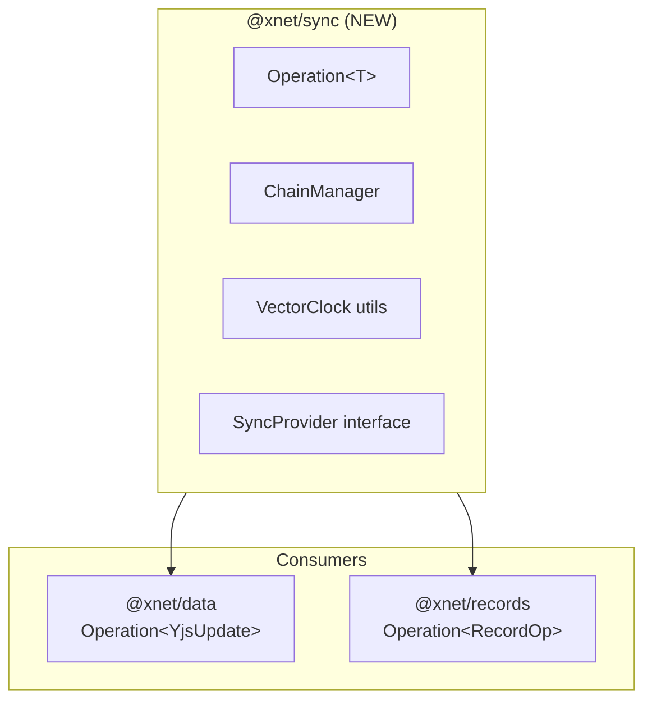

# 01: @xnet/sync Package

> Unified sync primitives for both Yjs and event-sourcing

**Duration:** 1 week
**Risk Level:** Low
**Dependencies:** None (foundational)

## Overview

Create a new `@xnet/sync` package that provides the base abstractions for all sync operations. Both `@xnet/data` (Yjs) and `@xnet/records` (event-sourcing) will import from this package.



## Package Structure

```
packages/sync/
├── src/
│   ├── index.ts           # Public exports
│   ├── operation.ts       # Operation<T> type and helpers
│   ├── chain.ts           # Hash chain management
│   ├── clock.ts           # Vector clock utilities
│   ├── provider.ts        # SyncProvider interface
│   └── verification.ts    # Signature and hash verification
├── test/
│   ├── operation.test.ts
│   ├── chain.test.ts
│   ├── clock.test.ts
│   └── verification.test.ts
├── package.json
└── tsconfig.json
```

## Implementation

### Operation Type

```typescript
// packages/sync/src/operation.ts

import type { ContentId, DID, VectorClock } from '@xnet/core'

/**
 * Base operation type for all sync mechanisms.
 * Generic T allows different payload types for different use cases.
 */
export interface Operation<T = unknown> {
  /** Unique operation ID */
  id: string

  /** Operation type (e.g., 'yjs-update', 'create-item', 'update-item') */
  type: string

  /** The actual operation data */
  payload: T

  /** Content-addressed hash of this operation */
  hash: ContentId

  /** Hash of the previous operation in the chain (null for first) */
  parentHash: ContentId | null

  /** DID of the author */
  authorDID: DID

  /** Ed25519 signature of the hash */
  signature: Uint8Array

  /** Unix timestamp (milliseconds) */
  timestamp: number

  /** Vector clock for causal ordering */
  vectorClock: VectorClock
}

/**
 * Create an operation without hash/signature (for building)
 */
export interface UnsignedOperation<T = unknown> {
  id: string
  type: string
  payload: T
  parentHash: ContentId | null
  authorDID: DID
  timestamp: number
  vectorClock: VectorClock
}

/**
 * Create a signed operation from an unsigned one
 */
export async function signOperation<T>(
  unsigned: UnsignedOperation<T>,
  signingKey: Uint8Array
): Promise<Operation<T>> {
  // Implementation uses @xnet/crypto
  const { hashHex, sign } = await import('@xnet/crypto')

  // Hash the operation (excluding hash and signature)
  const hashInput = JSON.stringify(unsigned)
  const hash = `cid:blake3:${hashHex(new TextEncoder().encode(hashInput))}` as ContentId

  // Sign the hash
  const signature = sign(new TextEncoder().encode(hash), signingKey)

  return {
    ...unsigned,
    hash,
    signature
  }
}

/**
 * Verify an operation's signature
 */
export async function verifyOperation<T>(
  operation: Operation<T>,
  publicKey: Uint8Array
): Promise<boolean> {
  const { verify } = await import('@xnet/crypto')

  return verify(new TextEncoder().encode(operation.hash), operation.signature, publicKey)
}
```

### Vector Clock Utilities

```typescript
// packages/sync/src/clock.ts

import type { DID, VectorClock } from '@xnet/core'

/**
 * Create a new vector clock with initial value for this node
 */
export function createVectorClock(nodeId: DID): VectorClock {
  return { [nodeId]: 1 }
}

/**
 * Increment the clock for a specific node
 */
export function incrementVectorClock(clock: VectorClock, nodeId: DID): VectorClock {
  return {
    ...clock,
    [nodeId]: (clock[nodeId] || 0) + 1
  }
}

/**
 * Merge two vector clocks (take max of each entry)
 */
export function mergeVectorClocks(a: VectorClock, b: VectorClock): VectorClock {
  const result: VectorClock = { ...a }

  for (const [nodeId, value] of Object.entries(b)) {
    result[nodeId] = Math.max(result[nodeId] || 0, value)
  }

  return result
}

/**
 * Compare two vector clocks
 * Returns:
 *   -1 if a < b (a happened before b)
 *    0 if a || b (concurrent)
 *    1 if a > b (a happened after b)
 */
export function compareVectorClocks(a: VectorClock, b: VectorClock): -1 | 0 | 1 {
  let aGreater = false
  let bGreater = false

  const allKeys = new Set([...Object.keys(a), ...Object.keys(b)])

  for (const key of allKeys) {
    const aVal = a[key] || 0
    const bVal = b[key] || 0

    if (aVal > bVal) aGreater = true
    if (bVal > aVal) bGreater = true
  }

  if (aGreater && !bGreater) return 1
  if (bGreater && !aGreater) return -1
  return 0
}

/**
 * Check if clock a happened before clock b
 */
export function happenedBefore(a: VectorClock, b: VectorClock): boolean {
  return compareVectorClocks(a, b) === -1
}

/**
 * Check if two clocks are concurrent (neither happened before the other)
 */
export function areConcurrent(a: VectorClock, b: VectorClock): boolean {
  return compareVectorClocks(a, b) === 0
}
```

### Hash Chain Management

```typescript
// packages/sync/src/chain.ts

import type { ContentId } from '@xnet/core'
import type { Operation } from './operation'

/**
 * Result of validating a chain
 */
export interface ChainValidationResult {
  valid: boolean
  error?: string
  forkDetected?: boolean
  forkPoint?: ContentId
}

/**
 * Validate that operations form a valid hash chain
 */
export function validateChain<T>(operations: Operation<T>[]): ChainValidationResult {
  if (operations.length === 0) {
    return { valid: true }
  }

  // Sort by timestamp for validation
  const sorted = [...operations].sort((a, b) => a.timestamp - b.timestamp)

  // Build hash -> operation map
  const byHash = new Map<ContentId, Operation<T>>()
  for (const op of sorted) {
    byHash.set(op.hash, op)
  }

  // Validate chain linkage
  for (const op of sorted) {
    if (op.parentHash !== null && !byHash.has(op.parentHash)) {
      // Parent not in our set - could be valid if we don't have full history
      // This is not an error, just incomplete data
      continue
    }
  }

  return { valid: true }
}

/**
 * Detect if there's a fork in the chain (two operations with same parent)
 */
export function detectFork<T>(operations: Operation<T>[]): {
  hasFork: boolean
  forkPoints: ContentId[]
} {
  const childrenByParent = new Map<ContentId | null, Operation<T>[]>()

  for (const op of operations) {
    const children = childrenByParent.get(op.parentHash) || []
    children.push(op)
    childrenByParent.set(op.parentHash, children)
  }

  const forkPoints: ContentId[] = []
  for (const [parent, children] of childrenByParent) {
    if (children.length > 1 && parent !== null) {
      forkPoints.push(parent)
    }
  }

  return {
    hasFork: forkPoints.length > 0,
    forkPoints
  }
}

/**
 * Get the latest operation(s) in the chain (heads)
 */
export function getChainHeads<T>(operations: Operation<T>[]): Operation<T>[] {
  const allHashes = new Set(operations.map((op) => op.hash))
  const parentHashes = new Set(operations.map((op) => op.parentHash).filter(Boolean))

  // Heads are operations whose hash is not a parent of any other operation
  return operations.filter((op) => !parentHashes.has(op.hash))
}
```

### Sync Provider Interface

```typescript
// packages/sync/src/provider.ts

import type { Operation } from './operation'

/**
 * Status of sync connection
 */
export type SyncStatus = 'disconnected' | 'connecting' | 'connected' | 'syncing' | 'error'

/**
 * Events emitted by sync providers
 */
export interface SyncProviderEvents<T> {
  'status-change': (status: SyncStatus) => void
  'operation-received': (operation: Operation<T>) => void
  'operations-synced': (operations: Operation<T>[]) => void
  'peer-connected': (peerId: string) => void
  'peer-disconnected': (peerId: string) => void
  error: (error: Error) => void
}

/**
 * Base interface for all sync providers
 */
export interface SyncProvider<T = unknown> {
  /** Current sync status */
  readonly status: SyncStatus

  /** Connected peer IDs */
  readonly peers: string[]

  /** Connect to sync network */
  connect(): Promise<void>

  /** Disconnect from sync network */
  disconnect(): Promise<void>

  /** Broadcast an operation to peers */
  broadcast(operation: Operation<T>): Promise<void>

  /** Request operations from a specific peer */
  requestOperations(peerId: string, since?: string): Promise<Operation<T>[]>

  /** Subscribe to events */
  on<E extends keyof SyncProviderEvents<T>>(event: E, listener: SyncProviderEvents<T>[E]): void

  /** Unsubscribe from events */
  off<E extends keyof SyncProviderEvents<T>>(event: E, listener: SyncProviderEvents<T>[E]): void
}
```

### Package Configuration

```json
// packages/sync/package.json
{
  "name": "@xnet/sync",
  "version": "0.0.1",
  "type": "module",
  "main": "./dist/index.js",
  "types": "./dist/index.d.ts",
  "exports": {
    ".": {
      "import": "./dist/index.js",
      "types": "./dist/index.d.ts"
    }
  },
  "scripts": {
    "build": "tsup src/index.ts --format esm --dts",
    "test": "vitest run",
    "test:watch": "vitest",
    "typecheck": "tsc --noEmit",
    "clean": "rm -rf dist"
  },
  "dependencies": {
    "@xnet/core": "workspace:*",
    "@xnet/crypto": "workspace:*"
  },
  "devDependencies": {
    "tsup": "^8.0.0",
    "typescript": "^5.4.0",
    "vitest": "^1.3.0"
  }
}
```

## Migration Plan

### Phase 1: Create Package (Day 1-2)

1. Create `packages/sync/` directory
2. Implement core types (Operation, VectorClock utils)
3. Add comprehensive tests
4. Build and verify

### Phase 2: Update @xnet/core (Day 3)

1. Re-export from @xnet/sync (backward compatibility)
2. Deprecate old locations
3. Verify all tests pass

```typescript
// packages/core/src/index.ts

// Re-export from @xnet/sync for backward compatibility
export {
  type Operation,
  type UnsignedOperation,
  signOperation,
  verifyOperation,
  createVectorClock,
  incrementVectorClock,
  mergeVectorClocks,
  compareVectorClocks
} from '@xnet/sync'

// Mark old exports as deprecated
/** @deprecated Use import from '@xnet/sync' instead */
export type { SignedUpdate } from './updates'
```

### Phase 3: Update @xnet/data (Day 4)

1. Import Operation from @xnet/sync
2. Define `YjsUpdate` payload type
3. Update SignedUpdate to use Operation<YjsUpdate>
4. Verify tests pass

```typescript
// packages/data/src/updates.ts

import { Operation, signOperation } from '@xnet/sync'

/** Yjs-specific update payload */
export interface YjsUpdate {
  /** Encoded Yjs update */
  update: Uint8Array
  /** Document ID */
  documentId: string
}

/** SignedUpdate is now an alias for Operation<YjsUpdate> */
export type SignedUpdate = Operation<YjsUpdate>

// Rest of implementation uses signOperation from @xnet/sync
```

### Phase 4: Update @xnet/records (Day 5)

1. Import Operation from @xnet/sync
2. Define record operation payload types
3. Update RecordOperation to use Operation<RecordPayload>
4. Verify tests pass

```typescript
// packages/records/src/sync/types.ts

import { Operation } from '@xnet/sync'

/** Record operation payloads */
export type RecordPayload =
  | CreateItemPayload
  | UpdateItemPayload
  | DeleteItemPayload
  | CreateDatabasePayload
  | UpdateDatabasePayload

export interface CreateItemPayload {
  type: 'create-item'
  itemId: ItemId
  databaseId: DatabaseId
  properties: Record<PropertyId, PropertyValue>
}

// ... other payload types

/** RecordOperation is now an alias for Operation<RecordPayload> */
export type RecordOperation = Operation<RecordPayload>
```

## Tests

```typescript
// packages/sync/test/operation.test.ts

import { describe, it, expect } from 'vitest'
import { signOperation, verifyOperation } from '../src/operation'
import { generateKeyPair } from '@xnet/crypto'

describe('Operation', () => {
  it('signs and verifies operations', async () => {
    const keyPair = await generateKeyPair()

    const unsigned = {
      id: 'op-1',
      type: 'test',
      payload: { data: 'hello' },
      parentHash: null,
      authorDID: 'did:key:z6Mk...' as DID,
      timestamp: Date.now(),
      vectorClock: { 'did:key:z6Mk...': 1 }
    }

    const signed = await signOperation(unsigned, keyPair.privateKey)

    expect(signed.hash).toMatch(/^cid:blake3:/)
    expect(signed.signature).toBeInstanceOf(Uint8Array)

    const valid = await verifyOperation(signed, keyPair.publicKey)
    expect(valid).toBe(true)
  })

  it('detects tampered operations', async () => {
    const keyPair = await generateKeyPair()
    const otherKeyPair = await generateKeyPair()

    const unsigned = {
      id: 'op-1',
      type: 'test',
      payload: { data: 'hello' },
      parentHash: null,
      authorDID: 'did:key:z6Mk...' as DID,
      timestamp: Date.now(),
      vectorClock: {}
    }

    const signed = await signOperation(unsigned, keyPair.privateKey)

    // Verify with wrong key should fail
    const valid = await verifyOperation(signed, otherKeyPair.publicKey)
    expect(valid).toBe(false)
  })
})
```

```typescript
// packages/sync/test/clock.test.ts

import { describe, it, expect } from 'vitest'
import {
  createVectorClock,
  incrementVectorClock,
  mergeVectorClocks,
  compareVectorClocks,
  happenedBefore
} from '../src/clock'

describe('VectorClock', () => {
  const nodeA = 'did:key:nodeA' as DID
  const nodeB = 'did:key:nodeB' as DID

  it('creates initial clock', () => {
    const clock = createVectorClock(nodeA)
    expect(clock).toEqual({ [nodeA]: 1 })
  })

  it('increments clock', () => {
    const clock = createVectorClock(nodeA)
    const incremented = incrementVectorClock(clock, nodeA)
    expect(incremented[nodeA]).toBe(2)
  })

  it('merges clocks', () => {
    const clockA = { [nodeA]: 3, [nodeB]: 1 }
    const clockB = { [nodeA]: 2, [nodeB]: 4 }
    const merged = mergeVectorClocks(clockA, clockB)
    expect(merged).toEqual({ [nodeA]: 3, [nodeB]: 4 })
  })

  it('compares clocks correctly', () => {
    const earlier = { [nodeA]: 1 }
    const later = { [nodeA]: 2 }
    const concurrent = { [nodeB]: 1 }

    expect(compareVectorClocks(earlier, later)).toBe(-1)
    expect(compareVectorClocks(later, earlier)).toBe(1)
    expect(compareVectorClocks(earlier, concurrent)).toBe(0)
  })

  it('detects happened-before relationship', () => {
    const earlier = { [nodeA]: 1 }
    const later = { [nodeA]: 1, [nodeB]: 1 }

    expect(happenedBefore(earlier, later)).toBe(true)
    expect(happenedBefore(later, earlier)).toBe(false)
  })
})
```

## Checklist

### Day 1-2: Package Setup

- [ ] Create `packages/sync/` directory structure
- [ ] Implement `Operation<T>` type
- [ ] Implement `signOperation` and `verifyOperation`
- [ ] Implement vector clock utilities
- [ ] Implement chain utilities
- [ ] Implement SyncProvider interface
- [ ] Write comprehensive tests
- [ ] Add package.json and tsconfig.json

### Day 3: Update @xnet/core

- [ ] Add @xnet/sync as dependency
- [ ] Re-export types from @xnet/sync
- [ ] Mark old exports as deprecated
- [ ] Verify all @xnet/core tests pass
- [ ] Update CLAUDE.md

### Day 4: Update @xnet/data

- [ ] Import from @xnet/sync
- [ ] Define YjsUpdate payload type
- [ ] Update SignedUpdate type
- [ ] Verify all @xnet/data tests pass

### Day 5: Update @xnet/records

- [ ] Import from @xnet/sync
- [ ] Define RecordPayload types
- [ ] Update RecordOperation type
- [ ] Verify all @xnet/records tests pass

### Day 6-7: Documentation & Cleanup

- [ ] Update package READMEs
- [ ] Update CLAUDE.md with new package
- [ ] Remove deprecated code (if safe)
- [ ] Final test run across all packages

---

[← Back to Overview](./00-overview.md) | [Next: PropertyValue Simplification →](./02-property-value-simplification.md)
