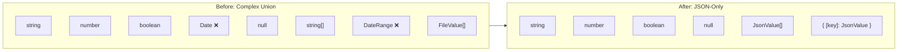

# 02: PropertyValue Simplification

> JSON-only property values for simpler serialization

**Duration:** 3 days
**Risk Level:** Low
**Dependencies:** 01-xnet-sync-package (for unified types)

## Overview

Simplify the `PropertyValue` type to be purely JSON-serializable. This eliminates special handling for `Date` objects and complex types, making serialization and storage straightforward.



## Current Problem

The current `PropertyValue` type includes non-JSON-serializable types:

```typescript
// Current: packages/records/src/types.ts
export type PropertyValue =
  | string
  | number
  | boolean
  | Date // ❌ Not JSON-serializable
  | null
  | string[]
  | DateRange // ❌ Contains Date objects
  | FileValue[]
```

This causes issues:

1. **Serialization complexity** - Need custom JSON replacer/reviver
2. **Storage inconsistency** - IndexedDB handles Date, but SQLite doesn't
3. **Sync complexity** - Must serialize/deserialize across the wire
4. **Type confusion** - Is a date stored as Date object or timestamp?

## Solution

Store all values as JSON-compatible primitives:

```typescript
// New: packages/records/src/types.ts

/**
 * JSON-compatible property value.
 * All property values can be serialized with JSON.stringify without loss.
 */
export type PropertyValue =
  | string
  | number
  | boolean
  | null
  | PropertyValue[]
  | { [key: string]: PropertyValue }
```

Semantic types are defined by the property configuration, not the value type:

```typescript
// Date is stored as timestamp (number)
{ type: 'date', value: 1706140800000 }

// DateRange is stored as object
{ type: 'dateRange', value: { start: 1706140800000, end: 1706227200000 } }

// File is stored as object with metadata
{ type: 'file', value: { id: 'file-123', name: 'doc.pdf', size: 1024, mimeType: 'application/pdf' } }

// Select is stored as option ID (string)
{ type: 'select', value: 'option-1' }

// MultiSelect is stored as array of option IDs
{ type: 'multiSelect', value: ['option-1', 'option-2'] }

// Person is stored as array of DIDs
{ type: 'person', value: ['did:key:z6Mk...'] }

// Relation is stored as array of item IDs
{ type: 'relation', value: ['item:abc', 'item:def'] }
```

## Implementation

### Updated Types

```typescript
// packages/records/src/types.ts

/**
 * JSON-compatible property value.
 * The property type (from schema) determines how to interpret the value.
 */
export type PropertyValue =
  | string
  | number
  | boolean
  | null
  | PropertyValue[]
  | { [key: string]: PropertyValue }

/**
 * Type guard for PropertyValue
 */
export function isPropertyValue(value: unknown): value is PropertyValue {
  if (value === null) return true
  if (typeof value === 'string') return true
  if (typeof value === 'number') return true
  if (typeof value === 'boolean') return true
  if (Array.isArray(value)) return value.every(isPropertyValue)
  if (typeof value === 'object') {
    return Object.values(value).every(isPropertyValue)
  }
  return false
}

/**
 * DateRange stored as JSON object
 */
export interface DateRangeValue {
  start: number | null // Unix timestamp ms
  end: number | null // Unix timestamp ms
}

/**
 * File metadata stored as JSON object
 */
export interface FileValue {
  id: string
  name: string
  size: number
  mimeType: string
  url?: string
}
```

### Updated Property Handlers

Each property handler is responsible for:

1. **Validation** - Ensuring the value matches expected shape
2. **Coercion** - Converting input to storage format
3. **Display** - Converting storage format to display

```typescript
// packages/records/src/properties/date.ts

import type { PropertyHandler, PropertyValue } from '../types'

export interface DateConfig {
  includeTime: boolean
  dateFormat?: string
  timeFormat?: '12h' | '24h'
}

export const dateHandler: PropertyHandler<number> = {
  type: 'date',

  /**
   * Validate that value is a valid timestamp
   */
  validate(value: PropertyValue): boolean {
    if (value === null) return true
    return typeof value === 'number' && !isNaN(value) && isFinite(value)
  },

  /**
   * Coerce input to timestamp
   * Accepts: number (timestamp), string (ISO date), Date object
   */
  coerce(input: unknown): number | null {
    if (input === null || input === undefined) return null

    // Already a timestamp
    if (typeof input === 'number') {
      return isNaN(input) ? null : input
    }

    // ISO date string
    if (typeof input === 'string') {
      const parsed = Date.parse(input)
      return isNaN(parsed) ? null : parsed
    }

    // Date object (from UI)
    if (input instanceof Date) {
      return input.getTime()
    }

    return null
  },

  /**
   * Format for display
   */
  format(value: number | null, config: DateConfig): string {
    if (value === null) return ''

    const date = new Date(value)
    const options: Intl.DateTimeFormatOptions = {
      year: 'numeric',
      month: 'short',
      day: 'numeric',
      ...(config.includeTime && {
        hour: 'numeric',
        minute: '2-digit',
        hour12: config.timeFormat !== '24h'
      })
    }

    return new Intl.DateTimeFormat(undefined, options).format(date)
  },

  /**
   * Convert to Date object for UI components
   */
  toDate(value: number | null): Date | null {
    return value !== null ? new Date(value) : null
  }
}
```

```typescript
// packages/records/src/properties/date-range.ts

import type { PropertyHandler, PropertyValue, DateRangeValue } from '../types'

export const dateRangeHandler: PropertyHandler<DateRangeValue> = {
  type: 'dateRange',

  validate(value: PropertyValue): boolean {
    if (value === null) return true
    if (typeof value !== 'object' || Array.isArray(value)) return false

    const range = value as DateRangeValue
    if (range.start !== null && typeof range.start !== 'number') return false
    if (range.end !== null && typeof range.end !== 'number') return false

    return true
  },

  coerce(input: unknown): DateRangeValue | null {
    if (input === null || input === undefined) return null

    if (typeof input === 'object' && !Array.isArray(input)) {
      const obj = input as Record<string, unknown>
      return {
        start: typeof obj.start === 'number' ? obj.start : null,
        end: typeof obj.end === 'number' ? obj.end : null
      }
    }

    return null
  },

  format(value: DateRangeValue | null): string {
    if (!value) return ''
    const { start, end } = value

    const formatDate = (ts: number | null) => (ts ? new Date(ts).toLocaleDateString() : '')

    if (start && end) {
      return `${formatDate(start)} → ${formatDate(end)}`
    }
    if (start) {
      return `From ${formatDate(start)}`
    }
    if (end) {
      return `Until ${formatDate(end)}`
    }
    return ''
  }
}
```

### Migration Script

For existing data with Date objects:

```typescript
// packages/records/src/migrations/001-json-property-values.ts

import type { PropertyValue } from '../types'

/**
 * Migrate property values from old format (with Date objects) to new format (JSON-only)
 */
export function migratePropertyValue(value: unknown): PropertyValue {
  // Handle Date objects
  if (value instanceof Date) {
    return value.getTime()
  }

  // Handle null/undefined
  if (value === null || value === undefined) {
    return null
  }

  // Handle primitives
  if (typeof value === 'string' || typeof value === 'number' || typeof value === 'boolean') {
    return value
  }

  // Handle arrays
  if (Array.isArray(value)) {
    return value.map(migratePropertyValue)
  }

  // Handle objects (including DateRange)
  if (typeof value === 'object') {
    const result: { [key: string]: PropertyValue } = {}
    for (const [key, val] of Object.entries(value)) {
      result[key] = migratePropertyValue(val)
    }
    return result
  }

  // Fallback to null for unsupported types
  return null
}

/**
 * Migrate all properties in an item
 */
export function migrateItemProperties(
  properties: Record<string, unknown>
): Record<string, PropertyValue> {
  const result: Record<string, PropertyValue> = {}

  for (const [propId, value] of Object.entries(properties)) {
    result[propId] = migratePropertyValue(value)
  }

  return result
}
```

### Storage Layer Update

```typescript
// packages/records/src/sync/store.ts

// No changes needed! JSON.stringify/parse work natively with the new types.
// The storage layer becomes simpler:

async createItem(
  databaseId: DatabaseId,
  properties: Record<PropertyId, PropertyValue>
): Promise<ItemState> {
  // Properties are already JSON-compatible, no transformation needed
  const propertiesJson = JSON.stringify(properties)

  // Store directly
  await this.db.run(
    'INSERT INTO record_items (id, database_id, properties, ...) VALUES (?, ?, ?, ...)',
    [itemId, databaseId, propertiesJson, ...]
  )

  // ...
}
```

## Tests

```typescript
// packages/records/test/properties/date.test.ts

import { describe, it, expect } from 'vitest'
import { dateHandler } from '../../src/properties/date'

describe('dateHandler', () => {
  describe('validate', () => {
    it('accepts null', () => {
      expect(dateHandler.validate(null)).toBe(true)
    })

    it('accepts valid timestamps', () => {
      expect(dateHandler.validate(1706140800000)).toBe(true)
      expect(dateHandler.validate(0)).toBe(true)
    })

    it('rejects invalid values', () => {
      expect(dateHandler.validate('2024-01-25')).toBe(false)
      expect(dateHandler.validate(new Date())).toBe(false)
      expect(dateHandler.validate(NaN)).toBe(false)
      expect(dateHandler.validate(Infinity)).toBe(false)
    })
  })

  describe('coerce', () => {
    it('passes through timestamps', () => {
      expect(dateHandler.coerce(1706140800000)).toBe(1706140800000)
    })

    it('converts ISO strings to timestamps', () => {
      const result = dateHandler.coerce('2024-01-25T00:00:00Z')
      expect(result).toBe(Date.parse('2024-01-25T00:00:00Z'))
    })

    it('converts Date objects to timestamps', () => {
      const date = new Date('2024-01-25')
      expect(dateHandler.coerce(date)).toBe(date.getTime())
    })

    it('returns null for invalid input', () => {
      expect(dateHandler.coerce('invalid')).toBe(null)
      expect(dateHandler.coerce({})).toBe(null)
    })
  })

  describe('format', () => {
    it('formats timestamps for display', () => {
      const result = dateHandler.format(1706140800000, { includeTime: false })
      expect(result).toMatch(/Jan.*25.*2024/)
    })

    it('includes time when configured', () => {
      const result = dateHandler.format(1706140800000, { includeTime: true, timeFormat: '24h' })
      expect(result).toMatch(/\d{1,2}:\d{2}/)
    })
  })
})
```

```typescript
// packages/records/test/migrations/json-values.test.ts

import { describe, it, expect } from 'vitest'
import {
  migratePropertyValue,
  migrateItemProperties
} from '../../src/migrations/001-json-property-values'

describe('migratePropertyValue', () => {
  it('converts Date to timestamp', () => {
    const date = new Date('2024-01-25')
    expect(migratePropertyValue(date)).toBe(date.getTime())
  })

  it('preserves primitives', () => {
    expect(migratePropertyValue('hello')).toBe('hello')
    expect(migratePropertyValue(42)).toBe(42)
    expect(migratePropertyValue(true)).toBe(true)
    expect(migratePropertyValue(null)).toBe(null)
  })

  it('recursively converts arrays', () => {
    const input = [new Date('2024-01-25'), 'string', 42]
    const result = migratePropertyValue(input)
    expect(result).toEqual([Date.parse('2024-01-25'), 'string', 42])
  })

  it('recursively converts objects', () => {
    const input = {
      start: new Date('2024-01-25'),
      end: new Date('2024-01-26')
    }
    const result = migratePropertyValue(input)
    expect(result).toEqual({
      start: Date.parse('2024-01-25'),
      end: Date.parse('2024-01-26')
    })
  })
})
```

## Checklist

### Day 1: Update Types

- [ ] Update `PropertyValue` type definition
- [ ] Add `isPropertyValue` type guard
- [ ] Define `DateRangeValue` interface
- [ ] Define `FileValue` interface
- [ ] Update all property type imports

### Day 2: Update Property Handlers

- [ ] Update `dateHandler` to use timestamps
- [ ] Update `dateRangeHandler` to use object format
- [ ] Update `fileHandler` to use object format
- [ ] Update all other handlers (verify they already work)
- [ ] Add comprehensive tests for each handler

### Day 3: Migration & Verification

- [ ] Create migration script for existing data
- [ ] Test migration with sample data
- [ ] Verify all @xnet/records tests pass
- [ ] Verify storage layer works without changes
- [ ] Verify sync works without changes
- [ ] Update documentation

## Backward Compatibility

The change is backward compatible because:

1. **Reading old data** - Migration script converts Date → timestamp
2. **Writing new data** - All values are JSON-compatible
3. **API unchanged** - Property handlers provide `coerce()` for input flexibility
4. **Display unchanged** - Property handlers provide `format()` for output

UI code that uses Date objects continues to work:

```typescript
// UI can still use Date objects
const dateInput = new Date(userInput)
const timestamp = dateHandler.coerce(dateInput) // → number

// Display converts back
const displayDate = dateHandler.toDate(timestamp) // → Date for UI
```

---

[← Back to @xnet/sync](./01-xnet-sync-package.md) | [Next: Unified Document Model →](./03-unified-document-model.md)
