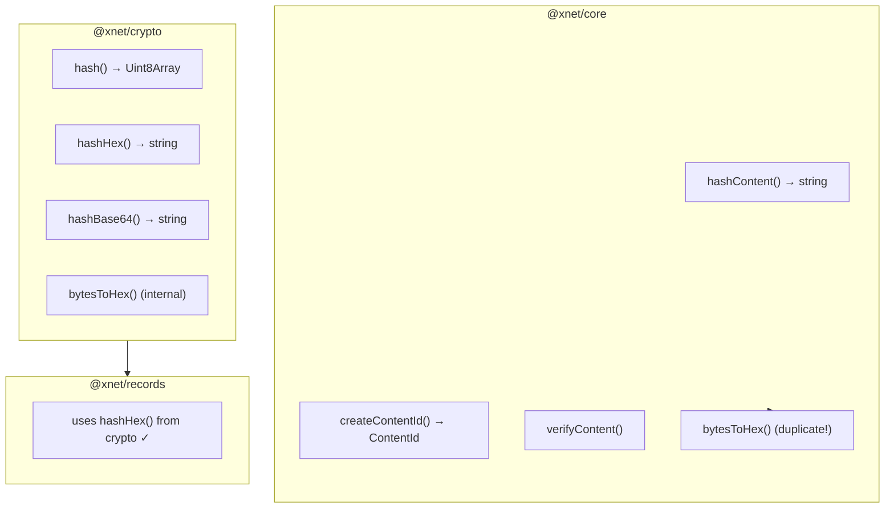
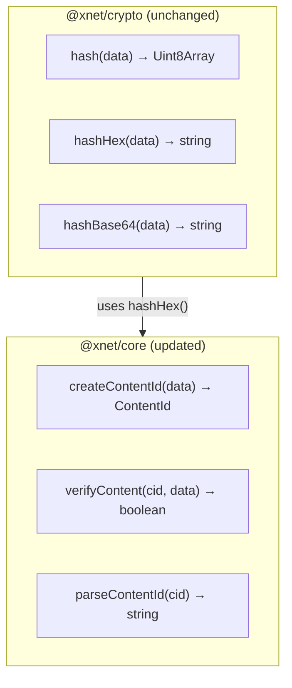
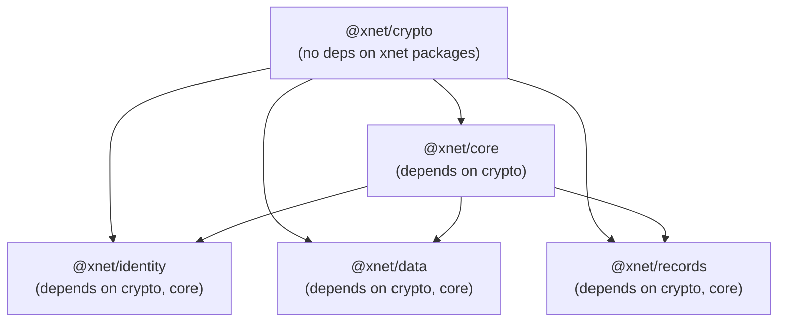

# 04: Hash Function Consolidation

> Single source of truth for hashing operations

**Duration:** 2 days
**Risk Level:** Low
**Dependencies:** None (can run in parallel with 01)

## Overview

The codebase has hash-related functions in multiple packages:



## Problem

1. **Duplicate `bytesToHex`** - Implemented in both @xnet/crypto and @xnet/core
2. **Layering violation** - @xnet/core imports @noble/hashes directly instead of using @xnet/crypto
3. **Confusion** - "Do I use `hash()` or `hashContent()`?"

## Solution

Clear separation of responsibilities:

| Package        | Responsibility               | Functions                                                  |
| -------------- | ---------------------------- | ---------------------------------------------------------- |
| `@xnet/crypto` | Raw cryptographic operations | `hash()`, `hashHex()`, `hashBase64()`                      |
| `@xnet/core`   | Content addressing (CIDs)    | `createContentId()`, `verifyContent()`, `parseContentId()` |



## Implementation

### Update @xnet/core/hashing.ts

```typescript
// packages/core/src/hashing.ts

import { hashHex } from '@xnet/crypto'
import type { ContentId, ContentChunk, ContentTree, MerkleNode } from './content'

/**
 * Create a content ID from data.
 * Uses BLAKE3 hash with cid:blake3: prefix.
 */
export function createContentId(data: Uint8Array): ContentId {
  const hash = hashHex(data)
  return `cid:blake3:${hash}`
}

/**
 * Hash content and return just the hex hash (no prefix).
 * @deprecated Use hashHex from @xnet/crypto for raw hashing,
 *             or createContentId for content addressing.
 */
export function hashContent(data: Uint8Array): string {
  return hashHex(data)
}

/**
 * Parse a ContentId to extract the hash.
 */
export function parseContentId(cid: ContentId): string {
  const match = cid.match(/^cid:blake3:([a-f0-9]+)$/)
  if (!match) throw new Error(`Invalid CID: ${cid}`)
  return match[1]
}

/**
 * Verify content matches a CID.
 */
export function verifyContent(cid: ContentId, data: Uint8Array): boolean {
  const expectedHash = parseContentId(cid)
  const actualHash = hashHex(data)
  return expectedHash === actualHash
}

/**
 * Create a content chunk from data.
 */
export function createChunk(data: Uint8Array): ContentChunk {
  return {
    data,
    hash: hashHex(data),
    size: data.length
  }
}

/**
 * Build a Merkle tree from content chunks.
 */
export function buildMerkleTree(chunks: ContentChunk[]): ContentTree {
  const nodes = new Map<string, MerkleNode>()

  if (chunks.length === 0) {
    const emptyHash = hashHex(new Uint8Array(0))
    nodes.set(emptyHash, { hash: emptyHash, data: new Uint8Array(0) })
    return { rootHash: emptyHash, nodes }
  }

  // Create leaf nodes
  const leafHashes: string[] = []
  for (const chunk of chunks) {
    nodes.set(chunk.hash, {
      hash: chunk.hash,
      data: chunk.data
    })
    leafHashes.push(chunk.hash)
  }

  // Build tree bottom-up
  let currentLevel = leafHashes
  while (currentLevel.length > 1) {
    const nextLevel: string[] = []
    for (let i = 0; i < currentLevel.length; i += 2) {
      const left = currentLevel[i]
      const right = currentLevel[i + 1] || left
      const combined = new TextEncoder().encode(left + right)
      const parentHash = hashHex(combined)
      nodes.set(parentHash, {
        hash: parentHash,
        children: left === right ? [left] : [left, right]
      })
      nextLevel.push(parentHash)
    }
    currentLevel = nextLevel
  }

  return {
    rootHash: currentLevel[0],
    nodes
  }
}

// REMOVED: bytesToHex (use the one in @xnet/crypto/utils)
```

### Update @xnet/core/package.json

```json
{
  "name": "@xnet/core",
  "version": "0.0.1",
  "type": "module",
  "main": "./dist/index.js",
  "types": "./dist/index.d.ts",
  "exports": {
    ".": {
      "import": "./dist/index.js",
      "types": "./dist/index.d.ts"
    }
  },
  "scripts": {
    "build": "tsup src/index.ts --format esm --dts",
    "typecheck": "tsc --noEmit",
    "clean": "rm -rf dist"
  },
  "dependencies": {
    "@xnet/crypto": "workspace:*"
  },
  "devDependencies": {
    "tsup": "^8.0.0",
    "typescript": "^5.4.0"
  }
}
```

Note: Removed direct dependency on `@noble/hashes` - now uses `@xnet/crypto`.

### Export bytesToHex from @xnet/crypto

```typescript
// packages/crypto/src/index.ts

// Existing exports
export { hash, hashHex, hashBase64, type HashAlgorithm } from './hashing'
export { generateKeyPair, sign, verify, type KeyPair } from './signing'
export { encrypt, decrypt, generateKey } from './symmetric'
export { encryptAsymmetric, decryptAsymmetric } from './asymmetric'
export { randomBytes, randomId } from './random'

// NEW: Export utility functions for other packages
export { bytesToHex, hexToBytes } from './utils'
```

```typescript
// packages/crypto/src/utils.ts

/**
 * Convert bytes to hex string.
 * Used by other @xnet packages that need hex encoding.
 */
export function bytesToHex(bytes: Uint8Array): string {
  return Array.from(bytes)
    .map((b) => b.toString(16).padStart(2, '0'))
    .join('')
}

/**
 * Convert hex string to bytes.
 */
export function hexToBytes(hex: string): Uint8Array {
  const bytes = new Uint8Array(hex.length / 2)
  for (let i = 0; i < hex.length; i += 2) {
    bytes[i / 2] = parseInt(hex.slice(i, i + 2), 16)
  }
  return bytes
}
```

### Update Consumers

Any code using `hashContent` from @xnet/core should migrate:

```typescript
// Before
import { hashContent, createContentId } from '@xnet/core'
const hash = hashContent(data)
const cid = createContentId(hash)

// After (option 1: for raw hash)
import { hashHex } from '@xnet/crypto'
const hash = hashHex(data)

// After (option 2: for content addressing)
import { createContentId } from '@xnet/core'
const cid = createContentId(data) // Now takes data directly, not hash
```

### Verify No Circular Dependencies



No cycles - `@xnet/crypto` has no dependencies on other @xnet packages.

## Tests

```typescript
// packages/core/test/hashing.test.ts

import { describe, it, expect } from 'vitest'
import { createContentId, verifyContent, parseContentId } from '../src/hashing'
import { hashHex } from '@xnet/crypto'

describe('Content Addressing', () => {
  const testData = new TextEncoder().encode('hello world')

  it('creates content IDs with correct format', () => {
    const cid = createContentId(testData)
    expect(cid).toMatch(/^cid:blake3:[a-f0-9]{64}$/)
  })

  it('creates deterministic content IDs', () => {
    const cid1 = createContentId(testData)
    const cid2 = createContentId(testData)
    expect(cid1).toBe(cid2)
  })

  it('creates different CIDs for different data', () => {
    const cid1 = createContentId(testData)
    const cid2 = createContentId(new TextEncoder().encode('different'))
    expect(cid1).not.toBe(cid2)
  })

  it('verifies content against CID', () => {
    const cid = createContentId(testData)
    expect(verifyContent(cid, testData)).toBe(true)
    expect(verifyContent(cid, new Uint8Array([1, 2, 3]))).toBe(false)
  })

  it('parses content IDs', () => {
    const cid = createContentId(testData)
    const hash = parseContentId(cid)
    expect(hash).toBe(hashHex(testData))
  })

  it('throws on invalid CID format', () => {
    expect(() => parseContentId('invalid' as any)).toThrow('Invalid CID')
    expect(() => parseContentId('cid:sha256:abc' as any)).toThrow('Invalid CID')
  })
})
```

```typescript
// packages/crypto/test/utils.test.ts

import { describe, it, expect } from 'vitest'
import { bytesToHex, hexToBytes } from '../src/utils'

describe('Hex Utilities', () => {
  it('converts bytes to hex', () => {
    const bytes = new Uint8Array([0, 15, 255])
    expect(bytesToHex(bytes)).toBe('000fff')
  })

  it('converts hex to bytes', () => {
    const hex = '000fff'
    const bytes = hexToBytes(hex)
    expect(Array.from(bytes)).toEqual([0, 15, 255])
  })

  it('round-trips correctly', () => {
    const original = new Uint8Array([1, 2, 3, 4, 5])
    const hex = bytesToHex(original)
    const restored = hexToBytes(hex)
    expect(Array.from(restored)).toEqual(Array.from(original))
  })
})
```

## Checklist

### Day 1: Update Packages

- [ ] Export `bytesToHex`, `hexToBytes` from @xnet/crypto
- [ ] Add @xnet/crypto dependency to @xnet/core
- [ ] Remove @noble/hashes dependency from @xnet/core
- [ ] Update @xnet/core/hashing.ts to use @xnet/crypto
- [ ] Remove duplicate bytesToHex from @xnet/core
- [ ] Update createContentId to accept data directly
- [ ] Mark hashContent as deprecated

### Day 2: Verify & Document

- [ ] Run all @xnet/core tests
- [ ] Run all @xnet/crypto tests
- [ ] Run all @xnet/records tests (uses hashHex)
- [ ] Run all @xnet/data tests
- [ ] Check for circular dependency issues
- [ ] Update documentation
- [ ] Update CLAUDE.md "Where Things Live" table

## Benefits

After this change:

1. **Single source** - All hashing from @xnet/crypto
2. **Clear layering** - crypto → core → others
3. **No duplication** - One bytesToHex implementation
4. **Simpler API** - createContentId(data) instead of createContentId(hashContent(data))

---

[← Back to Unified Document Model](./03-unified-document-model.md) | [Next: Timeline →](./05-timeline.md)
