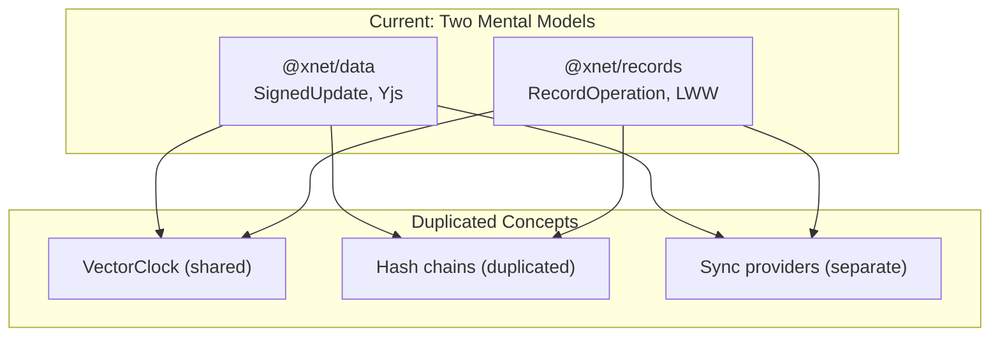
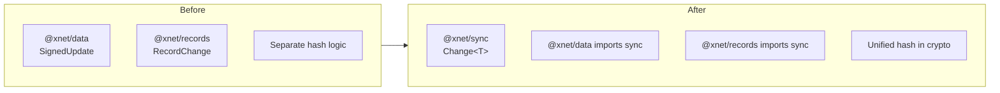

# xNet Implementation Plan - Step 02.1: Data Model Consolidation

> AI-agent-actionable implementation guide for reducing conceptual overhead

## Purpose

This plan addresses findings from the [Codebase Review](../CODEBASE_REVIEW.md). The goal is to **reduce conceptual surface area** without major rewrites - creating unified abstractions while preserving the working hybrid sync implementation.

## Prerequisites

Before starting this phase, ensure:

- [x] planStep01MVP complete
- [x] planStep02DatabasePlatform property types working (@xnet/records)
- [x] Dual sync operational (Yjs for docs, event-sourcing for records)
- [x] > 80% test coverage on core packages

## Problem Statement

The codebase currently has:



This creates:

- Two sets of types to learn
- Duplicated hash/verify logic
- Complex PropertyValue union type
- Separate Document vs Item concepts

## Implementation Order

Execute these documents in order. Each builds on the previous.

| #   | Document                                                              | Description                         | Est. Time | Risk   |
| --- | --------------------------------------------------------------------- | ----------------------------------- | --------- | ------ |
| 00  | [Overview](./00-overview.md)                                          | Goals, non-goals, success criteria  | Reference | -      |
| 01  | [@xnet/sync Package](./01-xnet-sync-package.md)                       | Unified sync primitives             | 1 week    | Low    |
| 02  | [PropertyValue Simplification](./02-property-value-simplification.md) | JSON-only property values           | 3 days    | Low    |
| 03  | [Unified Document Model](./03-unified-document-model.md)              | Merge XDocument and DatabaseItem    | 1 week    | Medium |
| 04  | [Hash Consolidation](./04-hash-function-consolidation.md)             | Single source for hashing           | 2 days    | Low    |
| 05  | [Timeline](./05-timeline.md)                                          | Schedule and milestones             | Reference | -      |
| 06  | [Package Naming](./06-package-naming-proposal.md)                     | Merge @xnet/records into @xnet/data | 3 days    | Medium |
| 07  | [Naming Research](./07-naming-research.md)                            | Research on "Document" alternatives | Reference | -      |
| 08  | [JSON-LD Integration](./08-jsonld-integration.md)                     | Add JSON-LD semantic web support    | 4 days    | Low    |
| 09  | [Schema-First Architecture](./09-schema-first-architecture.md)        | Everything is a schema-defined Node | Reference | -      |
| 10  | [Schema + TypeScript](./10-schema-first-with-typescript.md)           | Generated types from schemas        | 1 week    | Medium |
| 11  | [Global Namespacing](./11-global-schema-namespacing.md)               | Global schema namespace via IRIs    | Reference | -      |
| 12  | [Code-First Schemas](./12-code-first-schemas.md)                      | defineSchema() with inferred types  | 1 week    | Medium |

## Validation Gates

### After @xnet/sync

- [ ] Both @xnet/data and @xnet/records import from @xnet/sync
- [ ] Single Change<T> type used everywhere
- [ ] Vector clock utils in one place
- [ ] All existing tests still pass

### After PropertyValue Simplification

- [ ] PropertyValue is JSON-serializable
- [ ] Date stored as number (timestamp)
- [ ] DateRange stored as `{ start: number, end: number }`
- [ ] No special serialization needed
- [ ] All property type tests pass

### After Unified Document Model

- [ ] Single Document interface covers all types
- [ ] Type field determines shape (page, database, item, canvas)
- [ ] Existing APIs still work (backward compatible)
- [ ] React hooks work with unified model

### After Hash Consolidation

- [ ] @xnet/crypto is single source for raw hashing
- [ ] @xnet/core only does CID formatting
- [ ] No duplicate bytesToHex implementations
- [ ] All crypto tests pass

## Quick Reference

### Current vs. Target Architecture



### Package Changes

| Package         | Change                      | Impact                             |
| --------------- | --------------------------- | ---------------------------------- |
| `@xnet/sync`    | **NEW**                     | Unified sync primitives            |
| `@xnet/core`    | Slim down                   | Remove sync types, keep CID        |
| `@xnet/crypto`  | No change                   | Already correct                    |
| `@xnet/data`    | **Absorb @xnet/records**    | Unified data package with subpaths |
| `@xnet/records` | **Deprecated** → @xnet/data | Re-exports for backward compat     |

### Test Commands

```bash
pnpm test                        # All tests
pnpm --filter @xnet/sync test    # New sync package
pnpm --filter @xnet/data test    # Verify still works
pnpm --filter @xnet/records test # Verify still works
pnpm test:coverage               # Ensure >80%
```

## Non-Goals

This consolidation explicitly does NOT:

1. ~~**Merge @xnet/data and @xnet/records**~~ - **UPDATED:** Now merging into unified @xnet/data
2. **Change sync mechanisms** - Yjs stays Yjs, event-sourcing stays event-sourcing
3. **Rewrite working code** - Refactor, don't rebuild
4. **Break existing APIs** - All changes must be backward compatible

## Validation Gates (Continued)

### After Package Merge

- [ ] `@xnet/data` contains both document and record functionality
- [ ] Subpath imports work: `@xnet/data/document`, `@xnet/data/record`
- [ ] `@xnet/records` re-exports from `@xnet/data` for backward compat
- [ ] All tests pass with new structure

### After JSON-LD Integration

- [ ] `XNET_CONTEXT` defined with all type mappings
- [ ] `toJsonLd()` and `fromJsonLd()` work for all document types
- [ ] Export/import preserves semantic information
- [ ] Property types have JSON-LD schema definitions

### After Schema-First Implementation

- [ ] `Node` is the universal base type (replaces Document)
- [ ] `Schema` defines what a Node is (properties, behaviors)
- [ ] Built-in schemas: Page, Database, Item, Canvas, Task
- [ ] Schemas are Nodes (self-describing system)
- [ ] `defineSchema()` API with TypeScript type inference
- [ ] Property helpers: `text()`, `select()`, `date()`, etc.
- [ ] Validation co-located with schema definition
- [ ] User-defined schemas work at runtime

### After Global Namespacing

- [ ] Schema IRIs follow `xnet://<authority>/<path>` pattern
- [ ] Built-in schemas use `xnet://xnet.dev/` namespace
- [ ] User schemas use `xnet://did:key:.../` namespace
- [ ] Schema.org mappings via `sameAs` property
- [ ] Well-known URL resolution for domain-based schemas

## Success Criteria

After completing this plan:

1. **Single mental model** - Everything is a Node with a Schema
2. **Schema-first architecture** - Types defined as JSON-LD schemas
3. **TypeScript safety** - Generated types for built-in/plugin schemas
4. **Global namespace** - Schemas identified by globally unique IRIs
5. **JSON-LD native** - Schemas ARE JSON-LD type definitions
6. **No code duplication** - Unified sync, hash, and data primitives
7. **All tests pass** with same or better coverage
8. **Documentation accurate** - CLAUDE.md reflects reality

---

[Back to planStep02DatabasePlatform](../planStep02DatabasePlatform/README.md) | [Start with Overview →](./00-overview.md)
