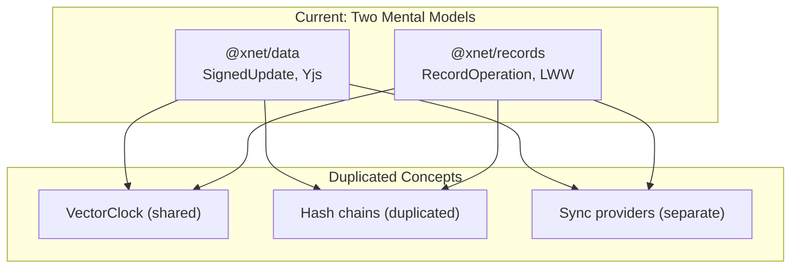
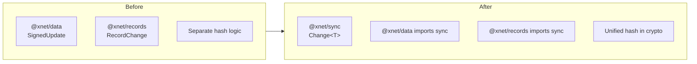

# xNet Implementation Plan - Step 02.1: Data Model Consolidation

> AI-agent-actionable implementation guide for reducing conceptual overhead

## Purpose

This plan addresses findings from the [Codebase Review](../CODEBASE_REVIEW.md). The goal is to **reduce conceptual surface area** without major rewrites - creating unified abstractions while preserving the working hybrid sync implementation.

## Prerequisites

Before starting this phase, ensure:

- [x] planStep01MVP complete
- [x] planStep02DatabasePlatform property types working (@xnet/records)
- [x] Dual sync operational (Yjs for docs, event-sourcing for records)
- [x] > 80% test coverage on core packages

## Problem Statement

The codebase currently has:



This creates:

- Two sets of types to learn
- Duplicated hash/verify logic
- Complex PropertyValue union type
- Separate Document vs Item concepts

## Implementation Order

Execute these documents in order. Each builds on the previous.

| #   | Document                                                              | Description                        | Est. Time | Risk   |
| --- | --------------------------------------------------------------------- | ---------------------------------- | --------- | ------ |
| 00  | [Overview](./00-overview.md)                                          | Goals, non-goals, success criteria | Reference | -      |
| 01  | [@xnet/sync Package](./01-xnet-sync-package.md)                       | Unified sync primitives            | 1 week    | Low    |
| 02  | [PropertyValue Simplification](./02-property-value-simplification.md) | JSON-only property values          | 3 days    | Low    |
| 03  | [Unified Document Model](./03-unified-document-model.md)              | Merge XDocument and DatabaseItem   | 1 week    | Medium |
| 04  | [Hash Consolidation](./04-hash-function-consolidation.md)             | Single source for hashing          | 2 days    | Low    |
| 05  | [Timeline](./05-timeline.md)                                          | Schedule and milestones            | Reference | -      |

## Validation Gates

### After @xnet/sync

- [ ] Both @xnet/data and @xnet/records import from @xnet/sync
- [ ] Single Change<T> type used everywhere
- [ ] Vector clock utils in one place
- [ ] All existing tests still pass

### After PropertyValue Simplification

- [ ] PropertyValue is JSON-serializable
- [ ] Date stored as number (timestamp)
- [ ] DateRange stored as `{ start: number, end: number }`
- [ ] No special serialization needed
- [ ] All property type tests pass

### After Unified Document Model

- [ ] Single Document interface covers all types
- [ ] Type field determines shape (page, database, item, canvas)
- [ ] Existing APIs still work (backward compatible)
- [ ] React hooks work with unified model

### After Hash Consolidation

- [ ] @xnet/crypto is single source for raw hashing
- [ ] @xnet/core only does CID formatting
- [ ] No duplicate bytesToHex implementations
- [ ] All crypto tests pass

## Quick Reference

### Current vs. Target Architecture



### Package Changes

| Package         | Change           | Impact                      |
| --------------- | ---------------- | --------------------------- |
| `@xnet/sync`    | **NEW**          | Unified sync primitives     |
| `@xnet/core`    | Slim down        | Remove sync types, keep CID |
| `@xnet/crypto`  | No change        | Already correct             |
| `@xnet/data`    | Import from sync | Minimal changes             |
| `@xnet/records` | Import from sync | Minimal changes             |

### Test Commands

```bash
pnpm test                        # All tests
pnpm --filter @xnet/sync test    # New sync package
pnpm --filter @xnet/data test    # Verify still works
pnpm --filter @xnet/records test # Verify still works
pnpm test:coverage               # Ensure >80%
```

## Non-Goals

This consolidation explicitly does NOT:

1. **Merge @xnet/data and @xnet/records** - Keep separate packages, unify abstractions only
2. **Change sync mechanisms** - Yjs stays Yjs, event-sourcing stays event-sourcing
3. **Rewrite working code** - Refactor, don't rebuild
4. **Break existing APIs** - All changes must be backward compatible

## Success Criteria

After completing this plan:

1. **Single mental model** for "how data syncs" (Change<T>)
2. **JSON-friendly types** everywhere (no Date objects in storage)
3. **No code duplication** for hashing, vector clocks, or chains
4. **All tests pass** with same or better coverage
5. **Documentation accurate** - CLAUDE.md reflects reality

---

[Back to planStep02DatabasePlatform](../planStep02DatabasePlatform/README.md) | [Start with Overview →](./00-overview.md)
