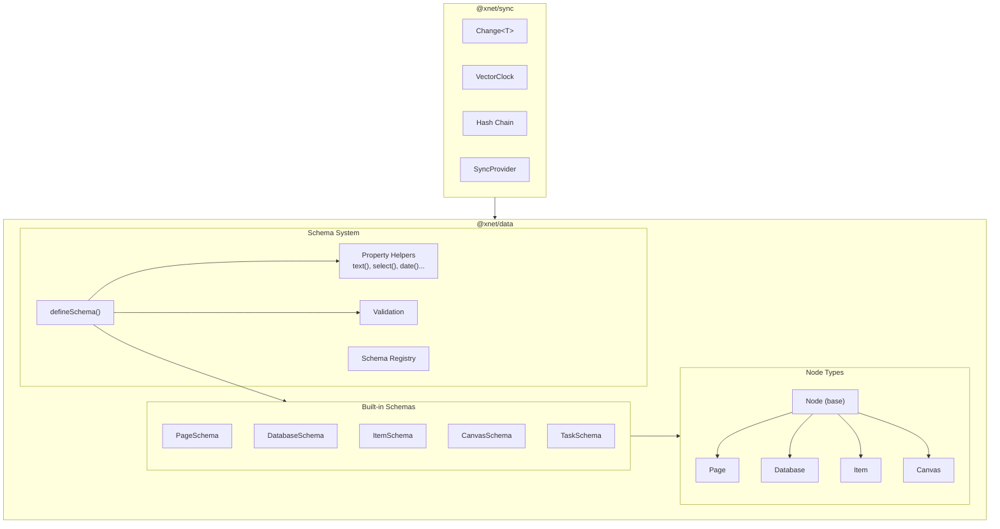

# xNet Implementation Plan - Step 02.1: Data Model Consolidation

> Unifying xNet around a schema-first, Node-based architecture with JSON-LD support

## Executive Summary

This plan consolidates xNet's data model around a single, powerful abstraction:

**Everything is a Node. A Schema defines what the Node is.**

```typescript
// The entire data model in one concept
const task = TaskSchema.create({
  title: 'Fix the bug',
  status: 'todo',
  priority: 'high'
})

// TaskSchema is defined in code with full TypeScript inference
const TaskSchema = defineSchema({
  name: 'Task',
  namespace: 'xnet://xnet.dev/',
  properties: {
    title: text({ required: true }),
    status: select({ options: STATUS_OPTIONS }),
    priority: select({ options: PRIORITY_OPTIONS })
  },
  hasContent: true
})

type Task = InferNode<typeof TaskSchema> // Fully typed!
```

## Architecture Decisions (Ratified)

| Decision              | Choice                            | Rationale                                                    |
| --------------------- | --------------------------------- | ------------------------------------------------------------ |
| **Base type**         | `Node`                            | Universal container, graph-native, no conflict with subtypes |
| **Type system**       | Schema-defined                    | Flexible, user-extensible, JSON-LD native                    |
| **Schema definition** | Code-first via `defineSchema()`   | TypeScript inference, co-located validation                  |
| **TypeScript**        | Inferred from schema              | No codegen for dev schemas, full type safety                 |
| **Global namespace**  | IRIs: `xnet://<authority>/<path>` | No collisions, federation-ready                              |
| **Package structure** | Unified `@xnet/data`              | Single mental model for "where data lives"                   |
| **Sync primitives**   | `Change<T>` in `@xnet/sync`       | Unified across Yjs and event-sourcing                        |

## Target Architecture



## Implementation Phases

### Phase 1: Foundation (Week 1-2)

| Task | Document                                                                     | Description                                         |
| ---- | ---------------------------------------------------------------------------- | --------------------------------------------------- |
| 1.1  | [01-xnet-sync-package.md](./01-xnet-sync-package.md)                         | Create `@xnet/sync` with `Change<T>`, vector clocks |
| 1.2  | [04-hash-function-consolidation.md](./04-hash-function-consolidation.md)     | Single source for hashing in `@xnet/crypto`         |
| 1.3  | [02-property-value-simplification.md](./02-property-value-simplification.md) | JSON-only PropertyValue types                       |

**Validation Gate:**

- [ ] `Change<T>` replaces `SignedUpdate` and `RecordOperation`
- [ ] All hash functions come from `@xnet/crypto`
- [ ] PropertyValue is JSON-serializable
- [ ] All existing tests pass

### Phase 2: Schema System (Week 2-3)

| Task | Document                                                             | Description                                |
| ---- | -------------------------------------------------------------------- | ------------------------------------------ |
| 2.1  | [12-code-first-schemas.md](./12-code-first-schemas.md)               | `defineSchema()` API with property helpers |
| 2.2  | [09-schema-first-architecture.md](./09-schema-first-architecture.md) | `Node` base type, `Schema` as Node         |
| 2.3  | [11-global-schema-namespacing.md](./11-global-schema-namespacing.md) | IRI-based schema identifiers               |

**Validation Gate:**

- [ ] `defineSchema()` works with TypeScript inference
- [ ] Property helpers: `text()`, `select()`, `date()`, `relation()`, etc.
- [ ] `Node` is the universal base type
- [ ] Schemas are Nodes (self-describing)
- [ ] Schema IRIs: `xnet://xnet.dev/Page`, `xnet://did:key:.../Recipe`

### Phase 3: Package Consolidation (Week 3-4)

| Task | Document                                                         | Description                               |
| ---- | ---------------------------------------------------------------- | ----------------------------------------- |
| 3.1  | [06-package-naming-proposal.md](./06-package-naming-proposal.md) | Merge `@xnet/records` into `@xnet/data`   |
| 3.2  | [03-unified-document-model.md](./03-unified-document-model.md)   | Migrate to Node-based model               |
| 3.3  | -                                                                | Update React hooks for schema-aware usage |

**Validation Gate:**

- [ ] `@xnet/data` contains all data functionality
- [ ] `@xnet/records` re-exports for backward compatibility
- [ ] Built-in schemas: Page, Database, Item, Canvas, Task
- [ ] React hooks work with Node/Schema model

### Phase 4: JSON-LD & Polish (Week 4-5)

| Task | Document                                               | Description                     |
| ---- | ------------------------------------------------------ | ------------------------------- |
| 4.1  | [08-jsonld-integration.md](./08-jsonld-integration.md) | JSON-LD context, export/import  |
| 4.2  | -                                                      | Schema.org mappings for interop |
| 4.3  | -                                                      | Update CLAUDE.md, documentation |

**Validation Gate:**

- [ ] `toJsonLd()` / `fromJsonLd()` work for all Node types
- [ ] Schema.org mappings via `sameAs` property
- [ ] Export produces valid JSON-LD
- [ ] Documentation reflects new architecture

## Reference Documents

| #   | Document                                                    | Purpose                                        |
| --- | ----------------------------------------------------------- | ---------------------------------------------- |
| 00  | [Overview](./00-overview.md)                                | Original goals (now superseded by this README) |
| 05  | [Timeline](./05-timeline.md)                                | Original timeline (to be updated)              |
| 07  | [Naming Research](./07-naming-research.md)                  | Research on Node vs Document naming            |
| 10  | [Schema + TypeScript](./10-schema-first-with-typescript.md) | Codegen approach (superseded by code-first)    |

## Core Concepts

### Node: The Universal Container

```typescript
interface Node {
  // Identity
  id: string
  schemaId: SchemaIRI // What type of node is this?

  // Data
  properties: Record<string, PropertyValue>
  content?: Y.Doc // Optional rich text (Yjs)
  children?: string[] // Optional child node IDs

  // Metadata
  workspaceId: string
  parentId?: string
  created: number
  updated: number
  createdBy: DID
  updatedBy: DID

  // JSON-LD (populated on export)
  '@context'?: JsonLdContext
  '@type'?: string
  '@id'?: string
}
```

### Schema: The Type Definition

```typescript
interface Schema {
  // JSON-LD identity
  '@id': SchemaIRI // e.g., 'xnet://xnet.dev/Task'
  '@type': 'xnet://xnet.dev/Schema'

  // Definition
  name: string
  namespace: string
  properties: PropertyDefinition[]
  extends?: SchemaIRI

  // Behavior flags
  hasContent: boolean // Has Y.Doc body?
  hasChildren: boolean // Can contain child nodes?
  isCollection: boolean // Is a "database"?

  // UI hints
  icon?: string
  color?: string
}
```

### defineSchema(): Code-First Definition

```typescript
import { defineSchema, text, select, date, person } from '@xnet/data/schema'

export const TaskSchema = defineSchema({
  name: 'Task',
  namespace: 'xnet://xnet.dev/',

  properties: {
    title: text({ required: true, maxLength: 500 }),
    status: select({
      options: [
        { id: 'todo', name: 'To Do', color: 'gray' },
        { id: 'in-progress', name: 'In Progress', color: 'blue' },
        { id: 'done', name: 'Done', color: 'green' }
      ] as const,
      default: 'todo'
    }),
    dueDate: date({ includeTime: false }),
    assignee: person({ multiple: false })
  },

  hasContent: true,
  icon: '✅'
})

// Type is INFERRED from the schema definition
export type Task = InferNode<typeof TaskSchema>

// Full API
TaskSchema.create({ title: 'Fix bug', status: 'todo' }) // Create node
TaskSchema.validate(unknownData) // Runtime validation
TaskSchema.is(someNode) // Type guard
TaskSchema.schema // JSON-LD export
```

### Global Schema Namespace

```
xnet://xnet.dev/Page              # Built-in (ships with xNet)
xnet://xnet.dev/Task              # Built-in task type
xnet://schema.org/Person          # Web standard mapping
xnet://acme-corp.com/Project      # Organization schema
xnet://did:key:z6Mk.../Recipe     # Personal schema
```

## Package Structure (Target)

```
packages/
├── sync/                         # NEW: Unified sync primitives
│   └── src/
│       ├── change.ts             # Change<T> type
│       ├── clock.ts              # Vector clock utils
│       ├── chain.ts              # Hash chain utils
│       └── provider.ts           # SyncProvider interface
│
├── data/                         # EXPANDED: All data types
│   └── src/
│       ├── schema/               # Schema system
│       │   ├── define.ts         # defineSchema()
│       │   ├── registry.ts       # Schema registry
│       │   ├── validation.ts     # Runtime validation
│       │   └── properties/       # Property helpers
│       │       ├── text.ts
│       │       ├── select.ts
│       │       ├── date.ts
│       │       └── ...
│       │
│       ├── schemas/              # Built-in schemas
│       │   ├── page.ts
│       │   ├── database.ts
│       │   ├── item.ts
│       │   ├── canvas.ts
│       │   └── task.ts
│       │
│       ├── types/                # Core types
│       │   ├── node.ts           # Node interface
│       │   └── schema.ts         # Schema interface
│       │
│       ├── sync/                 # Sync implementations
│       │   ├── yjs.ts            # Yjs adapter
│       │   └── event.ts          # Event-sourced adapter
│       │
│       └── jsonld/               # JSON-LD support
│           ├── context.ts
│           ├── export.ts
│           └── import.ts
│
├── records/                      # DEPRECATED: Re-exports from @xnet/data
│   └── src/
│       └── index.ts              # export * from '@xnet/data/record'
```

## Success Criteria

After completing this plan:

1. **Single mental model** - Everything is a Node with a Schema
2. **Code-first schemas** - `defineSchema()` with TypeScript inference
3. **Co-located validation** - Property helpers include validators
4. **Global namespace** - Schemas identified by unique IRIs
5. **JSON-LD native** - Schemas ARE JSON-LD type definitions
6. **Unified sync** - `Change<T>` for all sync mechanisms
7. **Single data package** - `@xnet/data` contains everything
8. **All tests pass** - >80% coverage maintained
9. **Documentation accurate** - CLAUDE.md reflects new architecture

## Migration Notes

### For Existing Code

```typescript
// Before
import { XDocument } from '@xnet/data'
import { DatabaseItem, Database } from '@xnet/records'

// After
import { Node, Page, Item, Database } from '@xnet/data'
import { PageSchema, ItemSchema, DatabaseSchema } from '@xnet/data/schemas'

// Type guards
if (PageSchema.is(node)) {
  // TypeScript knows this is a Page
}
```

### Backward Compatibility

- `@xnet/records` will re-export from `@xnet/data` for 1-2 versions
- Old type names (`XDocument`, `DatabaseItem`) will be deprecated aliases
- Sync mechanisms (Yjs, event-sourcing) unchanged internally

---

## Quick Start for Implementation

1. **Start with Phase 1.1** - Create `@xnet/sync` package
2. **Run tests after each change** - `pnpm test`
3. **Update one package at a time** - Don't refactor everything at once
4. **Keep backward compat** - Add aliases before removing old exports

---

[Back to planStep02DatabasePlatform](../planStep02DatabasePlatform/README.md) | [Start Implementation →](./01-xnet-sync-package.md)
