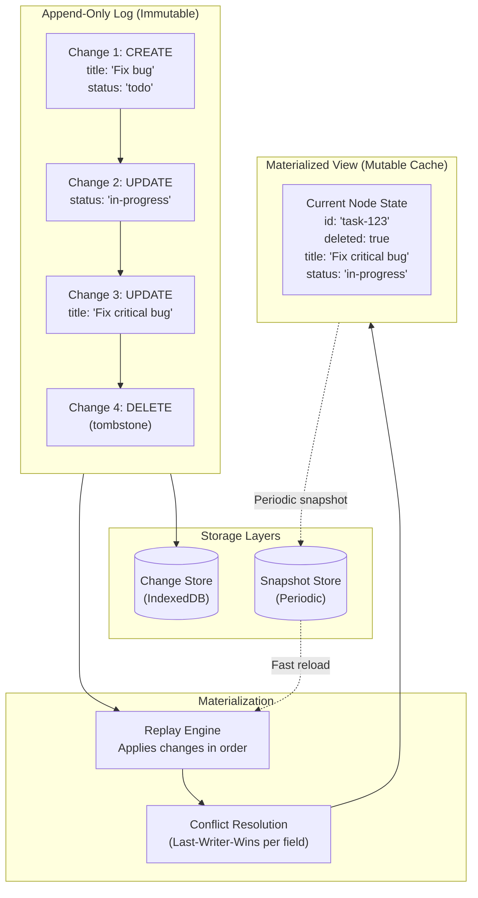

```mermaid
flowchart TB
    subgraph appendLog["Append-Only Log (Immutable)"]
        direction TB
        C1["Change 1: CREATE<br/>title: 'Fix bug'<br/>status: 'todo'"]
        C2["Change 2: UPDATE<br/>status: 'in-progress'"]
        C3["Change 3: UPDATE<br/>title: 'Fix critical bug'"]
        C4["Change 4: DELETE<br/>(tombstone)"]
        C1 --> C2 --> C3 --> C4
    end

    subgraph materialize["Materialization"]
        direction TB
        REPLAY["Replay Engine<br/>Applies changes in order"]
        LWW["Conflict Resolution<br/>(Last-Writer-Wins per field)"]
    end

    subgraph view["Materialized View (Mutable Cache)"]
        direction TB
        NODE["Current Node State<br/>id: 'task-123'<br/>deleted: true<br/>title: 'Fix critical bug'<br/>status: 'in-progress'"]
    end

    subgraph storage["Storage Layers"]
        direction LR
        CHANGES[("Change Store<br/>(IndexedDB)")]
        SNAPSHOT[("Snapshot Store<br/>(Periodic)")]
    end

    appendLog --> REPLAY
    REPLAY --> LWW
    LWW --> view

    appendLog --> CHANGES
    view -.->|"Periodic snapshot"| SNAPSHOT
    SNAPSHOT -.->|"Fast reload"| REPLAY
```
