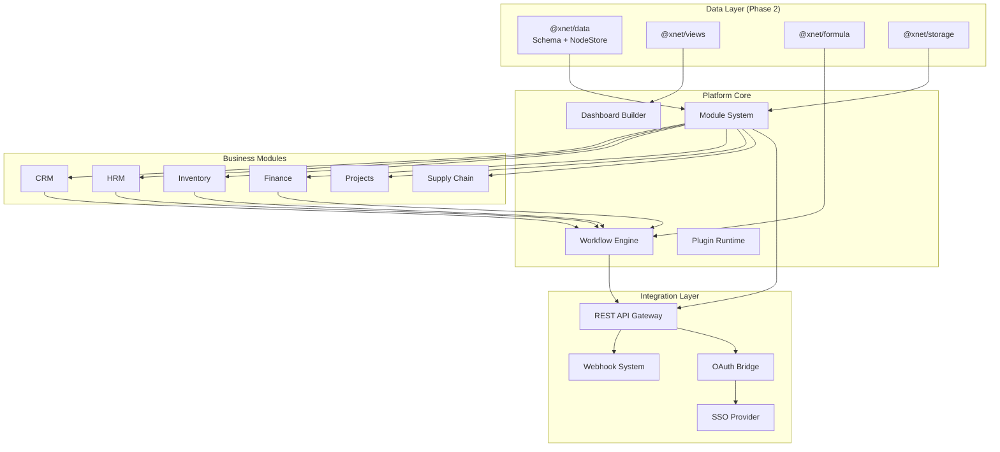
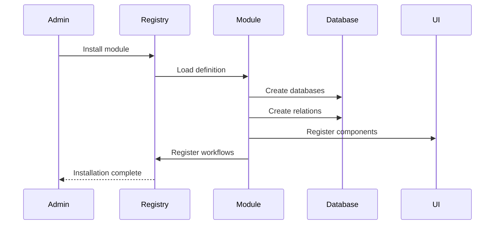
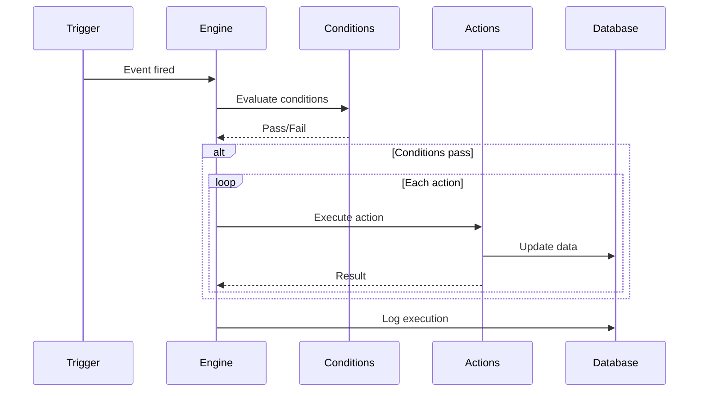
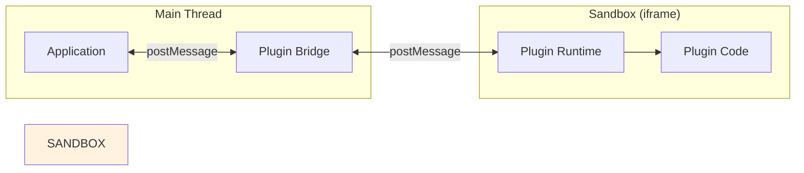
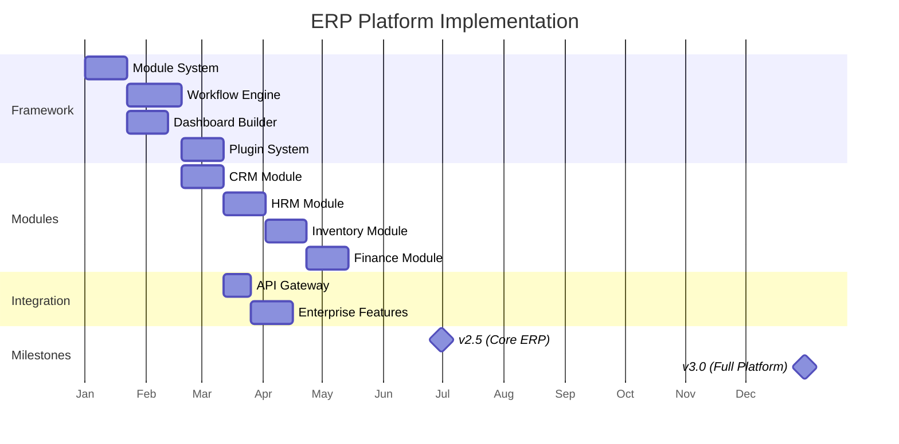

# 00: ERP Platform Overview

> Architecture and goals for Phase 3

**Duration:** 12 months (Months 24-36)
**Prerequisites:** planStep02DatabasePlatform complete

> **Architecture Update (Jan 2026):**
>
> - `@xnet/database` → Use `@xnet/data` (Schema system + NodeStore)
> - `DatabaseItem` → `Node`
> - `Database` → `Schema`
> - Modules store their data as Nodes with custom Schemas

## Goals

Evolve xNotes into a fully customizable ERP platform, enabling businesses to build complete operational systems.

| Milestone       | Target          | Key Features                                    |
| --------------- | --------------- | ----------------------------------------------- |
| v2.5 (Month 30) | 100 enterprises | Module framework, CRM/HRM, basic workflows      |
| v3.0 (Month 36) | 500 enterprises | All modules, plugin marketplace, enterprise SSO |

## Architecture

### New Packages

```
packages/
  @xnet/modules/       # Module system and registry
  @xnet/workflows/     # Workflow engine
  @xnet/dashboard/     # Dashboard builder
  @xnet/plugins/       # Plugin runtime and sandbox
  @xnet/api/          # REST API gateway

modules/
  @xnet/crm/          # CRM module
  @xnet/hrm/          # HRM module
  @xnet/inventory/    # Inventory module
  @xnet/finance/      # Finance module
  @xnet/projects/     # Project management module
  @xnet/scm/          # Supply chain module
```

### System Architecture



## Core Concepts

### Module

A module is a self-contained business function with databases, UI, and workflows.

```typescript
interface ModuleDefinition {
  id: ModuleId
  name: string
  version: string
  description: string

  // Dependencies
  dependencies: {
    core: string // Minimum platform version
    modules: ModuleId[] // Required modules
  }

  // Data model
  schema: {
    databases: DatabaseTemplate[]
    relations: RelationTemplate[]
  }

  // UI components
  components: {
    pages: PageDefinition[]
    widgets: WidgetDefinition[]
    actions: ActionDefinition[]
  }

  // Automation
  workflows: WorkflowTemplate[]

  // Settings
  settings: SettingDefinition[]

  // Lifecycle
  hooks: ModuleHooks
}
```

### Workflow

A workflow is an automated process triggered by events.

```typescript
interface WorkflowDefinition {
  id: WorkflowId
  name: string
  moduleId: ModuleId
  enabled: boolean

  trigger: WorkflowTrigger
  conditions: WorkflowCondition[]
  actions: WorkflowAction[]

  // Execution settings
  settings: {
    timeout: number // Max execution time (ms)
    retries: number // Retry on failure
    concurrent: boolean // Allow concurrent executions
  }
}
```

### Dashboard

A dashboard is a configurable view of widgets displaying data.

```typescript
interface DashboardDefinition {
  id: string
  name: string
  moduleId?: ModuleId

  // Layout
  layout: 'grid' | 'freeform'
  columns: number

  // Widgets
  widgets: WidgetInstance[]

  // Filters
  globalFilters: FilterDefinition[]

  // Refresh
  autoRefresh: boolean
  refreshInterval: number
}
```

### Plugin

A plugin is third-party code running in a sandboxed environment.

```typescript
interface PluginManifest {
  id: PluginId
  name: string
  version: string
  author: string

  // Permissions
  permissions: PluginPermission[]

  // Entry points
  main: string // Main JS bundle
  styles?: string // Optional CSS

  // Extensions
  extends: {
    widgets?: WidgetExtension[]
    actions?: ActionExtension[]
    commands?: CommandExtension[]
  }
}
```

## Data Flow

### Module Installation



### Workflow Execution



## Technology Choices

| Component         | Technology           | Rationale                     |
| ----------------- | -------------------- | ----------------------------- |
| Module Registry   | Custom + IndexedDB   | Local-first, sync-capable     |
| Workflow Engine   | Custom state machine | Full control, CRDT-compatible |
| Dashboard Builder | React Grid Layout    | Proven, customizable          |
| Plugin Sandbox    | iframe + postMessage | Security isolation            |
| API Gateway       | Hono.js              | Lightweight, edge-compatible  |
| Webhook Delivery  | Background workers   | Reliable, retryable           |

## Security Model

### Permission Layers

```
Platform Permissions (UCAN)
    └── Module Permissions
        └── Database Permissions
            └── Record Permissions
```

### Plugin Sandboxing



Plugins have no direct access to:

- Main thread DOM
- Direct database access
- Network without permission
- Other plugins

## Performance Targets

| Metric           | Target | Measurement           |
| ---------------- | ------ | --------------------- |
| Module load      | <500ms | Cold start to ready   |
| Workflow trigger | <100ms | Event to first action |
| Dashboard render | <1s    | With 20 widgets       |
| Plugin load      | <200ms | Sandbox creation      |
| API response     | <100ms | p95 latency           |

## Implementation Order



## File Structure

```
packages/modules/
├── src/
│   ├── index.ts
│   ├── types.ts
│   ├── registry/
│   │   ├── ModuleRegistry.ts
│   │   └── DependencyResolver.ts
│   ├── loader/
│   │   ├── ModuleLoader.ts
│   │   └── HotReload.ts
│   └── lifecycle/
│       ├── install.ts
│       ├── upgrade.ts
│       └── uninstall.ts
└── package.json

packages/workflows/
├── src/
│   ├── index.ts
│   ├── types.ts
│   ├── engine/
│   │   ├── WorkflowEngine.ts
│   │   ├── ExecutionContext.ts
│   │   └── StateMachine.ts
│   ├── triggers/
│   ├── conditions/
│   ├── actions/
│   └── sandbox/
│       └── ScriptRunner.ts
└── package.json

packages/dashboard/
├── src/
│   ├── index.ts
│   ├── types.ts
│   ├── builder/
│   │   ├── DashboardBuilder.tsx
│   │   ├── WidgetPalette.tsx
│   │   └── PropertyPanel.tsx
│   ├── widgets/
│   │   ├── MetricWidget.tsx
│   │   ├── ChartWidget.tsx
│   │   ├── TableWidget.tsx
│   │   └── ...
│   └── data/
│       ├── DataSource.ts
│       └── Aggregation.ts
└── package.json

packages/plugins/
├── src/
│   ├── index.ts
│   ├── types.ts
│   ├── runtime/
│   │   ├── PluginRuntime.ts
│   │   └── Sandbox.ts
│   ├── bridge/
│   │   ├── PluginBridge.ts
│   │   └── MessageHandler.ts
│   └── marketplace/
│       ├── PluginStore.ts
│       └── PluginInstaller.ts
└── package.json

modules/crm/
├── src/
│   ├── index.ts
│   ├── module.ts          # Module definition
│   ├── databases/
│   ├── components/
│   ├── workflows/
│   └── settings/
└── package.json
```

---

[← Back to README](./README.md) | [Next: Module System →](./01-module-system.md)
