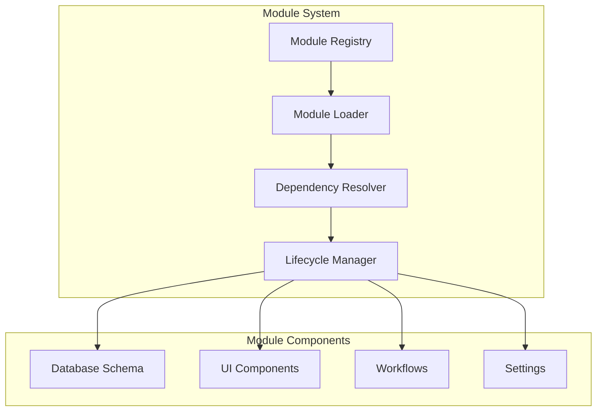

# 01: Module System

> Self-contained business function packages

**Duration:** 3 weeks
**Dependencies:** @xnet/data, @xnet/storage

> **Architecture Update (Jan 2026):**
>
> - `@xnet/database` → `@xnet/data` (Schema system + NodeStore)
> - Modules define their data using `defineSchema()` from `@xnet/data`
> - Module data stored as Nodes via NodeStore

## Overview

The module system provides a framework for packaging and managing business functionality. Each module is self-contained with databases, UI components, workflows, and settings.

## Architecture



## Implementation

### Module Definition Types

```typescript
// packages/modules/src/types.ts

export type ModuleId = `mod:${string}`
export type ModuleVersion = `${number}.${number}.${number}`

export interface ModuleDefinition {
  // Identity
  id: ModuleId
  name: string
  version: ModuleVersion
  description: string
  author: string
  license: string
  icon?: string

  // Dependencies
  dependencies: ModuleDependencies

  // Schema extensions
  schema: ModuleSchema

  // UI components
  components: ModuleComponents

  // Workflows
  workflows: WorkflowTemplate[]

  // Settings
  settings: SettingDefinition[]

  // Lifecycle hooks
  hooks: ModuleHooks
}

export interface ModuleDependencies {
  // Minimum platform version required
  platform: string

  // Other modules this depends on
  modules: Array<{
    id: ModuleId
    version: string // Semver range
  }>

  // External libraries (bundled)
  libraries?: Record<string, string>
}

export interface ModuleSchema {
  // Database templates to create
  databases: DatabaseTemplate[]

  // Relations between databases (including cross-module)
  relations: RelationTemplate[]
}

export interface ModuleComponents {
  // Full page components
  pages: PageDefinition[]

  // Dashboard widgets
  widgets: WidgetDefinition[]

  // Action buttons/menus
  actions: ActionDefinition[]

  // Navigation items
  navigation: NavigationItem[]
}

export interface ModuleHooks {
  // Called when module is first installed
  onInstall?: (context: ModuleContext) => Promise<void>

  // Called when module is upgraded
  onUpgrade?: (context: ModuleContext, fromVersion: string) => Promise<void>

  // Called when module is uninstalled
  onUninstall?: (context: ModuleContext) => Promise<void>

  // Called when module is activated
  onActivate?: (context: ModuleContext) => Promise<void>

  // Called when module is deactivated
  onDeactivate?: (context: ModuleContext) => Promise<void>
}

export interface ModuleContext {
  moduleId: ModuleId
  workspaceId: string
  storage: StorageAdapter
  database: DatabaseService
  identity: IdentityService
}
```

### Database Template

```typescript
// packages/modules/src/types.ts

export interface DatabaseTemplate {
  // Template ID (becomes database ID when instantiated)
  templateId: string
  name: string
  description?: string

  // Property definitions
  properties: PropertyTemplate[]

  // Default views
  views: ViewTemplate[]

  // Initial data (optional)
  seedData?: Record<string, unknown>[]
}

export interface PropertyTemplate {
  id: string
  name: string
  type: PropertyType
  config: PropertyConfig
  required?: boolean
  unique?: boolean
  indexed?: boolean
}

export interface ViewTemplate {
  id: string
  name: string
  type: ViewType
  config: ViewConfig
  isDefault?: boolean
}

export interface RelationTemplate {
  // Source database template
  from: {
    database: string
    property: string
  }

  // Target database template (can be from another module)
  to: {
    module?: ModuleId // If cross-module
    database: string
  }

  // Relation type
  type: 'one-to-one' | 'one-to-many' | 'many-to-many'

  // Bidirectional relation
  bidirectional?: {
    property: string
    name: string
  }
}
```

### Module Registry

```typescript
// packages/modules/src/registry/ModuleRegistry.ts

import { ModuleDefinition, ModuleId, ModuleVersion } from '../types'
import { StorageAdapter } from '@xnet/storage'

export interface InstalledModule {
  definition: ModuleDefinition
  installedAt: number
  installedVersion: ModuleVersion
  enabled: boolean
  databases: string[] // Created database IDs
}

export class ModuleRegistry {
  private storage: StorageAdapter
  private modules: Map<ModuleId, InstalledModule> = new Map()
  private loaded: Map<ModuleId, ModuleRuntime> = new Map()

  constructor(storage: StorageAdapter) {
    this.storage = storage
  }

  async initialize(): Promise<void> {
    // Load installed modules from storage
    const stored = await this.storage.get('modules:installed')
    if (stored) {
      const data = stored as Record<string, InstalledModule>
      Object.entries(data).forEach(([id, module]) => {
        this.modules.set(id as ModuleId, module)
      })
    }
  }

  async install(definition: ModuleDefinition): Promise<void> {
    const moduleId = definition.id

    // Check if already installed
    if (this.modules.has(moduleId)) {
      throw new Error(`Module ${moduleId} is already installed`)
    }

    // Resolve dependencies
    await this.resolveDependencies(definition)

    // Create module context
    const context = await this.createContext(moduleId)

    // Install schema (create databases)
    const databases = await this.installSchema(definition.schema, context)

    // Run install hook
    if (definition.hooks.onInstall) {
      await definition.hooks.onInstall(context)
    }

    // Register module
    const installed: InstalledModule = {
      definition,
      installedAt: Date.now(),
      installedVersion: definition.version,
      enabled: true,
      databases
    }

    this.modules.set(moduleId, installed)
    await this.persist()

    // Activate module
    await this.activate(moduleId)
  }

  async uninstall(moduleId: ModuleId): Promise<void> {
    const installed = this.modules.get(moduleId)
    if (!installed) {
      throw new Error(`Module ${moduleId} is not installed`)
    }

    // Check for dependents
    const dependents = this.findDependents(moduleId)
    if (dependents.length > 0) {
      throw new Error(`Cannot uninstall ${moduleId}: required by ${dependents.join(', ')}`)
    }

    // Deactivate first
    await this.deactivate(moduleId)

    // Create context
    const context = await this.createContext(moduleId)

    // Run uninstall hook
    if (installed.definition.hooks.onUninstall) {
      await installed.definition.hooks.onUninstall(context)
    }

    // Remove databases (with confirmation)
    // In production, this would require explicit user confirmation
    for (const dbId of installed.databases) {
      await context.database.deleteDatabase(dbId)
    }

    // Remove from registry
    this.modules.delete(moduleId)
    await this.persist()
  }

  async upgrade(moduleId: ModuleId, newDefinition: ModuleDefinition): Promise<void> {
    const installed = this.modules.get(moduleId)
    if (!installed) {
      throw new Error(`Module ${moduleId} is not installed`)
    }

    const fromVersion = installed.installedVersion
    const toVersion = newDefinition.version

    // Version check
    if (!this.isNewerVersion(fromVersion, toVersion)) {
      throw new Error(`Cannot downgrade from ${fromVersion} to ${toVersion}`)
    }

    // Deactivate during upgrade
    await this.deactivate(moduleId)

    // Create context
    const context = await this.createContext(moduleId)

    // Run upgrade hook
    if (newDefinition.hooks.onUpgrade) {
      await newDefinition.hooks.onUpgrade(context, fromVersion)
    }

    // Migrate schema if needed
    await this.migrateSchema(installed.definition.schema, newDefinition.schema, context)

    // Update registry
    installed.definition = newDefinition
    installed.installedVersion = toVersion
    await this.persist()

    // Reactivate
    await this.activate(moduleId)
  }

  async activate(moduleId: ModuleId): Promise<void> {
    const installed = this.modules.get(moduleId)
    if (!installed) {
      throw new Error(`Module ${moduleId} is not installed`)
    }

    if (this.loaded.has(moduleId)) {
      return // Already active
    }

    // Activate dependencies first
    for (const dep of installed.definition.dependencies.modules) {
      await this.activate(dep.id)
    }

    // Create runtime
    const context = await this.createContext(moduleId)
    const runtime = new ModuleRuntime(installed.definition, context)
    await runtime.start()

    // Run activate hook
    if (installed.definition.hooks.onActivate) {
      await installed.definition.hooks.onActivate(context)
    }

    this.loaded.set(moduleId, runtime)
    installed.enabled = true
    await this.persist()
  }

  async deactivate(moduleId: ModuleId): Promise<void> {
    const installed = this.modules.get(moduleId)
    if (!installed) return

    const runtime = this.loaded.get(moduleId)
    if (!runtime) return

    // Deactivate dependents first
    const dependents = this.findDependents(moduleId)
    for (const depId of dependents) {
      await this.deactivate(depId)
    }

    // Create context
    const context = await this.createContext(moduleId)

    // Run deactivate hook
    if (installed.definition.hooks.onDeactivate) {
      await installed.definition.hooks.onDeactivate(context)
    }

    // Stop runtime
    await runtime.stop()

    this.loaded.delete(moduleId)
    installed.enabled = false
    await this.persist()
  }

  // Getters
  getInstalled(): InstalledModule[] {
    return Array.from(this.modules.values())
  }

  getModule(moduleId: ModuleId): InstalledModule | undefined {
    return this.modules.get(moduleId)
  }

  isInstalled(moduleId: ModuleId): boolean {
    return this.modules.has(moduleId)
  }

  isActive(moduleId: ModuleId): boolean {
    return this.loaded.has(moduleId)
  }

  // Private methods
  private async resolveDependencies(definition: ModuleDefinition): Promise<void> {
    for (const dep of definition.dependencies.modules) {
      const installed = this.modules.get(dep.id)
      if (!installed) {
        throw new Error(`Missing dependency: ${dep.id}`)
      }
      // TODO: Check version compatibility with semver
    }
  }

  private findDependents(moduleId: ModuleId): ModuleId[] {
    const dependents: ModuleId[] = []
    for (const [id, installed] of this.modules) {
      const deps = installed.definition.dependencies.modules
      if (deps.some((d) => d.id === moduleId)) {
        dependents.push(id)
      }
    }
    return dependents
  }

  private async installSchema(schema: ModuleSchema, context: ModuleContext): Promise<string[]> {
    const createdDatabases: string[] = []

    for (const template of schema.databases) {
      const dbId = `${context.moduleId}:${template.templateId}`
      await context.database.createDatabase({
        id: dbId,
        name: template.name,
        properties: template.properties,
        views: template.views
      })
      createdDatabases.push(dbId)

      // Seed data if provided
      if (template.seedData) {
        for (const item of template.seedData) {
          await context.database.createItem(dbId, item)
        }
      }
    }

    // Create relations
    for (const relation of schema.relations) {
      // Implementation depends on database service
    }

    return createdDatabases
  }

  private async migrateSchema(
    oldSchema: ModuleSchema,
    newSchema: ModuleSchema,
    context: ModuleContext
  ): Promise<void> {
    // Compare schemas and apply migrations
    // This is a complex topic - simplified here
    for (const newDb of newSchema.databases) {
      const oldDb = oldSchema.databases.find((d) => d.templateId === newDb.templateId)
      if (!oldDb) {
        // New database - create it
        await this.installSchema({ databases: [newDb], relations: [] }, context)
      } else {
        // Existing database - migrate properties
        // Add new properties, handle removed properties, etc.
      }
    }
  }

  private isNewerVersion(from: ModuleVersion, to: ModuleVersion): boolean {
    const [fromMajor, fromMinor, fromPatch] = from.split('.').map(Number)
    const [toMajor, toMinor, toPatch] = to.split('.').map(Number)

    if (toMajor > fromMajor) return true
    if (toMajor < fromMajor) return false
    if (toMinor > fromMinor) return true
    if (toMinor < fromMinor) return false
    return toPatch > fromPatch
  }

  private async createContext(moduleId: ModuleId): Promise<ModuleContext> {
    return {
      moduleId,
      workspaceId: 'default', // TODO: Get from context
      storage: this.storage,
      database: null as any, // Injected
      identity: null as any // Injected
    }
  }

  private async persist(): Promise<void> {
    const data: Record<string, InstalledModule> = {}
    for (const [id, module] of this.modules) {
      data[id] = module
    }
    await this.storage.set('modules:installed', data)
  }
}
```

### Module Runtime

```typescript
// packages/modules/src/runtime/ModuleRuntime.ts

import { ModuleDefinition, ModuleContext } from '../types'

export class ModuleRuntime {
  private definition: ModuleDefinition
  private context: ModuleContext
  private components: Map<string, React.ComponentType> = new Map()
  private running = false

  constructor(definition: ModuleDefinition, context: ModuleContext) {
    this.definition = definition
    this.context = context
  }

  async start(): Promise<void> {
    if (this.running) return

    // Register UI components
    this.registerComponents()

    // Register workflows
    await this.registerWorkflows()

    // Register navigation
    this.registerNavigation()

    this.running = true
  }

  async stop(): Promise<void> {
    if (!this.running) return

    // Unregister components
    this.components.clear()

    // Unregister workflows
    await this.unregisterWorkflows()

    this.running = false
  }

  private registerComponents(): void {
    // Register pages
    for (const page of this.definition.components.pages) {
      const component = this.loadComponent(page.component)
      this.components.set(`page:${page.id}`, component)
    }

    // Register widgets
    for (const widget of this.definition.components.widgets) {
      const component = this.loadComponent(widget.component)
      this.components.set(`widget:${widget.id}`, component)
    }

    // Register actions
    for (const action of this.definition.components.actions) {
      const component = this.loadComponent(action.component)
      this.components.set(`action:${action.id}`, component)
    }
  }

  private loadComponent(path: string): React.ComponentType {
    // In production, this would use dynamic imports
    // For now, components are bundled with the module
    return () => null // Placeholder
  }

  private async registerWorkflows(): Promise<void> {
    // Register workflow templates with the workflow engine
    // This would integrate with @xnet/workflows
  }

  private async unregisterWorkflows(): Promise<void> {
    // Unregister workflows from the engine
  }

  private registerNavigation(): void {
    // Register navigation items with the app shell
  }

  getComponent(key: string): React.ComponentType | undefined {
    return this.components.get(key)
  }
}
```

### Module Loader (Hot Reload)

```typescript
// packages/modules/src/loader/ModuleLoader.ts

export class ModuleLoader {
  private cache: Map<string, ModuleDefinition> = new Map()

  async loadFromUrl(url: string): Promise<ModuleDefinition> {
    // Fetch module definition
    const response = await fetch(url)
    const definition = await response.json()

    // Validate definition
    this.validate(definition)

    // Cache
    this.cache.set(definition.id, definition)

    return definition
  }

  async loadFromFile(file: File): Promise<ModuleDefinition> {
    const text = await file.text()
    const definition = JSON.parse(text)

    this.validate(definition)
    this.cache.set(definition.id, definition)

    return definition
  }

  // For development hot reload
  async hotReload(moduleId: ModuleId, registry: ModuleRegistry): Promise<void> {
    const cached = this.cache.get(moduleId)
    if (!cached) {
      throw new Error(`Module ${moduleId} not in cache`)
    }

    // Reload definition (in development, this would re-fetch)
    // Then upgrade the module
    await registry.upgrade(moduleId, cached)
  }

  private validate(definition: unknown): asserts definition is ModuleDefinition {
    // Validate required fields
    if (!definition || typeof definition !== 'object') {
      throw new Error('Invalid module definition')
    }

    const def = definition as Record<string, unknown>
    if (!def.id || !def.name || !def.version) {
      throw new Error('Module must have id, name, and version')
    }

    // Additional validation...
  }
}
```

## Tests

```typescript
// packages/modules/test/ModuleRegistry.test.ts

import { describe, it, expect, beforeEach } from 'vitest'
import { ModuleRegistry } from '../src/registry/ModuleRegistry'
import { MemoryAdapter } from '@xnet/storage'

describe('ModuleRegistry', () => {
  let registry: ModuleRegistry
  let storage: MemoryAdapter

  const testModule: ModuleDefinition = {
    id: 'mod:test',
    name: 'Test Module',
    version: '1.0.0',
    description: 'A test module',
    author: 'Test',
    license: 'MIT',
    dependencies: {
      platform: '1.0.0',
      modules: []
    },
    schema: {
      databases: [],
      relations: []
    },
    components: {
      pages: [],
      widgets: [],
      actions: [],
      navigation: []
    },
    workflows: [],
    settings: [],
    hooks: {}
  }

  beforeEach(async () => {
    storage = new MemoryAdapter()
    registry = new ModuleRegistry(storage)
    await registry.initialize()
  })

  it('installs a module', async () => {
    await registry.install(testModule)

    expect(registry.isInstalled('mod:test')).toBe(true)
    expect(registry.getInstalled()).toHaveLength(1)
  })

  it('prevents duplicate installation', async () => {
    await registry.install(testModule)

    await expect(registry.install(testModule)).rejects.toThrow('already installed')
  })

  it('uninstalls a module', async () => {
    await registry.install(testModule)
    await registry.uninstall('mod:test')

    expect(registry.isInstalled('mod:test')).toBe(false)
  })

  it('prevents uninstall if dependents exist', async () => {
    await registry.install(testModule)

    const dependentModule: ModuleDefinition = {
      ...testModule,
      id: 'mod:dependent',
      dependencies: {
        platform: '1.0.0',
        modules: [{ id: 'mod:test', version: '1.0.0' }]
      }
    }
    await registry.install(dependentModule)

    await expect(registry.uninstall('mod:test')).rejects.toThrow('required by')
  })

  it('upgrades a module', async () => {
    await registry.install(testModule)

    const upgradedModule: ModuleDefinition = {
      ...testModule,
      version: '2.0.0'
    }
    await registry.upgrade('mod:test', upgradedModule)

    const installed = registry.getModule('mod:test')
    expect(installed?.installedVersion).toBe('2.0.0')
  })
})
```

## Checklist

### Week 1: Core Registry

- [ ] ModuleDefinition types
- [ ] ModuleRegistry class
- [ ] Install/uninstall functionality
- [ ] Dependency resolution
- [ ] Storage persistence

### Week 2: Lifecycle & Schema

- [ ] Module lifecycle hooks
- [ ] Schema installation
- [ ] Schema migration on upgrade
- [ ] ModuleRuntime class
- [ ] Component registration

### Week 3: Loader & Integration

- [ ] ModuleLoader with validation
- [ ] Hot reload for development
- [ ] Integration with database service
- [ ] Integration with UI shell
- [ ] All tests pass (>80% coverage)

---

[← Back to Overview](./00-overview.md) | [Next: Workflow Engine →](./02-workflow-engine.md)
