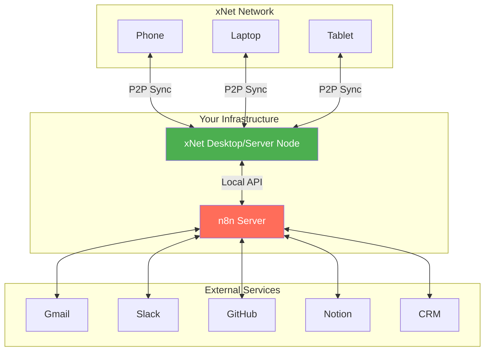
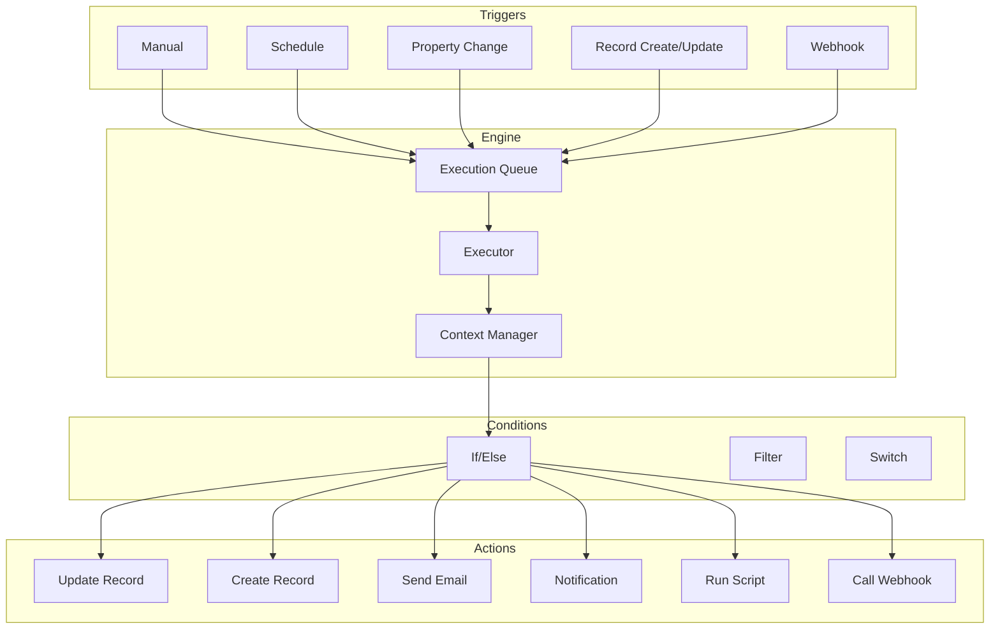

# 02: Workflow Engine

> Automated business process execution with n8n integration

**Package:** `@xnet/workflows`
**Dependencies:** `@xnet/modules`, `@xnet/data`
**Estimated Time:** 4 weeks

> **Architecture Update (Jan 2026):**
>
> - `@xnet/database` → `@xnet/data`
> - Workflow triggers use Node events (create, update, delete)
> - Workflow state stored as Nodes

## n8n Integration

For external service integrations and advanced automation, xNet integrates with [n8n](https://n8n.io/) - a self-hosted workflow automation platform that aligns with xNet's local-first philosophy.

### Architecture: xNet + n8n



### xNet Local API Server

```typescript
// packages/workflows/src/api/LocalAPIServer.ts

import { Hono } from 'hono'
import { cors } from 'hono/cors'
import { DatabaseManager } from '@xnet/database'
import { verifyUCAN } from '@xnet/identity'

export class LocalAPIServer {
  private app: Hono
  private port = 3741

  constructor(
    private databaseManager: DatabaseManager,
    private workflowEngine: WorkflowEngine
  ) {
    this.app = new Hono()
    this.setupMiddleware()
    this.setupRoutes()
  }

  private setupMiddleware(): void {
    // CORS for local development
    this.app.use(
      '*',
      cors({
        origin: ['http://localhost:5678', 'http://127.0.0.1:5678'], // n8n default
        credentials: true
      })
    )

    // Authentication
    this.app.use('/api/*', async (c, next) => {
      const authHeader = c.req.header('Authorization')
      if (!authHeader?.startsWith('Bearer ')) {
        return c.json({ error: 'Unauthorized' }, 401)
      }

      const token = authHeader.slice(7)
      const isValid = await verifyUCAN(token)
      if (!isValid) {
        return c.json({ error: 'Invalid token' }, 401)
      }

      await next()
    })
  }

  private setupRoutes(): void {
    // Tasks
    this.app.get('/api/tasks', async (c) => {
      const db = await this.databaseManager.getDatabase('tasks')
      const result = await db.query().execute()
      return c.json(result.records)
    })

    this.app.get('/api/tasks/:id', async (c) => {
      const db = await this.databaseManager.getDatabase('tasks')
      const task = await db.getRecord(c.req.param('id'))
      if (!task) return c.json({ error: 'Not found' }, 404)
      return c.json(task)
    })

    this.app.post('/api/tasks', async (c) => {
      const db = await this.databaseManager.getDatabase('tasks')
      const data = await c.req.json()
      const task = await db.createRecord(data)
      return c.json(task, 201)
    })

    this.app.patch('/api/tasks/:id', async (c) => {
      const db = await this.databaseManager.getDatabase('tasks')
      const data = await c.req.json()
      await db.updateRecord(c.req.param('id'), data)
      const task = await db.getRecord(c.req.param('id'))
      return c.json(task)
    })

    this.app.delete('/api/tasks/:id', async (c) => {
      const db = await this.databaseManager.getDatabase('tasks')
      await db.deleteRecord(c.req.param('id'))
      return c.json({ success: true })
    })

    // Databases (generic)
    this.app.get('/api/databases', async (c) => {
      const databases = await this.databaseManager.listDatabases()
      return c.json(databases)
    })

    this.app.get('/api/databases/:id/query', async (c) => {
      const db = await this.databaseManager.getDatabase(c.req.param('id'))
      const filter = c.req.query('filter') ? JSON.parse(c.req.query('filter')!) : undefined
      const sort = c.req.query('sort') ? JSON.parse(c.req.query('sort')!) : undefined
      const limit = c.req.query('limit') ? parseInt(c.req.query('limit')!) : undefined

      let query = db.query()
      if (filter) query = query.filter(filter)
      if (sort) query = query.sort(sort.field, sort.direction)
      if (limit) query = query.limit(limit)

      const result = await query.execute()
      return c.json(result)
    })

    this.app.post('/api/databases/:id/rows', async (c) => {
      const db = await this.databaseManager.getDatabase(c.req.param('id'))
      const data = await c.req.json()
      const record = await db.createRecord(data)
      return c.json(record, 201)
    })

    this.app.patch('/api/databases/:id/rows/:rowId', async (c) => {
      const db = await this.databaseManager.getDatabase(c.req.param('id'))
      const data = await c.req.json()
      await db.updateRecord(c.req.param('rowId'), data)
      const record = await db.getRecord(c.req.param('rowId'))
      return c.json(record)
    })

    // Pages
    this.app.get('/api/pages', async (c) => {
      const db = await this.databaseManager.getDatabase('pages')
      const result = await db.query().execute()
      return c.json(result.records)
    })

    this.app.get('/api/pages/:id', async (c) => {
      const db = await this.databaseManager.getDatabase('pages')
      const page = await db.getRecord(c.req.param('id'))
      if (!page) return c.json({ error: 'Not found' }, 404)
      return c.json(page)
    })

    this.app.post('/api/pages', async (c) => {
      const db = await this.databaseManager.getDatabase('pages')
      const data = await c.req.json()
      const page = await db.createRecord(data)
      return c.json(page, 201)
    })

    // Search
    this.app.get('/api/search', async (c) => {
      const query = c.req.query('q')
      if (!query) return c.json({ error: 'Query required' }, 400)
      const results = await this.databaseManager.search(query)
      return c.json(results)
    })

    // Webhooks
    this.app.post('/api/webhooks', async (c) => {
      const data = await c.req.json()
      const webhook = await this.workflowEngine.registerWebhook({
        url: data.url,
        events: data.events,
        secret: data.secret
      })
      return c.json(webhook, 201)
    })

    this.app.delete('/api/webhooks/:id', async (c) => {
      await this.workflowEngine.unregisterWebhook(c.req.param('id'))
      return c.json({ success: true })
    })

    // Events (for polling)
    this.app.get('/api/events', async (c) => {
      const since = c.req.query('since') ? parseInt(c.req.query('since')!) : 0
      const events = await this.workflowEngine.getEventsSince(since)
      return c.json(events)
    })
  }

  async start(): Promise<void> {
    // Use Bun or Node HTTP adapter
    const server = Bun.serve({
      port: this.port,
      fetch: this.app.fetch
    })
    console.log(`xNet Local API running on http://localhost:${this.port}`)
  }

  async stop(): Promise<void> {
    // Cleanup
  }
}
```

### Webhook Dispatcher

```typescript
// packages/workflows/src/api/WebhookDispatcher.ts

import { createHmac } from 'crypto'

interface WebhookRegistration {
  id: string
  url: string
  events: string[]
  secret: string
  createdAt: number
}

export class WebhookDispatcher {
  private webhooks = new Map<string, WebhookRegistration>()
  private eventQueue: XNetEvent[] = []

  // Register a webhook
  async register(params: {
    url: string
    events: string[]
    secret: string
  }): Promise<WebhookRegistration> {
    const webhook: WebhookRegistration = {
      id: `webhook:${Date.now()}`,
      url: params.url,
      events: params.events,
      secret: params.secret,
      createdAt: Date.now()
    }

    this.webhooks.set(webhook.id, webhook)
    return webhook
  }

  // Unregister a webhook
  async unregister(webhookId: string): Promise<void> {
    this.webhooks.delete(webhookId)
  }

  // Dispatch event to registered webhooks
  async dispatch(event: XNetEvent): Promise<void> {
    // Store for polling
    this.eventQueue.push(event)
    if (this.eventQueue.length > 1000) {
      this.eventQueue.shift()
    }

    // Find matching webhooks
    for (const webhook of this.webhooks.values()) {
      if (webhook.events.includes(event.type) || webhook.events.includes('*')) {
        await this.sendToWebhook(webhook, event)
      }
    }
  }

  // Get events since timestamp (for polling)
  getEventsSince(timestamp: number): XNetEvent[] {
    return this.eventQueue.filter((e) => e.timestamp > timestamp)
  }

  private async sendToWebhook(webhook: WebhookRegistration, event: XNetEvent): Promise<void> {
    const payload = JSON.stringify(event)
    const signature = createHmac('sha256', webhook.secret).update(payload).digest('hex')

    try {
      await fetch(webhook.url, {
        method: 'POST',
        headers: {
          'Content-Type': 'application/json',
          'X-XNet-Signature': `sha256=${signature}`,
          'X-XNet-Event': event.type
        },
        body: payload
      })
    } catch (error) {
      console.error(`Failed to deliver webhook to ${webhook.url}:`, error)
      // Could implement retry logic here
    }
  }
}

interface XNetEvent {
  id: string
  type:
    | 'task.created'
    | 'task.updated'
    | 'task.completed'
    | 'page.created'
    | 'page.updated'
    | 'database.row.created'
    | 'database.row.updated'
    | 'workflow.completed'
    | 'comment.created'
    | 'mention'
  timestamp: number
  data: unknown
  workspace: string
}
```

### Docker Compose for n8n + xNet

```yaml
# docker/docker-compose.n8n.yml
version: '3.8'

services:
  xnet:
    image: xnet/server:latest
    ports:
      - '3741:3741' # Local API
      - '4001:4001' # libp2p
    volumes:
      - xnet-data:/data
    environment:
      - XNET_API_ENABLED=true
      - XNET_API_TOKEN=${XNET_API_TOKEN}

  n8n:
    image: n8nio/n8n
    ports:
      - '5678:5678'
    volumes:
      - n8n-data:/home/node/.n8n
    environment:
      - N8N_BASIC_AUTH_ACTIVE=true
      - N8N_BASIC_AUTH_USER=${N8N_USER}
      - N8N_BASIC_AUTH_PASSWORD=${N8N_PASSWORD}
      - XNET_API_URL=http://xnet:3741
      - XNET_API_TOKEN=${XNET_API_TOKEN}
    depends_on:
      - xnet

volumes:
  xnet-data:
  n8n-data:
```

### Custom n8n Node

```typescript
// packages/workflows/src/n8n/XNetNode.ts
// Published as @xnet/n8n-node for community installation

import {
  IExecuteFunctions,
  INodeExecutionData,
  INodeType,
  INodeTypeDescription
} from 'n8n-workflow'

export class XNetNode implements INodeType {
  description: INodeTypeDescription = {
    displayName: 'xNet',
    name: 'xnet',
    icon: 'file:xnet.svg',
    group: ['transform'],
    version: 1,
    description: 'Interact with xNet local-first workspace',
    inputs: ['main'],
    outputs: ['main'],
    credentials: [
      {
        name: 'xnetApi',
        required: true
      }
    ],
    properties: [
      {
        displayName: 'Operation',
        name: 'operation',
        type: 'options',
        noDataExpression: true,
        options: [
          { name: 'Create Task', value: 'createTask' },
          { name: 'Update Task', value: 'updateTask' },
          { name: 'Get Task', value: 'getTask' },
          { name: 'List Tasks', value: 'listTasks' },
          { name: 'Query Database', value: 'queryDatabase' },
          { name: 'Create Record', value: 'createRecord' },
          { name: 'Update Record', value: 'updateRecord' },
          { name: 'Search', value: 'search' }
        ],
        default: 'createTask'
      },
      // Task fields
      {
        displayName: 'Task Title',
        name: 'taskTitle',
        type: 'string',
        default: '',
        displayOptions: { show: { operation: ['createTask'] } },
        required: true
      },
      {
        displayName: 'Task Description',
        name: 'taskDescription',
        type: 'string',
        default: '',
        displayOptions: { show: { operation: ['createTask'] } }
      },
      {
        displayName: 'Task ID',
        name: 'taskId',
        type: 'string',
        default: '',
        displayOptions: { show: { operation: ['updateTask', 'getTask'] } },
        required: true
      },
      // Database fields
      {
        displayName: 'Database ID',
        name: 'databaseId',
        type: 'string',
        default: '',
        displayOptions: { show: { operation: ['queryDatabase', 'createRecord', 'updateRecord'] } },
        required: true
      },
      {
        displayName: 'Record Data',
        name: 'recordData',
        type: 'json',
        default: '{}',
        displayOptions: { show: { operation: ['createRecord', 'updateRecord'] } }
      },
      // Search
      {
        displayName: 'Search Query',
        name: 'searchQuery',
        type: 'string',
        default: '',
        displayOptions: { show: { operation: ['search'] } },
        required: true
      }
    ]
  }

  async execute(this: IExecuteFunctions): Promise<INodeExecutionData[][]> {
    const credentials = await this.getCredentials('xnetApi')
    const baseUrl = credentials.apiUrl as string
    const token = credentials.apiToken as string

    const operation = this.getNodeParameter('operation', 0) as string
    const items = this.getInputData()
    const results: INodeExecutionData[] = []

    for (let i = 0; i < items.length; i++) {
      let response: unknown

      switch (operation) {
        case 'createTask': {
          const title = this.getNodeParameter('taskTitle', i) as string
          const description = this.getNodeParameter('taskDescription', i) as string
          response = await this.apiRequest(baseUrl, token, 'POST', '/api/tasks', {
            title,
            description
          })
          break
        }

        case 'updateTask': {
          const taskId = this.getNodeParameter('taskId', i) as string
          const data = items[i].json
          response = await this.apiRequest(baseUrl, token, 'PATCH', `/api/tasks/${taskId}`, data)
          break
        }

        case 'getTask': {
          const taskId = this.getNodeParameter('taskId', i) as string
          response = await this.apiRequest(baseUrl, token, 'GET', `/api/tasks/${taskId}`)
          break
        }

        case 'listTasks': {
          response = await this.apiRequest(baseUrl, token, 'GET', '/api/tasks')
          break
        }

        case 'queryDatabase': {
          const databaseId = this.getNodeParameter('databaseId', i) as string
          response = await this.apiRequest(
            baseUrl,
            token,
            'GET',
            `/api/databases/${databaseId}/query`
          )
          break
        }

        case 'createRecord': {
          const databaseId = this.getNodeParameter('databaseId', i) as string
          const recordData = JSON.parse(this.getNodeParameter('recordData', i) as string)
          response = await this.apiRequest(
            baseUrl,
            token,
            'POST',
            `/api/databases/${databaseId}/rows`,
            recordData
          )
          break
        }

        case 'search': {
          const query = this.getNodeParameter('searchQuery', i) as string
          response = await this.apiRequest(
            baseUrl,
            token,
            'GET',
            `/api/search?q=${encodeURIComponent(query)}`
          )
          break
        }
      }

      results.push({ json: response as object })
    }

    return [results]
  }

  private async apiRequest(
    baseUrl: string,
    token: string,
    method: string,
    path: string,
    body?: unknown
  ): Promise<unknown> {
    const response = await fetch(`${baseUrl}${path}`, {
      method,
      headers: {
        Authorization: `Bearer ${token}`,
        'Content-Type': 'application/json'
      },
      body: body ? JSON.stringify(body) : undefined
    })

    if (!response.ok) {
      throw new Error(`xNet API error: ${response.status} ${response.statusText}`)
    }

    return response.json()
  }
}
```

### n8n Workflow Examples

#### Email to Task

```json
{
  "nodes": [
    {
      "name": "Gmail Trigger",
      "type": "n8n-nodes-base.gmailTrigger",
      "parameters": {
        "filters": { "labelIds": ["Label_todo"] }
      }
    },
    {
      "name": "Create xNet Task",
      "type": "xnet",
      "parameters": {
        "operation": "createTask",
        "taskTitle": "={{ $json.subject }}",
        "taskDescription": "={{ $json.snippet }}\n\nFrom: {{ $json.from }}"
      }
    }
  ]
}
```

#### Task Completed → Slack

```json
{
  "nodes": [
    {
      "name": "xNet Webhook",
      "type": "n8n-nodes-base.webhook",
      "parameters": {
        "path": "xnet-task-completed",
        "httpMethod": "POST"
      }
    },
    {
      "name": "Filter Completed",
      "type": "n8n-nodes-base.if",
      "parameters": {
        "conditions": {
          "string": [
            {
              "value1": "={{ $json.type }}",
              "value2": "task.completed"
            }
          ]
        }
      }
    },
    {
      "name": "Post to Slack",
      "type": "n8n-nodes-base.slack",
      "parameters": {
        "channel": "#team-updates",
        "text": "✅ Task completed: {{ $json.data.title }}"
      }
    }
  ]
}
```

---

## Overview

The workflow engine enables no-code automation of business processes through triggers, conditions, and actions.

## Architecture



## Implementation

### Workflow Types

```typescript
// packages/workflows/src/types.ts

export type WorkflowId = `wf:${string}`
export type ExecutionId = `exec:${string}`

export interface WorkflowDefinition {
  id: WorkflowId
  name: string
  description?: string
  moduleId?: ModuleId
  enabled: boolean

  // Trigger configuration
  trigger: WorkflowTrigger

  // Condition tree (optional)
  conditions?: WorkflowCondition

  // Actions to execute
  actions: WorkflowAction[]

  // Execution settings
  settings: ExecutionSettings
}

export interface ExecutionSettings {
  timeout: number // Max execution time (ms), default 30000
  retries: number // Retry count on failure, default 0
  retryDelay: number // Delay between retries (ms), default 1000
  concurrent: boolean // Allow concurrent executions, default false
  logLevel: 'error' | 'warn' | 'info' | 'debug'
}

// Trigger Types
export type WorkflowTrigger =
  | ManualTrigger
  | ScheduleTrigger
  | PropertyChangeTrigger
  | RecordTrigger
  | WebhookTrigger

export interface ManualTrigger {
  type: 'manual'
  config: {
    buttonLabel?: string
    confirmMessage?: string
  }
}

export interface ScheduleTrigger {
  type: 'schedule'
  config: {
    cron: string // Cron expression
    timezone?: string // IANA timezone
  }
}

export interface PropertyChangeTrigger {
  type: 'property_change'
  config: {
    databaseId: string
    propertyId: string
    fromValue?: unknown // Optional: only trigger on specific transition
    toValue?: unknown
  }
}

export interface RecordTrigger {
  type: 'record_create' | 'record_update' | 'record_delete'
  config: {
    databaseId: string
    filter?: FilterGroup // Optional: only trigger for matching records
  }
}

export interface WebhookTrigger {
  type: 'webhook'
  config: {
    path: string // URL path for webhook
    method: 'GET' | 'POST' | 'PUT'
    secret?: string // Optional: for signature verification
  }
}
```

### Conditions

```typescript
// packages/workflows/src/types.ts

export type WorkflowCondition =
  | PropertyCondition
  | FormulaCondition
  | AndCondition
  | OrCondition
  | NotCondition

export interface PropertyCondition {
  type: 'property'
  config: {
    property: string // Property path or template
    operator: ConditionOperator
    value: unknown | string // Can be template like "{{trigger.oldValue}}"
  }
}

export interface FormulaCondition {
  type: 'formula'
  config: {
    expression: string // Formula expression returning boolean
  }
}

export interface AndCondition {
  type: 'and'
  conditions: WorkflowCondition[]
}

export interface OrCondition {
  type: 'or'
  conditions: WorkflowCondition[]
}

export interface NotCondition {
  type: 'not'
  condition: WorkflowCondition
}

export type ConditionOperator =
  | 'equals'
  | 'not_equals'
  | 'contains'
  | 'not_contains'
  | 'greater_than'
  | 'less_than'
  | 'is_empty'
  | 'is_not_empty'
  | 'changed'
  | 'changed_to'
  | 'changed_from'
```

### Actions

```typescript
// packages/workflows/src/types.ts

export type WorkflowAction =
  | UpdateRecordAction
  | CreateRecordAction
  | DeleteRecordAction
  | SendEmailAction
  | SendNotificationAction
  | CallWebhookAction
  | RunScriptAction
  | DelayAction
  | BranchAction
  | LoopAction

export interface UpdateRecordAction {
  type: 'update_record'
  config: {
    recordId: string // Template: "{{trigger.recordId}}"
    databaseId: string
    updates: Record<string, unknown | string> // Property updates (templates)
  }
}

export interface CreateRecordAction {
  type: 'create_record'
  config: {
    databaseId: string
    data: Record<string, unknown | string>
    outputKey?: string // Store created record in context
  }
}

export interface DeleteRecordAction {
  type: 'delete_record'
  config: {
    recordId: string
    databaseId: string
  }
}

export interface SendEmailAction {
  type: 'send_email'
  config: {
    to: string | string[] // Templates supported
    subject: string
    body: string // Supports HTML
    template?: string // Optional: use email template
  }
}

export interface SendNotificationAction {
  type: 'send_notification'
  config: {
    to: string | string[] // User DIDs or "{{record.assignee}}"
    title: string
    body: string
    link?: string // Optional: deep link
  }
}

export interface CallWebhookAction {
  type: 'call_webhook'
  config: {
    url: string
    method: 'GET' | 'POST' | 'PUT' | 'DELETE'
    headers?: Record<string, string>
    body?: unknown | string
    outputKey?: string // Store response in context
  }
}

export interface RunScriptAction {
  type: 'run_script'
  config: {
    code: string // JavaScript code
    timeout?: number // Script timeout (ms)
  }
}

export interface DelayAction {
  type: 'delay'
  config: {
    duration: number // Milliseconds
    // or
    until?: string // ISO date string or template
  }
}

export interface BranchAction {
  type: 'branch'
  config: {
    condition: WorkflowCondition
    ifTrue: WorkflowAction[]
    ifFalse?: WorkflowAction[]
  }
}

export interface LoopAction {
  type: 'loop'
  config: {
    items: string // Template: "{{query.results}}"
    itemKey: string // Variable name for current item
    actions: WorkflowAction[]
    maxIterations?: number // Safety limit
  }
}
```

### Workflow Engine

```typescript
// packages/workflows/src/engine/WorkflowEngine.ts

import { WorkflowDefinition, WorkflowTrigger, ExecutionId } from '../types'
import { ExecutionContext } from './ExecutionContext'
import { ActionExecutor } from './ActionExecutor'
import { ConditionEvaluator } from './ConditionEvaluator'
import { TemplateResolver } from './TemplateResolver'

export interface WorkflowExecution {
  id: ExecutionId
  workflowId: WorkflowId
  status: 'pending' | 'running' | 'completed' | 'failed' | 'cancelled'
  startedAt?: number
  completedAt?: number
  trigger: {
    type: string
    data: unknown
  }
  context: Record<string, unknown>
  logs: ExecutionLog[]
  error?: string
}

export interface ExecutionLog {
  timestamp: number
  level: 'error' | 'warn' | 'info' | 'debug'
  message: string
  data?: unknown
}

export class WorkflowEngine {
  private workflows: Map<WorkflowId, WorkflowDefinition> = new Map()
  private executions: Map<ExecutionId, WorkflowExecution> = new Map()
  private queue: ExecutionId[] = []
  private running = false

  private actionExecutor: ActionExecutor
  private conditionEvaluator: ConditionEvaluator
  private templateResolver: TemplateResolver

  constructor(
    private database: DatabaseService,
    private notifications: NotificationService,
    private email: EmailService
  ) {
    this.actionExecutor = new ActionExecutor(database, notifications, email)
    this.conditionEvaluator = new ConditionEvaluator()
    this.templateResolver = new TemplateResolver()
  }

  // Register a workflow
  register(workflow: WorkflowDefinition): void {
    this.workflows.set(workflow.id, workflow)
    this.setupTrigger(workflow)
  }

  // Unregister a workflow
  unregister(workflowId: WorkflowId): void {
    this.workflows.delete(workflowId)
    this.teardownTrigger(workflowId)
  }

  // Manually trigger a workflow
  async trigger(workflowId: WorkflowId, triggerData: unknown = {}): Promise<ExecutionId> {
    const workflow = this.workflows.get(workflowId)
    if (!workflow) {
      throw new Error(`Workflow ${workflowId} not found`)
    }

    if (!workflow.enabled) {
      throw new Error(`Workflow ${workflowId} is disabled`)
    }

    // Check concurrent execution
    if (!workflow.settings.concurrent) {
      const running = this.findRunningExecution(workflowId)
      if (running) {
        throw new Error(`Workflow ${workflowId} is already running`)
      }
    }

    // Create execution
    const executionId: ExecutionId = `exec:${crypto.randomUUID()}`
    const execution: WorkflowExecution = {
      id: executionId,
      workflowId,
      status: 'pending',
      trigger: {
        type: workflow.trigger.type,
        data: triggerData
      },
      context: { trigger: triggerData },
      logs: []
    }

    this.executions.set(executionId, execution)
    this.queue.push(executionId)

    // Start processing if not already
    this.processQueue()

    return executionId
  }

  // Cancel a running execution
  async cancel(executionId: ExecutionId): Promise<void> {
    const execution = this.executions.get(executionId)
    if (!execution) return

    if (execution.status === 'running') {
      execution.status = 'cancelled'
      this.log(execution, 'info', 'Execution cancelled')
    }
  }

  // Get execution status
  getExecution(executionId: ExecutionId): WorkflowExecution | undefined {
    return this.executions.get(executionId)
  }

  // Process execution queue
  private async processQueue(): Promise<void> {
    if (this.running) return
    this.running = true

    while (this.queue.length > 0) {
      const executionId = this.queue.shift()!
      const execution = this.executions.get(executionId)
      if (!execution || execution.status !== 'pending') continue

      await this.execute(execution)
    }

    this.running = false
  }

  // Execute a single workflow
  private async execute(execution: WorkflowExecution): Promise<void> {
    const workflow = this.workflows.get(execution.workflowId)
    if (!workflow) {
      execution.status = 'failed'
      execution.error = 'Workflow not found'
      return
    }

    execution.status = 'running'
    execution.startedAt = Date.now()
    this.log(execution, 'info', `Starting workflow: ${workflow.name}`)

    try {
      // Set timeout
      const timeoutPromise = new Promise<never>((_, reject) => {
        setTimeout(() => reject(new Error('Workflow timeout')), workflow.settings.timeout)
      })

      // Execute with timeout
      await Promise.race([this.executeWorkflow(workflow, execution), timeoutPromise])

      execution.status = 'completed'
      this.log(execution, 'info', 'Workflow completed successfully')
    } catch (error) {
      execution.status = 'failed'
      execution.error = (error as Error).message
      this.log(execution, 'error', `Workflow failed: ${execution.error}`)

      // Retry logic
      if (workflow.settings.retries > 0) {
        await this.retry(workflow, execution)
      }
    }

    execution.completedAt = Date.now()
  }

  private async executeWorkflow(
    workflow: WorkflowDefinition,
    execution: WorkflowExecution
  ): Promise<void> {
    // Evaluate conditions
    if (workflow.conditions) {
      const passes = await this.conditionEvaluator.evaluate(workflow.conditions, execution.context)
      if (!passes) {
        this.log(execution, 'info', 'Conditions not met, skipping workflow')
        return
      }
    }

    // Execute actions
    for (const action of workflow.actions) {
      if (execution.status === 'cancelled') {
        throw new Error('Execution cancelled')
      }

      this.log(execution, 'debug', `Executing action: ${action.type}`)

      const result = await this.actionExecutor.execute(
        action,
        execution.context,
        this.templateResolver
      )

      // Store action output in context
      if (result.outputKey) {
        execution.context[result.outputKey] = result.output
      }
    }
  }

  private async retry(
    workflow: WorkflowDefinition,
    failedExecution: WorkflowExecution
  ): Promise<void> {
    // Simple retry - in production would track retry count
    await new Promise((resolve) => setTimeout(resolve, workflow.settings.retryDelay))

    const retryId = await this.trigger(workflow.id, failedExecution.trigger.data)
    this.log(failedExecution, 'info', `Retrying as ${retryId}`)
  }

  private setupTrigger(workflow: WorkflowDefinition): void {
    const trigger = workflow.trigger

    switch (trigger.type) {
      case 'schedule':
        this.setupScheduleTrigger(workflow, trigger)
        break
      case 'property_change':
        this.setupPropertyChangeTrigger(workflow, trigger)
        break
      case 'record_create':
      case 'record_update':
      case 'record_delete':
        this.setupRecordTrigger(workflow, trigger)
        break
      case 'webhook':
        this.setupWebhookTrigger(workflow, trigger)
        break
      // manual triggers don't need setup
    }
  }

  private teardownTrigger(workflowId: WorkflowId): void {
    // Clean up any listeners or scheduled jobs
  }

  private setupScheduleTrigger(workflow: WorkflowDefinition, trigger: ScheduleTrigger): void {
    // Use a cron library to schedule execution
    // In production: node-cron or similar
  }

  private setupPropertyChangeTrigger(
    workflow: WorkflowDefinition,
    trigger: PropertyChangeTrigger
  ): void {
    // Subscribe to database change events
    this.database.subscribe(trigger.config.databaseId, async (event) => {
      if (event.type === 'update' && event.changes[trigger.config.propertyId]) {
        const { oldValue, newValue } = event.changes[trigger.config.propertyId]

        // Check value filters
        if (trigger.config.fromValue !== undefined && oldValue !== trigger.config.fromValue) {
          return
        }
        if (trigger.config.toValue !== undefined && newValue !== trigger.config.toValue) {
          return
        }

        await this.trigger(workflow.id, {
          recordId: event.recordId,
          propertyId: trigger.config.propertyId,
          oldValue,
          newValue,
          record: event.record
        })
      }
    })
  }

  private setupRecordTrigger(workflow: WorkflowDefinition, trigger: RecordTrigger): void {
    // Subscribe to database events
  }

  private setupWebhookTrigger(workflow: WorkflowDefinition, trigger: WebhookTrigger): void {
    // Register webhook endpoint with API gateway
  }

  private findRunningExecution(workflowId: WorkflowId): WorkflowExecution | undefined {
    for (const execution of this.executions.values()) {
      if (execution.workflowId === workflowId && execution.status === 'running') {
        return execution
      }
    }
    return undefined
  }

  private log(
    execution: WorkflowExecution,
    level: ExecutionLog['level'],
    message: string,
    data?: unknown
  ): void {
    execution.logs.push({
      timestamp: Date.now(),
      level,
      message,
      data
    })
  }
}
```

### Template Resolver

```typescript
// packages/workflows/src/engine/TemplateResolver.ts

export class TemplateResolver {
  // Resolve template strings like "{{trigger.record.name}}"
  resolve(template: unknown, context: Record<string, unknown>): unknown {
    if (typeof template !== 'string') {
      return template
    }

    // Check if entire string is a template
    const fullMatch = template.match(/^\{\{(.+)\}\}$/)
    if (fullMatch) {
      return this.getPath(context, fullMatch[1].trim())
    }

    // Replace embedded templates
    return template.replace(/\{\{(.+?)\}\}/g, (_, path) => {
      const value = this.getPath(context, path.trim())
      return value !== undefined ? String(value) : ''
    })
  }

  // Resolve all templates in an object
  resolveAll(
    obj: Record<string, unknown>,
    context: Record<string, unknown>
  ): Record<string, unknown> {
    const result: Record<string, unknown> = {}

    for (const [key, value] of Object.entries(obj)) {
      if (typeof value === 'object' && value !== null) {
        result[key] = this.resolveAll(value as Record<string, unknown>, context)
      } else {
        result[key] = this.resolve(value, context)
      }
    }

    return result
  }

  private getPath(obj: unknown, path: string): unknown {
    const parts = path.split('.')
    let current = obj

    for (const part of parts) {
      if (current === null || current === undefined) {
        return undefined
      }
      current = (current as Record<string, unknown>)[part]
    }

    return current
  }
}
```

### Script Sandbox

```typescript
// packages/workflows/src/sandbox/ScriptRunner.ts

export interface ScriptAPI {
  log: (...args: unknown[]) => void
  setOutput: (key: string, value: unknown) => void
  getProperty: (recordId: string, propertyId: string) => Promise<unknown>
  query: (databaseId: string, filter?: FilterGroup) => Promise<unknown[]>
}

export class ScriptRunner {
  private worker: Worker | null = null

  async run(
    code: string,
    context: Record<string, unknown>,
    timeout: number = 5000
  ): Promise<{ outputs: Record<string, unknown>; logs: string[] }> {
    return new Promise((resolve, reject) => {
      // Create worker from blob
      const workerCode = this.createWorkerCode(code)
      const blob = new Blob([workerCode], { type: 'application/javascript' })
      const worker = new Worker(URL.createObjectURL(blob))

      const outputs: Record<string, unknown> = {}
      const logs: string[] = []

      // Timeout
      const timeoutId = setTimeout(() => {
        worker.terminate()
        reject(new Error('Script timeout'))
      }, timeout)

      // Handle messages
      worker.onmessage = (event) => {
        const { type, data } = event.data

        switch (type) {
          case 'log':
            logs.push(data)
            break
          case 'output':
            outputs[data.key] = data.value
            break
          case 'complete':
            clearTimeout(timeoutId)
            worker.terminate()
            resolve({ outputs, logs })
            break
          case 'error':
            clearTimeout(timeoutId)
            worker.terminate()
            reject(new Error(data))
            break
        }
      }

      worker.onerror = (error) => {
        clearTimeout(timeoutId)
        worker.terminate()
        reject(error)
      }

      // Start execution
      worker.postMessage({ context })
    })
  }

  private createWorkerCode(userCode: string): string {
    return `
      const api = {
        log: (...args) => postMessage({ type: 'log', data: args.join(' ') }),
        setOutput: (key, value) => postMessage({ type: 'output', data: { key, value } }),
      };

      self.onmessage = async (event) => {
        const context = event.data.context;

        try {
          ${userCode}
          postMessage({ type: 'complete' });
        } catch (error) {
          postMessage({ type: 'error', data: error.message });
        }
      };
    `
  }
}
```

## Tests

```typescript
// packages/workflows/test/WorkflowEngine.test.ts

import { describe, it, expect, beforeEach, vi } from 'vitest'
import { WorkflowEngine } from '../src/engine/WorkflowEngine'
import { WorkflowDefinition } from '../src/types'

describe('WorkflowEngine', () => {
  let engine: WorkflowEngine
  let mockDatabase: any
  let mockNotifications: any
  let mockEmail: any

  beforeEach(() => {
    mockDatabase = {
      getRecord: vi.fn(),
      updateRecord: vi.fn(),
      createRecord: vi.fn(),
      subscribe: vi.fn()
    }
    mockNotifications = { send: vi.fn() }
    mockEmail = { send: vi.fn() }

    engine = new WorkflowEngine(mockDatabase, mockNotifications, mockEmail)
  })

  const testWorkflow: WorkflowDefinition = {
    id: 'wf:test',
    name: 'Test Workflow',
    enabled: true,
    trigger: { type: 'manual', config: {} },
    actions: [
      {
        type: 'update_record',
        config: {
          recordId: '{{trigger.recordId}}',
          databaseId: 'db:test',
          updates: { status: 'processed' }
        }
      }
    ],
    settings: {
      timeout: 5000,
      retries: 0,
      retryDelay: 1000,
      concurrent: false,
      logLevel: 'info'
    }
  }

  it('registers and triggers a workflow', async () => {
    engine.register(testWorkflow)

    const executionId = await engine.trigger('wf:test', { recordId: 'rec:1' })

    expect(executionId).toMatch(/^exec:/)

    // Wait for execution
    await new Promise((resolve) => setTimeout(resolve, 100))

    const execution = engine.getExecution(executionId)
    expect(execution?.status).toBe('completed')
  })

  it('resolves templates in actions', async () => {
    engine.register(testWorkflow)
    await engine.trigger('wf:test', { recordId: 'rec:123' })

    await new Promise((resolve) => setTimeout(resolve, 100))

    expect(mockDatabase.updateRecord).toHaveBeenCalledWith('db:test', 'rec:123', {
      status: 'processed'
    })
  })

  it('prevents concurrent execution when disabled', async () => {
    engine.register(testWorkflow)

    // Modify to take longer
    const slowWorkflow = {
      ...testWorkflow,
      actions: [{ type: 'delay', config: { duration: 1000 } }]
    }
    engine.register(slowWorkflow)

    await engine.trigger('wf:test', {})

    await expect(engine.trigger('wf:test', {})).rejects.toThrow('already running')
  })

  it('evaluates conditions', async () => {
    const conditionalWorkflow: WorkflowDefinition = {
      ...testWorkflow,
      conditions: {
        type: 'property',
        config: {
          property: 'trigger.value',
          operator: 'greater_than',
          value: 100
        }
      }
    }
    engine.register(conditionalWorkflow)

    // Should skip - value too low
    await engine.trigger('wf:test', { value: 50 })
    await new Promise((resolve) => setTimeout(resolve, 100))
    expect(mockDatabase.updateRecord).not.toHaveBeenCalled()

    // Should execute - value high enough
    await engine.trigger('wf:test', { value: 150, recordId: 'rec:1' })
    await new Promise((resolve) => setTimeout(resolve, 100))
    expect(mockDatabase.updateRecord).toHaveBeenCalled()
  })
})
```

## Checklist

### Week 1: Core Engine

- [ ] Workflow types and definitions
- [ ] WorkflowEngine class
- [ ] Execution queue and processor
- [ ] Template resolver

### Week 2: Triggers

- [ ] Manual trigger
- [ ] Schedule trigger (cron)
- [ ] Property change trigger
- [ ] Record create/update/delete triggers
- [ ] Webhook trigger

### Week 3: Actions

- [ ] Update/create/delete record actions
- [ ] Send email action
- [ ] Send notification action
- [ ] Call webhook action
- [ ] Delay action
- [ ] Branch and loop actions

### Week 4: Script Sandbox & Integration

- [ ] Script runner with Web Worker
- [ ] Condition evaluator
- [ ] Integration with database events
- [ ] Execution logging and monitoring
- [ ] All tests pass (>80% coverage)

---

[← Back to Module System](./01-module-system.md) | [Next: Dashboard Builder →](./03-dashboard-builder.md)
