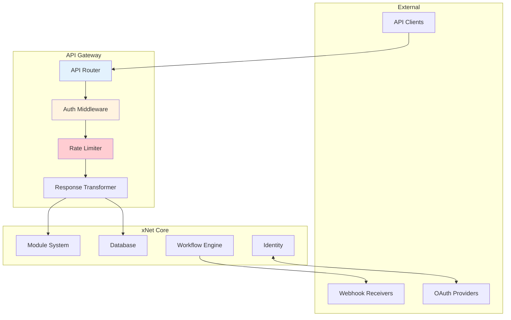

# 09: API Gateway

> REST API, webhooks, and OAuth bridge for external integrations

**Package:** `@xnet/api`
**Dependencies:** `@xnet/modules`, `@xnet/identity`, `@xnet/workflows`
**Estimated Time:** 2 weeks

## Goals

- Public REST API for external access
- OAuth 2.0 / OIDC authentication bridge
- Webhook system for event notifications
- Rate limiting and quota management
- API key management

## Architecture



## Core Types

```typescript
// packages/api/src/types.ts

export interface APIConfig {
  // Server
  host: string
  port: number
  basePath: string

  // Security
  cors: CORSConfig
  rateLimit: RateLimitConfig

  // Auth
  auth: AuthConfig

  // Features
  webhooks: WebhookConfig
  documentation: boolean
}

export interface CORSConfig {
  origins: string[]
  methods: string[]
  headers: string[]
  credentials: boolean
}

export interface RateLimitConfig {
  windowMs: number       // Time window in ms
  maxRequests: number    // Max requests per window
  keyGenerator: 'ip' | 'apiKey' | 'user'
}

export interface AuthConfig {
  methods: ('apiKey' | 'oauth' | 'ucan')[]
  apiKeys: {
    enabled: boolean
    header: string
  }
  oauth: {
    enabled: boolean
    providers: OAuthProvider[]
  }
}

export interface OAuthProvider {
  id: string
  name: string
  type: 'oauth2' | 'oidc'
  clientId: string
  clientSecret: string
  authorizationUrl: string
  tokenUrl: string
  userInfoUrl?: string
  scopes: string[]
}

export interface WebhookConfig {
  maxRetries: number
  retryDelayMs: number
  timeoutMs: number
  signatureHeader: string
}

// API Key
export interface APIKey {
  id: string
  name: string
  key: string           // hashed
  prefix: string        // first 8 chars for identification
  permissions: APIPermission[]
  rateLimit?: number
  expiresAt?: number
  createdAt: number
  lastUsedAt?: number
  createdBy: string
}

export type APIPermission =
  | 'read:databases'
  | 'write:databases'
  | 'read:records'
  | 'write:records'
  | 'read:users'
  | 'execute:workflows'
  | 'manage:webhooks'
  | '*'  // Full access
```

## API Gateway Server

```typescript
// packages/api/src/APIGateway.ts

import { Hono } from 'hono'
import { cors } from 'hono/cors'
import { compress } from 'hono/compress'
import { logger } from 'hono/logger'
import { secureHeaders } from 'hono/secure-headers'
import { swaggerUI } from '@hono/swagger-ui'

import { DatabaseManager } from '@xnet/database'
import { ModuleRegistry } from '@xnet/modules'
import { WorkflowEngine } from '@xnet/workflows'

export class APIGateway {
  private app: Hono
  private rateLimiter: RateLimiter
  private webhookDispatcher: WebhookDispatcher

  constructor(
    private config: APIConfig,
    private databaseManager: DatabaseManager,
    private moduleRegistry: ModuleRegistry,
    private workflowEngine: WorkflowEngine
  ) {
    this.app = new Hono()
    this.rateLimiter = new RateLimiter(config.rateLimit)
    this.webhookDispatcher = new WebhookDispatcher(config.webhooks)

    this.setupMiddleware()
    this.setupRoutes()
  }

  private setupMiddleware(): void {
    // Logging
    this.app.use('*', logger())

    // Compression
    this.app.use('*', compress())

    // Security headers
    this.app.use('*', secureHeaders())

    // CORS
    this.app.use('*', cors({
      origin: this.config.cors.origins,
      allowMethods: this.config.cors.methods,
      allowHeaders: this.config.cors.headers,
      credentials: this.config.cors.credentials
    }))

    // Rate limiting
    this.app.use('/api/*', async (c, next) => {
      const key = this.getRateLimitKey(c)
      const allowed = await this.rateLimiter.check(key)

      if (!allowed) {
        return c.json({
          error: 'Rate limit exceeded',
          retryAfter: this.rateLimiter.getRetryAfter(key)
        }, 429)
      }

      await next()
    })

    // Authentication
    this.app.use('/api/*', async (c, next) => {
      const auth = await this.authenticate(c)

      if (!auth.authenticated) {
        return c.json({ error: 'Unauthorized' }, 401)
      }

      c.set('auth', auth)
      await next()
    })
  }

  private setupRoutes(): void {
    // Documentation
    if (this.config.documentation) {
      this.app.get('/docs', swaggerUI({ url: '/api/openapi.json' }))
      this.app.get('/api/openapi.json', (c) => c.json(this.generateOpenAPISpec()))
    }

    // Health check
    this.app.get('/health', (c) => c.json({ status: 'ok' }))

    // API routes
    this.setupDatabaseRoutes()
    this.setupModuleRoutes()
    this.setupWorkflowRoutes()
    this.setupWebhookRoutes()
    this.setupAPIKeyRoutes()
  }

  private setupDatabaseRoutes(): void {
    const router = new Hono()

    // List databases
    router.get('/', async (c) => {
      this.requirePermission(c, 'read:databases')
      const databases = await this.databaseManager.listDatabases()
      return c.json({ databases })
    })

    // Get database schema
    router.get('/:id', async (c) => {
      this.requirePermission(c, 'read:databases')
      const database = await this.databaseManager.getDatabase(c.req.param('id'))
      if (!database) {
        return c.json({ error: 'Database not found' }, 404)
      }
      return c.json({ database: database.getSchema() })
    })

    // Query database
    router.post('/:id/query', async (c) => {
      this.requirePermission(c, 'read:records')
      const database = await this.databaseManager.getDatabase(c.req.param('id'))
      if (!database) {
        return c.json({ error: 'Database not found' }, 404)
      }

      const body = await c.req.json<QueryRequest>()
      let query = database.query()

      if (body.filter) query = query.filter(body.filter)
      if (body.sorts) {
        for (const sort of body.sorts) {
          query = query.sort(sort.field, sort.direction)
        }
      }
      if (body.limit) query = query.limit(body.limit)
      if (body.offset) query = query.offset(body.offset)

      const result = await query.execute()
      return c.json({
        records: result.records,
        total: result.totalCount,
        hasMore: result.hasMore
      })
    })

    // Get record
    router.get('/:id/records/:recordId', async (c) => {
      this.requirePermission(c, 'read:records')
      const database = await this.databaseManager.getDatabase(c.req.param('id'))
      if (!database) {
        return c.json({ error: 'Database not found' }, 404)
      }

      const record = await database.getRecord(c.req.param('recordId'))
      if (!record) {
        return c.json({ error: 'Record not found' }, 404)
      }
      return c.json({ record })
    })

    // Create record
    router.post('/:id/records', async (c) => {
      this.requirePermission(c, 'write:records')
      const database = await this.databaseManager.getDatabase(c.req.param('id'))
      if (!database) {
        return c.json({ error: 'Database not found' }, 404)
      }

      const data = await c.req.json()
      const record = await database.createRecord(data)

      // Emit event
      await this.webhookDispatcher.dispatch({
        type: 'database.row.created',
        database: c.req.param('id'),
        record
      })

      return c.json({ record }, 201)
    })

    // Update record
    router.patch('/:id/records/:recordId', async (c) => {
      this.requirePermission(c, 'write:records')
      const database = await this.databaseManager.getDatabase(c.req.param('id'))
      if (!database) {
        return c.json({ error: 'Database not found' }, 404)
      }

      const data = await c.req.json()
      await database.updateRecord(c.req.param('recordId'), data)
      const record = await database.getRecord(c.req.param('recordId'))

      // Emit event
      await this.webhookDispatcher.dispatch({
        type: 'database.row.updated',
        database: c.req.param('id'),
        record
      })

      return c.json({ record })
    })

    // Delete record
    router.delete('/:id/records/:recordId', async (c) => {
      this.requirePermission(c, 'write:records')
      const database = await this.databaseManager.getDatabase(c.req.param('id'))
      if (!database) {
        return c.json({ error: 'Database not found' }, 404)
      }

      await database.deleteRecord(c.req.param('recordId'))

      // Emit event
      await this.webhookDispatcher.dispatch({
        type: 'database.row.deleted',
        database: c.req.param('id'),
        recordId: c.req.param('recordId')
      })

      return c.json({ success: true })
    })

    this.app.route('/api/databases', router)
  }

  private setupModuleRoutes(): void {
    const router = new Hono()

    // List modules
    router.get('/', async (c) => {
      const modules = this.moduleRegistry.getActiveModules()
      return c.json({ modules: modules.map(m => ({
        id: m.id,
        name: m.name,
        version: m.version,
        description: m.description
      }))})
    })

    // Get module details
    router.get('/:id', async (c) => {
      const module = this.moduleRegistry.getModule(c.req.param('id'))
      if (!module) {
        return c.json({ error: 'Module not found' }, 404)
      }
      return c.json({ module })
    })

    // Module-specific API endpoints
    router.all('/:id/api/*', async (c) => {
      const module = this.moduleRegistry.getModule(c.req.param('id'))
      if (!module) {
        return c.json({ error: 'Module not found' }, 404)
      }

      // Delegate to module's API handler
      const path = c.req.path.replace(`/api/modules/${c.req.param('id')}/api`, '')
      const handler = module.getAPIHandler?.(path, c.req.method)

      if (!handler) {
        return c.json({ error: 'Endpoint not found' }, 404)
      }

      return handler(c)
    })

    this.app.route('/api/modules', router)
  }

  private setupWorkflowRoutes(): void {
    const router = new Hono()

    // List workflows
    router.get('/', async (c) => {
      this.requirePermission(c, 'read:databases')
      const workflows = await this.workflowEngine.listWorkflows()
      return c.json({ workflows })
    })

    // Trigger workflow manually
    router.post('/:id/trigger', async (c) => {
      this.requirePermission(c, 'execute:workflows')

      const workflow = await this.workflowEngine.getWorkflow(c.req.param('id'))
      if (!workflow) {
        return c.json({ error: 'Workflow not found' }, 404)
      }

      const input = await c.req.json()
      const execution = await this.workflowEngine.trigger(c.req.param('id'), {
        type: 'api',
        input
      })

      return c.json({ execution })
    })

    // Get workflow execution
    router.get('/executions/:id', async (c) => {
      this.requirePermission(c, 'read:databases')

      const execution = await this.workflowEngine.getExecution(c.req.param('id'))
      if (!execution) {
        return c.json({ error: 'Execution not found' }, 404)
      }

      return c.json({ execution })
    })

    this.app.route('/api/workflows', router)
  }

  private setupWebhookRoutes(): void {
    const router = new Hono()

    // List webhooks
    router.get('/', async (c) => {
      this.requirePermission(c, 'manage:webhooks')
      const webhooks = await this.webhookDispatcher.listWebhooks(c.get('auth').userId)
      return c.json({ webhooks })
    })

    // Create webhook
    router.post('/', async (c) => {
      this.requirePermission(c, 'manage:webhooks')

      const body = await c.req.json<CreateWebhookRequest>()
      const webhook = await this.webhookDispatcher.register({
        url: body.url,
        events: body.events,
        secret: body.secret || this.generateSecret(),
        userId: c.get('auth').userId
      })

      return c.json({ webhook }, 201)
    })

    // Delete webhook
    router.delete('/:id', async (c) => {
      this.requirePermission(c, 'manage:webhooks')
      await this.webhookDispatcher.unregister(c.req.param('id'))
      return c.json({ success: true })
    })

    // Webhook delivery logs
    router.get('/:id/deliveries', async (c) => {
      this.requirePermission(c, 'manage:webhooks')
      const deliveries = await this.webhookDispatcher.getDeliveries(c.req.param('id'))
      return c.json({ deliveries })
    })

    this.app.route('/api/webhooks', router)
  }

  private setupAPIKeyRoutes(): void {
    const router = new Hono()

    // List API keys
    router.get('/', async (c) => {
      const keys = await this.getAPIKeys(c.get('auth').userId)
      return c.json({ keys: keys.map(k => ({
        id: k.id,
        name: k.name,
        prefix: k.prefix,
        permissions: k.permissions,
        createdAt: k.createdAt,
        lastUsedAt: k.lastUsedAt
      }))})
    })

    // Create API key
    router.post('/', async (c) => {
      const body = await c.req.json<CreateAPIKeyRequest>()
      const { key, apiKey } = await this.createAPIKey({
        name: body.name,
        permissions: body.permissions,
        expiresAt: body.expiresAt,
        userId: c.get('auth').userId
      })

      // Return full key only once
      return c.json({
        key,  // Full key - only shown once
        apiKey: {
          id: apiKey.id,
          name: apiKey.name,
          prefix: apiKey.prefix,
          permissions: apiKey.permissions,
          createdAt: apiKey.createdAt
        }
      }, 201)
    })

    // Revoke API key
    router.delete('/:id', async (c) => {
      await this.revokeAPIKey(c.req.param('id'), c.get('auth').userId)
      return c.json({ success: true })
    })

    this.app.route('/api/keys', router)
  }

  // Authentication
  private async authenticate(c: Context): Promise<AuthResult> {
    // Try API key
    if (this.config.auth.apiKeys.enabled) {
      const apiKey = c.req.header(this.config.auth.apiKeys.header)
      if (apiKey) {
        const key = await this.validateAPIKey(apiKey)
        if (key) {
          return {
            authenticated: true,
            method: 'apiKey',
            userId: key.createdBy,
            permissions: key.permissions
          }
        }
      }
    }

    // Try Bearer token (OAuth or UCAN)
    const authHeader = c.req.header('Authorization')
    if (authHeader?.startsWith('Bearer ')) {
      const token = authHeader.slice(7)

      // Try UCAN
      const ucan = await this.validateUCAN(token)
      if (ucan) {
        return {
          authenticated: true,
          method: 'ucan',
          userId: ucan.issuer,
          permissions: ucan.capabilities
        }
      }

      // Try OAuth
      const oauth = await this.validateOAuthToken(token)
      if (oauth) {
        return {
          authenticated: true,
          method: 'oauth',
          userId: oauth.userId,
          permissions: ['*']  // Full access for OAuth users
        }
      }
    }

    return { authenticated: false }
  }

  private requirePermission(c: Context, permission: APIPermission): void {
    const auth = c.get('auth')
    if (!auth.permissions.includes(permission) && !auth.permissions.includes('*')) {
      throw new HTTPException(403, { message: 'Forbidden' })
    }
  }

  async start(): Promise<void> {
    console.log(`API Gateway starting on ${this.config.host}:${this.config.port}`)
    // Use appropriate server (Bun/Node)
    Bun.serve({
      hostname: this.config.host,
      port: this.config.port,
      fetch: this.app.fetch
    })
  }
}

interface QueryRequest {
  filter?: FilterGroup
  sorts?: { field: string; direction: 'asc' | 'desc' }[]
  limit?: number
  offset?: number
}

interface CreateWebhookRequest {
  url: string
  events: string[]
  secret?: string
}

interface CreateAPIKeyRequest {
  name: string
  permissions: APIPermission[]
  expiresAt?: number
}

interface AuthResult {
  authenticated: boolean
  method?: 'apiKey' | 'oauth' | 'ucan'
  userId?: string
  permissions?: APIPermission[]
}
```

## Rate Limiter

```typescript
// packages/api/src/RateLimiter.ts

interface RateLimitEntry {
  count: number
  resetAt: number
}

export class RateLimiter {
  private entries = new Map<string, RateLimitEntry>()

  constructor(private config: RateLimitConfig) {
    // Cleanup expired entries periodically
    setInterval(() => this.cleanup(), 60000)
  }

  async check(key: string): Promise<boolean> {
    const now = Date.now()
    let entry = this.entries.get(key)

    if (!entry || entry.resetAt <= now) {
      entry = {
        count: 0,
        resetAt: now + this.config.windowMs
      }
      this.entries.set(key, entry)
    }

    entry.count++
    return entry.count <= this.config.maxRequests
  }

  getRetryAfter(key: string): number {
    const entry = this.entries.get(key)
    if (!entry) return 0
    return Math.max(0, entry.resetAt - Date.now())
  }

  getRemainingRequests(key: string): number {
    const entry = this.entries.get(key)
    if (!entry) return this.config.maxRequests
    return Math.max(0, this.config.maxRequests - entry.count)
  }

  private cleanup(): void {
    const now = Date.now()
    for (const [key, entry] of this.entries) {
      if (entry.resetAt <= now) {
        this.entries.delete(key)
      }
    }
  }
}
```

## OAuth Bridge

```typescript
// packages/api/src/oauth/OAuthBridge.ts

import { OAuth2Client } from 'oslo/oauth2'

export class OAuthBridge {
  private clients = new Map<string, OAuth2Client>()

  constructor(private providers: OAuthProvider[]) {
    for (const provider of providers) {
      this.clients.set(provider.id, new OAuth2Client(
        provider.clientId,
        provider.authorizationUrl,
        provider.tokenUrl,
        { redirectUri: this.getRedirectUri(provider.id) }
      ))
    }
  }

  // Generate authorization URL
  getAuthorizationUrl(providerId: string, state: string): string {
    const provider = this.providers.find(p => p.id === providerId)
    const client = this.clients.get(providerId)

    if (!provider || !client) {
      throw new Error(`Unknown provider: ${providerId}`)
    }

    return client.createAuthorizationUrl({
      state,
      scopes: provider.scopes
    }).toString()
  }

  // Exchange code for tokens
  async exchangeCode(
    providerId: string,
    code: string
  ): Promise<OAuthTokens> {
    const provider = this.providers.find(p => p.id === providerId)
    const client = this.clients.get(providerId)

    if (!provider || !client) {
      throw new Error(`Unknown provider: ${providerId}`)
    }

    const tokens = await client.validateAuthorizationCode(code, {
      credentials: provider.clientSecret,
      authenticateWith: 'request_body'
    })

    return {
      accessToken: tokens.accessToken,
      refreshToken: tokens.refreshToken,
      expiresAt: tokens.accessTokenExpiresAt?.getTime()
    }
  }

  // Get user info
  async getUserInfo(
    providerId: string,
    accessToken: string
  ): Promise<OAuthUserInfo> {
    const provider = this.providers.find(p => p.id === providerId)

    if (!provider?.userInfoUrl) {
      throw new Error(`User info not supported for: ${providerId}`)
    }

    const response = await fetch(provider.userInfoUrl, {
      headers: {
        Authorization: `Bearer ${accessToken}`
      }
    })

    if (!response.ok) {
      throw new Error(`Failed to get user info: ${response.status}`)
    }

    const data = await response.json()

    return {
      id: data.sub || data.id,
      email: data.email,
      name: data.name || data.display_name,
      avatar: data.picture || data.avatar_url
    }
  }

  private getRedirectUri(providerId: string): string {
    return `${process.env.API_BASE_URL}/oauth/callback/${providerId}`
  }
}

interface OAuthTokens {
  accessToken: string
  refreshToken?: string
  expiresAt?: number
}

interface OAuthUserInfo {
  id: string
  email?: string
  name?: string
  avatar?: string
}
```

## OpenAPI Specification Generator

```typescript
// packages/api/src/openapi/OpenAPIGenerator.ts

import { OpenAPIV3 } from 'openapi-types'

export class OpenAPIGenerator {
  generate(): OpenAPIV3.Document {
    return {
      openapi: '3.0.3',
      info: {
        title: 'xNet API',
        description: 'REST API for xNet workspace',
        version: '1.0.0',
        contact: {
          name: 'xNet Support',
          url: 'https://xnet.dev'
        }
      },
      servers: [
        {
          url: 'http://localhost:3741',
          description: 'Local API'
        }
      ],
      security: [
        { apiKey: [] },
        { bearerAuth: [] }
      ],
      paths: {
        '/api/databases': {
          get: {
            tags: ['Databases'],
            summary: 'List all databases',
            responses: {
              '200': {
                description: 'List of databases',
                content: {
                  'application/json': {
                    schema: {
                      type: 'object',
                      properties: {
                        databases: {
                          type: 'array',
                          items: { $ref: '#/components/schemas/Database' }
                        }
                      }
                    }
                  }
                }
              }
            }
          }
        },
        '/api/databases/{id}/query': {
          post: {
            tags: ['Databases'],
            summary: 'Query database records',
            parameters: [
              {
                name: 'id',
                in: 'path',
                required: true,
                schema: { type: 'string' }
              }
            ],
            requestBody: {
              content: {
                'application/json': {
                  schema: { $ref: '#/components/schemas/QueryRequest' }
                }
              }
            },
            responses: {
              '200': {
                description: 'Query results',
                content: {
                  'application/json': {
                    schema: { $ref: '#/components/schemas/QueryResponse' }
                  }
                }
              }
            }
          }
        },
        '/api/databases/{id}/records': {
          post: {
            tags: ['Records'],
            summary: 'Create a record',
            parameters: [
              {
                name: 'id',
                in: 'path',
                required: true,
                schema: { type: 'string' }
              }
            ],
            requestBody: {
              content: {
                'application/json': {
                  schema: { type: 'object' }
                }
              }
            },
            responses: {
              '201': {
                description: 'Record created',
                content: {
                  'application/json': {
                    schema: {
                      type: 'object',
                      properties: {
                        record: { type: 'object' }
                      }
                    }
                  }
                }
              }
            }
          }
        },
        '/api/webhooks': {
          get: {
            tags: ['Webhooks'],
            summary: 'List webhooks',
            responses: {
              '200': {
                description: 'List of webhooks'
              }
            }
          },
          post: {
            tags: ['Webhooks'],
            summary: 'Create webhook',
            requestBody: {
              content: {
                'application/json': {
                  schema: { $ref: '#/components/schemas/CreateWebhook' }
                }
              }
            },
            responses: {
              '201': {
                description: 'Webhook created'
              }
            }
          }
        }
      },
      components: {
        securitySchemes: {
          apiKey: {
            type: 'apiKey',
            in: 'header',
            name: 'X-API-Key'
          },
          bearerAuth: {
            type: 'http',
            scheme: 'bearer'
          }
        },
        schemas: {
          Database: {
            type: 'object',
            properties: {
              id: { type: 'string' },
              name: { type: 'string' },
              properties: {
                type: 'array',
                items: { $ref: '#/components/schemas/Property' }
              }
            }
          },
          Property: {
            type: 'object',
            properties: {
              id: { type: 'string' },
              name: { type: 'string' },
              type: { type: 'string' }
            }
          },
          QueryRequest: {
            type: 'object',
            properties: {
              filter: { type: 'object' },
              sorts: {
                type: 'array',
                items: {
                  type: 'object',
                  properties: {
                    field: { type: 'string' },
                    direction: { type: 'string', enum: ['asc', 'desc'] }
                  }
                }
              },
              limit: { type: 'integer' },
              offset: { type: 'integer' }
            }
          },
          QueryResponse: {
            type: 'object',
            properties: {
              records: { type: 'array', items: { type: 'object' } },
              total: { type: 'integer' },
              hasMore: { type: 'boolean' }
            }
          },
          CreateWebhook: {
            type: 'object',
            required: ['url', 'events'],
            properties: {
              url: { type: 'string', format: 'uri' },
              events: { type: 'array', items: { type: 'string' } },
              secret: { type: 'string' }
            }
          }
        }
      }
    }
  }
}
```

## File Structure

```
packages/api/
├── src/
│   ├── index.ts
│   ├── types.ts
│   ├── APIGateway.ts
│   ├── RateLimiter.ts
│   ├── middleware/
│   │   ├── auth.ts
│   │   ├── cors.ts
│   │   ├── rateLimit.ts
│   │   └── errorHandler.ts
│   ├── routes/
│   │   ├── databases.ts
│   │   ├── modules.ts
│   │   ├── workflows.ts
│   │   ├── webhooks.ts
│   │   └── keys.ts
│   ├── oauth/
│   │   ├── OAuthBridge.ts
│   │   └── providers/
│   │       ├── google.ts
│   │       ├── github.ts
│   │       └── microsoft.ts
│   ├── webhooks/
│   │   ├── WebhookDispatcher.ts
│   │   └── WebhookDelivery.ts
│   └── openapi/
│       └── OpenAPIGenerator.ts
├── tests/
│   ├── gateway.test.ts
│   ├── rateLimit.test.ts
│   ├── oauth.test.ts
│   └── webhooks.test.ts
└── package.json
```

## Validation Checklist

```markdown
## API Gateway Validation

### Authentication
- [ ] API key authentication works
- [ ] OAuth flow completes
- [ ] UCAN validation works
- [ ] Invalid tokens rejected
- [ ] Permissions enforced

### Database Endpoints
- [ ] List databases
- [ ] Get database schema
- [ ] Query with filters
- [ ] Query with sorts
- [ ] Query with pagination
- [ ] Create record
- [ ] Update record
- [ ] Delete record

### Rate Limiting
- [ ] Rate limits enforced
- [ ] Retry-After header set
- [ ] Different limits per key tier

### Webhooks
- [ ] Create webhook
- [ ] List webhooks
- [ ] Delete webhook
- [ ] Events delivered
- [ ] Signature verification
- [ ] Retry on failure

### API Keys
- [ ] Create API key
- [ ] List API keys
- [ ] Revoke API key
- [ ] Permissions respected

### Documentation
- [ ] Swagger UI accessible
- [ ] OpenAPI spec generated
- [ ] Examples provided

### Security
- [ ] CORS configured correctly
- [ ] Security headers set
- [ ] Input validation
- [ ] Error messages don't leak info
```

---

[← Back to Finance Module](./08-finance-module.md) | [Next: Enterprise Features →](./10-enterprise-features.md)
