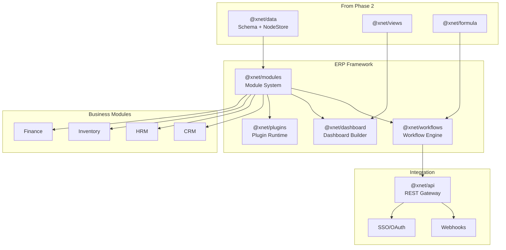

# xNet Implementation Plan - Step 03: ERP Platform

> AI-agent-actionable implementation guide for Phase 3

> **Architecture Update (Jan 2026):**
>
> - `@xnet/database` → Use `@xnet/data` (Schema system + NodeStore)
> - `@xnet/records` → Removed (consolidated into `@xnet/data`)
> - `DatabaseItem` → `Node`
> - `Database` → `Schema`
> - Sync uses **Lamport timestamps** with LWW per property (not vector clocks)
> - Import types from `@xnet/data`, hooks from `@xnet/react`

## Prerequisites

Before starting this phase, ensure planStep02DatabasePlatform is complete:

- [x] Schema system with 16 property types (COMPLETE in @xnet/data)
- [x] NodeStore with LWW conflict resolution (COMPLETE)
- [x] React hooks: useNode, useNodes, useNodeSync (COMPLETE)
- [ ] All 6 view types functional (table, board, gallery, timeline, calendar, list)
- [ ] Formula engine with 40+ functions
- [ ] Vector search operational
- [ ] Infinite canvas with auto-layout
- [ ] > 80% test coverage on packages

## Implementation Order

Execute these documents in order. Each builds on the previous.

| #   | Document                                           | Description                              | Est. Time |
| --- | -------------------------------------------------- | ---------------------------------------- | --------- |
| 00  | [Overview](./00-overview.md)                       | Architecture, prerequisites, goals       | Reference |
| 01  | [Module System](./01-module-system.md)             | Module definitions, lifecycle, registry  | 3 weeks   |
| 02  | [Workflow Engine](./02-workflow-engine.md)         | Triggers, conditions, actions, execution | 4 weeks   |
| 03  | [Dashboard Builder](./03-dashboard-builder.md)     | Widget system, drag-drop, data binding   | 3 weeks   |
| 04  | [Plugin System](./04-plugin-system.md)             | Sandboxing, permissions, marketplace     | 3 weeks   |
| 05  | [CRM Module](./05-crm-module.md)                   | Contacts, companies, deals, pipeline     | 3 weeks   |
| 06  | [HRM Module](./06-hrm-module.md)                   | Employees, recruiting, payroll           | 3 weeks   |
| 07  | [Inventory Module](./07-inventory-module.md)       | Products, warehouses, stock movements    | 3 weeks   |
| 08  | [Finance Module](./08-finance-module.md)           | Invoicing, expenses, budgets             | 3 weeks   |
| 09  | [API Gateway](./09-api-gateway.md)                 | REST API, webhooks, OAuth                | 2 weeks   |
| 10  | [Enterprise Features](./10-enterprise-features.md) | SSO, audit logging, RBAC                 | 3 weeks   |
| 11  | [Timeline](./11-timeline.md)                       | Development schedule and milestones      | Reference |

## Validation Gates

### After Module System

- [ ] Modules load and unload cleanly
- [ ] Module dependencies resolve correctly
- [ ] Module lifecycle hooks fire
- [ ] Hot-reload works in development
- [ ] Tests pass (>80% coverage)

### After Workflow Engine

- [ ] All trigger types functional
- [ ] Conditions evaluate correctly
- [ ] Actions execute reliably
- [ ] Sandboxed scripts run safely
- [ ] Workflow execution is async and cancelable

### After Dashboard Builder

- [ ] Drag-drop widget placement works
- [ ] All widget types render correctly
- [ ] Data binding refreshes live
- [ ] Dashboards persist and load
- [ ] Cross-filtering between widgets works

### After Plugin System

- [ ] Plugins load in sandboxed iframe
- [ ] Permission requests work
- [ ] Plugin API is accessible
- [ ] Malicious plugins are contained
- [ ] Plugin marketplace browsing works

### After Business Modules

- [ ] CRM pipeline view functional
- [ ] HRM employee management works
- [ ] Inventory stock tracking accurate
- [ ] Finance invoicing generates PDFs
- [ ] All modules integrate with workflows

### After Enterprise Features

- [ ] SAML SSO login works
- [ ] Audit logs capture all actions
- [ ] RBAC permissions enforced
- [ ] Multi-tenant isolation verified

## Quick Reference

### Package Dependencies (New)

```
@xnet/modules ───> @xnet/data, @xnet/storage
@xnet/workflows ─> @xnet/modules, @xnet/data
@xnet/dashboard ─> @xnet/modules, @xnet/views
@xnet/plugins ───> @xnet/modules (sandboxed)
@xnet/api ───────> @xnet/modules, @xnet/identity
```

### Key Types

```typescript
// Module System
ModuleId = `mod:${string}`
ModuleVersion = `${number}.${number}.${number}`

// Workflows
WorkflowId = `wf:${string}`
ExecutionId = `exec:${string}`
TriggerType = 'manual' | 'schedule' | 'property_change' | 'node_create' | 'webhook'

// Plugins
PluginId = `plugin:${string}`
PluginPermission = 'read:nodes' | 'write:nodes' | 'network' | 'notifications'
```

### Test Commands

```bash
pnpm test                           # All tests
pnpm --filter @xnet/modules test    # Module system
pnpm --filter @xnet/workflows test  # Workflow engine
pnpm --filter @xnet/dashboard test  # Dashboard builder
pnpm --filter @xnet/plugins test    # Plugin system
pnpm test:coverage                  # With coverage
```

## Architecture Overview



## Goal

Transform xNet into a fully customizable ERP platform (like Tesla's Warp Drive):

- **v2.5 (Month 30)**: Module framework, CRM/HRM, basic workflows
- **v3.0 (Month 36)**: All modules, full workflows, plugin marketplace, enterprise features
- **Target**: 500+ Enterprise Deployments

---

[Back to planStep02DatabasePlatform](../planStep02DatabasePlatform/README.md) | [Start with Overview →](./00-overview.md)
