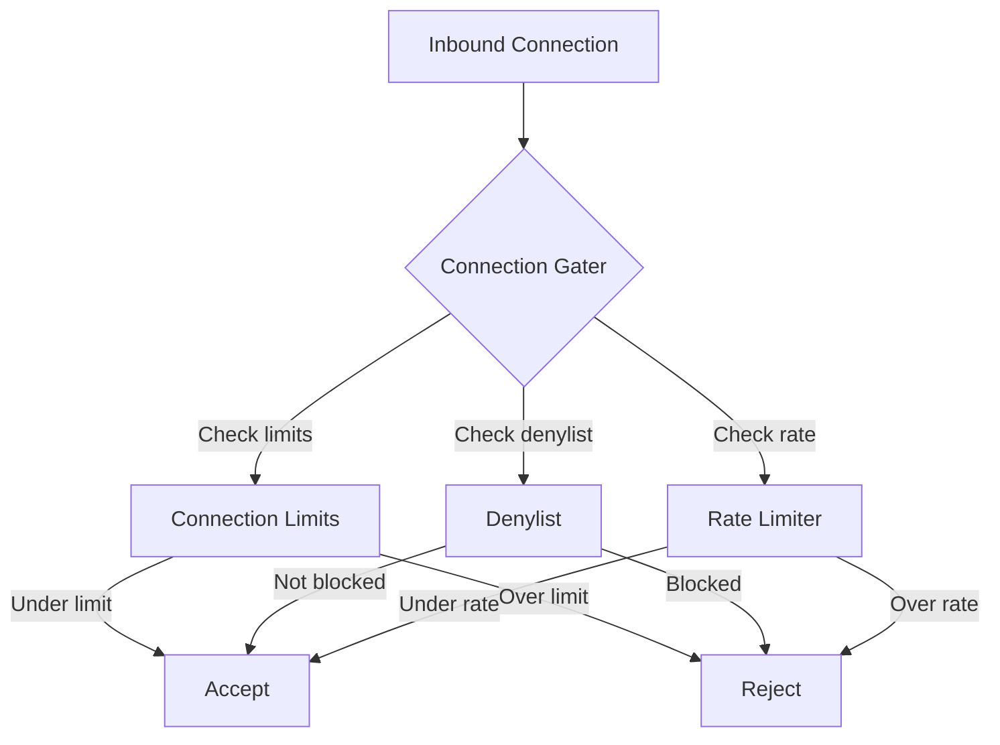

# 07: Connection Limits

> Resource limits to prevent connection/stream exhaustion attacks

**Duration:** 2 days  
**Dependencies:** `@xnet/network` existing infrastructure

## Overview

Connection limits are the first line of defense against DoS attacks. They prevent attackers from:

- Exhausting memory with too many connections
- Exhausting file descriptors
- Overwhelming CPU with too many streams

Inspired by [libp2p Resource Manager](https://docs.libp2p.io/concepts/security/dos-mitigation/).



## Implementation

### Connection Limits Configuration

```typescript
// packages/network/src/security/limits.ts

/**
 * Connection and resource limits.
 */
export interface ConnectionLimits {
  // ============ Connection Limits ============

  /** Maximum total connections (default: 100) */
  maxConnections: number

  /** Maximum connections per peer (default: 2) */
  maxConnectionsPerPeer: number

  /** Maximum connections from same IP (default: 5) */
  maxConnectionsPerIP: number

  /** Maximum pending (negotiating) connections (default: 20) */
  maxPendingConnections: number

  // ============ Stream Limits ============

  /** Maximum streams per connection (default: 100) */
  maxStreamsPerConnection: number

  /** Maximum inbound streams per connection (default: 50) */
  maxInboundStreamsPerConnection: number

  /** Maximum streams per protocol (default: 20) */
  maxStreamsPerProtocol: number

  // ============ Rate Limits ============

  /** Maximum new connections per minute (default: 30) */
  maxConnectionsPerMinute: number

  /** Maximum new streams per minute per connection (default: 60) */
  maxStreamsPerMinute: number

  // ============ Timeouts ============

  /** Connection handshake timeout in ms (default: 30000) */
  connectionTimeout: number

  /** Stream idle timeout in ms (default: 60000) */
  streamIdleTimeout: number

  /** Pending connection timeout in ms (default: 10000) */
  pendingTimeout: number

  // ============ Memory Limits ============

  /** Maximum memory per connection in bytes (default: 16MB) */
  maxMemoryPerConnection: number

  /** Maximum total memory for connections in bytes (default: 256MB) */
  maxTotalMemory: number
}

/**
 * Default connection limits (conservative).
 */
export const DEFAULT_LIMITS: ConnectionLimits = {
  // Connections
  maxConnections: 100,
  maxConnectionsPerPeer: 2,
  maxConnectionsPerIP: 5,
  maxPendingConnections: 20,

  // Streams
  maxStreamsPerConnection: 100,
  maxInboundStreamsPerConnection: 50,
  maxStreamsPerProtocol: 20,

  // Rates
  maxConnectionsPerMinute: 30,
  maxStreamsPerMinute: 60,

  // Timeouts
  connectionTimeout: 30_000,
  streamIdleTimeout: 60_000,
  pendingTimeout: 10_000,

  // Memory
  maxMemoryPerConnection: 16 * 1024 * 1024, // 16MB
  maxTotalMemory: 256 * 1024 * 1024 // 256MB
}

/**
 * Stricter limits for resource-constrained environments.
 */
export const STRICT_LIMITS: ConnectionLimits = {
  ...DEFAULT_LIMITS,
  maxConnections: 50,
  maxConnectionsPerPeer: 1,
  maxConnectionsPerIP: 3,
  maxPendingConnections: 10,
  maxStreamsPerConnection: 50,
  maxConnectionsPerMinute: 15
}

/**
 * Relaxed limits for trusted environments.
 */
export const RELAXED_LIMITS: ConnectionLimits = {
  ...DEFAULT_LIMITS,
  maxConnections: 200,
  maxConnectionsPerPeer: 4,
  maxConnectionsPerIP: 10,
  maxPendingConnections: 50,
  maxStreamsPerConnection: 200,
  maxConnectionsPerMinute: 60
}
```

### Connection Tracker

```typescript
// packages/network/src/security/tracker.ts

import type { PeerId } from '@xnet/core'
import type { ConnectionLimits } from './limits'

interface ConnectionInfo {
  peerId: PeerId
  ip: string
  connectedAt: Date
  streamCount: number
  memoryUsage: number
}

/**
 * Tracks active connections and enforces limits.
 */
export class ConnectionTracker {
  private connections = new Map<string, ConnectionInfo>()
  private pendingConnections = new Set<string>()
  private connectionsByPeer = new Map<PeerId, Set<string>>()
  private connectionsByIP = new Map<string, Set<string>>()
  private recentConnections: Array<{ timestamp: number; ip: string }> = []

  constructor(private limits: ConnectionLimits) {}

  // ============ Limit Checks ============

  /**
   * Check if a new connection can be accepted.
   */
  canAcceptConnection(peerId: PeerId, ip: string): { allowed: boolean; reason?: string } {
    // Check total connections
    if (this.connections.size >= this.limits.maxConnections) {
      return { allowed: false, reason: 'max_connections_reached' }
    }

    // Check pending connections
    if (this.pendingConnections.size >= this.limits.maxPendingConnections) {
      return { allowed: false, reason: 'max_pending_connections_reached' }
    }

    // Check per-peer limit
    const peerConnections = this.connectionsByPeer.get(peerId)
    if (peerConnections && peerConnections.size >= this.limits.maxConnectionsPerPeer) {
      return { allowed: false, reason: 'max_connections_per_peer_reached' }
    }

    // Check per-IP limit
    const ipConnections = this.connectionsByIP.get(ip)
    if (ipConnections && ipConnections.size >= this.limits.maxConnectionsPerIP) {
      return { allowed: false, reason: 'max_connections_per_ip_reached' }
    }

    // Check rate limit
    const recentCount = this.getRecentConnectionCount(ip)
    if (recentCount >= this.limits.maxConnectionsPerMinute) {
      return { allowed: false, reason: 'connection_rate_exceeded' }
    }

    return { allowed: true }
  }

  /**
   * Check if a new stream can be opened.
   */
  canOpenStream(connectionId: string, protocol?: string): { allowed: boolean; reason?: string } {
    const conn = this.connections.get(connectionId)
    if (!conn) {
      return { allowed: false, reason: 'connection_not_found' }
    }

    // Check per-connection limit
    if (conn.streamCount >= this.limits.maxStreamsPerConnection) {
      return { allowed: false, reason: 'max_streams_per_connection_reached' }
    }

    // TODO: Track per-protocol streams

    return { allowed: true }
  }

  // ============ Connection Lifecycle ============

  /**
   * Mark a connection as pending (negotiating).
   */
  addPending(connectionId: string): void {
    this.pendingConnections.add(connectionId)

    // Auto-remove after timeout
    setTimeout(() => {
      if (this.pendingConnections.has(connectionId)) {
        this.pendingConnections.delete(connectionId)
      }
    }, this.limits.pendingTimeout)
  }

  /**
   * Register a successfully established connection.
   */
  addConnection(connectionId: string, peerId: PeerId, ip: string): void {
    // Remove from pending
    this.pendingConnections.delete(connectionId)

    // Add to active connections
    this.connections.set(connectionId, {
      peerId,
      ip,
      connectedAt: new Date(),
      streamCount: 0,
      memoryUsage: 0
    })

    // Track by peer
    let peerConns = this.connectionsByPeer.get(peerId)
    if (!peerConns) {
      peerConns = new Set()
      this.connectionsByPeer.set(peerId, peerConns)
    }
    peerConns.add(connectionId)

    // Track by IP
    let ipConns = this.connectionsByIP.get(ip)
    if (!ipConns) {
      ipConns = new Set()
      this.connectionsByIP.set(ip, ipConns)
    }
    ipConns.add(connectionId)

    // Track for rate limiting
    this.recentConnections.push({ timestamp: Date.now(), ip })
    this.pruneRecentConnections()
  }

  /**
   * Remove a closed connection.
   */
  removeConnection(connectionId: string): void {
    const conn = this.connections.get(connectionId)
    if (!conn) return

    this.connections.delete(connectionId)

    // Update peer tracking
    const peerConns = this.connectionsByPeer.get(conn.peerId)
    if (peerConns) {
      peerConns.delete(connectionId)
      if (peerConns.size === 0) {
        this.connectionsByPeer.delete(conn.peerId)
      }
    }

    // Update IP tracking
    const ipConns = this.connectionsByIP.get(conn.ip)
    if (ipConns) {
      ipConns.delete(connectionId)
      if (ipConns.size === 0) {
        this.connectionsByIP.delete(conn.ip)
      }
    }
  }

  /**
   * Update stream count for a connection.
   */
  updateStreamCount(connectionId: string, delta: number): void {
    const conn = this.connections.get(connectionId)
    if (conn) {
      conn.streamCount = Math.max(0, conn.streamCount + delta)
    }
  }

  // ============ Stats ============

  /**
   * Get current connection statistics.
   */
  getStats(): ConnectionStats {
    return {
      totalConnections: this.connections.size,
      pendingConnections: this.pendingConnections.size,
      uniquePeers: this.connectionsByPeer.size,
      uniqueIPs: this.connectionsByIP.size,
      connectionsPerMinute: this.getRecentConnectionCount()
    }
  }

  // ============ Private ============

  private getRecentConnectionCount(ip?: string): number {
    const oneMinuteAgo = Date.now() - 60_000
    return this.recentConnections.filter((c) => c.timestamp > oneMinuteAgo && (!ip || c.ip === ip))
      .length
  }

  private pruneRecentConnections(): void {
    const oneMinuteAgo = Date.now() - 60_000
    this.recentConnections = this.recentConnections.filter((c) => c.timestamp > oneMinuteAgo)
  }
}

export interface ConnectionStats {
  totalConnections: number
  pendingConnections: number
  uniquePeers: number
  uniqueIPs: number
  connectionsPerMinute: number
}
```

### Connection Gater

```typescript
// packages/network/src/security/gater.ts

import type { PeerId, Multiaddr } from '@xnet/core'
import type { ConnectionLimits } from './limits'
import { ConnectionTracker } from './tracker'
import { logSecurityEvent } from './logging'

/**
 * Connection gater interface.
 * Decides whether to accept/reject connections.
 */
export interface ConnectionGater {
  /** Called before accepting inbound connection */
  interceptAccept(addr: Multiaddr): boolean | Promise<boolean>

  /** Called before dialing outbound */
  interceptDial(peerId: PeerId, addr: Multiaddr): boolean | Promise<boolean>

  /** Called after security negotiation */
  interceptSecured(peerId: PeerId, direction: 'inbound' | 'outbound'): boolean | Promise<boolean>

  /** Called before opening a stream */
  interceptStream(peerId: PeerId, protocol: string): boolean | Promise<boolean>
}

/**
 * Default connection gater implementation.
 */
export class DefaultConnectionGater implements ConnectionGater {
  private tracker: ConnectionTracker
  private denylist = new Set<string>() // PeerIds and IPs
  private allowlist = new Set<string>() // PeerIds (bypass limits)

  constructor(
    private limits: ConnectionLimits,
    options?: {
      denylist?: string[]
      allowlist?: string[]
    }
  ) {
    this.tracker = new ConnectionTracker(limits)

    if (options?.denylist) {
      for (const id of options.denylist) {
        this.denylist.add(id)
      }
    }

    if (options?.allowlist) {
      for (const id of options.allowlist) {
        this.allowlist.add(id)
      }
    }
  }

  // ============ Gating Methods ============

  async interceptAccept(addr: Multiaddr): Promise<boolean> {
    const ip = extractIP(addr)
    if (!ip) return true // Can't extract IP, allow

    // Check IP denylist
    if (this.denylist.has(ip)) {
      logSecurityEvent({
        eventType: 'connection_flood',
        severity: 'medium',
        peerIdHash: '',
        details: JSON.stringify({ ip, reason: 'denylisted' }),
        actionTaken: 'blocked'
      })
      return false
    }

    return true
  }

  async interceptDial(peerId: PeerId, addr: Multiaddr): Promise<boolean> {
    // Check peer denylist
    if (this.denylist.has(peerId)) {
      return false
    }

    return true
  }

  async interceptSecured(peerId: PeerId, direction: 'inbound' | 'outbound'): Promise<boolean> {
    // Check peer denylist
    if (this.denylist.has(peerId)) {
      logSecurityEvent({
        eventType: 'connection_flood',
        severity: 'medium',
        peerIdHash: hashPeerId(peerId),
        details: JSON.stringify({ direction, reason: 'denylisted' }),
        actionTaken: 'blocked'
      })
      return false
    }

    // Allowlisted peers bypass limits
    if (this.allowlist.has(peerId)) {
      return true
    }

    // Check connection limits
    // Note: IP would need to be passed from earlier stage
    const check = this.tracker.canAcceptConnection(peerId, 'unknown')
    if (!check.allowed) {
      logSecurityEvent({
        eventType: 'connection_flood',
        severity: 'low',
        peerIdHash: hashPeerId(peerId),
        details: JSON.stringify({ direction, reason: check.reason }),
        actionTaken: 'blocked'
      })
      return false
    }

    return true
  }

  async interceptStream(peerId: PeerId, protocol: string): Promise<boolean> {
    // Get connection ID for this peer
    // Note: This is a simplified version; real implementation would track connection IDs
    const connectionId = `conn-${peerId}`

    const check = this.tracker.canOpenStream(connectionId, protocol)
    if (!check.allowed) {
      logSecurityEvent({
        eventType: 'stream_exhaustion',
        severity: 'low',
        peerIdHash: hashPeerId(peerId),
        details: JSON.stringify({ protocol, reason: check.reason }),
        actionTaken: 'blocked'
      })
      return false
    }

    return true
  }

  // ============ Denylist Management ============

  addToDenylist(id: string, options?: { duration?: number }): void {
    this.denylist.add(id)

    if (options?.duration) {
      setTimeout(() => this.denylist.delete(id), options.duration)
    }
  }

  removeFromDenylist(id: string): void {
    this.denylist.delete(id)
  }

  // ============ Allowlist Management ============

  addToAllowlist(peerId: PeerId): void {
    this.allowlist.add(peerId)
  }

  removeFromAllowlist(peerId: PeerId): void {
    this.allowlist.delete(peerId)
  }

  // ============ Stats ============

  getStats() {
    return {
      ...this.tracker.getStats(),
      denylistSize: this.denylist.size,
      allowlistSize: this.allowlist.size
    }
  }
}

// ============ Helpers ============

function extractIP(addr: Multiaddr): string | null {
  // Extract IP from multiaddr
  // e.g., /ip4/192.168.1.1/tcp/4001 -> 192.168.1.1
  const parts = addr.toString().split('/')
  const ipIndex = parts.findIndex((p) => p === 'ip4' || p === 'ip6')
  return ipIndex >= 0 ? parts[ipIndex + 1] : null
}

function hashPeerId(peerId: PeerId): string {
  // Hash the peer ID for privacy in logs
  // In real implementation, use proper hashing
  return peerId.slice(0, 16) + '...'
}
```

## Integration with libp2p

```typescript
// packages/network/src/node.ts (modifications)

import { DefaultConnectionGater, DEFAULT_LIMITS } from './security'

export interface NetworkNodeOptions {
  // ... existing options ...

  /** Connection limits (optional) */
  limits?: Partial<ConnectionLimits>

  /** Initial denylist */
  denylist?: string[]

  /** Initial allowlist (bypass limits) */
  allowlist?: string[]
}

export async function createNetworkNode(options: NetworkNodeOptions) {
  const limits = { ...DEFAULT_LIMITS, ...options.limits }
  const gater = new DefaultConnectionGater(limits, {
    denylist: options.denylist,
    allowlist: options.allowlist
  })

  // Configure libp2p with gater
  const node = await createLibp2p({
    // ... existing config ...
    connectionGater: {
      denyDialPeer: (peerId) => gater.interceptDial(peerId, null as any),
      denyInboundConnection: (addr) => !gater.interceptAccept(addr)
      // ... other gating methods
    },
    connectionManager: {
      maxConnections: limits.maxConnections,
      minConnections: 10
    }
  })

  return { node, gater }
}
```

## Tests

```typescript
// packages/network/test/limits.test.ts

import { describe, it, expect, beforeEach } from 'vitest'
import { ConnectionTracker } from '../src/security/tracker'
import { DEFAULT_LIMITS } from '../src/security/limits'

describe('ConnectionTracker', () => {
  let tracker: ConnectionTracker

  beforeEach(() => {
    tracker = new ConnectionTracker(DEFAULT_LIMITS)
  })

  describe('canAcceptConnection', () => {
    it('should allow connections under limit', () => {
      const result = tracker.canAcceptConnection('peer1', '192.168.1.1')
      expect(result.allowed).toBe(true)
    })

    it('should reject when max connections reached', () => {
      // Fill up to limit
      for (let i = 0; i < DEFAULT_LIMITS.maxConnections; i++) {
        tracker.addConnection(`conn-${i}`, `peer-${i}`, `192.168.${i}.1`)
      }

      const result = tracker.canAcceptConnection('new-peer', '10.0.0.1')
      expect(result.allowed).toBe(false)
      expect(result.reason).toBe('max_connections_reached')
    })

    it('should reject when per-peer limit reached', () => {
      const peerId = 'peer1'

      // Fill per-peer limit
      for (let i = 0; i < DEFAULT_LIMITS.maxConnectionsPerPeer; i++) {
        tracker.addConnection(`conn-${i}`, peerId, `192.168.1.${i}`)
      }

      const result = tracker.canAcceptConnection(peerId, '192.168.1.100')
      expect(result.allowed).toBe(false)
      expect(result.reason).toBe('max_connections_per_peer_reached')
    })

    it('should reject when per-IP limit reached', () => {
      const ip = '192.168.1.1'

      // Fill per-IP limit
      for (let i = 0; i < DEFAULT_LIMITS.maxConnectionsPerIP; i++) {
        tracker.addConnection(`conn-${i}`, `peer-${i}`, ip)
      }

      const result = tracker.canAcceptConnection('new-peer', ip)
      expect(result.allowed).toBe(false)
      expect(result.reason).toBe('max_connections_per_ip_reached')
    })
  })

  describe('removeConnection', () => {
    it('should free up slots when connection removed', () => {
      // Fill up
      for (let i = 0; i < DEFAULT_LIMITS.maxConnections; i++) {
        tracker.addConnection(`conn-${i}`, `peer-${i}`, `192.168.${i}.1`)
      }

      // Remove one
      tracker.removeConnection('conn-0')

      // Should allow new connection
      const result = tracker.canAcceptConnection('new-peer', '10.0.0.1')
      expect(result.allowed).toBe(true)
    })
  })
})
```

## Checklist

- [ ] Define ConnectionLimits interface
- [ ] Create DEFAULT_LIMITS, STRICT_LIMITS, RELAXED_LIMITS presets
- [ ] Implement ConnectionTracker class
- [ ] Implement connection limit checks
- [ ] Implement per-peer limits
- [ ] Implement per-IP limits
- [ ] Implement rate limiting
- [ ] Implement stream limits
- [ ] Create ConnectionGater interface
- [ ] Implement DefaultConnectionGater
- [ ] Add denylist/allowlist management
- [ ] Integrate with libp2p configuration
- [ ] Write comprehensive tests
- [ ] Tests pass

---

[Back to README](./README.md) | [Previous: React Hooks](./06-react-hooks.md) | [Next: Rate Limiting](./08-rate-limiting.md)
