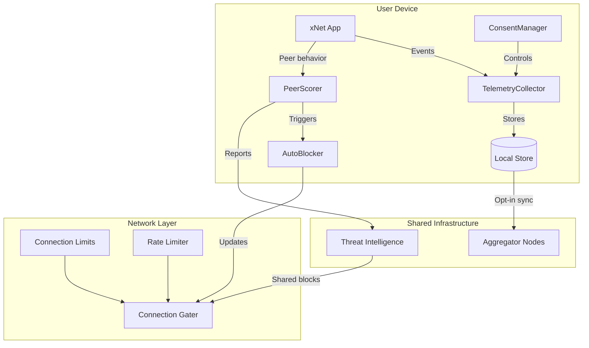

# xNet Implementation Plan - Step 03.1: Telemetry & Network Security

> Privacy-preserving observability and decentralized attack mitigation

## Executive Summary

This plan adds telemetry and network security capabilities to xNet while maintaining its privacy-first, user-sovereign principles. The key insight is that **telemetry is just another Node type** - we leverage the existing schema system, sync infrastructure, and UCAN permissions.

```typescript
// Telemetry uses the same patterns as user data
const crash = await store.create({
  schemaId: 'xnet://xnet.dev/telemetry/CrashReport',
  properties: {
    errorType: 'RangeError',
    errorMessage: 'Invalid array length',
    appVersion: '1.2.3',
    platform: 'macos'
  }
})

// User controls what gets shared
telemetry.setConsent({ tier: 'crashes', reviewBeforeSend: true })
```

## Design Principles

| Principle                | Implementation                                          |
| ------------------------ | ------------------------------------------------------- |
| **User sovereignty**     | Opt-in tiers, inspectable schemas, instant deletion     |
| **Local-first**          | All telemetry stored locally first; sharing is separate |
| **No silent collection** | Zero telemetry without explicit consent                 |
| **Privacy-preserving**   | Bucketed values, no persistent IDs, scrubbed PII        |
| **Future-proof**         | Infrastructure enables Web of Trust, AI detection later |

## Architecture Overview



## Implementation Phases

### Phase 1: Telemetry Foundation (Week 1-2)

| Task | Document                                             | Description                                            |
| ---- | ---------------------------------------------------- | ------------------------------------------------------ |
| 1.1  | [01-telemetry-package.md](./01-telemetry-package.md) | Create `@xnet/telemetry` package structure             |
| 1.2  | [02-telemetry-schemas.md](./02-telemetry-schemas.md) | Define CrashReport, UsageMetric, SecurityEvent schemas |
| 1.3  | [03-consent-manager.md](./03-consent-manager.md)     | Tiered consent system with persistence                 |

**Validation Gate:**

- [ ] Telemetry schemas defined and registered
- [ ] ConsentManager persists user preferences
- [ ] Telemetry respects consent tier
- [ ] All tests pass (>80% coverage)

### Phase 2: Collection & Scrubbing (Week 2-3)

| Task | Document                                                         | Description                           |
| ---- | ---------------------------------------------------------------- | ------------------------------------- |
| 2.1  | [04-telemetry-collector.md](./04-telemetry-collector.md)         | TelemetryCollector with local storage |
| 2.2  | [05-scrubbing-and-bucketing.md](./05-scrubbing-and-bucketing.md) | PII scrubbing, P3A-style bucketing    |
| 2.3  | [06-react-hooks.md](./06-react-hooks.md)                         | useTelemetry, useConsent hooks        |

**Validation Gate:**

- [ ] PII automatically scrubbed (paths, emails, IPs)
- [ ] Numeric values bucketed (no exact counts)
- [ ] React hooks work in xNet app
- [ ] User can view/delete their telemetry

### Phase 3: Network Security Foundation (Week 3-4)

| Task | Document                                             | Description                                 |
| ---- | ---------------------------------------------------- | ------------------------------------------- |
| 3.1  | [07-connection-limits.md](./07-connection-limits.md) | Connection/stream limits in `@xnet/network` |
| 3.2  | [08-rate-limiting.md](./08-rate-limiting.md)         | Token bucket rate limiter for sync          |
| 3.3  | [09-security-logging.md](./09-security-logging.md)   | Canonical security event logging            |

**Validation Gate:**

- [ ] Connection limits prevent resource exhaustion
- [ ] Rate limiting throttles aggressive peers
- [ ] Security logs in fail2ban-compatible format
- [ ] No performance regression for honest peers

### Phase 4: Peer Reputation (Week 4-5)

| Task | Document                                               | Description                            |
| ---- | ------------------------------------------------------ | -------------------------------------- |
| 4.1  | [10-peer-scoring.md](./10-peer-scoring.md)             | GossipSub-inspired peer scoring        |
| 4.2  | [11-auto-blocking.md](./11-auto-blocking.md)           | Automatic blocking based on thresholds |
| 4.3  | [12-allowlist-denylist.md](./12-allowlist-denylist.md) | Workspace-level peer access control    |

**Validation Gate:**

- [ ] Peer scores computed from behavior
- [ ] Low-score peers automatically blocked
- [ ] Users can manage allow/deny lists
- [ ] Blocked peers cannot sync

### Phase 5: Integration & Polish (Week 5-6)

| Task | Document                                               | Description                                     |
| ---- | ------------------------------------------------------ | ----------------------------------------------- |
| 5.1  | [13-telemetry-sync.md](./13-telemetry-sync.md)         | Opt-in telemetry sharing with aggregators       |
| 5.2  | [14-security-dashboard.md](./14-security-dashboard.md) | UI for security status and management           |
| 5.3  | [15-future-work.md](./15-future-work.md)               | Web of Trust, AI detection, shared threat intel |

**Validation Gate:**

- [ ] Telemetry syncs to aggregators (when consented)
- [ ] Security dashboard shows network health
- [ ] Documentation complete
- [ ] All tests pass

## Package Structure

```
packages/
├── telemetry/                    # NEW: Telemetry collection & consent
│   └── src/
│       ├── index.ts
│       ├── schemas/              # Telemetry schemas
│       │   ├── crash.ts          # CrashReport schema
│       │   ├── usage.ts          # UsageMetric schema
│       │   ├── security.ts       # SecurityEvent schema
│       │   └── performance.ts    # PerformanceMetric schema
│       ├── collection/
│       │   ├── collector.ts      # TelemetryCollector class
│       │   ├── scrubbing.ts      # PII scrubbing utilities
│       │   ├── bucketing.ts      # P3A-style value bucketing
│       │   └── timing.ts         # Random delay utilities
│       ├── consent/
│       │   ├── manager.ts        # ConsentManager class
│       │   ├── tiers.ts          # TelemetryTier types
│       │   └── storage.ts        # Consent persistence
│       └── hooks/
│           ├── useTelemetry.ts   # React hook for reporting
│           └── useConsent.ts     # React hook for consent UI
│
├── network/                      # MODIFIED: Add security features
│   └── src/
│       ├── security/             # NEW: Security subsystem
│       │   ├── limits.ts         # Connection/stream limits
│       │   ├── rate-limiter.ts   # Token bucket rate limiter
│       │   ├── gater.ts          # Connection gater
│       │   ├── peer-scorer.ts    # Peer reputation scoring
│       │   ├── auto-blocker.ts   # Automatic blocking
│       │   └── logging.ts        # Security event logging
│       └── ...existing files
│
├── react/                        # MODIFIED: Add telemetry hooks
│   └── src/
│       └── hooks/
│           ├── useTelemetry.ts   # Re-export from @xnet/telemetry
│           └── useNetworkSecurity.ts  # Security status hook
```

## Key Types

```typescript
// Consent tiers (progressive)
type TelemetryTier =
  | 'off'           // No collection
  | 'local'         // Local storage only
  | 'crashes'       // + crash reports shared
  | 'anonymous'     // + anonymous usage metrics
  | 'identified'    // + stable identifier (beta testers)

// Peer score (GossipSub-inspired)
interface PeerScore {
  peerId: PeerId
  score: number                    // -100 to +100
  syncSuccessRate: number          // 0-1
  validDataRate: number            // 0-1
  invalidSignatures: number        // Penalty counter
  lastUpdated: Date
}

// Security event (fail2ban compatible)
interface SecurityEvent {
  eventType: 'invalid_signature' | 'rate_limit_exceeded' | 'connection_flood' | ...
  severity: 'low' | 'medium' | 'high' | 'critical'
  peerIdHash: string               // Anonymized
  actionTaken: 'none' | 'warned' | 'throttled' | 'blocked'
  timestamp: Date
}
```

## Success Criteria

After completing this plan:

1. **Telemetry works** - Crashes and usage tracked locally
2. **User controls data** - Consent tiers respected, deletion works
3. **Privacy preserved** - No PII leaked, values bucketed
4. **Network protected** - DoS attacks mitigated automatically
5. **Peers scored** - Bad actors identified and blocked
6. **Logs useful** - fail2ban integration works
7. **Tests pass** - >80% coverage on new code
8. **Future-ready** - Infrastructure supports Web of Trust, AI

## What's NOT in This Plan

These are explicitly deferred to [15-future-work.md](./15-future-work.md):

- **Web of Trust** - Social graph-based trust propagation
- **AI-assisted detection** - ML models for attack classification
- **Federated threat intel** - Privacy-preserving threat sharing
- **Aggregator nodes** - Server-side telemetry aggregation
- **Developer dashboards** - Telemetry visualization for app devs
- **Differential privacy** - Noise addition for aggregate queries

The current plan focuses on **local-first foundations** that make these future enhancements straightforward.

## Dependencies

| Package                    | Depends On                                  |
| -------------------------- | ------------------------------------------- |
| `@xnet/telemetry`          | `@xnet/data`, `@xnet/core`, `@xnet/storage` |
| `@xnet/network` (security) | `@xnet/core`, `@xnet/crypto`                |
| `@xnet/react` (hooks)      | `@xnet/telemetry`, `@xnet/network`          |

## Quick Start

1. **Start with Phase 1.1** - Create `@xnet/telemetry` package
2. **Run tests after each change** - `pnpm test`
3. **Test in xNet** - Verify consent UI and telemetry collection
4. **Add security incrementally** - Connection limits first, then scoring

---

## Reference Documents

- [TELEMETRY_DESIGN.md](../TELEMETRY_DESIGN.md) - Full design exploration with research
- [libp2p DoS Mitigation](https://docs.libp2p.io/concepts/security/dos-mitigation/) - Connection limits, fail2ban
- [Brave P3A](https://brave.com/privacy-preserving-product-analytics-p3a/) - Privacy-preserving analytics

---

[Back to Main Plan](../plan/README.md) | [Start Implementation](./01-telemetry-package.md)
