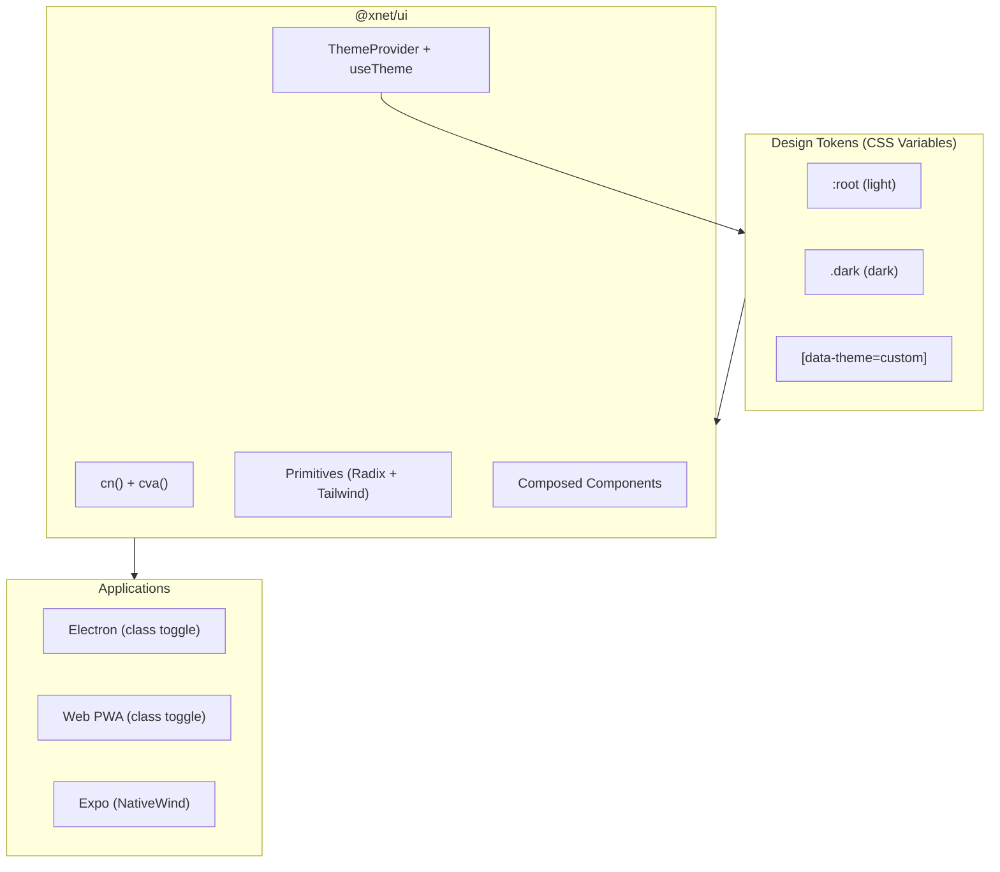

# xNet Implementation Plan - Step 03.1.1: shadcn-Style Component System

> Unified design tokens, dark/light mode, and shadcn-pattern components across all platforms

## Executive Summary

The current UI system has critical inconsistencies: hardcoded colors in shared components, mismatched dark mode strategies, disconnected CSS variables, and no theme toggle. This plan migrates `@xnet/ui` to shadcn's design token pattern - a single CSS variable layer that all components reference, with proper dark/light mode support across Electron, Web, and Expo.

**This is NOT "install shadcn"** - it's adopting shadcn's architecture patterns (HSL tokens, CVA variants, consistent Radix wrappers) while keeping our monorepo structure and cross-platform support.

```typescript
// Before: hardcoded colors that break in dark mode
<button className="bg-blue-600 text-white hover:bg-blue-700">

// After: semantic tokens that respond to theme
<button className="bg-primary text-primary-foreground hover:bg-primary/90">
```

## Problems This Solves

| Problem                  | Current State                                | After                                      |
| ------------------------ | -------------------------------------------- | ------------------------------------------ |
| Components in dark mode  | Hardcoded `bg-white`, `text-gray-900`        | Semantic `bg-card`, `text-card-foreground` |
| Inconsistent darkMode    | Web: `'media'`, Electron: `'class'` (unused) | All: `'class'` with ThemeProvider          |
| Different primary colors | Electron: `#646cff`, Web: `#0066cc`          | Unified HSL token: `--primary`             |
| No theme toggle          | None                                         | `useTheme()` hook + toggle component       |
| Variant patterns         | Inline object literals                       | `class-variance-authority` (CVA)           |
| Duplicated cn()          | In `@xnet/ui` and `@xnet/editor`             | Single export from `@xnet/ui`              |
| Missing components       | No Tabs, ScrollArea, Sheet, etc.             | Full set for devtools + editor             |

## Architecture Overview



## Design Principles

| Principle                 | Implementation                                                                    |
| ------------------------- | --------------------------------------------------------------------------------- |
| **Semantic tokens**       | Never use raw Tailwind palette (`gray-500`); always semantic (`muted-foreground`) |
| **HSL format**            | All colors as `H S% L%` for opacity modifiers (`bg-primary/80`)                   |
| **Foreground pairing**    | Every background token has a matching `*-foreground` for text                     |
| **Class-based dark mode** | `.dark` class on `<html>` enables dark theme everywhere                           |
| **CVA for variants**      | All component variants use `class-variance-authority`                             |
| **Copy-paste friendly**   | Components are self-contained, easy to understand and modify                      |

## Implementation Phases

### Phase 1: Design Tokens & Theme Foundation (Week 1)

| Task | Document                                     | Description                                             |
| ---- | -------------------------------------------- | ------------------------------------------------------- |
| 1.1  | [01-design-tokens.md](./01-design-tokens.md) | Define HSL color system, CSS variables, Tailwind config |

**Validation Gate:**

- [x] Single `globals.css` with `:root` and `.dark` token sets
- [x] All Tailwind configs reference the same token set
- [x] `darkMode: 'class'` in all Tailwind configs
- [x] Colors work with Tailwind opacity modifiers (`bg-primary/50`)

### Phase 2: Utilities & Variant System (Week 1)

| Task | Document                             | Description                                               |
| ---- | ------------------------------------ | --------------------------------------------------------- |
| 2.1  | [02-utilities.md](./02-utilities.md) | Consolidate cn(), add CVA, define shared variant patterns |

**Validation Gate:**

- [x] Single `cn()` export from `@xnet/ui`
- [x] `cva()` available for all components
- [x] Editor package imports cn from @xnet/ui (no duplicate)
- [x] Variant types are exported for consumer use

### Phase 3: Migrate Existing Primitives (Week 1-2)

| Task | Document                                                 | Description                                                     |
| ---- | -------------------------------------------------------- | --------------------------------------------------------------- |
| 3.1  | [03-primitive-migration.md](./03-primitive-migration.md) | Convert all 10 existing primitives to use semantic tokens + CVA |

**Validation Gate:**

- [x] Button uses `bg-primary text-primary-foreground` (not `bg-blue-600 text-white`)
- [x] Modal uses `bg-card text-card-foreground` (not `bg-white text-gray-900`)
- [x] Select uses semantic border/bg tokens
- [x] All primitives render correctly in both light and dark mode
- [x] No raw palette colors (`gray-*`, `blue-*`, `white`) in primitives

### Phase 4: New Primitives (Week 2)

| Task | Document                                       | Description                                                           |
| ---- | ---------------------------------------------- | --------------------------------------------------------------------- |
| 4.1  | [04-new-primitives.md](./04-new-primitives.md) | Add Tabs, ScrollArea, Sheet, Separator, Command, Badge variants, etc. |

**Validation Gate:**

- [x] Tabs component works for devtools panel navigation
- [x] ScrollArea provides custom-styled scrollbars
- [x] Sheet component for mobile slide-out panels
- [x] Separator for visual dividers
- [x] All new primitives use semantic tokens
- [x] All new primitives support dark mode

### Phase 5: App Theming & Toggle (Week 2-3)

| Task | Document                                 | Description                                                     |
| ---- | ---------------------------------------- | --------------------------------------------------------------- |
| 5.1  | [05-app-theming.md](./05-app-theming.md) | ThemeProvider, useTheme hook, theme toggle, per-app integration |

**Validation Gate:**

- [x] ThemeProvider manages `.dark` class on `<html>`
- [x] useTheme() returns `{ theme, setTheme, toggleTheme }`
- [x] Theme persists across sessions (localStorage)
- [ ] Electron app has theme toggle in titlebar/menu
- [ ] Web app has theme toggle
- [ ] Expo app respects system theme with optional override
- [x] System preference is respected as default

### Phase 6: DevTools-Specific Components (Week 3)

| Task | Document                                                 | Description                                                        |
| ---- | -------------------------------------------------------- | ------------------------------------------------------------------ |
| 6.1  | [06-devtools-components.md](./06-devtools-components.md) | ResizablePanel, TreeView, StatusDot, LogEntry, KeyValue, CodeBlock |

**Validation Gate:**

- [x] ResizablePanel works for devtools shell
- [x] TreeView renders Y.Doc and Node hierarchies
- [x] StatusDot shows connection states (green/yellow/red)
- [x] All devtools components use semantic tokens
- [x] Components render well in the always-dark devtools panel

## Token Architecture

### shadcn's HSL Pattern (What We're Adopting)

```css
:root {
  --background: 0 0% 100%; /* white */
  --foreground: 222.2 84% 4.9%; /* near-black */
  --primary: 222.2 47.4% 11.2%; /* dark blue */
  --primary-foreground: 210 40% 98%; /* near-white */
  /* ... */
}

.dark {
  --background: 222.2 84% 4.9%; /* near-black */
  --foreground: 210 40% 98%; /* near-white */
  --primary: 210 40% 98%; /* near-white */
  --primary-foreground: 222.2 47.4% 11.2%; /* dark blue */
  /* ... */
}
```

### Usage in Tailwind

```javascript
// tailwind.config.js
colors: {
  background: 'hsl(var(--background))',
  foreground: 'hsl(var(--foreground))',
  primary: {
    DEFAULT: 'hsl(var(--primary))',
    foreground: 'hsl(var(--primary-foreground))',
  },
  // ...
}
```

### Usage in Components

```tsx
// Semantic, theme-aware, opacity-compatible
<div className="bg-background text-foreground">
  <button className="bg-primary text-primary-foreground hover:bg-primary/90">Click me</button>
  <p className="text-muted-foreground">Secondary text</p>
</div>
```

## Full Token Set

| Token                      | Purpose               | Light           | Dark                 |
| -------------------------- | --------------------- | --------------- | -------------------- |
| `--background`             | Page background       | white           | near-black           |
| `--foreground`             | Page text             | near-black      | near-white           |
| `--card`                   | Card/panel background | white           | dark gray            |
| `--card-foreground`        | Card text             | near-black      | near-white           |
| `--popover`                | Popover/dropdown bg   | white           | dark gray            |
| `--popover-foreground`     | Popover text          | near-black      | near-white           |
| `--primary`                | Primary actions       | brand blue      | brand blue (lighter) |
| `--primary-foreground`     | Text on primary       | white           | near-black           |
| `--secondary`              | Secondary actions     | light gray      | dark gray            |
| `--secondary-foreground`   | Text on secondary     | dark            | light                |
| `--muted`                  | Muted backgrounds     | very light gray | very dark gray       |
| `--muted-foreground`       | Muted text            | medium gray     | medium gray          |
| `--accent`                 | Hover/active states   | light gray      | dark gray            |
| `--accent-foreground`      | Text on accent        | dark            | light                |
| `--destructive`            | Error/danger          | red             | red                  |
| `--destructive-foreground` | Text on destructive   | white           | white                |
| `--border`                 | Default borders       | light gray      | dark gray            |
| `--input`                  | Input borders         | light gray      | dark gray            |
| `--ring`                   | Focus rings           | brand blue      | brand blue           |
| `--radius`                 | Border radius         | 0.5rem          | 0.5rem               |

## Package Structure After Migration

```
packages/ui/
├── src/
│   ├── index.ts                    # All exports
│   ├── utils.ts                    # cn() + cva re-export
│   │
│   ├── primitives/
│   │   ├── Button.tsx              # Migrated: CVA + semantic tokens
│   │   ├── Input.tsx               # Migrated
│   │   ├── Select.tsx              # Migrated
│   │   ├── Checkbox.tsx            # Migrated
│   │   ├── Modal.tsx               # Migrated (renamed Dialog?)
│   │   ├── Popover.tsx             # Migrated
│   │   ├── Menu.tsx                # Migrated (DropdownMenu)
│   │   ├── Tooltip.tsx             # Migrated
│   │   ├── Badge.tsx               # Migrated with variants
│   │   ├── IconButton.tsx          # Migrated
│   │   ├── Tabs.tsx                # NEW
│   │   ├── ScrollArea.tsx          # NEW
│   │   ├── Sheet.tsx               # NEW
│   │   ├── Separator.tsx           # NEW
│   │   ├── Command.tsx             # NEW (for slash commands)
│   │   ├── Switch.tsx              # NEW
│   │   ├── Accordion.tsx           # NEW
│   │   ├── Collapsible.tsx         # NEW
│   │   └── ResizablePanel.tsx      # NEW (for devtools)
│   │
│   ├── composed/
│   │   ├── DatePicker.tsx          # Migrated
│   │   ├── ColorPicker.tsx         # Migrated
│   │   ├── TagInput.tsx            # Migrated
│   │   ├── SearchInput.tsx         # Migrated
│   │   ├── EmptyState.tsx          # Migrated
│   │   ├── Skeleton.tsx            # Migrated
│   │   └── ThemeToggle.tsx         # NEW
│   │
│   ├── theme/
│   │   ├── ThemeProvider.tsx       # NEW: class toggle + persistence
│   │   ├── useTheme.ts            # NEW: hook
│   │   └── tokens.css             # NEW: CSS variable definitions
│   │
│   └── hooks/
│       ├── useClickOutside.ts
│       ├── useDebounce.ts
│       └── useKeyboardShortcut.ts
│
├── package.json
└── tailwind.config.js              # Updated: semantic tokens
```

## Dependencies

| Package                        | Version  | Purpose             | Change |
| ------------------------------ | -------- | ------------------- | ------ |
| `class-variance-authority`     | ^0.7     | Variant composition | NEW    |
| `@radix-ui/react-tabs`         | ^1.1     | Tabs primitive      | NEW    |
| `@radix-ui/react-scroll-area`  | ^1.2     | ScrollArea          | NEW    |
| `@radix-ui/react-separator`    | ^1.1     | Separator           | NEW    |
| `@radix-ui/react-switch`       | ^1.1     | Switch toggle       | NEW    |
| `@radix-ui/react-accordion`    | ^1.2     | Accordion           | NEW    |
| `@radix-ui/react-collapsible`  | ^1.1     | Collapsible         | NEW    |
| `react-resizable-panels`       | ^2.0     | Resizable panels    | NEW    |
| `cmdk`                         | ^1.0     | Command palette     | NEW    |
| `clsx`                         | existing | Class merging       | KEEP   |
| `tailwind-merge`               | existing | Tailwind dedup      | KEEP   |
| `@radix-ui/react-*` (existing) | existing | Primitives          | KEEP   |

## Success Criteria

1. **All components use semantic tokens** - No raw palette colors in `@xnet/ui`
2. **Dark mode works everywhere** - Toggle between light/dark in all apps
3. **Single source of truth** - One `tokens.css` defines all colors
4. **CVA patterns** - All variants use class-variance-authority
5. **New primitives available** - Tabs, ScrollArea, Sheet, Separator, etc.
6. **Devtools ready** - ResizablePanel and TreeView work for planStep03_2_2
7. **No visual regressions** - Apps look the same (or better) after migration

## Reference

- [shadcn/ui Theming](https://ui.shadcn.com/docs/theming) - Token architecture
- [shadcn/ui Components](https://ui.shadcn.com/docs/components) - Component patterns
- [CVA Documentation](https://cva.style/docs) - Variant composition
- [planStep03_2_2 DevTools](../planStep03_2_2DevTools/README.md) - Components needed

---

[Start Implementation](./01-design-tokens.md)
