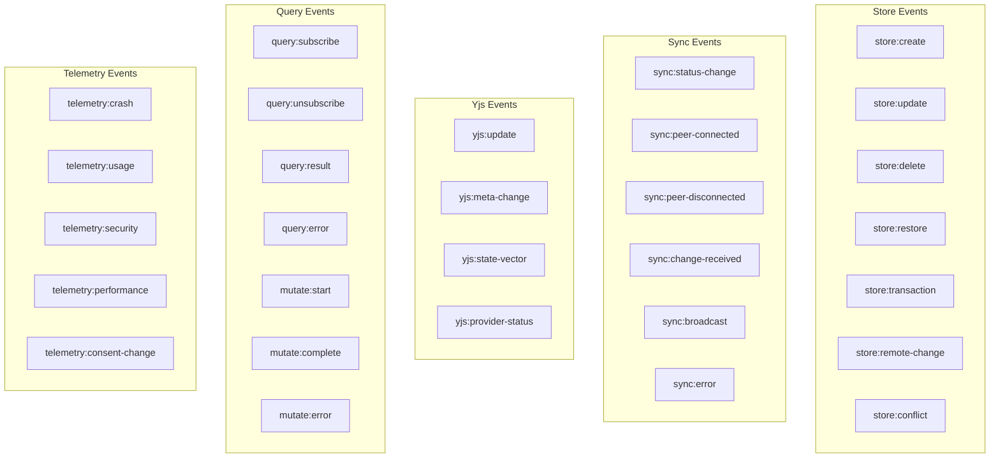

# 02 - Event Bus & Instrumentation

> A typed, memory-bounded event bus that passively captures all xNet protocol events

## Overview

The DevToolsEventBus is the central nervous system of the devtools. It receives typed events from instrumentation wrappers around NodeStore, SyncProvider, Y.Doc, and React hooks. Events are stored in a ring buffer with configurable capacity, enabling panels to subscribe to live events and replay history.

## Event Type Hierarchy



## Type Definitions

```typescript
// core/types.ts

import type { NodeState, NodeChange, MergeConflict } from '@xnet/data'
import type { Change, SyncStatus, PeerInfo, LamportTimestamp } from '@xnet/sync'

// ─── Base Event ────────────────────────────────────────────

export interface DevToolsEventBase {
  id: string // unique event ID (monotonic counter)
  timestamp: number // performance.now() for ordering
  wallTime: number // Date.now() for display
}

// ─── Store Events ──────────────────────────────────────────

export interface StoreCreateEvent extends DevToolsEventBase {
  type: 'store:create'
  nodeId: string
  schemaId: string
  properties: Record<string, unknown>
  lamport: LamportTimestamp
  duration: number // ms for the operation
}

export interface StoreUpdateEvent extends DevToolsEventBase {
  type: 'store:update'
  nodeId: string
  properties: Record<string, unknown>
  lamport: LamportTimestamp
  duration: number
}

export interface StoreDeleteEvent extends DevToolsEventBase {
  type: 'store:delete'
  nodeId: string
  duration: number
}

export interface StoreRestoreEvent extends DevToolsEventBase {
  type: 'store:restore'
  nodeId: string
  duration: number
}

export interface StoreTransactionEvent extends DevToolsEventBase {
  type: 'store:transaction'
  operations: Array<{ type: string; nodeId: string }>
  batchId: string
  duration: number
}

export interface StoreRemoteChangeEvent extends DevToolsEventBase {
  type: 'store:remote-change'
  change: NodeChange
  nodeId: string
  peerId?: string
  isRemote: true
}

export interface StoreConflictEvent extends DevToolsEventBase {
  type: 'store:conflict'
  conflict: MergeConflict
}

// ─── Sync Events ───────────────────────────────────────────

export interface SyncStatusEvent extends DevToolsEventBase {
  type: 'sync:status-change'
  room: string
  previousStatus: SyncStatus
  newStatus: SyncStatus
}

export interface SyncPeerConnectedEvent extends DevToolsEventBase {
  type: 'sync:peer-connected'
  peer: PeerInfo
  room: string
  totalPeers: number
}

export interface SyncPeerDisconnectedEvent extends DevToolsEventBase {
  type: 'sync:peer-disconnected'
  peerId: string
  room: string
  totalPeers: number
}

export interface SyncChangeReceivedEvent extends DevToolsEventBase {
  type: 'sync:change-received'
  changeId: string
  peerId: string
  lamport: LamportTimestamp
  room: string
}

export interface SyncBroadcastEvent extends DevToolsEventBase {
  type: 'sync:broadcast'
  changeId: string
  lamport: LamportTimestamp
  room: string
}

export interface SyncErrorEvent extends DevToolsEventBase {
  type: 'sync:error'
  error: string
  room: string
}

// ─── Yjs Events ────────────────────────────────────────────

export interface YjsUpdateEvent extends DevToolsEventBase {
  type: 'yjs:update'
  docId: string
  updateSize: number // bytes
  origin: string | null
  isLocal: boolean
}

export interface YjsMetaChangeEvent extends DevToolsEventBase {
  type: 'yjs:meta-change'
  docId: string
  keysChanged: string[]
  origin: string | null
  isLocal: boolean
}

export interface YjsStateVectorEvent extends DevToolsEventBase {
  type: 'yjs:state-vector'
  docId: string
  entries: Array<{ clientId: number; clock: number }>
  encodedSize: number
}

export interface YjsProviderStatusEvent extends DevToolsEventBase {
  type: 'yjs:provider-status'
  docId: string
  connected: boolean
  peerCount: number
}

// ─── Query Events ──────────────────────────────────────────

export interface QuerySubscribeEvent extends DevToolsEventBase {
  type: 'query:subscribe'
  queryId: string
  schemaId: string
  mode: 'list' | 'single' | 'filtered'
  filter?: Record<string, unknown>
}

export interface QueryUnsubscribeEvent extends DevToolsEventBase {
  type: 'query:unsubscribe'
  queryId: string
}

export interface QueryResultEvent extends DevToolsEventBase {
  type: 'query:result'
  queryId: string
  resultCount: number
  duration: number
}

export interface QueryErrorEvent extends DevToolsEventBase {
  type: 'query:error'
  queryId: string
  error: string
}

export interface MutateStartEvent extends DevToolsEventBase {
  type: 'mutate:start'
  mutationId: string
  operation: 'create' | 'update' | 'delete' | 'restore' | 'transaction'
  nodeId?: string
  schemaId?: string
}

export interface MutateCompleteEvent extends DevToolsEventBase {
  type: 'mutate:complete'
  mutationId: string
  duration: number
  success: boolean
}

export interface MutateErrorEvent extends DevToolsEventBase {
  type: 'mutate:error'
  mutationId: string
  error: string
}

// ─── Telemetry Events ──────────────────────────────────────

export interface TelemetryCrashEvent extends DevToolsEventBase {
  type: 'telemetry:crash'
  errorType: string
  errorMessage: string
  component?: string
}

export interface TelemetryUsageEvent extends DevToolsEventBase {
  type: 'telemetry:usage'
  metric: string
  bucket: string
  period: string
}

export interface TelemetrySecurityEvent extends DevToolsEventBase {
  type: 'telemetry:security'
  eventType: string
  severity: string
  actionTaken: string
}

export interface TelemetryPerformanceEvent extends DevToolsEventBase {
  type: 'telemetry:performance'
  metric: string
  bucket: string
}

export interface TelemetryConsentEvent extends DevToolsEventBase {
  type: 'telemetry:consent-change'
  tier: string
  previousTier: string
}

// ─── Union Type ────────────────────────────────────────────

export type DevToolsEvent =
  | StoreCreateEvent
  | StoreUpdateEvent
  | StoreDeleteEvent
  | StoreRestoreEvent
  | StoreTransactionEvent
  | StoreRemoteChangeEvent
  | StoreConflictEvent
  | SyncStatusEvent
  | SyncPeerConnectedEvent
  | SyncPeerDisconnectedEvent
  | SyncChangeReceivedEvent
  | SyncBroadcastEvent
  | SyncErrorEvent
  | YjsUpdateEvent
  | YjsMetaChangeEvent
  | YjsStateVectorEvent
  | YjsProviderStatusEvent
  | QuerySubscribeEvent
  | QueryUnsubscribeEvent
  | QueryResultEvent
  | QueryErrorEvent
  | MutateStartEvent
  | MutateCompleteEvent
  | MutateErrorEvent
  | TelemetryCrashEvent
  | TelemetryUsageEvent
  | TelemetrySecurityEvent
  | TelemetryPerformanceEvent
  | TelemetryConsentEvent

export type DevToolsEventType = DevToolsEvent['type']
```

## Ring Buffer Implementation

```typescript
// core/event-bus.ts

import type { DevToolsEvent, DevToolsEventType } from './types'

export interface DevToolsEventBusOptions {
  maxEvents?: number // Ring buffer capacity (default: 10_000)
  paused?: boolean // Start paused
}

type EventListener = (event: DevToolsEvent) => void
type TypedListener<T extends DevToolsEventType> = (
  event: Extract<DevToolsEvent, { type: T }>
) => void

export class DevToolsEventBus {
  private buffer: DevToolsEvent[]
  private head = 0 // Next write position
  private count = 0 // Current event count
  private nextId = 0 // Monotonic ID counter
  private paused = false

  private globalListeners = new Set<EventListener>()
  private typedListeners = new Map<DevToolsEventType, Set<EventListener>>()

  constructor(private options: DevToolsEventBusOptions = {}) {
    const capacity = options.maxEvents ?? 10_000
    this.buffer = new Array(capacity)
    this.paused = options.paused ?? false
  }

  // ─── Emitting ──────────────────────────────────────────

  emit(event: Omit<DevToolsEvent, 'id' | 'timestamp' | 'wallTime'>): void {
    if (this.paused) return

    const fullEvent: DevToolsEvent = {
      ...event,
      id: String(this.nextId++),
      timestamp: performance.now(),
      wallTime: Date.now()
    } as DevToolsEvent

    // Write to ring buffer
    const capacity = this.buffer.length
    this.buffer[this.head] = fullEvent
    this.head = (this.head + 1) % capacity
    this.count = Math.min(this.count + 1, capacity)

    // Notify listeners
    this.globalListeners.forEach((fn) => {
      try {
        fn(fullEvent)
      } catch (e) {
        console.error('[DevTools] Listener error:', e)
      }
    })

    const typed = this.typedListeners.get(fullEvent.type as DevToolsEventType)
    typed?.forEach((fn) => {
      try {
        fn(fullEvent)
      } catch (e) {
        console.error('[DevTools] Listener error:', e)
      }
    })
  }

  // ─── Subscribing ───────────────────────────────────────

  /** Subscribe to all events */
  subscribe(listener: EventListener): () => void {
    this.globalListeners.add(listener)
    return () => this.globalListeners.delete(listener)
  }

  /** Subscribe to a specific event type */
  on<T extends DevToolsEventType>(type: T, listener: TypedListener<T>): () => void {
    if (!this.typedListeners.has(type)) {
      this.typedListeners.set(type, new Set())
    }
    this.typedListeners.get(type)!.add(listener as EventListener)
    return () => this.typedListeners.get(type)?.delete(listener as EventListener)
  }

  // ─── Querying ──────────────────────────────────────────

  /** Get all events in chronological order */
  getEvents(): DevToolsEvent[] {
    if (this.count === 0) return []
    const capacity = this.buffer.length

    if (this.count < capacity) {
      // Buffer not full yet - events are 0..head-1
      return this.buffer.slice(0, this.count)
    }

    // Buffer is full - read from head (oldest) wrapping around
    return [...this.buffer.slice(this.head), ...this.buffer.slice(0, this.head)]
  }

  /** Get events of a specific type */
  getEventsByType<T extends DevToolsEventType>(type: T): Extract<DevToolsEvent, { type: T }>[] {
    return this.getEvents().filter((e) => e.type === type) as Extract<DevToolsEvent, { type: T }>[]
  }

  /** Get events for a specific node */
  getEventsForNode(nodeId: string): DevToolsEvent[] {
    return this.getEvents().filter(
      (e) => ('nodeId' in e && e.nodeId === nodeId) || ('docId' in e && e.docId === nodeId)
    )
  }

  /** Get the last N events */
  getRecent(n: number): DevToolsEvent[] {
    const all = this.getEvents()
    return all.slice(-n)
  }

  // ─── Control ───────────────────────────────────────────

  pause(): void {
    this.paused = true
  }
  resume(): void {
    this.paused = false
  }
  get isPaused(): boolean {
    return this.paused
  }

  clear(): void {
    this.buffer = new Array(this.buffer.length)
    this.head = 0
    this.count = 0
  }

  get size(): number {
    return this.count
  }
  get capacity(): number {
    return this.buffer.length
  }
}
```

## Instrumentation Wrappers

### Store Instrumentation

```typescript
// instrumentation/store.ts

import type { NodeStore, NodeChangeEvent } from '@xnet/data'
import type { DevToolsEventBus } from '../core/event-bus'

export function instrumentStore(store: NodeStore, bus: DevToolsEventBus): () => void {
  // Listen to all store changes via the existing subscribe mechanism
  const unsubscribe = store.subscribe((event: NodeChangeEvent) => {
    const { change, node, isRemote } = event
    const payload = change.payload as Record<string, unknown>

    if (isRemote) {
      bus.emit({
        type: 'store:remote-change',
        change,
        nodeId: payload.nodeId as string,
        isRemote: true
      })
    } else {
      // Determine operation type from change
      const nodeId = payload.nodeId as string
      const isCreate = payload.schemaId && !payload.deleted
      const isDelete = payload.deleted === true
      const isRestore = payload.deleted === false && !payload.schemaId

      if (isCreate) {
        bus.emit({
          type: 'store:create',
          nodeId,
          schemaId: payload.schemaId as string,
          properties: (payload.properties || {}) as Record<string, unknown>,
          lamport: change.lamport,
          duration: 0 // TODO: measure
        })
      } else if (isDelete) {
        bus.emit({ type: 'store:delete', nodeId, duration: 0 })
      } else if (isRestore) {
        bus.emit({ type: 'store:restore', nodeId, duration: 0 })
      } else {
        bus.emit({
          type: 'store:update',
          nodeId,
          properties: (payload.properties || {}) as Record<string, unknown>,
          lamport: change.lamport,
          duration: 0
        })
      }
    }
  })

  // Poll for conflicts
  const conflictInterval = setInterval(() => {
    const conflicts = store.getRecentConflicts?.()
    if (conflicts?.length) {
      conflicts.forEach((conflict) => {
        bus.emit({ type: 'store:conflict', conflict })
      })
      store.clearConflicts?.()
    }
  }, 2000)

  return () => {
    unsubscribe()
    clearInterval(conflictInterval)
  }
}
```

### Sync Instrumentation

```typescript
// instrumentation/sync.ts

import type { SyncProvider, PeerInfo, SyncStatus } from '@xnet/sync'
import type { DevToolsEventBus } from '../core/event-bus'

export function instrumentSync(
  provider: SyncProvider<unknown>,
  room: string,
  bus: DevToolsEventBus
): () => void {
  let previousStatus: SyncStatus = provider.status

  const onStatus = (status: SyncStatus) => {
    bus.emit({
      type: 'sync:status-change',
      room,
      previousStatus,
      newStatus: status
    })
    previousStatus = status
  }

  const onPeerConnected = (peer: PeerInfo) => {
    bus.emit({
      type: 'sync:peer-connected',
      peer,
      room,
      totalPeers: provider.peers.length
    })
  }

  const onPeerDisconnected = (peerId: string) => {
    bus.emit({
      type: 'sync:peer-disconnected',
      peerId,
      room,
      totalPeers: provider.peers.length
    })
  }

  const onChangeReceived = (change: unknown, peerId: string) => {
    const c = change as { id: string; lamport: unknown }
    bus.emit({
      type: 'sync:change-received',
      changeId: c.id,
      peerId,
      lamport: c.lamport as any,
      room
    })
  }

  const onError = (error: Error) => {
    bus.emit({ type: 'sync:error', error: error.message, room })
  }

  provider.on('status-change', onStatus)
  provider.on('peer-connected', onPeerConnected)
  provider.on('peer-disconnected', onPeerDisconnected)
  provider.on('change-received', onChangeReceived)
  provider.on('error', onError)

  return () => {
    provider.off('status-change', onStatus)
    provider.off('peer-connected', onPeerConnected)
    provider.off('peer-disconnected', onPeerDisconnected)
    provider.off('change-received', onChangeReceived)
    provider.off('error', onError)
  }
}
```

### Yjs Instrumentation

```typescript
// instrumentation/yjs.ts

import type * as Y from 'yjs'
import type { DevToolsEventBus } from '../core/event-bus'

export function instrumentYDoc(doc: Y.Doc, docId: string, bus: DevToolsEventBus): () => void {
  const onUpdate = (update: Uint8Array, origin: unknown) => {
    bus.emit({
      type: 'yjs:update',
      docId,
      updateSize: update.byteLength,
      origin: origin ? String(origin) : null,
      isLocal: origin === null || origin === 'local'
    })
  }

  const metaMap = doc.getMap('meta')
  const onMetaChange = (event: Y.YMapEvent<unknown>) => {
    bus.emit({
      type: 'yjs:meta-change',
      docId,
      keysChanged: Array.from(event.keysChanged),
      origin: event.transaction.origin ? String(event.transaction.origin) : null,
      isLocal: event.transaction.origin === null || event.transaction.origin === 'local'
    })
  }

  doc.on('update', onUpdate)
  metaMap.observe(onMetaChange)

  return () => {
    doc.off('update', onUpdate)
    metaMap.unobserve(onMetaChange)
  }
}
```

## Constants

```typescript
// core/constants.ts

export const DEFAULTS = {
  MAX_EVENTS: 10_000,
  CONFLICT_POLL_MS: 2_000,
  PANEL_HEIGHT: 320,
  PANEL_MIN_HEIGHT: 200,
  PANEL_MAX_HEIGHT: 600,
  KEYBOARD_SHORTCUT: { key: 'd', ctrl: true, shift: true }
} as const
```

## Checklist

- [ ] Define all event types in `core/types.ts`
- [ ] Implement ring buffer in `DevToolsEventBus`
- [ ] Implement `instrumentStore()` wrapper
- [ ] Implement `instrumentSync()` wrapper
- [ ] Implement `instrumentYDoc()` wrapper
- [ ] Write unit tests for ring buffer (overflow, ordering, filtering)
- [ ] Write unit tests for store instrumentation
- [ ] Verify <1ms overhead per emitted event
- [ ] Verify memory stays bounded at capacity limit

---

[Previous: Package Setup](./01-package-setup.md) | [Next: DevTools Provider](./03-devtools-provider.md)
