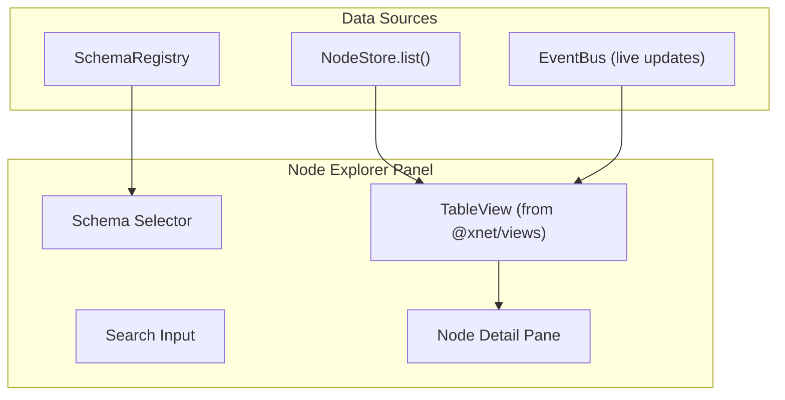

# 04 - Node Explorer

> Browse all Nodes grouped by schema using the existing TableView component

## Overview

The Node Explorer is the primary data inspection panel. It reuses `@xnet/views` `TableView` to render nodes in a familiar table interface with virtual scrolling, sorting, and filtering. Nodes are grouped by schema, with a detail pane showing properties, Lamport timestamps, and navigation to related views.

## Architecture



## Reusing @xnet/views TableView

The existing `TableView` accepts a `Schema` (for columns), `ViewConfig` (for sort/visibility), and `TableRow[]` (for data). For the devtools, we synthesize a schema dynamically based on the selected node schema.

### Schema Synthesis

```typescript
// panels/NodeExplorer/useNodeExplorer.ts

import type { Schema, PropertyDefinition } from '@xnet/data'

/** Create a devtools-friendly schema for displaying nodes */
function createInspectorSchema(schema: Schema | null, showSystemFields: boolean): Schema {
  const properties: PropertyDefinition[] = [
    { '@id': 'devtools#id', name: 'ID', type: 'text', required: true },
    { '@id': 'devtools#schemaLabel', name: 'Type', type: 'text', required: true }
  ]

  if (showSystemFields) {
    properties.push(
      { '@id': 'devtools#createdAt', name: 'Created', type: 'date', required: true },
      { '@id': 'devtools#updatedAt', name: 'Updated', type: 'date', required: true },
      { '@id': 'devtools#createdBy', name: 'Author', type: 'text', required: false },
      { '@id': 'devtools#lamportTime', name: 'Lamport', type: 'number', required: false }
    )
  }

  // Add user-defined properties from the schema
  if (schema?.properties) {
    for (const prop of schema.properties) {
      properties.push(prop)
    }
  }

  return {
    '@id': 'xnet://devtools/NodeInspector',
    '@type': 'xnet://xnet.dev/Schema',
    name: schema ? schema.name + ' Inspector' : 'All Nodes',
    namespace: 'devtools',
    properties
  }
}
```

### Row Mapping

```typescript
/** Map NodeState to TableRow */
function nodeToRow(node: NodeState, registry: SchemaRegistry): TableRow {
  const schemaLabel = registry.get(node.schemaId)?.name ?? node.schemaId

  return {
    id: node.id,
    schemaLabel,
    createdAt: node.createdAt,
    updatedAt: node.updatedAt,
    createdBy: truncateDID(node.createdBy),
    lamportTime: node.lamportTime ?? 0,
    // Spread user properties
    ...Object.fromEntries(
      Object.entries(node.properties || {}).map(([key, val]) => [
        key,
        typeof val === 'object' ? JSON.stringify(val) : val
      ])
    )
  }
}
```

## Component Structure

```typescript
// panels/NodeExplorer/NodeExplorer.tsx

import { useState, useMemo } from 'react'
import { TableView } from '@xnet/views'
import { useDevTools } from '../../provider/useDevTools'
import { useNodeExplorer } from './useNodeExplorer'

export function NodeExplorer() {
  const { store } = useDevTools()
  const {
    nodes,
    schemas,
    selectedSchema,
    setSelectedSchema,
    selectedNode,
    setSelectedNode,
    searchQuery,
    setSearchQuery,
    showDeleted,
    setShowDeleted,
    showSystemFields,
    setShowSystemFields,
  } = useNodeExplorer()

  const inspectorSchema = useMemo(
    () => createInspectorSchema(selectedSchema, showSystemFields),
    [selectedSchema, showSystemFields]
  )

  const rows = useMemo(
    () => nodes.map(n => nodeToRow(n, schemas)),
    [nodes, schemas]
  )

  const view = useMemo(() => ({
    id: 'devtools-nodes',
    name: 'Node Explorer',
    type: 'table' as const,
    visibleProperties: inspectorSchema.properties.map(p => p['@id'].split('#')[1]),
    sorts: [{ propertyId: 'updatedAt', direction: 'desc' as const }],
  }), [inspectorSchema])

  return (
    <div className="flex flex-col h-full">
      {/* Toolbar */}
      <div className="flex items-center gap-2 px-3 py-2 border-b border-zinc-800">
        {/* Schema filter */}
        <select
          value={selectedSchema?.['@id'] ?? 'all'}
          onChange={e => setSelectedSchema(e.target.value === 'all' ? null : e.target.value)}
          className="bg-zinc-800 text-zinc-200 text-xs rounded px-2 py-1"
        >
          <option value="all">All Schemas ({nodes.length})</option>
          {schemas.map(s => (
            <option key={s['@id']} value={s['@id']}>{s.name}</option>
          ))}
        </select>

        {/* Search */}
        <input
          type="text"
          placeholder="Search nodes..."
          value={searchQuery}
          onChange={e => setSearchQuery(e.target.value)}
          className="bg-zinc-800 text-zinc-200 text-xs rounded px-2 py-1 flex-1"
        />

        {/* Toggles */}
        <label className="flex items-center gap-1 text-xs text-zinc-400">
          <input type="checkbox" checked={showDeleted} onChange={e => setShowDeleted(e.target.checked)} />
          Deleted
        </label>
        <label className="flex items-center gap-1 text-xs text-zinc-400">
          <input type="checkbox" checked={showSystemFields} onChange={e => setShowSystemFields(e.target.checked)} />
          System
        </label>
      </div>

      {/* Table + Detail split */}
      <div className="flex-1 flex overflow-hidden">
        <div className={selectedNode ? 'w-2/3' : 'w-full'}>
          <TableView
            schema={inspectorSchema}
            view={view}
            data={rows}
            rowHeight={28}
            overscan={20}
            onRowClick={(rowId) => setSelectedNode(rowId)}
          />
        </div>

        {selectedNode && (
          <div className="w-1/3 border-l border-zinc-800 overflow-y-auto">
            <NodeDetail node={selectedNode} />
          </div>
        )}
      </div>
    </div>
  )
}
```

## Node Detail Pane

```typescript
// panels/NodeExplorer/NodeDetail.tsx

export function NodeDetail({ node }: { node: NodeState }) {
  return (
    <div className="p-3 space-y-3">
      <h3 className="text-sm font-bold text-zinc-200">
        {node.properties?.title as string || node.id}
      </h3>

      {/* Metadata */}
      <div className="space-y-1 text-[11px]">
        <MetaRow label="ID" value={node.id} copyable />
        <MetaRow label="Schema" value={node.schemaId} />
        <MetaRow label="Created" value={formatRelativeTime(node.createdAt)} />
        <MetaRow label="Updated" value={formatRelativeTime(node.updatedAt)} />
        <MetaRow label="Author" value={truncateDID(node.createdBy)} copyable />
        <MetaRow label="Deleted" value={String(node.deleted ?? false)} />
      </div>

      {/* Properties with Lamport timestamps */}
      <div>
        <h4 className="text-xs font-semibold text-zinc-400 mb-1">Properties</h4>
        <div className="space-y-0.5">
          {Object.entries(node.properties || {}).map(([key, value]) => (
            <PropertyRow
              key={key}
              name={key}
              value={value}
              lamport={node.propertyTimestamps?.[key]}
            />
          ))}
        </div>
      </div>

      {/* Actions */}
      <div className="flex gap-2 pt-2 border-t border-zinc-800">
        <ActionButton label="View Changes" onClick={() => navigateToChanges(node.id)} />
        <ActionButton label="View Y.Doc" onClick={() => navigateToYjs(node.id)} />
        <ActionButton label="Export" onClick={() => exportNode(node)} />
      </div>
    </div>
  )
}

function PropertyRow({ name, value, lamport }: {
  name: string
  value: unknown
  lamport?: { time: number; author: string }
}) {
  const displayValue = typeof value === 'object'
    ? JSON.stringify(value, null, 2)
    : String(value ?? 'null')

  return (
    <div className="flex items-start gap-2 text-[11px] py-0.5 hover:bg-zinc-800/50 rounded px-1">
      <span className="text-zinc-400 min-w-[80px]">{name}:</span>
      <span className="text-zinc-200 flex-1 break-all">{displayValue}</span>
      {lamport && (
        <span className="text-zinc-600 text-[9px]">[L:{lamport.time}]</span>
      )}
    </div>
  )
}
```

## Live Updates via EventBus

```typescript
// panels/NodeExplorer/useNodeExplorer.ts

import { useState, useEffect, useCallback } from 'react'
import { useDevTools } from '../../provider/useDevTools'

export function useNodeExplorer() {
  const { store, eventBus } = useDevTools()
  const [nodes, setNodes] = useState<NodeState[]>([])
  const [selectedSchemaId, setSelectedSchemaId] = useState<string | null>(null)
  const [searchQuery, setSearchQuery] = useState('')
  const [showDeleted, setShowDeleted] = useState(false)

  // Initial load
  useEffect(() => {
    if (!store) return
    loadNodes()
  }, [store, selectedSchemaId, showDeleted])

  // Live updates from event bus
  useEffect(() => {
    const unsubscribe = eventBus.on('store:create', () => loadNodes())
    const unsub2 = eventBus.on('store:update', () => loadNodes())
    const unsub3 = eventBus.on('store:delete', () => loadNodes())
    const unsub4 = eventBus.on('store:remote-change', () => loadNodes())

    return () => {
      unsubscribe()
      unsub2()
      unsub3()
      unsub4()
    }
  }, [eventBus])

  const loadNodes = useCallback(async () => {
    if (!store) return
    const opts = selectedSchemaId ? { schemaId: selectedSchemaId } : undefined
    const result = await store.list(opts)
    const filtered = showDeleted ? result : result.filter((n) => !n.deleted)
    setNodes(filtered)
  }, [store, selectedSchemaId, showDeleted])

  // Search filter (client-side)
  const filteredNodes = searchQuery
    ? nodes.filter((n) => {
        const title = (n.properties?.title as string) ?? ''
        return n.id.includes(searchQuery) || title.toLowerCase().includes(searchQuery.toLowerCase())
      })
    : nodes

  return {
    nodes: filteredNodes
    // ... rest of state
  }
}
```

## Checklist

- [ ] Implement `useNodeExplorer` hook with store loading
- [ ] Implement schema synthesis from SchemaRegistry
- [ ] Implement row mapping (NodeState -> TableRow)
- [ ] Implement NodeExplorer component with TableView
- [ ] Implement NodeDetail pane with property display
- [ ] Implement live updates via EventBus subscription
- [ ] Implement search filtering (id + title)
- [ ] Implement schema filter dropdown
- [ ] Implement show/hide deleted toggle
- [ ] Implement show/hide system fields toggle
- [ ] Add "View Changes" navigation to Change Timeline
- [ ] Add "View Y.Doc" navigation to Yjs Inspector
- [ ] Add node export (JSON download)
- [ ] Write tests for schema synthesis
- [ ] Write tests for row mapping

---

[Previous: DevTools Provider](./03-devtools-provider.md) | [Next: Change Timeline](./05-change-timeline.md)
