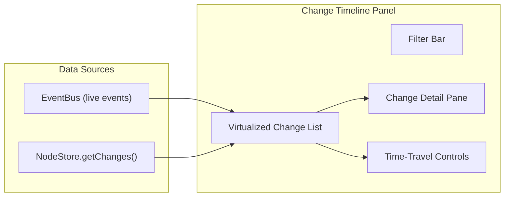

# 05 - Change Timeline

> Visualize event-sourced changes with Lamport ordering, conflict detection, and time-travel

## Overview

The Change Timeline displays the chronological history of all Changes applied to the NodeStore. It shows Lamport timestamps, hash chain linkage, batch grouping, conflict resolution, and signature verification. The time-travel feature allows developers to view the computed state at any point in history.

## Architecture



## Change List Entry

Each entry in the timeline shows:

```
L:45 ─●─ store:update  abc123  { title: "Updated Title" }
       │ Author: did:key:z6Mk...  Batch: tx-123 (1/2)
       │ Hash: cid:blake3:a1b2...  Parent: cid:blake3:9f8e...
```

### Entry Component

```typescript
// panels/ChangeTimeline/TimelineEntry.tsx

interface TimelineEntryProps {
  event: StoreCreateEvent | StoreUpdateEvent | StoreDeleteEvent
    | StoreRemoteChangeEvent | StoreConflictEvent
  isSelected: boolean
  onSelect: () => void
}

export function TimelineEntry({ event, isSelected, onSelect }: TimelineEntryProps) {
  const isConflict = event.type === 'store:conflict'
  const isRemote = event.type === 'store:remote-change'

  return (
    <div
      onClick={onSelect}
      className={`
        flex items-start gap-2 px-3 py-1.5 cursor-pointer border-l-2
        ${isSelected ? 'bg-zinc-800 border-blue-400' : 'border-transparent hover:bg-zinc-800/50'}
        ${isConflict ? 'bg-amber-950/20' : ''}
        ${isRemote ? 'bg-purple-950/20' : ''}
      `}
    >
      {/* Lamport badge */}
      <span className="text-[10px] text-zinc-500 w-10 text-right font-mono">
        L:{getLamport(event)}
      </span>

      {/* Timeline dot */}
      <div className="flex flex-col items-center pt-1">
        <div className={`w-2 h-2 rounded-full ${getDotColor(event)}`} />
        <div className="w-px flex-1 bg-zinc-700" />
      </div>

      {/* Content */}
      <div className="flex-1 min-w-0">
        <div className="flex items-center gap-2">
          <TypeBadge type={event.type} />
          <span className="text-zinc-400 text-[10px] font-mono truncate">
            {getNodeId(event)}
          </span>
          {isRemote && <RemoteBadge />}
          {isConflict && <ConflictBadge resolved={event.conflict.resolved} />}
        </div>

        {/* Payload preview */}
        <div className="text-[10px] text-zinc-500 truncate mt-0.5">
          {getPayloadPreview(event)}
        </div>

        {/* Timestamp */}
        <div className="text-[9px] text-zinc-600 mt-0.5">
          {formatRelativeTime(event.wallTime)}
        </div>
      </div>
    </div>
  )
}

function getDotColor(event: DevToolsEvent): string {
  switch (event.type) {
    case 'store:create': return 'bg-green-400'
    case 'store:update': return 'bg-blue-400'
    case 'store:delete': return 'bg-red-400'
    case 'store:restore': return 'bg-yellow-400'
    case 'store:remote-change': return 'bg-purple-400'
    case 'store:conflict': return 'bg-amber-400'
    default: return 'bg-zinc-400'
  }
}
```

## Change Detail Pane

When a change is selected, the detail pane shows full information:

```typescript
// panels/ChangeTimeline/ChangeDetail.tsx

export function ChangeDetail({ event }: { event: DevToolsEvent }) {
  return (
    <div className="p-3 space-y-3 text-[11px]">
      <h3 className="text-sm font-bold text-zinc-200">Change Details</h3>

      {/* Core fields */}
      <Section title="Identity">
        <Field label="Event ID" value={event.id} />
        <Field label="Type" value={event.type} />
        <Field label="Wall Time" value={new Date(event.wallTime).toISOString()} />
      </Section>

      {/* Change-specific fields */}
      {'lamport' in event && (
        <Section title="Ordering">
          <Field label="Lamport Time" value={String(event.lamport.time)} />
          <Field label="Author" value={truncateDID(event.lamport.author)} copyable />
        </Section>
      )}

      {'change' in event && (
        <Section title="Hash Chain">
          <Field label="Hash" value={event.change.hash} copyable mono />
          <Field label="Parent" value={event.change.parentHash ?? '(root)'} copyable mono />
          <Field label="Signature" value={event.change.signature ? 'Present' : 'Missing'} />
          <VerifyButton change={event.change} />
        </Section>
      )}

      {/* Batch info */}
      {'change' in event && event.change.batchId && (
        <Section title="Transaction">
          <Field label="Batch ID" value={event.change.batchId} />
          <Field label="Position" value={`${event.change.batchIndex + 1}/${event.change.batchSize}`} />
        </Section>
      )}

      {/* Payload */}
      <Section title="Payload">
        <pre className="bg-zinc-900 rounded p-2 text-[10px] overflow-x-auto whitespace-pre-wrap">
          {JSON.stringify(getPayload(event), null, 2)}
        </pre>
      </Section>

      {/* Conflict details */}
      {'conflict' in event && (
        <Section title="Conflict Resolution">
          <Field label="Property" value={event.conflict.key} />
          <Field label="Local Value" value={JSON.stringify(event.conflict.localValue)} />
          <Field label="Remote Value" value={JSON.stringify(event.conflict.remoteValue)} />
          <Field label="Winner" value={event.conflict.resolved} />
          <DiffView local={event.conflict.localValue} remote={event.conflict.remoteValue} />
        </Section>
      )}
    </div>
  )
}
```

## Time-Travel Debugging

Time-travel computes the state of the store at any point by replaying changes up to a selected index. This is **read-only** - it never modifies the real store.

```typescript
// panels/ChangeTimeline/useTimeTravel.ts

export function useTimeTravel(changes: NodeChange[]) {
  const [targetIndex, setTargetIndex] = useState<number | null>(null)
  const [computedState, setComputedState] = useState<Map<string, NodeState> | null>(null)

  const goToIndex = useCallback(
    (index: number) => {
      const sorted = [...changes].sort((a, b) => compareLamportTimestamps(a.lamport, b.lamport))

      const state = new Map<string, Record<string, unknown>>()

      for (let i = 0; i <= index && i < sorted.length; i++) {
        const change = sorted[i]
        const { nodeId, properties, schemaId, deleted } = change.payload

        const existing = state.get(nodeId) || {
          id: nodeId,
          schemaId,
          properties: {},
          deleted: false,
          createdAt: change.wallTime
        }

        if (properties) {
          existing.properties = { ...existing.properties, ...properties }
        }
        if (deleted !== undefined) {
          existing.deleted = deleted
        }
        existing.updatedAt = change.wallTime

        state.set(nodeId, existing)
      }

      setTargetIndex(index)
      setComputedState(state)
    },
    [changes]
  )

  const reset = useCallback(() => {
    setTargetIndex(null)
    setComputedState(null)
  }, [])

  return {
    isTimeTraveling: targetIndex !== null,
    targetIndex,
    computedState,
    goToIndex,
    reset,
    canGoBack: targetIndex !== null && targetIndex > 0,
    canGoForward: targetIndex !== null && targetIndex < changes.length - 1
  }
}
```

## Filter Controls

```typescript
// panels/ChangeTimeline/Filters.tsx

export function TimelineFilters({ filters, onChange }: {
  filters: TimelineFilters
  onChange: (f: TimelineFilters) => void
}) {
  return (
    <div className="flex items-center gap-2 px-3 py-2 border-b border-zinc-800">
      {/* Node filter */}
      <select className="bg-zinc-800 text-xs rounded px-2 py-1">
        <option value="all">All Nodes</option>
        {/* Populated from unique nodeIds in events */}
      </select>

      {/* Event type filter */}
      <select className="bg-zinc-800 text-xs rounded px-2 py-1">
        <option value="all">All Types</option>
        <option value="local">Local Only</option>
        <option value="remote">Remote Only</option>
        <option value="conflicts">Conflicts Only</option>
      </select>

      {/* Time range */}
      <select className="bg-zinc-800 text-xs rounded px-2 py-1">
        <option value="all">All Time</option>
        <option value="1m">Last Minute</option>
        <option value="5m">Last 5 Minutes</option>
        <option value="1h">Last Hour</option>
      </select>

      {/* Pause/Resume */}
      <PauseButton />
    </div>
  )
}
```

## Checklist

- [ ] Implement `useChangeTimeline` hook reading from EventBus
- [ ] Implement virtualized change list (handle 10k+ events)
- [ ] Implement `TimelineEntry` component with color coding
- [ ] Implement `ChangeDetail` pane with all fields
- [ ] Implement hash chain visualization (parent links)
- [ ] Implement batch grouping display
- [ ] Implement conflict highlighting with resolution info
- [ ] Implement signature verification button
- [ ] Implement filter controls (node, type, time range)
- [ ] Implement time-travel debugging
- [ ] Implement time-travel state viewer
- [ ] Implement Lamport ordering with tie-breaking display
- [ ] Write tests for time-travel state computation
- [ ] Write tests for filter logic

---

[Previous: Node Explorer](./04-node-explorer.md) | [Next: Sync Monitor](./06-sync-monitor.md)
