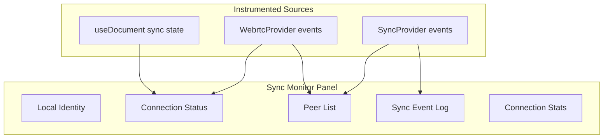

# 06 - Sync Monitor

> P2P connection status, peer list, sync events, and network health

## Overview

The Sync Monitor displays real-time information about P2P connections including peer status, sync events, latency estimates, and connection health. It instruments both the `SyncProvider` (for NodeStore changes) and `WebrtcProvider` (for Yjs document sync).

## Architecture



## Panel Layout

```typescript
// panels/SyncMonitor/SyncMonitor.tsx

export function SyncMonitor() {
  const { eventBus } = useDevTools()
  const {
    localIdentity,
    connectionStatus,
    peers,
    events,
    stats,
    rooms,
  } = useSyncMonitor()

  return (
    <div className="flex flex-col h-full">
      {/* Top: Identity + Status */}
      <div className="flex items-center gap-4 px-3 py-2 border-b border-zinc-800">
        <IdentityBadge identity={localIdentity} />
        <ConnectionStatusIndicator status={connectionStatus} peerCount={peers.length} />
        <div className="ml-auto flex items-center gap-2">
          <span className="text-[10px] text-zinc-500">Rooms: {rooms.length}</span>
          <ForceReconnectButton />
        </div>
      </div>

      {/* Main: Peers + Events split */}
      <div className="flex-1 flex overflow-hidden">
        {/* Left: Peer list */}
        <div className="w-1/3 border-r border-zinc-800 overflow-y-auto">
          <PeerList peers={peers} />
        </div>

        {/* Right: Event log */}
        <div className="w-2/3 overflow-y-auto">
          <SyncEventLog events={events} />
        </div>
      </div>

      {/* Bottom: Stats */}
      <div className="flex items-center gap-4 px-3 py-1.5 border-t border-zinc-800 text-[10px] text-zinc-500">
        <span>Changes sent: {stats.sent}</span>
        <span>Changes received: {stats.received}</span>
        <span>Conflicts: {stats.conflicts}</span>
        <span>Avg latency: {stats.avgLatency}ms</span>
      </div>
    </div>
  )
}
```

## Peer List

```typescript
// panels/SyncMonitor/PeerList.tsx

interface PeerEntry {
  id: string
  did?: string
  status: 'connected' | 'connecting' | 'disconnected'
  connectedAt: number
  lastSeen: number
  room: string
  changesReceived: number
  changesSent: number
  estimatedLatency?: number
}

export function PeerList({ peers }: { peers: PeerEntry[] }) {
  return (
    <div className="p-2 space-y-1">
      <h3 className="text-[10px] font-semibold text-zinc-400 uppercase tracking-wider px-1">
        Peers ({peers.length})
      </h3>

      {peers.map(peer => (
        <div key={peer.id} className="flex items-center gap-2 px-2 py-1.5 rounded hover:bg-zinc-800">
          {/* Status dot */}
          <div className={`w-1.5 h-1.5 rounded-full ${
            peer.status === 'connected' ? 'bg-green-400' :
            peer.status === 'connecting' ? 'bg-yellow-400 animate-pulse' :
            'bg-zinc-600'
          }`} />

          {/* Peer info */}
          <div className="flex-1 min-w-0">
            <div className="text-[11px] text-zinc-200 truncate font-mono">
              {peer.did ? truncateDID(peer.did) : peer.id.slice(0, 12)}
            </div>
            <div className="text-[9px] text-zinc-500">
              {peer.room} | {formatDuration(Date.now() - peer.connectedAt)}
            </div>
          </div>

          {/* Stats */}
          <div className="text-right text-[9px] text-zinc-500">
            {peer.estimatedLatency && <div>{peer.estimatedLatency}ms</div>}
            <div>{peer.changesReceived}↓ {peer.changesSent}↑</div>
          </div>
        </div>
      ))}

      {peers.length === 0 && (
        <div className="text-center text-zinc-600 text-xs py-4">No peers connected</div>
      )}
    </div>
  )
}
```

## Sync Event Log

```typescript
// panels/SyncMonitor/SyncEventLog.tsx

export function SyncEventLog({ events }: { events: DevToolsEvent[] }) {
  return (
    <div className="font-mono text-[10px]">
      {events.map(event => (
        <div key={event.id} className="flex items-start gap-2 px-3 py-0.5 hover:bg-zinc-800/50">
          {/* Timestamp */}
          <span className="text-zinc-600 w-16 shrink-0">
            {formatTime(event.wallTime)}
          </span>

          {/* Direction arrow */}
          <span className={getDirectionColor(event)}>
            {getDirectionArrow(event)}
          </span>

          {/* Message */}
          <span className="text-zinc-300 flex-1">
            {formatSyncEvent(event)}
          </span>
        </div>
      ))}
    </div>
  )
}

function getDirectionArrow(event: DevToolsEvent): string {
  switch (event.type) {
    case 'sync:change-received': return '←'
    case 'sync:broadcast': return '→'
    case 'sync:peer-connected': return '+'
    case 'sync:peer-disconnected': return '-'
    case 'sync:status-change': return '●'
    case 'sync:error': return '!'
    default: return '·'
  }
}

function formatSyncEvent(event: DevToolsEvent): string {
  switch (event.type) {
    case 'sync:change-received':
      return `Received from ${event.peerId.slice(0, 8)} (L:${event.lamport.time})`
    case 'sync:broadcast':
      return `Broadcast change (L:${event.lamport.time})`
    case 'sync:peer-connected':
      return `${event.peer.name || event.peer.id.slice(0, 8)} connected (${event.totalPeers} total)`
    case 'sync:peer-disconnected':
      return `${event.peerId.slice(0, 8)} disconnected (${event.totalPeers} remaining)`
    case 'sync:status-change':
      return `${event.room}: ${event.previousStatus} → ${event.newStatus}`
    case 'sync:error':
      return `Error: ${event.error}`
    default:
      return event.type
  }
}
```

## useSyncMonitor Hook

```typescript
// panels/SyncMonitor/useSyncMonitor.ts

export function useSyncMonitor() {
  const { eventBus } = useDevTools()
  const [peers, setPeers] = useState<PeerEntry[]>([])
  const [events, setEvents] = useState<DevToolsEvent[]>([])
  const [stats, setStats] = useState({ sent: 0, received: 0, conflicts: 0, avgLatency: 0 })

  useEffect(() => {
    // Load historical sync events
    const syncEvents = eventBus.getEvents().filter((e) => e.type.startsWith('sync:'))
    setEvents(syncEvents.slice(-200)) // Keep last 200

    // Subscribe to live events
    const unsubscribe = eventBus.subscribe((event) => {
      if (!event.type.startsWith('sync:')) return

      setEvents((prev) => [...prev.slice(-199), event])

      // Update peer list
      if (event.type === 'sync:peer-connected') {
        setPeers((prev) => [
          ...prev,
          {
            id: event.peer.id,
            did: event.peer.name,
            status: 'connected',
            connectedAt: event.peer.connectedAt,
            lastSeen: Date.now(),
            room: event.room,
            changesReceived: 0,
            changesSent: 0
          }
        ])
      } else if (event.type === 'sync:peer-disconnected') {
        setPeers((prev) => prev.filter((p) => p.id !== event.peerId))
      }

      // Update stats
      if (event.type === 'sync:change-received') {
        setStats((prev) => ({ ...prev, received: prev.received + 1 }))
      } else if (event.type === 'sync:broadcast') {
        setStats((prev) => ({ ...prev, sent: prev.sent + 1 }))
      }
    })

    return unsubscribe
  }, [eventBus])

  return { peers, events, stats /* ... */ }
}
```

## Checklist

- [ ] Implement `useSyncMonitor` hook subscribing to sync events
- [ ] Implement `SyncMonitor` layout with identity, peers, and event log
- [ ] Implement `PeerList` with status indicators and stats
- [ ] Implement `SyncEventLog` with direction arrows and formatting
- [ ] Implement `IdentityBadge` showing local DID
- [ ] Implement `ConnectionStatusIndicator` with color coding
- [ ] Implement connection stats (sent/received/conflicts/latency)
- [ ] Implement room list when multiple documents are synced
- [ ] Implement force-reconnect button
- [ ] Implement peer latency estimation from event timing
- [ ] Write tests for peer list state management
- [ ] Write tests for event formatting

---

[Previous: Change Timeline](./05-change-timeline.md) | [Next: Yjs Inspector](./07-yjs-inspector.md)
