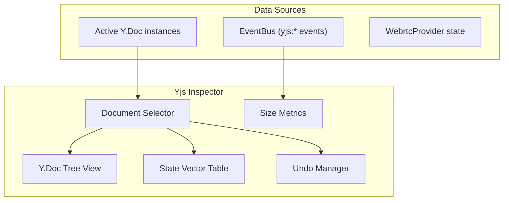

# 07 - Yjs Inspector

> Inspect Y.Doc structure, state vectors, undo history, and CRDT state

## Overview

The Yjs Inspector provides deep visibility into Yjs document internals. Since xNet uses Y.Doc for both rich text (XmlFragment) and property sync (Y.Map 'meta'), this panel helps debug CRDT conflicts, sync issues, and document structure problems.

## Architecture



## Document Selector

The inspector needs access to active Y.Doc instances. These are tracked by the Yjs instrumentation when `useDocument` creates them.

```typescript
// panels/YjsInspector/useYjsInspector.ts

interface TrackedDoc {
  id: string
  doc: Y.Doc
  title?: string
  schemaId?: string
  clientId: number
  connected: boolean
  peerCount: number
}

export function useYjsInspector() {
  const { eventBus } = useDevTools()
  const [docs, setDocs] = useState<TrackedDoc[]>([])
  const [selectedDocId, setSelectedDocId] = useState<string | null>(null)

  // Track docs as they are instrumented
  // The instrumentation layer registers docs via a registry
  // (See: DevToolsProvider registers each Y.Doc from useDocument)

  const selectedDoc = docs.find((d) => d.id === selectedDocId) ?? null

  return {
    docs,
    selectedDoc,
    selectedDocId,
    setSelectedDocId
    // ... tree data, state vector, etc.
  }
}
```

## Y.Doc Tree View

Renders the hierarchical structure of a Y.Doc (Maps, Arrays, XmlFragments, Text):

```typescript
// panels/YjsInspector/DocTree.tsx

interface TreeNode {
  key: string
  type: 'Map' | 'Array' | 'Text' | 'XmlFragment' | 'XmlElement' | 'value'
  value?: unknown
  children?: TreeNode[]
  size?: number
}

export function DocTree({ doc }: { doc: Y.Doc }) {
  const tree = useMemo(() => buildTree(doc), [doc])

  return (
    <div className="p-2 font-mono text-[11px]">
      {tree.map(node => (
        <TreeNodeComponent key={node.key} node={node} depth={0} />
      ))}
    </div>
  )
}

function TreeNodeComponent({ node, depth }: { node: TreeNode; depth: number }) {
  const [expanded, setExpanded] = useState(depth < 2) // Auto-expand first 2 levels

  const hasChildren = node.children && node.children.length > 0
  const indent = depth * 16

  return (
    <div>
      <div
        className="flex items-center gap-1 py-0.5 hover:bg-zinc-800/50 rounded cursor-pointer"
        style={{ paddingLeft: indent }}
        onClick={() => hasChildren && setExpanded(!expanded)}
      >
        {/* Expand arrow */}
        {hasChildren && (
          <span className="text-zinc-500 w-3">{expanded ? '▼' : '▶'}</span>
        )}
        {!hasChildren && <span className="w-3" />}

        {/* Type badge */}
        <TypeBadge type={node.type} />

        {/* Key */}
        <span className="text-zinc-400">{node.key}</span>

        {/* Value or size */}
        {node.type === 'value' && (
          <span className="text-zinc-200 ml-2">{formatValue(node.value)}</span>
        )}
        {node.size !== undefined && (
          <span className="text-zinc-600 ml-2">({node.size} entries)</span>
        )}
      </div>

      {expanded && node.children?.map(child => (
        <TreeNodeComponent key={child.key} node={child} depth={depth + 1} />
      ))}
    </div>
  )
}

function buildTree(doc: Y.Doc): TreeNode[] {
  const nodes: TreeNode[] = []

  // Iterate shared types
  doc.share.forEach((type, key) => {
    nodes.push(yTypeToTreeNode(key, type))
  })

  return nodes
}

function yTypeToTreeNode(key: string, type: Y.AbstractType<any>): TreeNode {
  if (type instanceof Y.Map) {
    const children: TreeNode[] = []
    type.forEach((value, k) => {
      if (value instanceof Y.AbstractType) {
        children.push(yTypeToTreeNode(k, value))
      } else {
        children.push({ key: k, type: 'value', value })
      }
    })
    return { key, type: 'Map', children, size: type.size }
  }

  if (type instanceof Y.Array) {
    const children = type.toArray().map((item, i) => {
      if (item instanceof Y.AbstractType) {
        return yTypeToTreeNode(String(i), item)
      }
      return { key: String(i), type: 'value' as const, value: item }
    })
    return { key, type: 'Array', children, size: type.length }
  }

  if (type instanceof Y.XmlFragment) {
    const children = Array.from({ length: type.length }, (_, i) => {
      const child = type.get(i)
      return yTypeToTreeNode(String(i), child)
    })
    return { key, type: 'XmlFragment', children, size: type.length }
  }

  if (type instanceof Y.Text) {
    return { key, type: 'Text', value: type.toString().slice(0, 200) }
  }

  return { key, type: 'value', value: String(type) }
}
```

## State Vector Table

```typescript
// panels/YjsInspector/StateVectorTable.tsx

export function StateVectorTable({ doc }: { doc: Y.Doc }) {
  const stateVector = useMemo(() => {
    const sv = Y.encodeStateVector(doc)
    // Decode state vector to get client entries
    return decodeStateVector(sv)
  }, [doc])

  const localClientId = doc.clientID

  return (
    <div className="p-2">
      <h4 className="text-[10px] font-semibold text-zinc-400 uppercase mb-2">State Vector</h4>
      <table className="w-full text-[10px]">
        <thead>
          <tr className="text-zinc-500">
            <th className="text-left py-1">Client ID</th>
            <th className="text-right py-1">Clock</th>
            <th className="text-right py-1">Note</th>
          </tr>
        </thead>
        <tbody>
          {stateVector.map(({ clientId, clock }) => (
            <tr key={clientId} className="border-t border-zinc-800">
              <td className="py-1 font-mono">{clientId}</td>
              <td className="py-1 text-right">{clock}</td>
              <td className="py-1 text-right text-zinc-500">
                {clientId === localClientId ? '(local)' : ''}
              </td>
            </tr>
          ))}
        </tbody>
      </table>

      <div className="mt-2 text-[9px] text-zinc-600">
        Encoded size: {Y.encodeStateAsUpdate(doc).byteLength} bytes
      </div>
    </div>
  )
}
```

## Undo Manager Panel

```typescript
// panels/YjsInspector/UndoPanel.tsx

export function UndoPanel({ doc }: { doc: Y.Doc }) {
  // Note: UndoManager must be passed from the app or reconstructed
  // For now, show stack sizes if available

  return (
    <div className="p-2">
      <h4 className="text-[10px] font-semibold text-zinc-400 uppercase mb-2">Undo Manager</h4>
      <div className="space-y-1 text-[11px]">
        <div className="flex justify-between">
          <span className="text-zinc-400">Undo Stack:</span>
          <span className="text-zinc-200">{undoManager?.undoStack.length ?? 'N/A'}</span>
        </div>
        <div className="flex justify-between">
          <span className="text-zinc-400">Redo Stack:</span>
          <span className="text-zinc-200">{undoManager?.redoStack.length ?? 'N/A'}</span>
        </div>
      </div>

      <div className="flex gap-2 mt-3">
        <button className="bg-zinc-800 px-2 py-1 rounded text-[10px]"
          onClick={() => undoManager?.undo()}>Undo</button>
        <button className="bg-zinc-800 px-2 py-1 rounded text-[10px]"
          onClick={() => undoManager?.redo()}>Redo</button>
      </div>
    </div>
  )
}
```

## Export/Import Controls

```typescript
export function DocActions({ doc, docId }: { doc: Y.Doc; docId: string }) {
  const exportState = () => {
    const update = Y.encodeStateAsUpdate(doc)
    const blob = new Blob([update], { type: 'application/octet-stream' })
    const url = URL.createObjectURL(blob)
    const a = document.createElement('a')
    a.href = url
    a.download = `ydoc-${docId}-${Date.now()}.yjs`
    a.click()
    URL.revokeObjectURL(url)
  }

  const importState = async (file: File) => {
    const buffer = await file.arrayBuffer()
    Y.applyUpdate(doc, new Uint8Array(buffer))
  }

  return (
    <div className="flex gap-2 p-2 border-t border-zinc-800">
      <button onClick={exportState} className="bg-zinc-800 px-2 py-1 rounded text-[10px]">
        Export State
      </button>
      <label className="bg-zinc-800 px-2 py-1 rounded text-[10px] cursor-pointer">
        Import State
        <input type="file" className="hidden" accept=".yjs" onChange={e => {
          if (e.target.files?.[0]) importState(e.target.files[0])
        }} />
      </label>
    </div>
  )
}
```

## Checklist

- [ ] Implement Y.Doc registry (track docs from useDocument)
- [ ] Implement document selector dropdown
- [ ] Implement `DocTree` recursive tree view
- [ ] Implement `buildTree` for Map, Array, XmlFragment, Text
- [ ] Implement `StateVectorTable` with client entries
- [ ] Implement undo/redo panel (if UndoManager is accessible)
- [ ] Implement size metrics (encoded state size, update count)
- [ ] Implement export state (download as .yjs file)
- [ ] Implement import state (apply update from file)
- [ ] Auto-refresh tree on `yjs:update` events
- [ ] Write tests for `buildTree` with nested structures
- [ ] Write tests for state vector decoding

---

[Previous: Sync Monitor](./06-sync-monitor.md) | [Next: Query Debugger](./08-query-debugger.md)
