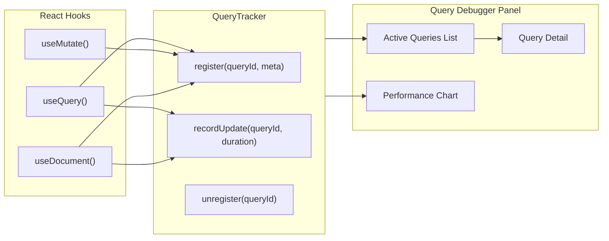

# 08 - Query Debugger

> Track active React hook subscriptions, update frequency, and render performance

## Overview

The Query Debugger monitors all active `useQuery`, `useMutate`, and `useDocument` hooks. It shows what each hook is subscribed to, how often it receives updates, and the performance cost of each re-render.

## Instrumentation Strategy

Unlike store/sync instrumentation (which uses existing events), query debugging requires adding lightweight tracking to the React hooks themselves. This is done by having the DevToolsProvider inject a `queryTracker` into context that the hooks can optionally report to.



## Query Tracker

```typescript
// instrumentation/query.ts

export interface TrackedQuery {
  id: string
  type: 'useQuery' | 'useMutate' | 'useDocument'
  schemaId: string
  mode: 'list' | 'single' | 'filtered' | 'document'
  filter?: Record<string, unknown>
  nodeId?: string

  // Lifecycle
  registeredAt: number
  lastUpdateAt: number | null
  unregisteredAt: number | null

  // Stats
  updateCount: number
  resultCount: number
  totalRenderTime: number // cumulative ms
  avgRenderTime: number // average ms per update
  peakRenderTime: number // max ms
}

export class QueryTracker {
  private queries = new Map<string, TrackedQuery>()
  private bus: DevToolsEventBus

  constructor(bus: DevToolsEventBus) {
    this.bus = bus
  }

  register(
    id: string,
    meta: {
      type: TrackedQuery['type']
      schemaId: string
      mode: TrackedQuery['mode']
      filter?: Record<string, unknown>
      nodeId?: string
    }
  ): void {
    this.queries.set(id, {
      id,
      ...meta,
      registeredAt: Date.now(),
      lastUpdateAt: null,
      unregisteredAt: null,
      updateCount: 0,
      resultCount: 0,
      totalRenderTime: 0,
      avgRenderTime: 0,
      peakRenderTime: 0
    })

    this.bus.emit({
      type: 'query:subscribe',
      queryId: id,
      schemaId: meta.schemaId,
      mode: meta.mode,
      filter: meta.filter
    })
  }

  recordUpdate(id: string, resultCount: number, renderTime: number): void {
    const query = this.queries.get(id)
    if (!query) return

    query.updateCount++
    query.resultCount = resultCount
    query.lastUpdateAt = Date.now()
    query.totalRenderTime += renderTime
    query.avgRenderTime = query.totalRenderTime / query.updateCount
    query.peakRenderTime = Math.max(query.peakRenderTime, renderTime)

    this.bus.emit({
      type: 'query:result',
      queryId: id,
      resultCount,
      duration: renderTime
    })
  }

  recordError(id: string, error: string): void {
    this.bus.emit({ type: 'query:error', queryId: id, error })
  }

  unregister(id: string): void {
    const query = this.queries.get(id)
    if (query) {
      query.unregisteredAt = Date.now()
      this.bus.emit({ type: 'query:unsubscribe', queryId: id })
    }
    // Keep in map for history, prune periodically
  }

  getActive(): TrackedQuery[] {
    return Array.from(this.queries.values()).filter((q) => !q.unregisteredAt)
  }

  getAll(): TrackedQuery[] {
    return Array.from(this.queries.values())
  }

  getById(id: string): TrackedQuery | undefined {
    return this.queries.get(id)
  }
}
```

## Hook Integration

The hooks check if a `QueryTracker` is available in context and report to it. This is **opt-in** - if no DevToolsProvider is present, the tracker is null and hooks skip reporting.

### useQuery Integration Points

```typescript
// In packages/react/src/hooks/useQuery.ts (modifications)

// On mount: register
useEffect(() => {
  const tracker = devToolsContext?.queryTracker
  if (!tracker) return

  const queryId = `useQuery-${schemaId}-${nodeId ?? 'list'}-${instanceId}`
  tracker.register(queryId, {
    type: 'useQuery',
    schemaId,
    mode: nodeId ? 'single' : filter ? 'filtered' : 'list',
    filter,
    nodeId
  })

  return () => tracker.unregister(queryId)
}, [schemaId, nodeId])

// On subscription update: recordUpdate
// Wrap the setState call with timing
const start = performance.now()
setData(newData)
const duration = performance.now() - start
tracker?.recordUpdate(queryId, newData.length, duration)
```

### useDocument Integration Points

```typescript
// On mount: register
tracker?.register(queryId, {
  type: 'useDocument',
  schemaId,
  mode: 'document',
  nodeId: id
})

// On Y.Doc update: recordUpdate (debounced)
// On unmount: unregister
```

## Panel Component

```typescript
// panels/QueryDebugger/QueryDebugger.tsx

export function QueryDebugger() {
  const { eventBus } = useDevTools()
  const { queries, selectedQuery, setSelectedQuery, sortBy, setSortBy } = useQueryDebugger()

  return (
    <div className="flex flex-col h-full">
      {/* Summary bar */}
      <div className="flex items-center gap-4 px-3 py-2 border-b border-zinc-800">
        <span className="text-xs text-zinc-400">
          Active: <strong className="text-zinc-200">{queries.length}</strong>
        </span>
        <span className="text-xs text-zinc-400">
          Updates: <strong className="text-zinc-200">{totalUpdates}</strong>
        </span>
        <span className="text-xs text-zinc-400">
          Avg render: <strong className="text-zinc-200">{avgRender.toFixed(1)}ms</strong>
        </span>

        {/* Sort control */}
        <select
          value={sortBy}
          onChange={e => setSortBy(e.target.value)}
          className="ml-auto bg-zinc-800 text-xs rounded px-2 py-1"
        >
          <option value="updates">Sort: Most Updates</option>
          <option value="render">Sort: Slowest Render</option>
          <option value="recent">Sort: Most Recent</option>
        </select>
      </div>

      {/* Query list */}
      <div className="flex-1 overflow-y-auto">
        {queries.map(query => (
          <QueryEntry
            key={query.id}
            query={query}
            isSelected={selectedQuery?.id === query.id}
            onSelect={() => setSelectedQuery(query)}
          />
        ))}
      </div>
    </div>
  )
}

function QueryEntry({ query, isSelected, onSelect }: {
  query: TrackedQuery
  isSelected: boolean
  onSelect: () => void
}) {
  return (
    <div
      onClick={onSelect}
      className={`
        px-3 py-2 border-b border-zinc-800/50 cursor-pointer
        ${isSelected ? 'bg-zinc-800' : 'hover:bg-zinc-800/50'}
      `}
    >
      <div className="flex items-center gap-2">
        {/* Hook type badge */}
        <span className={`text-[9px] px-1.5 py-0.5 rounded font-mono ${
          query.type === 'useQuery' ? 'bg-blue-900 text-blue-300' :
          query.type === 'useDocument' ? 'bg-purple-900 text-purple-300' :
          'bg-green-900 text-green-300'
        }`}>
          {query.type}
        </span>

        {/* Schema */}
        <span className="text-[11px] text-zinc-200">
          {query.schemaId.split('/').pop()}
        </span>

        {/* Mode */}
        <span className="text-[9px] text-zinc-500">
          ({query.mode})
        </span>
      </div>

      {/* Stats row */}
      <div className="flex items-center gap-3 mt-1 text-[9px] text-zinc-500">
        <span>Updates: {query.updateCount}</span>
        <span>Results: {query.resultCount}</span>
        <span>Avg: {query.avgRenderTime.toFixed(1)}ms</span>
        {query.peakRenderTime > 16 && (
          <span className="text-amber-400">Peak: {query.peakRenderTime.toFixed(1)}ms</span>
        )}
        {query.lastUpdateAt && (
          <span className="ml-auto">{formatRelativeTime(query.lastUpdateAt)}</span>
        )}
      </div>
    </div>
  )
}
```

## Performance Warnings

The debugger highlights performance issues:

- Peak render > 16ms (dropped frame): amber warning
- Peak render > 50ms: red warning
- Update frequency > 60/s: "chatty subscription" warning
- Result count > 1000: "large result set" warning

## Checklist

- [ ] Implement `QueryTracker` class with register/update/unregister
- [ ] Add optional DevTools context to useQuery (check for tracker)
- [ ] Add optional DevTools context to useDocument
- [ ] Implement `QueryDebugger` panel with query list
- [ ] Implement `QueryEntry` with hook type badges and stats
- [ ] Implement sort by updates/render time/recency
- [ ] Implement performance warning indicators
- [ ] Implement query detail view with filter/result preview
- [ ] Add performance.now() timing around setState in hooks
- [ ] Implement update frequency calculation
- [ ] Write tests for QueryTracker state management
- [ ] Write tests for performance calculations

---

[Previous: Yjs Inspector](./07-yjs-inspector.md) | [Next: Telemetry Panel](./09-telemetry-panel.md)
