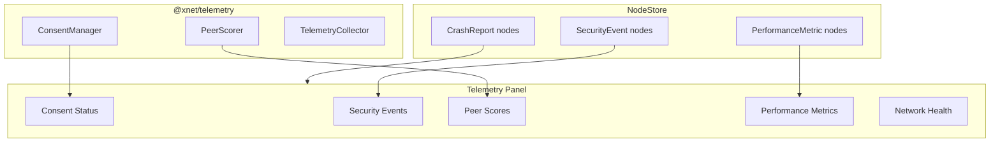

# 09 - Telemetry Panel

> Display security events, peer scores, consent status, and performance metrics from planStep03_1

## Overview

The Telemetry Panel integrates with the `@xnet/telemetry` package (planStep03_1) to display security events, peer reputation scores, performance metrics, and consent status. Since telemetry data is stored as regular Nodes, we query them using the existing `useQuery` infrastructure.

## Dependency on planStep03_1

This panel reads from the telemetry schemas defined in planStep03_1:

| Schema IRI                                    | Data Displayed                                            |
| --------------------------------------------- | --------------------------------------------------------- |
| `xnet://xnet.dev/telemetry/SecurityEvent`     | Security events (invalid signatures, rate limits, blocks) |
| `xnet://xnet.dev/telemetry/PerformanceMetric` | Performance buckets (sync latency, render time)           |
| `xnet://xnet.dev/telemetry/CrashReport`       | Crash reports with stack traces                           |
| `xnet://xnet.dev/telemetry/UsageMetric`       | Usage patterns (bucketed)                                 |

Additionally, it reads from the `PeerScorer` and `ConsentManager` APIs.

## Architecture



## Panel Layout

```typescript
// panels/TelemetryPanel/TelemetryPanel.tsx

export function TelemetryPanel() {
  const [subTab, setSubTab] = useState<'security' | 'performance' | 'consent'>('security')

  return (
    <div className="flex flex-col h-full">
      {/* Sub-tab navigation */}
      <div className="flex items-center gap-1 px-3 py-1.5 border-b border-zinc-800">
        <SubTab id="security" active={subTab} onClick={setSubTab} label="Security" />
        <SubTab id="performance" active={subTab} onClick={setSubTab} label="Performance" />
        <SubTab id="consent" active={subTab} onClick={setSubTab} label="Consent" />
      </div>

      {/* Content */}
      <div className="flex-1 overflow-hidden">
        {subTab === 'security' && <SecuritySubPanel />}
        {subTab === 'performance' && <PerformanceSubPanel />}
        {subTab === 'consent' && <ConsentSubPanel />}
      </div>
    </div>
  )
}
```

## Security Events Sub-Panel

```typescript
// panels/TelemetryPanel/SecurityEvents.tsx

export function SecuritySubPanel() {
  const { store } = useDevTools()
  const [events, setEvents] = useState<SecurityEventNode[]>([])
  const [peerScores, setPeerScores] = useState<PeerScoreEntry[]>([])

  // Query SecurityEvent nodes from store
  useEffect(() => {
    if (!store) return
    store.list({ schemaId: 'xnet://xnet.dev/telemetry/SecurityEvent' })
      .then(nodes => setEvents(nodes.sort((a, b) => b.createdAt - a.createdAt)))
  }, [store])

  return (
    <div className="flex h-full">
      {/* Left: Event list */}
      <div className="w-2/3 overflow-y-auto border-r border-zinc-800">
        <div className="sticky top-0 bg-zinc-950 px-3 py-1.5 border-b border-zinc-800">
          <NetworkHealthBar events={events} />
        </div>

        {events.map(event => (
          <SecurityEventEntry key={event.id} event={event} />
        ))}
      </div>

      {/* Right: Peer scores */}
      <div className="w-1/3 overflow-y-auto">
        <PeerScoreList scores={peerScores} />
      </div>
    </div>
  )
}

function SecurityEventEntry({ event }: { event: SecurityEventNode }) {
  const severityColor = {
    low: 'text-zinc-400',
    medium: 'text-yellow-400',
    high: 'text-orange-400',
    critical: 'text-red-400',
  }[event.properties.severity] ?? 'text-zinc-400'

  return (
    <div className="flex items-start gap-2 px-3 py-1.5 border-b border-zinc-800/50 hover:bg-zinc-800/30">
      {/* Severity indicator */}
      <span className={`text-[10px] ${severityColor} font-bold w-4`}>
        {event.properties.severity[0].toUpperCase()}
      </span>

      {/* Event info */}
      <div className="flex-1 min-w-0">
        <div className="flex items-center gap-2">
          <span className="text-[11px] text-zinc-200">{event.properties.eventType}</span>
          <ActionBadge action={event.properties.actionTaken} />
        </div>
        <div className="text-[9px] text-zinc-500 mt-0.5">
          {event.properties.peerIdHash && `Peer: ${event.properties.peerIdHash.slice(0, 12)}...`}
          {' | '}
          {formatRelativeTime(event.properties.occurredAt)}
        </div>
      </div>
    </div>
  )
}

function ActionBadge({ action }: { action: string }) {
  const colors = {
    none: 'bg-zinc-800 text-zinc-400',
    logged: 'bg-zinc-800 text-zinc-300',
    warned: 'bg-yellow-900 text-yellow-300',
    throttled: 'bg-orange-900 text-orange-300',
    blocked: 'bg-red-900 text-red-300',
    reported: 'bg-purple-900 text-purple-300',
  }

  return (
    <span className={`text-[8px] px-1 py-0.5 rounded ${colors[action] ?? colors.none}`}>
      {action}
    </span>
  )
}
```

## Peer Scores

```typescript
// panels/TelemetryPanel/PeerScores.tsx

interface PeerScoreEntry {
  peerIdHash: string
  score: number
  bucket: 'very_low' | 'low' | 'neutral' | 'good' | 'excellent'
  syncSuccesses: number
  invalidSignatures: number
  rateLimitViolations: number
  lastSeen: number
}

export function PeerScoreList({ scores }: { scores: PeerScoreEntry[] }) {
  const sorted = [...scores].sort((a, b) => b.score - a.score)

  return (
    <div className="p-2">
      <h4 className="text-[10px] font-semibold text-zinc-400 uppercase mb-2">
        Peer Scores ({scores.length})
      </h4>

      {sorted.map(peer => (
        <div key={peer.peerIdHash} className="flex items-center gap-2 py-1.5 border-b border-zinc-800/50">
          {/* Score bar */}
          <div className="w-12 h-1.5 bg-zinc-800 rounded-full overflow-hidden">
            <div
              className={`h-full rounded-full ${getScoreColor(peer.score)}`}
              style={{ width: `${Math.max(0, Math.min(100, (peer.score + 50) / 150 * 100))}%` }}
            />
          </div>

          {/* Score value */}
          <span className={`text-[10px] w-8 text-right ${getScoreTextColor(peer.score)}`}>
            {peer.score > 0 ? '+' : ''}{peer.score.toFixed(0)}
          </span>

          {/* Peer ID */}
          <span className="text-[10px] text-zinc-400 font-mono truncate flex-1">
            {peer.peerIdHash.slice(0, 12)}
          </span>
        </div>
      ))}
    </div>
  )
}
```

## Network Health Bar

```typescript
// panels/TelemetryPanel/NetworkHealthBar.tsx

export function NetworkHealthBar({ events }: { events: SecurityEventNode[] }) {
  // Compute health score (0-100) based on recent security events
  const recentEvents = events.filter(e =>
    Date.now() - e.properties.occurredAt < 3600000 // last hour
  )

  const criticalCount = recentEvents.filter(e => e.properties.severity === 'critical').length
  const highCount = recentEvents.filter(e => e.properties.severity === 'high').length
  const health = Math.max(0, 100 - (criticalCount * 30) - (highCount * 10))

  const color = health > 80 ? 'bg-green-400' : health > 50 ? 'bg-yellow-400' : 'bg-red-400'

  return (
    <div className="flex items-center gap-2">
      <span className="text-[10px] text-zinc-400">Health:</span>
      <div className="w-24 h-2 bg-zinc-800 rounded-full overflow-hidden">
        <div className={`h-full ${color} transition-all`} style={{ width: `${health}%` }} />
      </div>
      <span className="text-[10px] text-zinc-300">{health}%</span>
      <span className="text-[9px] text-zinc-500 ml-2">
        ({recentEvents.length} events last hour)
      </span>
    </div>
  )
}
```

## Consent Status Sub-Panel

```typescript
// panels/TelemetryPanel/ConsentPanel.tsx

export function ConsentSubPanel() {
  // Read consent state from telemetry package
  // This requires the telemetry package to expose its consent state

  return (
    <div className="p-3 space-y-4">
      <h3 className="text-sm font-bold text-zinc-200">Telemetry Consent</h3>

      {/* Current tier */}
      <div className="space-y-2">
        <label className="text-[11px] text-zinc-400">Current Tier</label>
        <TierSelector currentTier={tier} onChange={setTier} />
      </div>

      {/* Tier descriptions */}
      <div className="space-y-1 text-[10px]">
        <TierRow tier="off" label="Off" desc="Nothing collected" current={tier} />
        <TierRow tier="local" label="Local" desc="Stored locally for your debugging" current={tier} />
        <TierRow tier="crashes" label="Crashes" desc="+ crash reports shared" current={tier} />
        <TierRow tier="anonymous" label="Anonymous" desc="+ bucketed usage metrics" current={tier} />
      </div>

      {/* Pending review */}
      <div className="border-t border-zinc-800 pt-3">
        <h4 className="text-[11px] font-semibold text-zinc-400 mb-2">
          Pending Review ({pendingCount})
        </h4>
        <p className="text-[10px] text-zinc-500">
          Items awaiting your approval before sharing.
        </p>
      </div>

      {/* Data management */}
      <div className="border-t border-zinc-800 pt-3 flex gap-2">
        <button className="bg-zinc-800 px-2 py-1 rounded text-[10px]">
          View Local Data
        </button>
        <button className="bg-red-900 px-2 py-1 rounded text-[10px] text-red-300">
          Delete All Telemetry
        </button>
      </div>
    </div>
  )
}
```

## Performance Metrics Sub-Panel

```typescript
export function PerformanceSubPanel() {
  const { store } = useDevTools()
  const [metrics, setMetrics] = useState<PerformanceMetricNode[]>([])

  useEffect(() => {
    if (!store) return
    store.list({ schemaId: 'xnet://xnet.dev/telemetry/PerformanceMetric' })
      .then(setMetrics)
  }, [store])

  // Group by metric name
  const grouped = groupBy(metrics, m => m.properties.metric)

  return (
    <div className="p-3 space-y-3">
      {Object.entries(grouped).map(([metric, entries]) => (
        <div key={metric}>
          <h4 className="text-[11px] font-semibold text-zinc-300">{metric}</h4>
          <BucketDistribution entries={entries} />
        </div>
      ))}
    </div>
  )
}
```

## Graceful Degradation

If `@xnet/telemetry` is not installed or planStep03_1 is not yet implemented, the panel shows a helpful message:

```typescript
function TelemetryNotAvailable() {
  return (
    <div className="flex items-center justify-center h-full text-zinc-500 text-sm">
      <div className="text-center">
        <p>Telemetry package not detected.</p>
        <p className="text-[10px] mt-1">Install @xnet/telemetry to enable this panel.</p>
      </div>
    </div>
  )
}
```

## Checklist

- [ ] Implement `TelemetryPanel` with sub-tabs
- [ ] Implement `SecuritySubPanel` querying SecurityEvent nodes
- [ ] Implement `SecurityEventEntry` with severity colors and action badges
- [ ] Implement `PeerScoreList` with score bars
- [ ] Implement `NetworkHealthBar` computing health from events
- [ ] Implement `ConsentSubPanel` showing tier and controls
- [ ] Implement `PerformanceSubPanel` with bucket distributions
- [ ] Implement graceful degradation when telemetry not available
- [ ] Query telemetry nodes via NodeStore (not direct import)
- [ ] Support real-time updates as new telemetry events arrive
- [ ] Write tests for health score calculation
- [ ] Write tests for graceful degradation

---

[Previous: Query Debugger](./08-query-debugger.md) | [Next: Platform Integration](./10-platform-integration.md)
