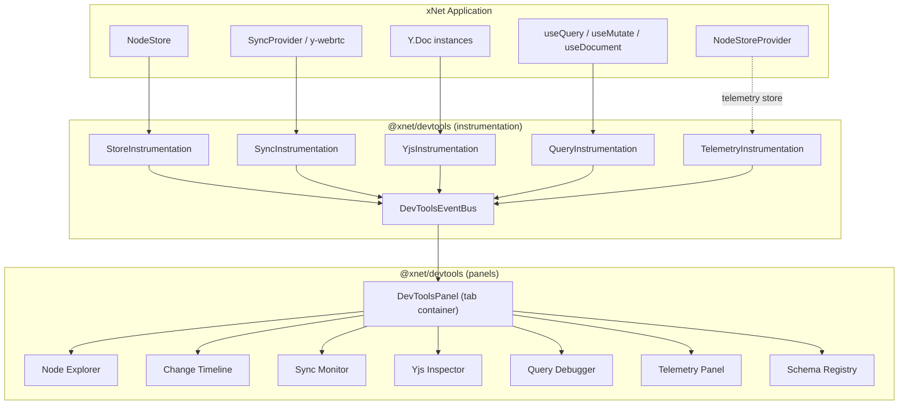

# xNet Implementation Plan - Step 03.2.2: DevTools

> Protocol-level debugging, inspection, and observability for xNet applications

## Executive Summary

This plan creates `@xnet/devtools` - an embeddable developer toolkit for inspecting, debugging, and understanding xNet applications across all platforms. Unlike generic React devtools, this is protocol-aware: it understands Nodes, Schemas, Lamport clocks, hash chains, P2P sync, Yjs CRDTs, and the upcoming telemetry/security layer.

```typescript
// Drop-in integration - zero config
import { DevToolsProvider } from '@xnet/devtools'

function App() {
  return (
    <NodeStoreProvider store={store}>
      <DevToolsProvider> {/* Ctrl+Shift+D to toggle */}
        <YourApp />
      </DevToolsProvider>
    </NodeStoreProvider>
  )
}
```

## Design Principles

| Principle                | Implementation                                                          |
| ------------------------ | ----------------------------------------------------------------------- |
| **Zero-config**          | Works by wrapping your app with `<DevToolsProvider>`                    |
| **Protocol-aware**       | Understands Nodes, Changes, Lamport timestamps, hash chains             |
| **Tree-shakeable**       | `import '@xnet/devtools'` in dev only; zero bytes in production         |
| **Reuses existing UI**   | Leverages `@xnet/views` TableView for node browsing                     |
| **Platform-agnostic**    | Works in Electron, Expo (via overlay), and Web                          |
| **Telemetry-integrated** | Displays security events, peer scores, consent status from planStep03_1 |
| **Non-invasive**         | Instrumentation via subscription/proxy, never mutates app state         |

## Architecture Overview



## Current State

| Feature              | Status  | Notes                                                                |
| -------------------- | ------- | -------------------------------------------------------------------- |
| Package scaffold     | Done    | package.json, tsconfig, conditional exports, build works             |
| Instrumentation bus  | Done    | Ring buffer EventBus, store/sync/yjs instrumentation                 |
| Node Explorer        | Done    | Custom list with schema filter, search, detail pane                  |
| Change Timeline      | Done    | Lamport-ordered timeline with type/node filtering                    |
| Sync Monitor         | Done    | Peer list, connection status, sync event log                         |
| Yjs Inspector        | Done    | Doc list with size/update metrics, update log                        |
| Query Debugger       | Done    | QueryTracker, hook list, perf metrics, detail pane                   |
| Telemetry Panel      | Done    | Security/performance/consent sub-tabs, instrumentation               |
| Schema Registry      | Done    | Schema browser with node counts                                      |
| Platform integration | Partial | Ctrl+Shift+D + 4-finger tap implemented, not tested in Expo/Electron |

## Implementation Phases

### Phase 1: Package & Event Bus (Week 1)

| Task | Document                                     | Description                                                           |
| ---- | -------------------------------------------- | --------------------------------------------------------------------- |
| 1.1  | [01-package-setup.md](./01-package-setup.md) | Package scaffold, dependencies, tree-shaking, exports                 |
| 1.2  | [02-event-bus.md](./02-event-bus.md)         | DevToolsEventBus, typed events, ring buffer, instrumentation wrappers |

**Validation Gate:**

- [x] `@xnet/devtools` package builds successfully
- [x] EventBus captures store CRUD events
- [x] EventBus captures sync status changes
- [x] Production builds tree-shake to 0 bytes
- [x] Ring buffer limits memory to configurable max

### Phase 2: Provider & Panel Shell (Week 1-2)

| Task | Document                                             | Description                                                              |
| ---- | ---------------------------------------------------- | ------------------------------------------------------------------------ |
| 2.1  | [03-devtools-provider.md](./03-devtools-provider.md) | DevToolsProvider, panel shell, tab navigation, keyboard shortcut, layout |

**Validation Gate:**

- [x] `<DevToolsProvider>` renders children unmodified when closed
- [x] `Ctrl+Shift+D` toggles panel
- [x] Panel supports bottom/right/floating positions
- [x] Tab navigation between panels works
- [x] Panel is resizable via drag handle

### Phase 3: Data Panels (Week 2-3)

| Task | Document                                         | Description                                                        |
| ---- | ------------------------------------------------ | ------------------------------------------------------------------ |
| 3.1  | [04-node-explorer.md](./04-node-explorer.md)     | Node browsing with TableView, schema grouping, property inspection |
| 3.2  | [05-change-timeline.md](./05-change-timeline.md) | Event-sourced timeline, conflict visualization, time-travel        |
| 3.3  | [06-sync-monitor.md](./06-sync-monitor.md)       | P2P connections, peer list, sync events, latency                   |

**Validation Gate:**

- [x] Node Explorer shows all nodes grouped by schema
- [ ] Node Explorer uses `@xnet/views` TableView for rendering
- [x] Change Timeline shows Lamport-ordered changes
- [x] Conflicts are highlighted with resolution info
- [x] Sync Monitor shows live peer list with status
- [x] Sync event log updates in real-time

### Phase 4: CRDT & Hooks Panels (Week 3-4)

| Task | Document                                       | Description                                                |
| ---- | ---------------------------------------------- | ---------------------------------------------------------- |
| 4.1  | [07-yjs-inspector.md](./07-yjs-inspector.md)   | Y.Doc tree view, state vectors, undo manager, size metrics |
| 4.2  | [08-query-debugger.md](./08-query-debugger.md) | Active subscriptions, update tracking, performance metrics |

**Validation Gate:**

- [ ] Yjs Inspector shows Y.Doc structure (Maps, XmlFragments)
- [ ] State vector table displays all client entries
- [x] Query Debugger lists all active useQuery/useDocument hooks
- [x] Performance metrics (update frequency, render time) are tracked
- [ ] Hook source location is displayed where possible

> Note: YjsInspector shows update events/sizes but not Y.Doc tree structure or state vectors yet. Hook source location not yet captured.

### Phase 5: Telemetry & Platform (Week 4-5)

| Task | Document                                                   | Description                                                   |
| ---- | ---------------------------------------------------------- | ------------------------------------------------------------- |
| 5.1  | [09-telemetry-panel.md](./09-telemetry-panel.md)           | Security events, peer scores, consent status, metrics display |
| 5.2  | [10-platform-integration.md](./10-platform-integration.md) | Electron IPC, Expo overlay, Web PWA, mobile gesture toggle    |

**Validation Gate:**

- [x] Telemetry panel shows security events from planStep03_1
- [ ] Peer scores display with score breakdown
- [x] Consent status is visible and editable
- [ ] Devtools work in Electron main window
- [ ] Devtools work in Expo via dev overlay
- [x] Mobile: 4-finger tap toggles panel

> Note: Peer scores require live PeerScorer integration (instrumentation emits events but no live peer score polling yet). Platform integration not yet tested in apps.

## Package Structure

```
packages/devtools/
├── src/
│   ├── index.ts                    # Public exports (provider, hook)
│   ├── index.dev.ts                # Dev-only exports (full UI)
│   │
│   ├── core/
│   │   ├── event-bus.ts            # DevToolsEventBus (ring buffer, typed events)
│   │   ├── types.ts                # All DevTools event types
│   │   └── constants.ts            # Defaults, limits
│   │
│   ├── instrumentation/
│   │   ├── store.ts                # NodeStore wrapper (subscribe + method proxy)
│   │   ├── sync.ts                 # SyncProvider event forwarding
│   │   ├── yjs.ts                  # Y.Doc observation
│   │   ├── query.ts                # useQuery/useMutate tracking
│   │   └── telemetry.ts            # TelemetryCollector forwarding
│   │
│   ├── provider/
│   │   ├── DevToolsProvider.tsx    # Context + instrumentation setup
│   │   ├── DevToolsContext.ts      # React context
│   │   └── useDevTools.ts          # Consumer hook
│   │
│   ├── panels/
│   │   ├── Shell.tsx               # Tab container, resize, layout
│   │   ├── NodeExplorer/           # Uses @xnet/views TableView
│   │   ├── ChangeTimeline/         # Lamport timeline + time-travel
│   │   ├── SyncMonitor/            # P2P status + event log
│   │   ├── YjsInspector/           # Y.Doc tree view
│   │   ├── QueryDebugger/          # Hook tracking
│   │   ├── TelemetryPanel/         # Security + metrics
│   │   └── SchemaRegistry/         # Schema browser
│   │
│   └── utils/
│       ├── formatters.ts           # DID truncation, timestamp display
│       ├── performance.ts          # Timing utilities
│       └── platform.ts             # Platform detection
│
├── package.json
├── tsconfig.json
└── vite.config.ts
```

## Dependencies

| Package       | Version   | Purpose                                  |
| ------------- | --------- | ---------------------------------------- |
| `@xnet/data`  | workspace | NodeStore, SchemaRegistry types          |
| `@xnet/sync`  | workspace | Change, LamportClock, SyncProvider types |
| `@xnet/views` | workspace | TableView for Node Explorer              |
| `@xnet/react` | workspace | Hook types, NodeStoreContext             |
| `react`       | ^18       | Peer dependency                          |
| `yjs`         | ^13       | Peer dependency (Y.Doc inspection)       |

No additional external dependencies. All UI is built with Tailwind classes available from the host app.

## Key Design Decisions

### 1. Instrumentation via Subscription (not Proxy)

Rather than wrapping NodeStore methods with Proxy (fragile, breaks types), we use the existing `store.subscribe()` and `SyncProvider.on()` patterns. The instrumentation layer listens passively.

### 2. Ring Buffer for Events

The EventBus stores events in a fixed-size ring buffer (default 10,000 events). This prevents memory growth during long sessions while keeping enough history for debugging.

### 3. Reuse @xnet/views TableView

Node Explorer renders using the existing `TableView` component with synthesized schemas. This gives us virtual scrolling, sorting, filtering, and column management for free.

### 4. Telemetry Integration

The Telemetry Panel reads from the same `NodeStore` that `@xnet/telemetry` writes to. SecurityEvents, PerformanceMetrics, and CrashReports are just Nodes with known schemas - we query them with `useQuery`.

### 5. Platform Strategy

| Platform     | Toggle                | Panel Location              |
| ------------ | --------------------- | --------------------------- |
| Electron     | `Ctrl+Shift+D`        | Bottom/right of main window |
| Web PWA      | `Ctrl+Shift+D`        | Bottom/right of viewport    |
| Expo iOS     | 4-finger tap          | Full-screen overlay         |
| Expo Android | 4-finger tap or shake | Full-screen overlay         |

## Success Criteria

1. **Zero-config works** - `<DevToolsProvider>` with no props gives full devtools
2. **Production-safe** - Tree-shaking removes all devtools code in prod builds
3. **All panels functional** - 7 panels covering the full xNet protocol stack
4. **Telemetry visible** - Security events, peer scores, and metrics from planStep03_1
5. **Cross-platform** - Works on Electron, Web, and Expo
6. **Performance** - <1ms overhead per instrumented operation
7. **Memory-bounded** - Ring buffer caps at configurable limit
8. **Reuses UI** - TableView from @xnet/views for node rendering

## Reference Documents

- [Exploration: DevTools Design](../explorations/DEVTOOLS_DESIGN.md) - Initial design research
- [Exploration: LiveStore Evaluation](../explorations/LIVESTORE_EVALUATION.md) - LiveStore comparison
- [Plan: Telemetry & Network Security](../planStep03_1TelemetryAndNetworkSecurity/README.md) - Telemetry schemas and security events

---

[Start Implementation](./01-package-setup.md)
