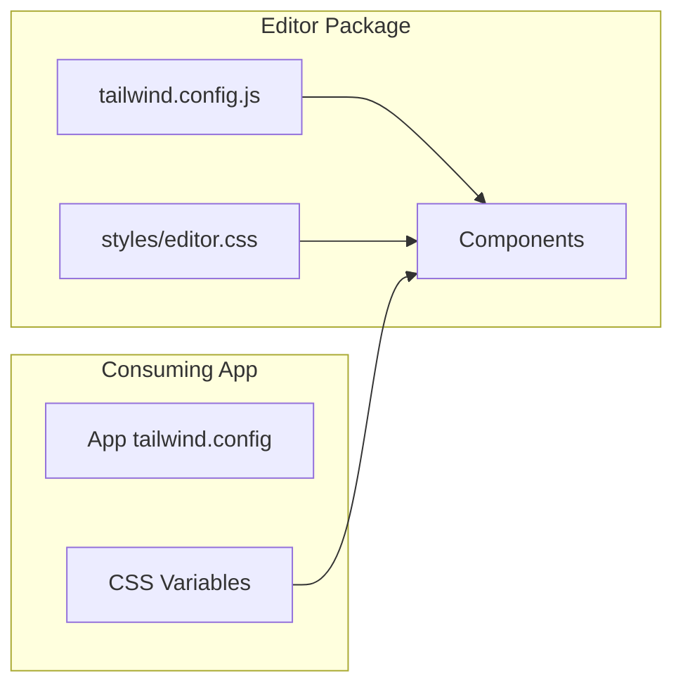

# 01: Tailwind Setup for Editor Package

> Configure Tailwind CSS for the @xnet/editor package with proper theming

**Duration:** 0.5 days  
**Dependencies:** None

## Overview

The editor package needs its own Tailwind configuration that:

1. Works with the consuming app's theme
2. Uses CSS variables for colors (dark mode support)
3. Includes typography plugin for prose styling
4. Has custom animations for menus



## Implementation

### 1. Install Dependencies

```bash
# In packages/editor
pnpm add -D tailwindcss @tailwindcss/typography tailwind-merge clsx
```

### 2. Tailwind Configuration

```javascript
// packages/editor/tailwind.config.js

/** @type {import('tailwindcss').Config} */
export default {
  content: ['./src/**/*.{ts,tsx}'],

  // Don't purge - let the consuming app handle that
  safelist: [
    // Ensure all editor classes are included
    { pattern: /^(md-syntax|heading-|code-|bubble-|slash-)/ }
  ],

  theme: {
    extend: {
      // CSS variable-based colors for theming
      colors: {
        background: 'hsl(var(--background, 0 0% 100%))',
        foreground: 'hsl(var(--foreground, 240 10% 3.9%))',
        muted: {
          DEFAULT: 'hsl(var(--muted, 240 4.8% 95.9%))',
          foreground: 'hsl(var(--muted-foreground, 240 3.8% 46.1%))'
        },
        accent: {
          DEFAULT: 'hsl(var(--accent, 240 4.8% 95.9%))',
          foreground: 'hsl(var(--accent-foreground, 240 5.9% 10%))'
        },
        primary: {
          DEFAULT: 'hsl(var(--primary, 240 5.9% 10%))',
          foreground: 'hsl(var(--primary-foreground, 0 0% 98%))'
        },
        border: 'hsl(var(--border, 240 5.9% 90%))',
        ring: 'hsl(var(--ring, 240 5.9% 10%))'
      },

      // Editor-specific animations
      keyframes: {
        'syntax-appear': {
          from: { opacity: '0', width: '0' },
          to: { opacity: 'var(--syntax-opacity, 0.5)', width: 'auto' }
        },
        'syntax-disappear': {
          from: { opacity: 'var(--syntax-opacity, 0.5)', width: 'auto' },
          to: { opacity: '0', width: '0' }
        },
        'menu-appear': {
          from: { opacity: '0', transform: 'translateY(-4px) scale(0.95)' },
          to: { opacity: '1', transform: 'translateY(0) scale(1)' }
        },
        'menu-disappear': {
          from: { opacity: '1', transform: 'translateY(0) scale(1)' },
          to: { opacity: '0', transform: 'translateY(-4px) scale(0.95)' }
        }
      },

      animation: {
        'syntax-appear': 'syntax-appear 150ms ease-out forwards',
        'syntax-disappear': 'syntax-disappear 150ms ease-out forwards',
        'menu-appear': 'menu-appear 150ms ease-out forwards',
        'menu-disappear': 'menu-disappear 100ms ease-out forwards'
      },

      // Custom transition durations
      transitionDuration: {
        150: '150ms'
      },

      // Typography customization
      typography: ({ theme }) => ({
        DEFAULT: {
          css: {
            '--tw-prose-body': theme('colors.foreground'),
            '--tw-prose-headings': theme('colors.foreground'),
            '--tw-prose-links': theme('colors.primary.DEFAULT'),
            '--tw-prose-code': theme('colors.foreground'),
            '--tw-prose-pre-bg': theme('colors.muted.DEFAULT'),
            '--tw-prose-pre-code': theme('colors.foreground'),

            // Remove default margins (we control spacing)
            '> *': {
              marginTop: '0',
              marginBottom: '0'
            },

            // Headings
            h1: {
              fontWeight: '700',
              marginTop: theme('spacing.8'),
              marginBottom: theme('spacing.4')
            },
            h2: {
              fontWeight: '600',
              marginTop: theme('spacing.6'),
              marginBottom: theme('spacing.3')
            },
            h3: {
              fontWeight: '500',
              marginTop: theme('spacing.4'),
              marginBottom: theme('spacing.2')
            },

            // Paragraphs
            p: {
              marginTop: theme('spacing.2'),
              marginBottom: theme('spacing.2')
            },

            // Lists
            ul: {
              marginTop: theme('spacing.2'),
              marginBottom: theme('spacing.2'),
              paddingLeft: theme('spacing.6')
            },
            ol: {
              marginTop: theme('spacing.2'),
              marginBottom: theme('spacing.2'),
              paddingLeft: theme('spacing.6')
            },
            li: {
              marginTop: theme('spacing.1'),
              marginBottom: theme('spacing.1')
            },

            // Code
            code: {
              backgroundColor: theme('colors.muted.DEFAULT'),
              borderRadius: theme('borderRadius.md'),
              padding: `${theme('spacing.0.5')} ${theme('spacing.1.5')}`,
              fontWeight: '400',

              // Remove backticks
              '&::before': { content: 'none' },
              '&::after': { content: 'none' }
            },

            // Pre/code blocks
            pre: {
              backgroundColor: theme('colors.muted.DEFAULT'),
              borderRadius: theme('borderRadius.lg'),
              padding: theme('spacing.4'),
              overflowX: 'auto',

              code: {
                backgroundColor: 'transparent',
                padding: '0'
              }
            },

            // Blockquotes
            blockquote: {
              borderLeftWidth: '4px',
              borderLeftColor: theme('colors.primary.DEFAULT'),
              paddingLeft: theme('spacing.4'),
              fontStyle: 'normal',

              p: {
                marginTop: '0',
                marginBottom: '0'
              }
            },

            // Links
            a: {
              textDecoration: 'underline',
              textUnderlineOffset: '3px',
              transition: 'color 150ms',

              '&:hover': {
                color: theme('colors.primary.DEFAULT')
              }
            },

            // Horizontal rules
            hr: {
              borderColor: theme('colors.border'),
              marginTop: theme('spacing.6'),
              marginBottom: theme('spacing.6')
            }
          }
        },

        // Dark mode variant
        invert: {
          css: {
            '--tw-prose-body': theme('colors.foreground'),
            '--tw-prose-headings': theme('colors.foreground')
          }
        }
      })
    }
  },

  plugins: [
    require('@tailwindcss/typography'),

    // Custom plugin for editor-specific utilities
    function ({ addUtilities }) {
      addUtilities({
        '.md-syntax': {
          color: 'hsl(var(--muted-foreground))',
          opacity: 'var(--syntax-opacity, 0.5)',
          fontFamily: 'var(--font-mono, ui-monospace, monospace)',
          fontWeight: '400',
          userSelect: 'none',
          pointerEvents: 'none'
        },
        '.syntax-transition': {
          transition: 'opacity 150ms ease-out, width 150ms ease-out'
        }
      })
    }
  ]
}
```

### 3. CSS Variables (Base)

```css
/* packages/editor/src/styles/editor.css */

/* Base editor styles - uses Tailwind where possible, CSS for ProseMirror specifics */

/* Editor container */
.ProseMirror {
  @apply outline-none min-h-full;
}

/* Placeholder */
.ProseMirror .is-editor-empty::before,
.ProseMirror .is-empty::before {
  content: attr(data-placeholder);
  @apply float-left text-muted-foreground pointer-events-none h-0;
}

/* Selection highlight */
.ProseMirror ::selection {
  @apply bg-primary/20;
}

/* Node selection (images, etc.) */
.ProseMirror .ProseMirror-selectednode {
  @apply outline-2 outline-primary/50 outline-offset-2;
}

/* Task list checkboxes */
.ProseMirror ul[data-type='taskList'] {
  @apply list-none pl-0;
}

.ProseMirror ul[data-type='taskList'] li {
  @apply flex items-start gap-2;
}

.ProseMirror ul[data-type='taskList'] li > label {
  @apply flex-shrink-0 mt-0.5;
}

.ProseMirror ul[data-type='taskList'] li > label input[type='checkbox'] {
  @apply w-4 h-4 rounded border-2 border-border 
         appearance-none cursor-pointer
         checked:bg-primary checked:border-primary
         transition-colors duration-150;
}

.ProseMirror ul[data-type='taskList'] li > label input[type='checkbox']:checked::after {
  content: '';
  @apply block w-full h-full;
  background-image: url("data:image/svg+xml,%3Csvg viewBox='0 0 16 16' fill='white' xmlns='http://www.w3.org/2000/svg'%3E%3Cpath d='M12.207 4.793a1 1 0 010 1.414l-5 5a1 1 0 01-1.414 0l-2-2a1 1 0 011.414-1.414L6.5 9.086l4.293-4.293a1 1 0 011.414 0z'/%3E%3C/svg%3E");
}

/* Wikilinks */
.ProseMirror a[data-wikilink] {
  @apply text-primary underline underline-offset-2 cursor-pointer
         hover:text-primary/80 transition-colors;
}

/* Markdown syntax characters */
.md-syntax {
  @apply text-muted-foreground font-mono font-normal select-none pointer-events-none;
  opacity: var(--syntax-opacity, 0.5);
  transition:
    opacity 150ms ease-out,
    width 150ms ease-out;
}

.md-syntax-open {
  /* Opening syntax (**, *, etc.) */
}

.md-syntax-close {
  /* Closing syntax */
}

/* Drag handle positioning (used by DragHandle extension) */
.drag-handle {
  @apply fixed opacity-0 z-50 cursor-grab
         w-6 h-8 rounded flex items-center justify-center
         bg-muted/50 hover:bg-muted
         transition-opacity duration-150;
}

.drag-handle.visible {
  @apply opacity-100;
}

.drag-handle:active {
  @apply cursor-grabbing bg-muted;
}

/* Drop indicator line */
.drop-indicator {
  @apply absolute left-0 right-0 h-0.5 bg-primary rounded-full
         pointer-events-none;
}
```

### 4. Utility Function

```typescript
// packages/editor/src/utils/cn.ts

import { clsx, type ClassValue } from 'clsx'
import { twMerge } from 'tailwind-merge'

/**
 * Merge Tailwind classes with proper precedence.
 * Combines clsx for conditional classes and tailwind-merge for deduplication.
 */
export function cn(...inputs: ClassValue[]): string {
  return twMerge(clsx(inputs))
}
```

### 5. Update Package.json

```json
{
  "name": "@xnet/editor",
  "dependencies": {
    // ... existing
    "clsx": "^2.1.0",
    "tailwind-merge": "^2.6.0"
  },
  "devDependencies": {
    // ... existing
    "tailwindcss": "^3.4.0",
    "@tailwindcss/typography": "^0.5.0"
  }
}
```

### 6. Export Styles

```typescript
// packages/editor/src/styles/index.ts

// Export CSS for apps to import
import './editor.css'

// Re-export cn utility
export { cn } from '../utils/cn'
```

## Usage in Apps

### Web App

```typescript
// apps/web/tailwind.config.js

export default {
  content: [
    './src/**/*.{ts,tsx}',
    // Include editor package
    '../../packages/editor/src/**/*.{ts,tsx}'
  ],

  // Extend or override editor theme
  theme: {
    extend: {
      // App can override colors
    }
  },

  // Include editor's Tailwind config
  presets: [require('../../packages/editor/tailwind.config.js')]
}
```

```css
/* apps/web/src/styles/globals.css */

@tailwind base;
@tailwind components;
@tailwind utilities;

/* Import editor styles */
@import '@xnet/editor/styles';

/* Define CSS variables */
:root {
  --background: 0 0% 100%;
  --foreground: 240 10% 3.9%;
  --muted: 240 4.8% 95.9%;
  --muted-foreground: 240 3.8% 46.1%;
  --accent: 240 4.8% 95.9%;
  --accent-foreground: 240 5.9% 10%;
  --primary: 240 5.9% 10%;
  --primary-foreground: 0 0% 98%;
  --border: 240 5.9% 90%;
  --ring: 240 5.9% 10%;

  /* Editor-specific variables */
  --syntax-opacity: 0.5;
  --font-mono: ui-monospace, 'SF Mono', Menlo, monospace;
}

.dark {
  --background: 240 10% 3.9%;
  --foreground: 0 0% 98%;
  --muted: 240 3.7% 15.9%;
  --muted-foreground: 240 5% 64.9%;
  --accent: 240 3.7% 15.9%;
  --accent-foreground: 0 0% 98%;
  --primary: 0 0% 98%;
  --primary-foreground: 240 5.9% 10%;
  --border: 240 3.7% 15.9%;
  --ring: 240 4.9% 83.9%;
}
```

## Testing

```typescript
// packages/editor/src/utils/cn.test.ts

import { describe, it, expect } from 'vitest'
import { cn } from './cn'

describe('cn', () => {
  it('should merge classes', () => {
    expect(cn('px-2', 'py-4')).toBe('px-2 py-4')
  })

  it('should handle conditional classes', () => {
    const isActive = true
    expect(cn('base', isActive && 'active')).toBe('base active')
  })

  it('should dedupe conflicting classes', () => {
    expect(cn('px-2', 'px-4')).toBe('px-4')
  })

  it('should handle arrays', () => {
    expect(cn(['px-2', 'py-4'])).toBe('px-2 py-4')
  })

  it('should handle objects', () => {
    expect(cn({ 'px-2': true, 'py-4': false })).toBe('px-2')
  })
})
```

## Checklist

- [ ] Install Tailwind and typography plugin
- [ ] Create tailwind.config.js with theme
- [ ] Create editor.css with base styles
- [ ] Create cn() utility function
- [ ] Update package.json dependencies
- [ ] Document usage in consuming apps
- [ ] Test dark mode works
- [ ] Test typography classes work
- [ ] Tests pass

---

[Back to README](./README.md) | [Next: Editor Styles](./02-editor-styles.md)
