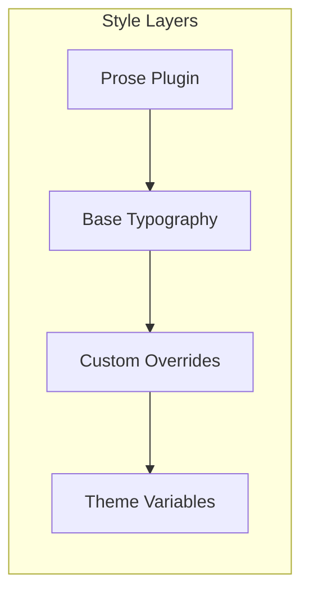

# 02: Editor Base Styles

> Base styling for the editor using Tailwind's typography plugin and custom prose configuration

**Duration:** 0.5 days  
**Dependencies:** [01-tailwind-setup.md](./01-tailwind-setup.md)

## Overview

This document covers the base styling for the editor content area using Tailwind's `@tailwindcss/typography` plugin. The goal is to provide beautiful default typography while allowing customization through CSS variables.



## Implementation

### 1. EditorContent Styling

```typescript
// packages/editor/src/components/RichTextEditor.tsx

import { EditorContent } from '@tiptap/react'
import { cn } from '../utils'

export function RichTextEditor({ /* props */ }) {
  return (
    <div className="relative h-full">
      <EditorContent
        editor={editor}
        className={cn(
          // Base prose styling
          'prose prose-neutral dark:prose-invert',
          // Size and spacing
          'prose-lg max-w-none',
          // Focus state
          '[&_.ProseMirror]:outline-none',
          '[&_.ProseMirror]:min-h-full',
          // Placeholder
          '[&_.ProseMirror_.is-empty]:before:content-[attr(data-placeholder)]',
          '[&_.ProseMirror_.is-empty]:before:text-muted-foreground',
          '[&_.ProseMirror_.is-empty]:before:float-left',
          '[&_.ProseMirror_.is-empty]:before:pointer-events-none',
          '[&_.ProseMirror_.is-empty]:before:h-0'
        )}
      />
    </div>
  )
}
```

### 2. Typography Plugin Configuration

```javascript
// packages/editor/tailwind.config.js

module.exports = {
  // ...
  theme: {
    extend: {
      typography: ({ theme }) => ({
        DEFAULT: {
          css: {
            // Colors from CSS variables
            '--tw-prose-body': 'hsl(var(--foreground))',
            '--tw-prose-headings': 'hsl(var(--foreground))',
            '--tw-prose-lead': 'hsl(var(--muted-foreground))',
            '--tw-prose-links': 'hsl(var(--primary))',
            '--tw-prose-bold': 'hsl(var(--foreground))',
            '--tw-prose-counters': 'hsl(var(--muted-foreground))',
            '--tw-prose-bullets': 'hsl(var(--muted-foreground))',
            '--tw-prose-hr': 'hsl(var(--border))',
            '--tw-prose-quotes': 'hsl(var(--foreground))',
            '--tw-prose-quote-borders': 'hsl(var(--primary))',
            '--tw-prose-captions': 'hsl(var(--muted-foreground))',
            '--tw-prose-code': 'hsl(var(--foreground))',
            '--tw-prose-pre-code': 'hsl(var(--foreground))',
            '--tw-prose-pre-bg': 'hsl(var(--muted))',
            '--tw-prose-th-borders': 'hsl(var(--border))',
            '--tw-prose-td-borders': 'hsl(var(--border))',

            // Headings
            h1: {
              fontSize: theme('fontSize.3xl')[0],
              fontWeight: '700',
              marginTop: theme('spacing.8'),
              marginBottom: theme('spacing.4'),
              lineHeight: '1.2'
            },
            h2: {
              fontSize: theme('fontSize.2xl')[0],
              fontWeight: '600',
              marginTop: theme('spacing.6'),
              marginBottom: theme('spacing.3'),
              lineHeight: '1.3'
            },
            h3: {
              fontSize: theme('fontSize.xl')[0],
              fontWeight: '500',
              marginTop: theme('spacing.5'),
              marginBottom: theme('spacing.2'),
              lineHeight: '1.4'
            },
            h4: {
              fontSize: theme('fontSize.lg')[0],
              fontWeight: '500',
              marginTop: theme('spacing.4'),
              marginBottom: theme('spacing.2')
            },

            // Paragraphs
            p: {
              marginTop: theme('spacing.4'),
              marginBottom: theme('spacing.4'),
              lineHeight: '1.75'
            },

            // First paragraph after heading - less top margin
            'h1 + p, h2 + p, h3 + p, h4 + p': {
              marginTop: theme('spacing.2')
            },

            // Links
            a: {
              color: 'var(--tw-prose-links)',
              textDecoration: 'underline',
              textUnderlineOffset: '3px',
              fontWeight: '500',
              transition: 'color 150ms',
              '&:hover': {
                color: 'hsl(var(--primary) / 0.8)'
              }
            },

            // Strong/Bold
            strong: {
              fontWeight: '600'
            },

            // Code inline
            code: {
              backgroundColor: 'hsl(var(--muted))',
              borderRadius: theme('borderRadius.md'),
              padding: `${theme('spacing.0.5')} ${theme('spacing.1.5')}`,
              fontWeight: '400',
              fontSize: '0.875em',
              // Remove backticks
              '&::before': { content: 'none' },
              '&::after': { content: 'none' }
            },

            // Code blocks
            pre: {
              backgroundColor: 'hsl(var(--muted))',
              borderRadius: theme('borderRadius.lg'),
              padding: theme('spacing.4'),
              overflowX: 'auto',
              fontSize: '0.875em',
              lineHeight: '1.7',
              code: {
                backgroundColor: 'transparent',
                padding: '0',
                borderRadius: '0',
                fontWeight: '400'
              }
            },

            // Blockquotes
            blockquote: {
              borderLeftWidth: '4px',
              borderLeftColor: 'hsl(var(--primary))',
              paddingLeft: theme('spacing.4'),
              fontStyle: 'normal',
              color: 'var(--tw-prose-quotes)',
              marginTop: theme('spacing.4'),
              marginBottom: theme('spacing.4'),
              p: {
                marginTop: theme('spacing.2'),
                marginBottom: theme('spacing.2')
              },
              'p:first-of-type::before': { content: 'none' },
              'p:last-of-type::after': { content: 'none' }
            },

            // Lists
            ul: {
              marginTop: theme('spacing.4'),
              marginBottom: theme('spacing.4'),
              paddingLeft: theme('spacing.6')
            },
            ol: {
              marginTop: theme('spacing.4'),
              marginBottom: theme('spacing.4'),
              paddingLeft: theme('spacing.6')
            },
            li: {
              marginTop: theme('spacing.2'),
              marginBottom: theme('spacing.2')
            },
            'li > ul, li > ol': {
              marginTop: theme('spacing.2'),
              marginBottom: theme('spacing.2')
            },

            // Horizontal rules
            hr: {
              borderColor: 'hsl(var(--border))',
              marginTop: theme('spacing.8'),
              marginBottom: theme('spacing.8')
            }
          }
        },

        // Dark mode - handled via CSS variables, but ensure invert works
        invert: {
          css: {
            '--tw-prose-body': 'hsl(var(--foreground))',
            '--tw-prose-headings': 'hsl(var(--foreground))'
          }
        }
      })
    }
  }
}
```

### 3. ProseMirror-Specific Styles

```css
/* packages/editor/src/styles/editor.css */

/* Base editor container */
.ProseMirror {
  @apply outline-none min-h-full;
}

/* Selection styling */
.ProseMirror ::selection {
  @apply bg-primary/20;
}

/* Placeholder for empty paragraphs */
.ProseMirror p.is-empty::before {
  content: attr(data-placeholder);
  @apply float-left text-muted-foreground pointer-events-none h-0;
}

/* First paragraph placeholder (editor-level) */
.ProseMirror.is-editor-empty::before {
  content: attr(data-placeholder);
  @apply float-left text-muted-foreground pointer-events-none h-0;
}

/* Task list styling */
.ProseMirror ul[data-type='taskList'] {
  @apply list-none pl-0;
}

.ProseMirror ul[data-type='taskList'] li {
  @apply flex items-start gap-2;
}

.ProseMirror ul[data-type='taskList'] li > label {
  @apply flex-shrink-0 mt-1;
}

.ProseMirror ul[data-type='taskList'] li > label input[type='checkbox'] {
  @apply w-4 h-4 rounded border-2 border-border 
         appearance-none cursor-pointer
         checked:bg-primary checked:border-primary
         transition-colors duration-150;
}

.ProseMirror ul[data-type='taskList'] li > label input[type='checkbox']:checked::after {
  content: '';
  @apply block w-full h-full;
  background-image: url("data:image/svg+xml,%3Csvg viewBox='0 0 16 16' fill='white' xmlns='http://www.w3.org/2000/svg'%3E%3Cpath d='M12.207 4.793a1 1 0 010 1.414l-5 5a1 1 0 01-1.414 0l-2-2a1 1 0 011.414-1.414L6.5 9.086l4.293-4.293a1 1 0 011.414 0z'/%3E%3C/svg%3E");
}

/* Task list content wrapper */
.ProseMirror ul[data-type='taskList'] li > div {
  @apply flex-1;
}

/* Checked task - optional strikethrough */
.ProseMirror ul[data-type='taskList'] li[data-checked='true'] > div {
  @apply text-muted-foreground;
}

/* Wikilinks */
.ProseMirror a[data-wikilink] {
  @apply text-primary underline underline-offset-2 cursor-pointer
         hover:text-primary/80 transition-colors;
}

/* Horizontal rule */
.ProseMirror hr {
  @apply border-t border-border my-8;
}

/* Images */
.ProseMirror img {
  @apply rounded-lg max-w-full h-auto;
}

.ProseMirror img.ProseMirror-selectednode {
  @apply ring-2 ring-primary ring-offset-2;
}
```

### 4. Extension HTMLAttributes

Configure extensions to use Tailwind classes:

```typescript
// packages/editor/src/extensions/index.ts

import StarterKit from '@tiptap/starter-kit'
import Link from '@tiptap/extension-link'
import TaskList from '@tiptap/extension-task-list'
import TaskItem from '@tiptap/extension-task-item'

export function createExtensions() {
  return [
    StarterKit.configure({
      heading: {
        levels: [1, 2, 3, 4]
      },
      codeBlock: {
        HTMLAttributes: {
          class: 'not-prose' // Exclude from prose styling
        }
      },
      blockquote: {
        HTMLAttributes: {
          class: 'not-prose border-l-4 border-primary pl-4 my-4'
        }
      },
      horizontalRule: {
        HTMLAttributes: {
          class: 'my-8 border-t border-border'
        }
      }
    }),

    Link.configure({
      HTMLAttributes: {
        class: 'text-primary underline underline-offset-2 hover:text-primary/80 transition-colors'
      },
      openOnClick: false
    }),

    TaskList.configure({
      HTMLAttributes: {
        class: 'not-prose list-none pl-0'
      }
    }),

    TaskItem.configure({
      HTMLAttributes: {
        class: 'flex items-start gap-2'
      },
      nested: true
    })
  ]
}
```

## Tests

```typescript
// packages/editor/src/styles/editor-styles.test.tsx

import { describe, it, expect } from 'vitest'
import { render } from '@testing-library/react'
import { Editor } from '@tiptap/core'
import { EditorContent, useEditor } from '@tiptap/react'
import StarterKit from '@tiptap/starter-kit'

function TestEditor({ content }: { content: string }) {
  const editor = useEditor({
    extensions: [StarterKit],
    content,
  })

  return (
    <div className="prose">
      <EditorContent editor={editor} />
    </div>
  )
}

describe('Editor Styles', () => {
  it('should render headings with correct classes', () => {
    const { container } = render(
      <TestEditor content="<h1>Heading 1</h1><h2>Heading 2</h2>" />
    )

    const h1 = container.querySelector('h1')
    const h2 = container.querySelector('h2')

    expect(h1).toBeInTheDocument()
    expect(h2).toBeInTheDocument()
  })

  it('should render code blocks with not-prose class', () => {
    const { container } = render(
      <TestEditor content="<pre><code>const x = 1</code></pre>" />
    )

    const pre = container.querySelector('pre')
    expect(pre).toHaveClass('not-prose')
  })

  it('should render blockquotes with border', () => {
    const { container } = render(
      <TestEditor content="<blockquote><p>Quote</p></blockquote>" />
    )

    const blockquote = container.querySelector('blockquote')
    expect(blockquote).toBeInTheDocument()
  })

  it('should render links with proper styling', () => {
    const { container } = render(
      <TestEditor content='<p><a href="https://example.com">Link</a></p>' />
    )

    const link = container.querySelector('a')
    expect(link).toHaveClass('text-primary')
  })
})
```

## Checklist

- [ ] Configure typography plugin in tailwind.config.js
- [ ] Create editor.css with ProseMirror styles
- [ ] Apply prose classes to EditorContent
- [ ] Configure extension HTMLAttributes
- [ ] Style task list checkboxes
- [ ] Style wikilinks
- [ ] Style horizontal rules
- [ ] Style images with selection state
- [ ] Test dark mode
- [ ] Tests pass

---

[Back to README](./README.md) | [Previous: Tailwind Setup](./01-tailwind-setup.md) | [Next: Toolbar Polish](./03-toolbar-polish.md)
