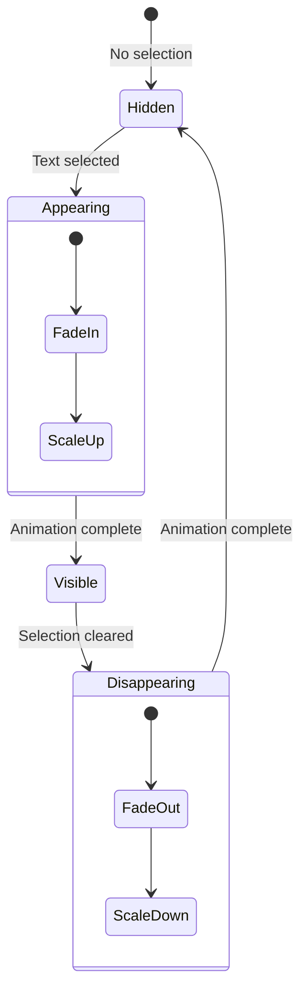

# 03: Toolbar Polish

> Enhanced bubble menu with smooth animations and polished interactions

**Duration:** 0.5 days  
**Dependencies:** [01-tailwind-setup.md](./01-tailwind-setup.md), [02-editor-styles.md](./02-editor-styles.md)

## Overview

This document covers polishing the existing FloatingToolbar/BubbleMenu to have smooth animations, better visual design, and improved interactions. We'll transform the basic toolbar into a Notion-style floating menu.



## Implementation

### 1. BubbleMenu Component

```typescript
// packages/editor/src/components/BubbleMenu/index.tsx

import { BubbleMenu as TiptapBubbleMenu } from '@tiptap/react'
import type { Editor } from '@tiptap/react'
import { cn } from '../../utils'
import { TextButtons } from './TextButtons'
import { NodeSelector } from './NodeSelector'
import { LinkEditor } from './LinkEditor'

interface BubbleMenuProps {
  editor: Editor
}

export function BubbleMenu({ editor }: BubbleMenuProps) {
  return (
    <TiptapBubbleMenu
      editor={editor}
      tippyOptions={{
        duration: [200, 150],
        animation: 'scale-fade',
        moveTransition: 'transform 0.15s ease-out',
        maxWidth: 'none',
      }}
      shouldShow={({ editor, state, from, to }) => {
        // Don't show in code blocks
        if (editor.isActive('codeBlock')) return false

        // Don't show for node selections (images, etc.)
        if (state.selection.node) return false

        // Only show with actual text selection
        return from !== to
      }}
      className={cn(
        'bubble-menu',
        'flex items-center',
        'px-1 py-1 gap-0.5',
        'rounded-lg',
        'bg-background border border-border',
        'shadow-lg shadow-black/10 dark:shadow-black/30'
      )}
    >
      <NodeSelector editor={editor} />
      <Separator />
      <TextButtons editor={editor} />
      <Separator />
      <LinkEditor editor={editor} />
    </TiptapBubbleMenu>
  )
}

function Separator() {
  return <div className="w-px h-6 bg-border mx-0.5" />
}
```

### 2. Text Format Buttons

```typescript
// packages/editor/src/components/BubbleMenu/TextButtons.tsx

import { memo } from 'react'
import type { Editor } from '@tiptap/react'
import { cn } from '../../utils'

interface TextButtonsProps {
  editor: Editor
}

interface ButtonConfig {
  name: string
  label: string
  className?: string
  isActive: (editor: Editor) => boolean
  command: (editor: Editor) => void
  shortcut: string
}

const BUTTONS: ButtonConfig[] = [
  {
    name: 'bold',
    label: 'B',
    className: 'font-bold',
    isActive: (e) => e.isActive('bold'),
    command: (e) => e.chain().focus().toggleBold().run(),
    shortcut: 'Cmd+B',
  },
  {
    name: 'italic',
    label: 'I',
    className: 'italic',
    isActive: (e) => e.isActive('italic'),
    command: (e) => e.chain().focus().toggleItalic().run(),
    shortcut: 'Cmd+I',
  },
  {
    name: 'strike',
    label: 'S',
    className: 'line-through',
    isActive: (e) => e.isActive('strike'),
    command: (e) => e.chain().focus().toggleStrike().run(),
    shortcut: 'Cmd+Shift+S',
  },
  {
    name: 'code',
    label: '</>',
    className: 'font-mono text-xs',
    isActive: (e) => e.isActive('code'),
    command: (e) => e.chain().focus().toggleCode().run(),
    shortcut: 'Cmd+E',
  },
]

export const TextButtons = memo(function TextButtons({ editor }: TextButtonsProps) {
  return (
    <div className="flex items-center">
      {BUTTONS.map((button) => (
        <ToolbarButton
          key={button.name}
          editor={editor}
          config={button}
        />
      ))}
    </div>
  )
})

interface ToolbarButtonProps {
  editor: Editor
  config: ButtonConfig
}

function ToolbarButton({ editor, config }: ToolbarButtonProps) {
  const isActive = config.isActive(editor)

  return (
    <button
      type="button"
      onClick={() => config.command(editor)}
      onMouseDown={(e) => e.preventDefault()}
      title={`${config.name} (${config.shortcut})`}
      className={cn(
        'flex items-center justify-center',
        'w-8 h-8 rounded',
        'text-sm',
        'transition-colors duration-100',
        config.className,
        isActive
          ? 'bg-primary/15 text-primary'
          : 'text-muted-foreground hover:text-foreground hover:bg-accent'
      )}
    >
      {config.label}
    </button>
  )
}
```

### 3. Node Type Selector

```typescript
// packages/editor/src/components/BubbleMenu/NodeSelector.tsx

import { memo, useState } from 'react'
import type { Editor } from '@tiptap/react'
import { cn } from '../../utils'

interface NodeSelectorProps {
  editor: Editor
}

interface NodeOption {
  name: string
  label: string
  isActive: (editor: Editor) => boolean
  command: (editor: Editor) => void
}

const NODE_OPTIONS: NodeOption[] = [
  {
    name: 'paragraph',
    label: 'Text',
    isActive: (e) => e.isActive('paragraph'),
    command: (e) => e.chain().focus().setParagraph().run(),
  },
  {
    name: 'heading1',
    label: 'Heading 1',
    isActive: (e) => e.isActive('heading', { level: 1 }),
    command: (e) => e.chain().focus().setHeading({ level: 1 }).run(),
  },
  {
    name: 'heading2',
    label: 'Heading 2',
    isActive: (e) => e.isActive('heading', { level: 2 }),
    command: (e) => e.chain().focus().setHeading({ level: 2 }).run(),
  },
  {
    name: 'heading3',
    label: 'Heading 3',
    isActive: (e) => e.isActive('heading', { level: 3 }),
    command: (e) => e.chain().focus().setHeading({ level: 3 }).run(),
  },
  {
    name: 'bulletList',
    label: 'Bullet List',
    isActive: (e) => e.isActive('bulletList'),
    command: (e) => e.chain().focus().toggleBulletList().run(),
  },
  {
    name: 'orderedList',
    label: 'Numbered List',
    isActive: (e) => e.isActive('orderedList'),
    command: (e) => e.chain().focus().toggleOrderedList().run(),
  },
  {
    name: 'blockquote',
    label: 'Quote',
    isActive: (e) => e.isActive('blockquote'),
    command: (e) => e.chain().focus().toggleBlockquote().run(),
  },
]

export const NodeSelector = memo(function NodeSelector({ editor }: NodeSelectorProps) {
  const [isOpen, setIsOpen] = useState(false)

  const activeNode = NODE_OPTIONS.find((opt) => opt.isActive(editor)) || NODE_OPTIONS[0]

  return (
    <div className="relative">
      <button
        type="button"
        onClick={() => setIsOpen(!isOpen)}
        onMouseDown={(e) => e.preventDefault()}
        className={cn(
          'flex items-center gap-1',
          'px-2 h-8 rounded',
          'text-sm font-medium',
          'transition-colors duration-100',
          'text-muted-foreground hover:text-foreground hover:bg-accent'
        )}
      >
        <span>{activeNode.label}</span>
        <ChevronDownIcon className="w-3 h-3" />
      </button>

      {isOpen && (
        <>
          {/* Backdrop */}
          <div
            className="fixed inset-0 z-40"
            onClick={() => setIsOpen(false)}
          />

          {/* Dropdown */}
          <div
            className={cn(
              'absolute top-full left-0 mt-1 z-50',
              'min-w-[140px] py-1',
              'rounded-lg border border-border bg-background',
              'shadow-lg shadow-black/10',
              'animate-in fade-in-0 zoom-in-95 duration-100'
            )}
          >
            {NODE_OPTIONS.map((option) => (
              <button
                key={option.name}
                type="button"
                onClick={() => {
                  option.command(editor)
                  setIsOpen(false)
                }}
                className={cn(
                  'flex items-center w-full px-3 py-1.5',
                  'text-sm text-left',
                  'transition-colors duration-75',
                  option.isActive(editor)
                    ? 'bg-accent text-accent-foreground'
                    : 'hover:bg-accent/50'
                )}
              >
                {option.label}
              </button>
            ))}
          </div>
        </>
      )}
    </div>
  )
})

function ChevronDownIcon({ className }: { className?: string }) {
  return (
    <svg
      className={className}
      viewBox="0 0 24 24"
      fill="none"
      stroke="currentColor"
      strokeWidth="2"
      strokeLinecap="round"
      strokeLinejoin="round"
    >
      <path d="m6 9 6 6 6-6" />
    </svg>
  )
}
```

### 4. Link Editor

```typescript
// packages/editor/src/components/BubbleMenu/LinkEditor.tsx

import { memo, useState, useCallback } from 'react'
import type { Editor } from '@tiptap/react'
import { cn } from '../../utils'

interface LinkEditorProps {
  editor: Editor
}

export const LinkEditor = memo(function LinkEditor({ editor }: LinkEditorProps) {
  const [isOpen, setIsOpen] = useState(false)
  const [url, setUrl] = useState('')

  const isActive = editor.isActive('link')

  const handleOpen = useCallback(() => {
    const existingUrl = editor.getAttributes('link').href || ''
    setUrl(existingUrl)
    setIsOpen(true)
  }, [editor])

  const handleSubmit = useCallback(() => {
    if (url) {
      editor.chain().focus().setLink({ href: url }).run()
    } else {
      editor.chain().focus().unsetLink().run()
    }
    setIsOpen(false)
  }, [editor, url])

  const handleRemove = useCallback(() => {
    editor.chain().focus().unsetLink().run()
    setIsOpen(false)
  }, [editor])

  return (
    <div className="relative">
      <button
        type="button"
        onClick={handleOpen}
        onMouseDown={(e) => e.preventDefault()}
        title="Link (Cmd+K)"
        className={cn(
          'flex items-center justify-center',
          'w-8 h-8 rounded',
          'text-sm',
          'transition-colors duration-100',
          isActive
            ? 'bg-primary/15 text-primary'
            : 'text-muted-foreground hover:text-foreground hover:bg-accent'
        )}
      >
        <LinkIcon className="w-4 h-4" />
      </button>

      {isOpen && (
        <>
          <div
            className="fixed inset-0 z-40"
            onClick={() => setIsOpen(false)}
          />

          <div
            className={cn(
              'absolute top-full right-0 mt-1 z-50',
              'p-2 w-64',
              'rounded-lg border border-border bg-background',
              'shadow-lg shadow-black/10',
              'animate-in fade-in-0 zoom-in-95 duration-100'
            )}
          >
            <input
              type="url"
              value={url}
              onChange={(e) => setUrl(e.target.value)}
              onKeyDown={(e) => {
                if (e.key === 'Enter') {
                  e.preventDefault()
                  handleSubmit()
                }
              }}
              placeholder="https://..."
              autoFocus
              className={cn(
                'w-full px-3 py-2 rounded-md',
                'text-sm',
                'border border-border bg-background',
                'focus:outline-none focus:ring-2 focus:ring-primary/20'
              )}
            />

            <div className="flex gap-2 mt-2">
              <button
                type="button"
                onClick={handleSubmit}
                className={cn(
                  'flex-1 px-3 py-1.5 rounded-md',
                  'text-sm font-medium',
                  'bg-primary text-primary-foreground',
                  'hover:bg-primary/90'
                )}
              >
                {isActive ? 'Update' : 'Add'}
              </button>

              {isActive && (
                <button
                  type="button"
                  onClick={handleRemove}
                  className={cn(
                    'px-3 py-1.5 rounded-md',
                    'text-sm font-medium',
                    'text-destructive hover:bg-destructive/10'
                  )}
                >
                  Remove
                </button>
              )}
            </div>
          </div>
        </>
      )}
    </div>
  )
})

function LinkIcon({ className }: { className?: string }) {
  return (
    <svg
      className={className}
      viewBox="0 0 24 24"
      fill="none"
      stroke="currentColor"
      strokeWidth="2"
      strokeLinecap="round"
      strokeLinejoin="round"
    >
      <path d="M10 13a5 5 0 0 0 7.54.54l3-3a5 5 0 0 0-7.07-7.07l-1.72 1.71" />
      <path d="M14 11a5 5 0 0 0-7.54-.54l-3 3a5 5 0 0 0 7.07 7.07l1.71-1.71" />
    </svg>
  )
}
```

### 5. Tippy Animation CSS

```css
/* packages/editor/src/styles/toolbar.css */

/* Custom tippy animation for bubble menu */
.tippy-box[data-animation='scale-fade'][data-state='hidden'] {
  opacity: 0;
  transform: scale(0.95);
}

.tippy-box[data-animation='scale-fade'][data-state='visible'] {
  opacity: 1;
  transform: scale(1);
}

.tippy-box[data-animation='scale-fade'] {
  transition:
    opacity 0.15s ease-out,
    transform 0.15s ease-out;
}

/* Remove default tippy arrow and background */
.tippy-box.bubble-menu {
  background: transparent;
}

.tippy-box.bubble-menu > .tippy-content {
  padding: 0;
}

.tippy-box.bubble-menu > .tippy-arrow {
  display: none;
}
```

## Tests

```typescript
// packages/editor/src/components/BubbleMenu/BubbleMenu.test.tsx

import { describe, it, expect, vi } from 'vitest'
import { render, screen, fireEvent } from '@testing-library/react'
import { Editor } from '@tiptap/core'
import { BubbleMenu } from './index'

// Mock editor
const createMockEditor = (overrides = {}) => ({
  isActive: vi.fn().mockReturnValue(false),
  chain: vi.fn().mockReturnValue({
    focus: vi.fn().mockReturnValue({
      toggleBold: vi.fn().mockReturnValue({ run: vi.fn() }),
      toggleItalic: vi.fn().mockReturnValue({ run: vi.fn() }),
      setLink: vi.fn().mockReturnValue({ run: vi.fn() }),
    }),
  }),
  getAttributes: vi.fn().mockReturnValue({}),
  ...overrides,
}) as unknown as Editor

describe('BubbleMenu', () => {
  describe('TextButtons', () => {
    it('should render all format buttons', () => {
      const editor = createMockEditor()
      render(<TextButtons editor={editor} />)

      expect(screen.getByTitle(/bold/i)).toBeInTheDocument()
      expect(screen.getByTitle(/italic/i)).toBeInTheDocument()
      expect(screen.getByTitle(/strike/i)).toBeInTheDocument()
      expect(screen.getByTitle(/code/i)).toBeInTheDocument()
    })

    it('should highlight active formats', () => {
      const editor = createMockEditor({
        isActive: (type: string) => type === 'bold',
      })
      render(<TextButtons editor={editor} />)

      const boldButton = screen.getByTitle(/bold/i)
      expect(boldButton).toHaveClass('bg-primary/15')
    })

    it('should call command on click', () => {
      const toggleBold = vi.fn().mockReturnValue({ run: vi.fn() })
      const editor = createMockEditor({
        chain: vi.fn().mockReturnValue({
          focus: vi.fn().mockReturnValue({ toggleBold }),
        }),
      })

      render(<TextButtons editor={editor} />)
      fireEvent.click(screen.getByTitle(/bold/i))

      expect(toggleBold).toHaveBeenCalled()
    })
  })

  describe('NodeSelector', () => {
    it('should show current node type', () => {
      const editor = createMockEditor({
        isActive: (type: string, attrs?: any) =>
          type === 'heading' && attrs?.level === 2,
      })

      render(<NodeSelector editor={editor} />)

      expect(screen.getByText('Heading 2')).toBeInTheDocument()
    })

    it('should open dropdown on click', () => {
      const editor = createMockEditor()
      render(<NodeSelector editor={editor} />)

      fireEvent.click(screen.getByText('Text'))

      expect(screen.getByText('Heading 1')).toBeInTheDocument()
      expect(screen.getByText('Bullet List')).toBeInTheDocument()
    })
  })

  describe('LinkEditor', () => {
    it('should open URL input on click', () => {
      const editor = createMockEditor()
      render(<LinkEditor editor={editor} />)

      fireEvent.click(screen.getByTitle(/link/i))

      expect(screen.getByPlaceholderText('https://...')).toBeInTheDocument()
    })

    it('should show existing URL when editing link', () => {
      const editor = createMockEditor({
        isActive: () => true,
        getAttributes: () => ({ href: 'https://example.com' }),
      })

      render(<LinkEditor editor={editor} />)
      fireEvent.click(screen.getByTitle(/link/i))

      const input = screen.getByPlaceholderText('https://...')
      expect(input).toHaveValue('https://example.com')
    })
  })
})
```

## Checklist

- [ ] Create BubbleMenu container component
- [ ] Create TextButtons component
- [ ] Create NodeSelector dropdown
- [ ] Create LinkEditor popover
- [ ] Add tippy animation CSS
- [ ] Add keyboard shortcuts display in tooltips
- [ ] Style active/hover states
- [ ] Add smooth transitions
- [ ] Test all interactions
- [ ] Tests pass

---

[Back to README](./README.md) | [Previous: Editor Styles](./02-editor-styles.md) | [Next: Inline Marks Plugin](./04-inline-marks-plugin.md)
