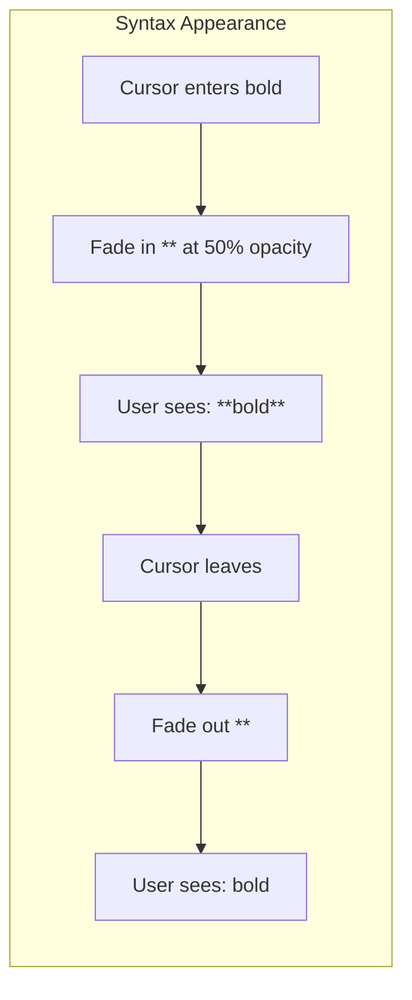

# 05: Syntax Styling

> CSS styling for markdown syntax characters with faded appearance and smooth transitions

**Duration:** 0.5 days  
**Dependencies:** [04-inline-marks-plugin.md](./04-inline-marks-plugin.md)

## Overview

This document covers the visual styling of markdown syntax characters (`**`, `*`, `` ` ``, etc.) that appear when editing formatted text. The goal is to make them visible but unobtrusive - faded, monospace, and non-selectable.



## Design Goals

| Goal                        | Implementation                          |
| --------------------------- | --------------------------------------- |
| **Visible but unobtrusive** | 50% opacity, muted color                |
| **Consistent font**         | Monospace for all syntax                |
| **Non-interactive**         | pointer-events: none, user-select: none |
| **Smooth transitions**      | 150ms opacity animation                 |
| **No layout shift**         | Inline display, no width changes        |

## Implementation

### 1. CSS Variables

```css
/* packages/editor/src/styles/syntax.css */

:root {
  /* Syntax styling variables - can be overridden by apps */
  --syntax-opacity: 0.5;
  --syntax-color: var(--muted-foreground);
  --syntax-font: var(--font-mono, ui-monospace, 'SF Mono', Menlo, monospace);
  --syntax-transition-duration: 150ms;
}
```

### 2. Base Syntax Styles

```css
/* packages/editor/src/styles/syntax.css */

/* Base markdown syntax character styling */
.md-syntax {
  /* Color and opacity */
  color: hsl(var(--syntax-color));
  opacity: var(--syntax-opacity);

  /* Font */
  font-family: var(--syntax-font);
  font-weight: 400;
  font-size: inherit;

  /* Non-interactive */
  user-select: none;
  -webkit-user-select: none;
  pointer-events: none;

  /* Inline display - no layout impact */
  display: inline;

  /* Accessibility */
  aria-hidden: true;
}

/* Animation for appearing syntax */
.md-syntax {
  animation: syntax-fade-in var(--syntax-transition-duration) ease-out forwards;
}

@keyframes syntax-fade-in {
  from {
    opacity: 0;
  }
  to {
    opacity: var(--syntax-opacity);
  }
}

/* Opening syntax (before content) */
.md-syntax-open {
  /* No extra spacing needed */
}

/* Closing syntax (after content) */
.md-syntax-close {
  /* No extra spacing needed */
}
```

### 3. Mark-Specific Styles

```css
/* packages/editor/src/styles/syntax.css */

/* Bold syntax - slightly more prominent */
.md-syntax[data-mark='bold'] {
  font-weight: 600;
}

/* Italic syntax */
.md-syntax[data-mark='italic'] {
  font-style: italic;
}

/* Strikethrough syntax */
.md-syntax[data-mark='strike'] {
  /* Standard appearance */
}

/* Code syntax - has background */
.md-syntax[data-mark='code'] {
  background-color: hsl(var(--muted) / 0.5);
  border-radius: 2px;
  padding: 0 2px;
}

/* Link syntax */
.md-syntax[data-mark='link'] {
  /* Standard appearance */
}

/* Link URL portion - even more faded */
.md-syntax-url {
  opacity: calc(var(--syntax-opacity) * 0.8);
  font-size: 0.9em;
}
```

### 4. Tailwind Utility Classes

For components using Tailwind directly instead of CSS:

```typescript
// packages/editor/src/utils/syntax-classes.ts

import { cn } from './cn'

/**
 * Get Tailwind classes for syntax styling
 */
export function getSyntaxClasses(markType?: string) {
  return cn(
    // Base styles
    'inline',
    'font-mono font-normal',
    'text-muted-foreground',
    'opacity-50',
    'select-none pointer-events-none',
    // Animation
    'animate-syntax-appear',
    // Mark-specific
    markType === 'bold' && 'font-semibold',
    markType === 'italic' && 'italic',
    markType === 'code' && 'bg-muted/50 rounded-sm px-0.5'
  )
}

/**
 * Tailwind config addition for syntax animation
 */
export const syntaxAnimationConfig = {
  keyframes: {
    'syntax-appear': {
      from: { opacity: '0' },
      to: { opacity: '0.5' }
    }
  },
  animation: {
    'syntax-appear': 'syntax-appear 150ms ease-out forwards'
  }
}
```

### 5. Widget Creation with Styles

```typescript
// packages/editor/src/extensions/live-preview/inline-marks.ts

function createSyntaxSpan(text: string, markType: string, position: 'open' | 'close'): HTMLElement {
  const span = document.createElement('span')

  // Classes
  span.className = `md-syntax md-syntax-${position}`

  // Data attributes
  span.setAttribute('data-mark', markType)
  span.setAttribute('data-position', position)

  // Accessibility - hide from screen readers
  span.setAttribute('aria-hidden', 'true')

  // Content
  span.textContent = text

  return span
}
```

### 6. Dark Mode Support

The styles use CSS variables that automatically adapt to dark mode:

```css
/* Light mode (default) */
:root {
  --syntax-color: 240 3.8% 46.1%; /* muted-foreground */
  --muted: 240 4.8% 95.9%;
}

/* Dark mode */
.dark {
  --syntax-color: 240 5% 64.9%; /* muted-foreground dark */
  --muted: 240 3.7% 15.9%;
}
```

### 7. Integration Example

```typescript
// packages/editor/src/extensions/live-preview/inline-marks.ts

import { Plugin, PluginKey } from '@tiptap/pm/state'
import { Decoration, DecorationSet } from '@tiptap/pm/view'

// Import the syntax styles
import '../../styles/syntax.css'

export function createInlineMarksPlugin(options: InlineMarksPluginOptions) {
  return new Plugin({
    key: new PluginKey('inlineMarks'),

    props: {
      decorations(state) {
        // ... decoration logic ...

        decorations.push(
          Decoration.widget(range.from, () => createSyntaxSpan(syntax.open, markType, 'open'), {
            side: -1
          })
        )

        // ... more logic ...
      }
    }
  })
}
```

## Visual Examples

### Bold Text

```
Unfocused: Some bold text here
                ↓ cursor enters
Focused:   Some **bold** text here
                  ^^  ^^ (faded, monospace)
```

### Nested Marks

```
Unfocused: Some bold italic text
                ↓ cursor enters
Focused:   Some ***bold italic*** text
           (outer ** for bold, inner * for italic)
```

### Code

```
Unfocused: Use the `code` function
                    ↓ cursor enters
Focused:   Use the `code` function
                   ^    ^ (faded backticks with subtle bg)
```

## Tests

```typescript
// packages/editor/src/styles/syntax.test.ts

import { describe, it, expect } from 'vitest'
import { getSyntaxClasses } from '../utils/syntax-classes'

describe('syntax styling', () => {
  describe('getSyntaxClasses', () => {
    it('should return base classes', () => {
      const classes = getSyntaxClasses()

      expect(classes).toContain('font-mono')
      expect(classes).toContain('opacity-50')
      expect(classes).toContain('select-none')
    })

    it('should add bold-specific classes', () => {
      const classes = getSyntaxClasses('bold')

      expect(classes).toContain('font-semibold')
    })

    it('should add code-specific classes', () => {
      const classes = getSyntaxClasses('code')

      expect(classes).toContain('bg-muted/50')
      expect(classes).toContain('rounded-sm')
    })
  })
})

describe('createSyntaxSpan', () => {
  it('should create span with correct attributes', () => {
    const span = createSyntaxSpan('**', 'bold', 'open')

    expect(span.className).toContain('md-syntax')
    expect(span.className).toContain('md-syntax-open')
    expect(span.getAttribute('data-mark')).toBe('bold')
    expect(span.getAttribute('aria-hidden')).toBe('true')
    expect(span.textContent).toBe('**')
  })
})
```

## Accessibility

- All syntax characters have `aria-hidden="true"` to hide from screen readers
- Screen readers will read the rendered content, not the syntax
- Visual opacity is sufficient (0.5) to meet contrast requirements for decorative elements
- Syntax does not affect keyboard navigation

## Checklist

- [ ] Create syntax.css with base styles
- [ ] Add CSS variables for customization
- [ ] Add mark-specific styles (bold, italic, code, etc.)
- [ ] Add animation keyframes
- [ ] Create Tailwind utility function
- [ ] Ensure dark mode works
- [ ] Add aria-hidden for accessibility
- [ ] Test visual appearance
- [ ] Tests pass

---

[Back to README](./README.md) | [Previous: Inline Marks Plugin](./04-inline-marks-plugin.md) | [Next: Link Preview](./06-link-preview.md)
