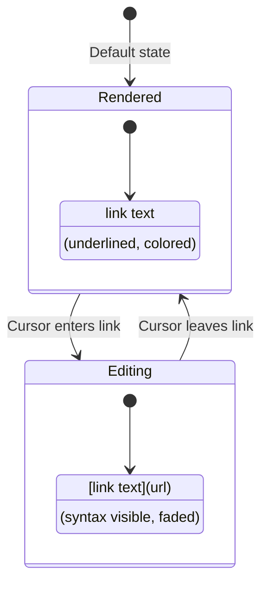

# 06: Link Preview

> Show `[text](url)` syntax when editing links, rendered link otherwise

**Duration:** 0.5 days  
**Dependencies:** [04-inline-marks-plugin.md](./04-inline-marks-plugin.md), [05-syntax-styling.md](./05-syntax-styling.md)

## Overview

Links require special handling because they have both visible text and a URL. When the cursor is inside a link, we show the full markdown syntax `[link text](https://url.com)`. When the cursor is elsewhere, we show just the rendered link.



## Implementation

### 1. Link Mark Extension

```typescript
// packages/editor/src/extensions/link-with-preview.ts

import { Mark, mergeAttributes } from '@tiptap/core'
import { Plugin, PluginKey } from '@tiptap/pm/state'
import { Decoration, DecorationSet } from '@tiptap/pm/view'

export interface LinkWithPreviewOptions {
  HTMLAttributes: Record<string, any>
  openOnClick: boolean
}

export const LinkWithPreview = Mark.create<LinkWithPreviewOptions>({
  name: 'link',

  priority: 1000,

  addOptions() {
    return {
      HTMLAttributes: {
        class:
          'text-primary underline underline-offset-2 cursor-pointer hover:text-primary/80 transition-colors'
      },
      openOnClick: false
    }
  },

  addAttributes() {
    return {
      href: {
        default: null
      },
      target: {
        default: null
      },
      title: {
        default: null
      }
    }
  },

  parseHTML() {
    return [{ tag: 'a[href]' }]
  },

  renderHTML({ HTMLAttributes }) {
    return ['a', mergeAttributes(this.options.HTMLAttributes, HTMLAttributes), 0]
  },

  addProseMirrorPlugins() {
    return [createLinkPreviewPlugin()]
  }
})
```

### 2. Link Preview Plugin

```typescript
// packages/editor/src/extensions/link-preview-plugin.ts

import { Plugin, PluginKey } from '@tiptap/pm/state'
import { Decoration, DecorationSet } from '@tiptap/pm/view'

export const linkPreviewPluginKey = new PluginKey('linkPreview')

export function createLinkPreviewPlugin() {
  return new Plugin({
    key: linkPreviewPluginKey,

    props: {
      decorations(state) {
        const { doc, selection } = state
        const { $from, empty } = selection

        // Only show when cursor is collapsed
        if (!empty) return DecorationSet.empty

        const decorations: Decoration[] = []

        // Check if cursor is in a link
        const linkMark = $from.marks().find((m) => m.type.name === 'link')
        if (!linkMark) return DecorationSet.empty

        const href = linkMark.attrs.href || ''

        // Find the link boundaries
        const range = findLinkRange(doc, $from.pos)
        if (!range) return DecorationSet.empty

        // Add opening bracket [
        decorations.push(
          Decoration.widget(range.from, () => createLinkSyntax('[', 'bracket-open'), {
            side: -1,
            key: 'link-open'
          })
        )

        // Add ]( after text
        decorations.push(
          Decoration.widget(range.to, () => createLinkSyntax('](', 'bracket-close'), {
            side: 0,
            key: 'link-middle'
          })
        )

        // Add URL
        decorations.push(
          Decoration.widget(range.to, () => createLinkUrl(href), { side: 1, key: 'link-url' })
        )

        // Add closing )
        decorations.push(
          Decoration.widget(range.to, () => createLinkSyntax(')', 'paren-close'), {
            side: 2,
            key: 'link-close'
          })
        )

        return DecorationSet.create(doc, decorations)
      }
    }
  })
}

function findLinkRange(doc: any, pos: number) {
  const $pos = doc.resolve(pos)
  const start = $pos.start()
  const end = $pos.end()

  let from = -1
  let to = -1

  doc.nodesBetween(start, end, (node: any, nodePos: number) => {
    if (!node.isText) return

    const hasLink = node.marks.some((m: any) => m.type.name === 'link')
    if (hasLink) {
      if (from === -1) from = nodePos
      to = nodePos + node.nodeSize
    }
  })

  return from !== -1 ? { from, to } : null
}

function createLinkSyntax(text: string, type: string): HTMLElement {
  const span = document.createElement('span')
  span.className = 'md-syntax md-syntax-link'
  span.setAttribute('data-type', type)
  span.setAttribute('aria-hidden', 'true')
  span.textContent = text
  return span
}

function createLinkUrl(url: string): HTMLElement {
  const span = document.createElement('span')
  span.className = 'md-syntax md-syntax-link md-syntax-url'
  span.setAttribute('aria-hidden', 'true')

  // Truncate long URLs
  const displayUrl = url.length > 40 ? url.slice(0, 37) + '...' : url
  span.textContent = displayUrl
  span.title = url // Full URL on hover

  return span
}
```

### 3. Link Syntax Styles

```css
/* packages/editor/src/styles/syntax.css */

/* Link syntax styling */
.md-syntax-link {
  color: hsl(var(--muted-foreground));
  opacity: var(--syntax-opacity);
  font-family: var(--syntax-font);
  font-size: inherit;
  user-select: none;
  pointer-events: none;
}

/* URL portion - slightly smaller and more faded */
.md-syntax-url {
  font-size: 0.85em;
  opacity: calc(var(--syntax-opacity) * 0.8);
  max-width: 200px;
  overflow: hidden;
  text-overflow: ellipsis;
  white-space: nowrap;
  display: inline-block;
  vertical-align: baseline;
}

/* Hover to show full URL */
.md-syntax-url[title]:hover::after {
  content: attr(title);
  position: absolute;
  /* Tooltip styling would go here */
}
```

### 4. Integration with LivePreview

```typescript
// packages/editor/src/extensions/live-preview/index.ts

import { Extension } from '@tiptap/core'
import { createInlineMarksPlugin } from './inline-marks'
import { createLinkPreviewPlugin } from './link-preview-plugin'

export const LivePreview = Extension.create({
  name: 'livePreview',

  addOptions() {
    return {
      marks: ['bold', 'italic', 'strike', 'code'],
      links: true // Enable link preview
    }
  },

  addProseMirrorPlugins() {
    const plugins = [
      createInlineMarksPlugin({
        marks: this.options.marks
      })
    ]

    if (this.options.links) {
      plugins.push(createLinkPreviewPlugin())
    }

    return plugins
  }
})
```

## Visual Example

```
Unfocused state:
  Check out my website for more info.
              ^^^^^^^^^^
              (underlined, primary color)

Focused state (cursor inside "website"):
  Check out [my website](https://example.com) for more info.
            ^          ^^                   ^
            [ (faded)  ]( (faded)           ) (faded)
                         ^^^^^^^^^^^^^^^^^^
                         (URL, smaller, more faded)
```

## Tests

```typescript
// packages/editor/src/extensions/link-preview-plugin.test.ts

import { describe, it, expect, beforeEach, afterEach } from 'vitest'
import { Editor } from '@tiptap/core'
import StarterKit from '@tiptap/starter-kit'
import { LinkWithPreview } from './link-with-preview'

describe('LinkPreviewPlugin', () => {
  let editor: Editor

  beforeEach(() => {
    editor = new Editor({
      extensions: [StarterKit.configure({ link: false }), LinkWithPreview],
      content: '<p>Check out <a href="https://example.com">my website</a> please</p>'
    })
  })

  afterEach(() => {
    editor.destroy()
  })

  it('should not show syntax when cursor outside link', () => {
    editor.commands.setTextSelection(1) // Before "Check"

    const decorations = getDecorations(editor)
    expect(decorations.length).toBe(0)
  })

  it('should show syntax when cursor inside link', () => {
    // Position cursor inside "my website"
    editor.commands.setTextSelection(14)

    const decorations = getDecorations(editor)
    expect(decorations.length).toBe(4) // [, ](, url, )
  })

  it('should include URL in decorations', () => {
    editor.commands.setTextSelection(14)

    const decorations = getDecorations(editor)
    const urlDecoration = decorations.find((d) => d.type.spec.key === 'link-url')

    expect(urlDecoration).toBeDefined()
  })

  it('should truncate long URLs', () => {
    editor.commands.setContent(
      '<p><a href="https://very-long-domain-name.example.com/path/to/something">link</a></p>'
    )
    editor.commands.setTextSelection(2)

    const decorations = getDecorations(editor)
    const urlElement = decorations[2]?.type.toDOM() as HTMLElement

    expect(urlElement.textContent?.length).toBeLessThanOrEqual(40)
    expect(urlElement.title).toContain('very-long-domain')
  })
})

function getDecorations(editor: Editor) {
  // Helper to extract decorations from plugin state
  const plugin = editor.view.state.plugins.find((p) => p.spec.key?.key === 'linkPreview')
  if (!plugin) return []

  const decorationSet = plugin.getState(editor.view.state)
  const decorations: any[] = []
  decorationSet?.find().forEach((d: any) => decorations.push(d))
  return decorations
}
```

## Edge Cases

| Scenario                     | Behavior                                 |
| ---------------------------- | ---------------------------------------- |
| Very long URL                | Truncate to 40 chars, show full on hover |
| Link at start of paragraph   | Syntax positioned correctly              |
| Link at end of paragraph     | Syntax positioned correctly              |
| Adjacent links               | Each link has independent syntax         |
| Link spanning multiple lines | Should still work (rare case)            |
| Empty link text              | Show syntax but minimal content          |
| Link with special characters | URL properly escaped                     |

## Checklist

- [ ] Create LinkWithPreview mark extension
- [ ] Create link preview plugin
- [ ] Add link syntax styles
- [ ] Handle URL truncation
- [ ] Add hover tooltip for full URL
- [ ] Integrate with LivePreview extension
- [ ] Handle edge cases
- [ ] Write tests
- [ ] Tests pass

---

[Back to README](./README.md) | [Previous: Syntax Styling](./05-syntax-styling.md) | [Next: Heading NodeView](./07-heading-nodeview.md)
