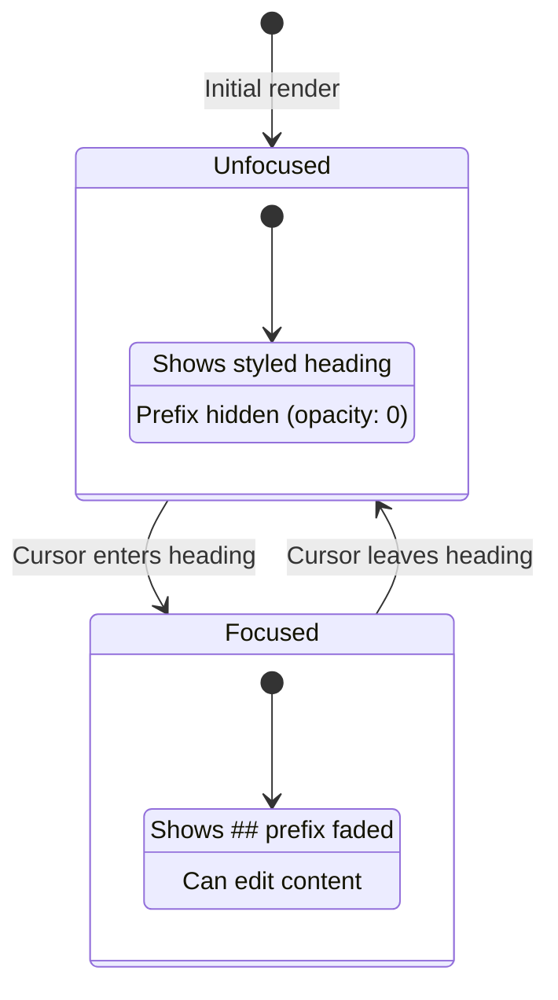

# 07: Heading NodeView

> Custom React NodeView that shows `#` characters when the heading is focused

**Duration:** 0.5 days  
**Dependencies:** [04-inline-marks-plugin.md](./04-inline-marks-plugin.md), [10-focus-detection.md](./10-focus-detection.md)

## Overview

The HeadingView is a custom NodeView that:

1. Renders headings with their normal styling (h1, h2, h3, etc.)
2. Shows the markdown `#` prefix when the cursor is inside the heading
3. Fades the prefix with a smooth transition
4. Allows editing the prefix to change heading level (future)



## Implementation

### 1. Focus Detection Hook

```typescript
// packages/editor/src/nodeviews/hooks/useNodeFocus.ts

import { useState, useEffect, useCallback } from 'react'
import type { Editor } from '@tiptap/react'

/**
 * Hook to track if the cursor is within a specific node.
 *
 * @param editor - The TipTap editor instance
 * @param getPos - Function that returns the node's position
 * @returns boolean indicating if the node is focused
 */
export function useNodeFocus(editor: Editor | null, getPos: () => number | undefined): boolean {
  const [isFocused, setIsFocused] = useState(false)

  const checkFocus = useCallback(() => {
    if (!editor) {
      setIsFocused(false)
      return
    }

    const pos = getPos()
    if (typeof pos !== 'number') {
      setIsFocused(false)
      return
    }

    const { from, to } = editor.state.selection
    const node = editor.state.doc.nodeAt(pos)

    if (!node) {
      setIsFocused(false)
      return
    }

    const nodeEnd = pos + node.nodeSize

    // Check if selection is completely within this node
    // (from and to are both inside the node boundaries)
    const focused = from > pos && to < nodeEnd

    setIsFocused(focused)
  }, [editor, getPos])

  useEffect(() => {
    if (!editor) return

    // Check immediately
    checkFocus()

    // Subscribe to selection updates
    const handleUpdate = () => checkFocus()

    editor.on('selectionUpdate', handleUpdate)
    editor.on('focus', handleUpdate)
    editor.on('blur', () => setIsFocused(false))

    return () => {
      editor.off('selectionUpdate', handleUpdate)
      editor.off('focus', handleUpdate)
      editor.off('blur', () => setIsFocused(false))
    }
  }, [editor, checkFocus])

  return isFocused
}
```

### 2. Heading NodeView Component

```typescript
// packages/editor/src/nodeviews/HeadingView.tsx

import { memo, useMemo } from 'react'
import { NodeViewWrapper, NodeViewContent, type NodeViewProps } from '@tiptap/react'
import { cn } from '../utils'
import { useNodeFocus } from './hooks/useNodeFocus'

/**
 * Props specific to heading nodes
 */
interface HeadingAttrs {
  level: 1 | 2 | 3 | 4 | 5 | 6
}

/**
 * Get the markdown prefix for a heading level
 */
function getHeadingPrefix(level: number): string {
  return '#'.repeat(level) + ' '
}

/**
 * HeadingView - Obsidian-style heading with visible markdown prefix
 *
 * Shows the `#` characters when the cursor is inside the heading,
 * hidden (with fade) when the cursor is elsewhere.
 */
export const HeadingView = memo(function HeadingView({
  node,
  editor,
  getPos,
}: NodeViewProps) {
  const level = (node.attrs as HeadingAttrs).level
  const isFocused = useNodeFocus(editor, getPos)

  // Memoize the prefix string
  const prefix = useMemo(() => getHeadingPrefix(level), [level])

  // Dynamic element type based on level
  const Tag = `h${level}` as const

  return (
    <NodeViewWrapper
      as={Tag}
      className={cn(
        'heading-line group relative',
        // Heading-level specific styles
        level === 1 && 'text-3xl font-bold mt-8 mb-4 leading-tight',
        level === 2 && 'text-2xl font-semibold mt-6 mb-3 leading-snug',
        level === 3 && 'text-xl font-medium mt-5 mb-2 leading-snug',
        level === 4 && 'text-lg font-medium mt-4 mb-2',
        level === 5 && 'text-base font-medium mt-3 mb-1',
        level === 6 && 'text-sm font-medium mt-3 mb-1 text-muted-foreground'
      )}
      data-level={level}
      data-focused={isFocused}
    >
      {/* Markdown prefix - visible when focused */}
      <span
        className={cn(
          'heading-syntax',
          // Base styles
          'inline-block',
          'font-mono font-normal',
          'text-muted-foreground',
          'select-none',
          'pointer-events-none',
          // Transition
          'transition-all duration-150 ease-out',
          // Conditional visibility
          isFocused
            ? 'opacity-50 w-auto mr-1'
            : 'opacity-0 w-0 mr-0 overflow-hidden'
        )}
        contentEditable={false}
        aria-hidden="true"
      >
        {prefix}
      </span>

      {/* Heading content - editable */}
      <NodeViewContent
        as="span"
        className="outline-none"
      />
    </NodeViewWrapper>
  )
})
```

### 3. Heading Extension Override

```typescript
// packages/editor/src/extensions/heading-with-syntax.ts

import { Node, mergeAttributes } from '@tiptap/core'
import { ReactNodeViewRenderer } from '@tiptap/react'
import { HeadingView } from '../nodeviews/HeadingView'

export interface HeadingWithSyntaxOptions {
  levels: number[]
  HTMLAttributes: Record<string, any>
}

/**
 * Custom Heading extension that uses HeadingView for live preview.
 *
 * Replaces the default Heading from StarterKit.
 */
export const HeadingWithSyntax = Node.create<HeadingWithSyntaxOptions>({
  name: 'heading',

  addOptions() {
    return {
      levels: [1, 2, 3, 4, 5, 6],
      HTMLAttributes: {}
    }
  },

  content: 'inline*',

  group: 'block',

  defining: true,

  addAttributes() {
    return {
      level: {
        default: 1,
        rendered: false
      }
    }
  },

  parseHTML() {
    return this.options.levels.map((level) => ({
      tag: `h${level}`,
      attrs: { level }
    }))
  },

  renderHTML({ node, HTMLAttributes }) {
    const level = node.attrs.level
    const Tag = `h${level}` as keyof HTMLElementTagNameMap

    return [Tag, mergeAttributes(this.options.HTMLAttributes, HTMLAttributes), 0]
  },

  // Use custom React NodeView
  addNodeView() {
    return ReactNodeViewRenderer(HeadingView, {
      // Ensure the wrapper element matches the heading tag
      as: 'div' // Wrapper, actual heading is inside
    })
  },

  addKeyboardShortcuts() {
    return this.options.levels.reduce(
      (shortcuts, level) => ({
        ...shortcuts,
        [`Mod-Alt-${level}`]: () => this.editor.commands.toggleHeading({ level })
      }),
      {}
    )
  },

  addInputRules() {
    return this.options.levels.map((level) => ({
      // Match # at start of line
      find: new RegExp(`^(#{1,${level}})\\s$`),
      handler: ({ state, range, match }) => {
        const { tr } = state
        const start = range.from
        const end = range.to

        tr.delete(start, end)
        tr.setBlockType(start, start, this.type, { level: match[1].length })
      }
    }))
  }
})
```

### 4. Integration with RichTextEditor

```typescript
// packages/editor/src/components/RichTextEditor.tsx

import { useEditor, EditorContent } from '@tiptap/react'
import StarterKit from '@tiptap/starter-kit'
import { HeadingWithSyntax } from '../extensions/heading-with-syntax'
import { LivePreview } from '../extensions/live-preview'

export function RichTextEditor(
  {
    /* props */
  }
) {
  const editor = useEditor({
    extensions: [
      StarterKit.configure({
        // Disable default heading, we use our own
        heading: false
      }),
      // Our custom heading with live preview
      HeadingWithSyntax.configure({
        levels: [1, 2, 3, 4, 5, 6]
      }),
      // Inline marks live preview
      LivePreview.configure({
        marks: ['bold', 'italic', 'strike', 'code']
      })
      // ... other extensions
    ]
    // ...
  })

  // ...
}
```

### 5. Tailwind Styles

The HeadingView uses Tailwind classes directly. Here's the complete set:

```typescript
// Heading levels mapping
const HEADING_STYLES = {
  1: 'text-3xl font-bold mt-8 mb-4 leading-tight',
  2: 'text-2xl font-semibold mt-6 mb-3 leading-snug',
  3: 'text-xl font-medium mt-5 mb-2 leading-snug',
  4: 'text-lg font-medium mt-4 mb-2',
  5: 'text-base font-medium mt-3 mb-1',
  6: 'text-sm font-medium mt-3 mb-1 text-muted-foreground'
}

// Syntax prefix styles
const SYNTAX_STYLES = {
  base: 'inline-block font-mono font-normal text-muted-foreground select-none pointer-events-none',
  transition: 'transition-all duration-150 ease-out',
  visible: 'opacity-50 w-auto mr-1',
  hidden: 'opacity-0 w-0 mr-0 overflow-hidden'
}
```

## Tests

```typescript
// packages/editor/src/nodeviews/HeadingView.test.tsx

import { describe, it, expect, beforeEach, afterEach } from 'vitest'
import { render, screen } from '@testing-library/react'
import { Editor } from '@tiptap/core'
import StarterKit from '@tiptap/starter-kit'
import { EditorContent, useEditor } from '@tiptap/react'
import { HeadingWithSyntax } from '../extensions/heading-with-syntax'

// Test wrapper component
function TestEditor({ content }: { content: string }) {
  const editor = useEditor({
    extensions: [
      StarterKit.configure({ heading: false }),
      HeadingWithSyntax,
    ],
    content,
  })

  return <EditorContent editor={editor} />
}

describe('HeadingView', () => {
  describe('rendering', () => {
    it('should render heading with correct level', () => {
      render(<TestEditor content="<h2>Test Heading</h2>" />)

      const heading = screen.getByRole('heading', { level: 2 })
      expect(heading).toBeInTheDocument()
      expect(heading).toHaveTextContent('Test Heading')
    })

    it('should have syntax prefix element', () => {
      render(<TestEditor content="<h2>Test Heading</h2>" />)

      const syntax = document.querySelector('.heading-syntax')
      expect(syntax).toBeInTheDocument()
      expect(syntax).toHaveTextContent('## ')
    })

    it('should hide syntax when not focused', () => {
      render(<TestEditor content="<h2>Test Heading</h2>" />)

      const syntax = document.querySelector('.heading-syntax')
      expect(syntax).toHaveClass('opacity-0')
    })
  })

  describe('focus behavior', () => {
    it('should show syntax when heading is focused', async () => {
      const { container } = render(<TestEditor content="<h2>Test Heading</h2>" />)

      // Focus the editor and move cursor into heading
      const editor = container.querySelector('.ProseMirror')
      editor?.focus()

      // Simulate clicking inside the heading
      const heading = screen.getByRole('heading', { level: 2 })
      heading.click()

      // Wait for state update
      await new Promise(r => setTimeout(r, 50))

      const syntax = document.querySelector('.heading-syntax')
      expect(syntax).toHaveClass('opacity-50')
    })
  })

  describe('levels', () => {
    it.each([1, 2, 3, 4, 5, 6])('should render h%i correctly', (level) => {
      const content = `<h${level}>Heading ${level}</h${level}>`
      render(<TestEditor content={content} />)

      const heading = screen.getByRole('heading', { level })
      expect(heading).toBeInTheDocument()

      const syntax = document.querySelector('.heading-syntax')
      expect(syntax).toHaveTextContent('#'.repeat(level) + ' ')
    })
  })
})
```

```typescript
// packages/editor/src/nodeviews/hooks/useNodeFocus.test.ts

import { describe, it, expect, vi } from 'vitest'
import { renderHook, act } from '@testing-library/react'
import { useNodeFocus } from './useNodeFocus'

describe('useNodeFocus', () => {
  const createMockEditor = (selection = { from: 0, to: 0 }) => ({
    state: {
      selection,
      doc: {
        nodeAt: (pos: number) => ({
          nodeSize: 10
        })
      }
    },
    on: vi.fn(),
    off: vi.fn()
  })

  it('should return false when editor is null', () => {
    const { result } = renderHook(() => useNodeFocus(null, () => 0))
    expect(result.current).toBe(false)
  })

  it('should return false when getPos returns undefined', () => {
    const editor = createMockEditor() as any
    const { result } = renderHook(() => useNodeFocus(editor, () => undefined))
    expect(result.current).toBe(false)
  })

  it('should return true when cursor is inside node', () => {
    const editor = createMockEditor({ from: 3, to: 3 }) as any
    const { result } = renderHook(() => useNodeFocus(editor, () => 0))

    // Node is at pos 0 with size 10, cursor at 3 is inside
    expect(result.current).toBe(true)
  })

  it('should return false when cursor is outside node', () => {
    const editor = createMockEditor({ from: 15, to: 15 }) as any
    const { result } = renderHook(() => useNodeFocus(editor, () => 0))

    // Node is at pos 0 with size 10, cursor at 15 is outside
    expect(result.current).toBe(false)
  })

  it('should subscribe to selectionUpdate events', () => {
    const editor = createMockEditor() as any
    renderHook(() => useNodeFocus(editor, () => 0))

    expect(editor.on).toHaveBeenCalledWith('selectionUpdate', expect.any(Function))
  })

  it('should unsubscribe on cleanup', () => {
    const editor = createMockEditor() as any
    const { unmount } = renderHook(() => useNodeFocus(editor, () => 0))

    unmount()

    expect(editor.off).toHaveBeenCalledWith('selectionUpdate', expect.any(Function))
  })
})
```

## Edge Cases

| Scenario                             | Expected Behavior                   |
| ------------------------------------ | ----------------------------------- |
| Empty heading                        | Show prefix, content is empty       |
| Heading at start of doc              | Prefix positioned correctly         |
| Heading at end of doc                | Works same as middle                |
| Multiple consecutive headings        | Each has independent focus state    |
| Selection spanning heading           | Don't show prefix (range selection) |
| Cursor at very start of heading      | Show prefix                         |
| Cursor at very end of heading        | Show prefix                         |
| Keyboard navigation through headings | Prefix shows/hides on focus change  |

## Accessibility

- Prefix is marked `aria-hidden="true"` (decorative)
- Heading element has correct role/level
- Content is fully keyboard navigable
- Screen readers read content, not syntax

## Performance

- `useNodeFocus` only updates on selection changes
- `memo()` prevents unnecessary re-renders
- Prefix string is memoized with `useMemo`
- CSS transitions are GPU-accelerated (opacity, transform)

## Checklist

- [ ] Create useNodeFocus hook
- [ ] Create HeadingView component
- [ ] Create HeadingWithSyntax extension
- [ ] Integrate with RichTextEditor
- [ ] Style with Tailwind
- [ ] Handle all 6 heading levels
- [ ] Add smooth transitions
- [ ] Ensure accessibility
- [ ] Write tests
- [ ] Tests pass

---

[Back to README](./README.md) | [Previous: Link Preview](./06-link-preview.md) | [Next: CodeBlock NodeView](./08-codeblock-nodeview.md)
