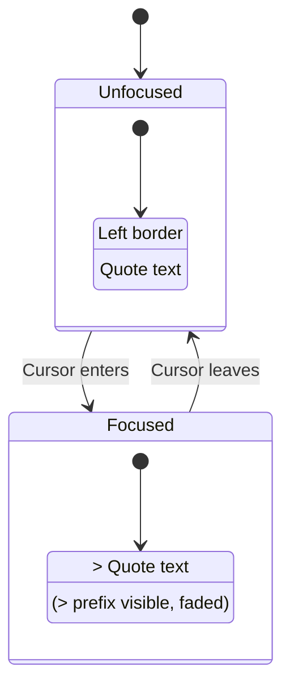

# 09: Blockquote NodeView

> Custom NodeView showing `>` prefix when blockquote is focused

**Duration:** 0.5 days  
**Dependencies:** [07-heading-nodeview.md](./07-heading-nodeview.md), [10-focus-detection.md](./10-focus-detection.md)

## Overview

The Blockquote NodeView shows the `>` markdown prefix when the cursor is inside the blockquote. This is simpler than headings and code blocks because blockquotes only have a single prefix character.



## Implementation

### 1. Blockquote NodeView Component

```typescript
// packages/editor/src/nodeviews/BlockquoteView.tsx

import { memo } from 'react'
import { NodeViewWrapper, NodeViewContent, type NodeViewProps } from '@tiptap/react'
import { cn } from '../utils'
import { useNodeFocus } from './hooks/useNodeFocus'

export const BlockquoteView = memo(function BlockquoteView({
  node,
  editor,
  getPos,
}: NodeViewProps) {
  const isFocused = useNodeFocus(editor, getPos)

  return (
    <NodeViewWrapper
      as="blockquote"
      className={cn(
        'blockquote-wrapper',
        'relative my-4 pl-4',
        'border-l-4 border-primary',
        'transition-colors duration-150',
        isFocused && 'border-primary/70'
      )}
      data-focused={isFocused}
    >
      {/* Quote prefix - visible when focused */}
      <span
        className={cn(
          'blockquote-syntax',
          'absolute left-0 top-0',
          'transform -translate-x-full pr-2',
          'font-mono text-muted-foreground',
          'select-none pointer-events-none',
          'transition-all duration-150 ease-out',
          isFocused
            ? 'opacity-50'
            : 'opacity-0'
        )}
        contentEditable={false}
        aria-hidden="true"
      >
        &gt;
      </span>

      {/* Quote content */}
      <NodeViewContent className="outline-none" />
    </NodeViewWrapper>
  )
})
```

### 2. Blockquote Extension Override

```typescript
// packages/editor/src/extensions/blockquote-with-syntax.ts

import { Node, mergeAttributes } from '@tiptap/core'
import { ReactNodeViewRenderer } from '@tiptap/react'
import { BlockquoteView } from '../nodeviews/BlockquoteView'

export interface BlockquoteWithSyntaxOptions {
  HTMLAttributes: Record<string, any>
}

export const BlockquoteWithSyntax = Node.create<BlockquoteWithSyntaxOptions>({
  name: 'blockquote',

  addOptions() {
    return {
      HTMLAttributes: {}
    }
  },

  content: 'block+',

  group: 'block',

  defining: true,

  parseHTML() {
    return [{ tag: 'blockquote' }]
  },

  renderHTML({ HTMLAttributes }) {
    return ['blockquote', mergeAttributes(this.options.HTMLAttributes, HTMLAttributes), 0]
  },

  addNodeView() {
    return ReactNodeViewRenderer(BlockquoteView)
  },

  addKeyboardShortcuts() {
    return {
      'Mod-Shift-b': () => this.editor.commands.toggleBlockquote(),

      // Enter at empty line exits blockquote
      Enter: ({ editor }) => {
        if (!editor.isActive('blockquote')) return false

        const { $from } = editor.state.selection
        const isEmptyLine = $from.parent.content.size === 0

        if (isEmptyLine) {
          // Check if we're at the last paragraph in the blockquote
          const blockquote = $from.node(-1)
          const paragraphIndex = $from.index(-1)
          const isLastParagraph = paragraphIndex === blockquote.childCount - 1

          if (isLastParagraph) {
            return editor.chain().lift('blockquote').run()
          }
        }

        return false
      },

      // Backspace at start of first line exits blockquote
      Backspace: ({ editor }) => {
        if (!editor.isActive('blockquote')) return false

        const { $from } = editor.state.selection
        const isAtStart = $from.parentOffset === 0

        if (isAtStart) {
          const blockquote = $from.node(-1)
          const paragraphIndex = $from.index(-1)
          const isFirstParagraph = paragraphIndex === 0

          if (isFirstParagraph) {
            return editor.chain().lift('blockquote').run()
          }
        }

        return false
      }
    }
  },

  addInputRules() {
    return [
      // > at start of line creates blockquote
      {
        find: /^>\s$/,
        handler: ({ state, range }) => {
          state.tr.delete(range.from, range.to).wrap(range.from, range.from, this.type)
        }
      }
    ]
  }
})
```

### 3. CSS Styles

```css
/* packages/editor/src/styles/blockquote.css */

/* Blockquote container */
.blockquote-wrapper {
  position: relative;
}

/* Ensure proper text styling inside quote */
.blockquote-wrapper p {
  margin: 0.5rem 0;
}

.blockquote-wrapper p:first-child {
  margin-top: 0;
}

.blockquote-wrapper p:last-child {
  margin-bottom: 0;
}

/* Quote syntax prefix */
.blockquote-syntax {
  font-size: 1.2em;
  line-height: 1.5;
}

/* Nested blockquotes */
.blockquote-wrapper .blockquote-wrapper {
  margin-left: 0;
  border-left-width: 2px;
}
```

### 4. Alternative: Simpler Inline Approach

If the absolute positioning causes issues, here's a simpler inline approach:

```typescript
// packages/editor/src/nodeviews/BlockquoteViewSimple.tsx

import { memo } from 'react'
import { NodeViewWrapper, NodeViewContent, type NodeViewProps } from '@tiptap/react'
import { cn } from '../utils'
import { useNodeFocus } from './hooks/useNodeFocus'

export const BlockquoteViewSimple = memo(function BlockquoteViewSimple({
  editor,
  getPos,
}: NodeViewProps) {
  const isFocused = useNodeFocus(editor, getPos)

  return (
    <NodeViewWrapper
      as="blockquote"
      className={cn(
        'my-4',
        'border-l-4 border-primary pl-4',
        'transition-colors duration-150'
      )}
    >
      <div className="flex">
        {/* Prefix */}
        <span
          className={cn(
            'flex-shrink-0 mr-2',
            'font-mono text-muted-foreground',
            'select-none',
            'transition-opacity duration-150',
            isFocused ? 'opacity-50' : 'opacity-0 w-0 overflow-hidden'
          )}
          contentEditable={false}
          aria-hidden="true"
        >
          &gt;
        </span>

        {/* Content */}
        <NodeViewContent className="flex-1 outline-none" />
      </div>
    </NodeViewWrapper>
  )
})
```

## Tests

```typescript
// packages/editor/src/nodeviews/BlockquoteView.test.tsx

import { describe, it, expect } from 'vitest'
import { render, screen, fireEvent } from '@testing-library/react'
import { Editor } from '@tiptap/core'
import { EditorContent, useEditor } from '@tiptap/react'
import StarterKit from '@tiptap/starter-kit'
import { BlockquoteWithSyntax } from '../extensions/blockquote-with-syntax'

function TestEditor({ content }: { content: string }) {
  const editor = useEditor({
    extensions: [
      StarterKit.configure({ blockquote: false }),
      BlockquoteWithSyntax,
    ],
    content,
  })
  return <EditorContent editor={editor} />
}

describe('BlockquoteView', () => {
  describe('rendering', () => {
    it('should render blockquote', () => {
      render(
        <TestEditor content="<blockquote><p>Quote text</p></blockquote>" />
      )

      expect(screen.getByText('Quote text')).toBeInTheDocument()
    })

    it('should have left border', () => {
      render(
        <TestEditor content="<blockquote><p>Quote text</p></blockquote>" />
      )

      const blockquote = document.querySelector('blockquote')
      expect(blockquote).toHaveClass('border-l-4')
    })

    it('should hide prefix when unfocused', () => {
      render(
        <TestEditor content="<blockquote><p>Quote text</p></blockquote>" />
      )

      const prefix = document.querySelector('.blockquote-syntax')
      expect(prefix).toHaveClass('opacity-0')
    })
  })

  describe('focus behavior', () => {
    it('should show prefix when focused', async () => {
      render(
        <TestEditor content="<blockquote><p>Quote text</p></blockquote>" />
      )

      fireEvent.click(screen.getByText('Quote text'))
      await new Promise(r => setTimeout(r, 50))

      const prefix = document.querySelector('.blockquote-syntax')
      expect(prefix).toHaveClass('opacity-50')
    })
  })

  describe('keyboard shortcuts', () => {
    it('should toggle blockquote with Cmd+Shift+B', () => {
      // Test keyboard shortcut
    })

    it('should exit on Enter at empty line', () => {
      // Test exit behavior
    })
  })
})
```

## Keyboard Shortcuts

| Shortcut                  | Action            |
| ------------------------- | ----------------- |
| `Cmd+Shift+B`             | Toggle blockquote |
| `Enter` on empty line     | Exit blockquote   |
| `Backspace` at start      | Exit blockquote   |
| `>` + space at line start | Create blockquote |

## Checklist

- [ ] Create BlockquoteView component
- [ ] Create BlockquoteWithSyntax extension
- [ ] Position prefix correctly
- [ ] Show/hide prefix on focus
- [ ] Add smooth transitions
- [ ] Handle keyboard shortcuts
- [ ] Add input rule for > syntax
- [ ] Handle nested blockquotes
- [ ] Write tests
- [ ] Tests pass

---

[Back to README](./README.md) | [Previous: CodeBlock NodeView](./08-codeblock-nodeview.md) | [Next: Focus Detection](./10-focus-detection.md)
