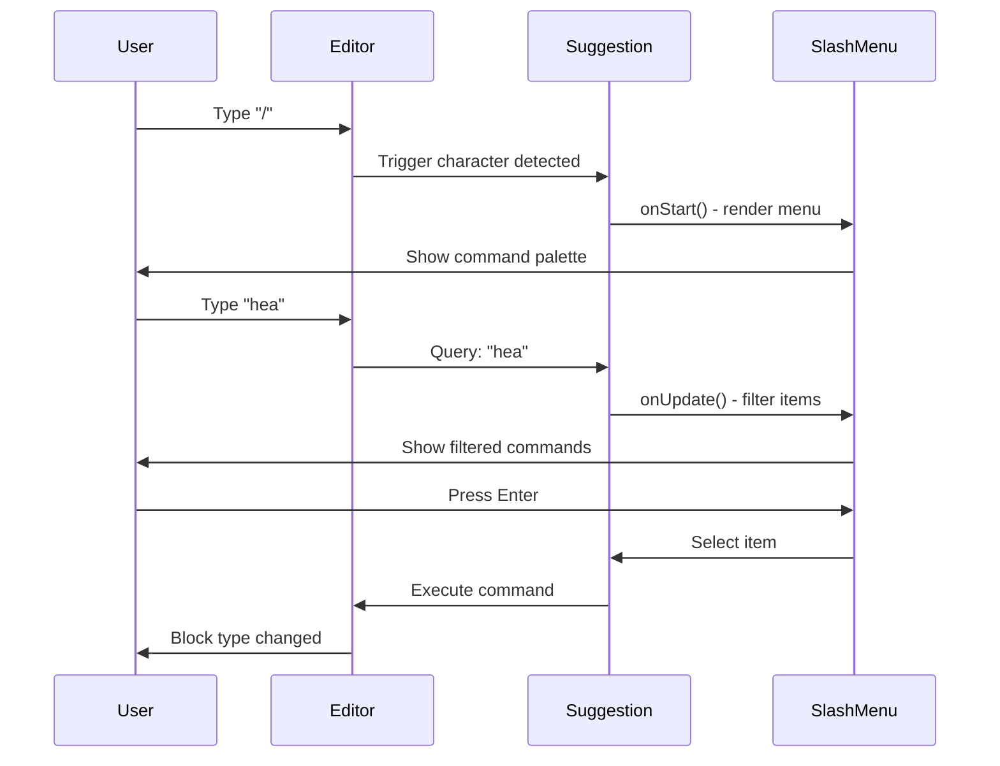

# 11: Slash Command Extension

> TipTap extension for Notion-style `/` command palette

**Duration:** 1 day  
**Dependencies:** [01-tailwind-setup.md](./01-tailwind-setup.md)

## Overview

The SlashCommand extension provides a Notion-style command palette triggered by typing `/`. It:

1. Listens for `/` character at start of line or after space
2. Shows a filterable command menu
3. Supports keyboard navigation (arrows, enter, escape)
4. Executes commands that transform blocks



## Implementation

### 1. Command Items Definition

```typescript
// packages/editor/src/extensions/slash-command/items.ts

import type { Editor } from '@tiptap/core'
import type { Range } from '@tiptap/pm/model'

/**
 * A single command in the slash menu
 */
export interface SlashCommandItem {
  /** Display title */
  title: string
  /** Short description */
  description: string
  /** Icon (emoji or component) */
  icon: string
  /** Alternative search terms */
  searchTerms?: string[]
  /** Command to execute */
  command: (props: { editor: Editor; range: Range }) => void
}

/**
 * A group of related commands
 */
export interface SlashCommandGroup {
  name: string
  items: SlashCommandItem[]
}

/**
 * All available slash commands, organized by group
 */
export const COMMAND_GROUPS: SlashCommandGroup[] = [
  {
    name: 'Basic Blocks',
    items: [
      {
        title: 'Text',
        description: 'Plain text paragraph',
        icon: 'Aa',
        searchTerms: ['paragraph', 'p', 'plain'],
        command: ({ editor, range }) => {
          editor.chain().focus().deleteRange(range).setParagraph().run()
        }
      },
      {
        title: 'Heading 1',
        description: 'Large section heading',
        icon: 'H1',
        searchTerms: ['h1', 'title', 'large', 'header'],
        command: ({ editor, range }) => {
          editor.chain().focus().deleteRange(range).setHeading({ level: 1 }).run()
        }
      },
      {
        title: 'Heading 2',
        description: 'Medium section heading',
        icon: 'H2',
        searchTerms: ['h2', 'subtitle', 'medium', 'header'],
        command: ({ editor, range }) => {
          editor.chain().focus().deleteRange(range).setHeading({ level: 2 }).run()
        }
      },
      {
        title: 'Heading 3',
        description: 'Small section heading',
        icon: 'H3',
        searchTerms: ['h3', 'small', 'header'],
        command: ({ editor, range }) => {
          editor.chain().focus().deleteRange(range).setHeading({ level: 3 }).run()
        }
      }
    ]
  },
  {
    name: 'Lists',
    items: [
      {
        title: 'Bullet List',
        description: 'Unordered list with bullets',
        icon: '•',
        searchTerms: ['ul', 'unordered', 'bullets', 'points'],
        command: ({ editor, range }) => {
          editor.chain().focus().deleteRange(range).toggleBulletList().run()
        }
      },
      {
        title: 'Numbered List',
        description: 'Ordered list with numbers',
        icon: '1.',
        searchTerms: ['ol', 'ordered', 'numbers', 'sequence'],
        command: ({ editor, range }) => {
          editor.chain().focus().deleteRange(range).toggleOrderedList().run()
        }
      },
      {
        title: 'Task List',
        description: 'Checklist with checkboxes',
        icon: '[]',
        searchTerms: ['todo', 'checkbox', 'tasks', 'checklist'],
        command: ({ editor, range }) => {
          editor.chain().focus().deleteRange(range).toggleTaskList().run()
        }
      }
    ]
  },
  {
    name: 'Blocks',
    items: [
      {
        title: 'Quote',
        description: 'Blockquote for citations',
        icon: '"',
        searchTerms: ['blockquote', 'citation', 'pullquote'],
        command: ({ editor, range }) => {
          editor.chain().focus().deleteRange(range).toggleBlockquote().run()
        }
      },
      {
        title: 'Code Block',
        description: 'Code with syntax highlighting',
        icon: '</>',
        searchTerms: ['code', 'pre', 'snippet', 'programming'],
        command: ({ editor, range }) => {
          editor.chain().focus().deleteRange(range).toggleCodeBlock().run()
        }
      },
      {
        title: 'Divider',
        description: 'Horizontal line separator',
        icon: '—',
        searchTerms: ['hr', 'horizontal', 'rule', 'line', 'separator'],
        command: ({ editor, range }) => {
          editor.chain().focus().deleteRange(range).setHorizontalRule().run()
        }
      }
    ]
  }
]

/**
 * Get all command items as a flat array
 */
export function getAllCommands(): SlashCommandItem[] {
  return COMMAND_GROUPS.flatMap((group) => group.items)
}

/**
 * Filter commands by search query
 */
export function filterCommands(query: string): SlashCommandItem[] {
  const search = query.toLowerCase().trim()

  if (!search) {
    return getAllCommands()
  }

  return getAllCommands().filter((item) => {
    // Match title
    if (item.title.toLowerCase().includes(search)) return true

    // Match search terms
    if (item.searchTerms?.some((term) => term.includes(search))) return true

    // Match description
    if (item.description.toLowerCase().includes(search)) return true

    return false
  })
}
```

### 2. Slash Command Extension

````typescript
// packages/editor/src/extensions/slash-command/index.ts

import { Extension } from '@tiptap/core'
import Suggestion, { type SuggestionOptions } from '@tiptap/suggestion'
import { PluginKey } from '@tiptap/pm/state'
import { ReactRenderer } from '@tiptap/react'
import tippy, { type Instance, type Props as TippyProps } from 'tippy.js'
import { SlashMenu } from '../../components/SlashMenu'
import { filterCommands, type SlashCommandItem } from './items'

export const slashCommandPluginKey = new PluginKey('slashCommand')

export interface SlashCommandOptions {
  /** Custom suggestion options */
  suggestion?: Partial<SuggestionOptions<SlashCommandItem>>
}

/**
 * SlashCommand extension for Notion-style command palette.
 *
 * Triggered by typing `/` at the start of a line or after a space.
 * Shows a filterable menu of block types and commands.
 *
 * @example
 * ```ts
 * import { SlashCommand } from '@xnet/editor/extensions'
 *
 * const editor = useEditor({
 *   extensions: [
 *     StarterKit,
 *     SlashCommand,
 *   ]
 * })
 * ```
 */
export const SlashCommand = Extension.create<SlashCommandOptions>({
  name: 'slashCommand',

  addOptions() {
    return {
      suggestion: {
        char: '/',
        allowSpaces: false,
        startOfLine: false,

        items: ({ query }) => filterCommands(query).slice(0, 10),

        command: ({ editor, range, props }) => {
          // Delete the slash command text and execute the command
          props.command({ editor, range })
        }
      }
    }
  },

  addProseMirrorPlugins() {
    return [
      Suggestion({
        editor: this.editor,
        pluginKey: slashCommandPluginKey,

        ...this.options.suggestion,

        render: () => {
          let component: ReactRenderer<SlashMenuRef>
          let popup: Instance<TippyProps>[]

          return {
            onStart: (props) => {
              // Create React component
              component = new ReactRenderer(SlashMenu, {
                props: {
                  items: props.items,
                  command: props.command
                },
                editor: props.editor
              })

              // Create tippy popup
              if (!props.clientRect) return

              popup = tippy('body', {
                getReferenceClientRect: props.clientRect as () => DOMRect,
                appendTo: () => document.body,
                content: component.element,
                showOnCreate: true,
                interactive: true,
                trigger: 'manual',
                placement: 'bottom-start',

                // Animation
                animation: 'shift-away',
                duration: [200, 150],

                // Prevent focus issues
                popperOptions: {
                  modifiers: [
                    { name: 'flip', enabled: true },
                    { name: 'preventOverflow', enabled: true }
                  ]
                }
              })
            },

            onUpdate(props) {
              // Update component props
              component.updateProps({
                items: props.items,
                command: props.command
              })

              // Update popup position
              if (props.clientRect) {
                popup[0].setProps({
                  getReferenceClientRect: props.clientRect as () => DOMRect
                })
              }
            },

            onKeyDown(props) {
              // Handle escape
              if (props.event.key === 'Escape') {
                popup[0].hide()
                return true
              }

              // Forward to component for arrow/enter handling
              return component.ref?.onKeyDown(props.event) ?? false
            },

            onExit() {
              // Clean up
              popup[0].destroy()
              component.destroy()
            }
          }
        }
      })
    ]
  }
})

// Type for component ref
interface SlashMenuRef {
  onKeyDown: (event: KeyboardEvent) => boolean
}

// Re-exports
export { COMMAND_GROUPS, getAllCommands, filterCommands } from './items'
export type { SlashCommandItem, SlashCommandGroup } from './items'
````

### 3. SlashMenu Component

```typescript
// packages/editor/src/components/SlashMenu/index.tsx

import {
  forwardRef,
  useCallback,
  useEffect,
  useImperativeHandle,
  useState,
} from 'react'
import { cn } from '../../utils'
import type { SlashCommandItem } from '../../extensions/slash-command/items'

interface SlashMenuProps {
  items: SlashCommandItem[]
  command: (item: SlashCommandItem) => void
}

interface SlashMenuRef {
  onKeyDown: (event: KeyboardEvent) => boolean
}

/**
 * SlashMenu - Command palette UI component
 */
export const SlashMenu = forwardRef<SlashMenuRef, SlashMenuProps>(
  function SlashMenu({ items, command }, ref) {
    const [selectedIndex, setSelectedIndex] = useState(0)

    // Reset selection when items change
    useEffect(() => {
      setSelectedIndex(0)
    }, [items])

    // Handle item selection
    const selectItem = useCallback(
      (index: number) => {
        const item = items[index]
        if (item) {
          command(item)
        }
      },
      [items, command]
    )

    // Expose keyboard handler to parent
    useImperativeHandle(ref, () => ({
      onKeyDown: (event: KeyboardEvent) => {
        if (event.key === 'ArrowUp') {
          event.preventDefault()
          setSelectedIndex((prev) => (prev - 1 + items.length) % items.length)
          return true
        }

        if (event.key === 'ArrowDown') {
          event.preventDefault()
          setSelectedIndex((prev) => (prev + 1) % items.length)
          return true
        }

        if (event.key === 'Enter') {
          event.preventDefault()
          selectItem(selectedIndex)
          return true
        }

        return false
      },
    }))

    // Empty state
    if (items.length === 0) {
      return (
        <div
          className={cn(
            'slash-menu',
            'w-72 p-2',
            'rounded-lg border border-border bg-background',
            'shadow-lg shadow-black/10'
          )}
        >
          <p className="px-2 py-1 text-sm text-muted-foreground">
            No results found
          </p>
        </div>
      )
    }

    return (
      <div
        className={cn(
          'slash-menu',
          'w-72 max-h-80 overflow-y-auto',
          'rounded-lg border border-border bg-background',
          'shadow-lg shadow-black/10',
          'p-1',
          // Animation
          'animate-in fade-in-0 slide-in-from-top-2',
          'duration-200'
        )}
      >
        {items.map((item, index) => (
          <SlashMenuItem
            key={item.title}
            item={item}
            isSelected={index === selectedIndex}
            onClick={() => selectItem(index)}
            onMouseEnter={() => setSelectedIndex(index)}
          />
        ))}
      </div>
    )
  }
)

// Individual menu item
interface SlashMenuItemProps {
  item: SlashCommandItem
  isSelected: boolean
  onClick: () => void
  onMouseEnter: () => void
}

function SlashMenuItem({
  item,
  isSelected,
  onClick,
  onMouseEnter,
}: SlashMenuItemProps) {
  return (
    <button
      type="button"
      onClick={onClick}
      onMouseEnter={onMouseEnter}
      className={cn(
        'flex items-center gap-3 w-full',
        'px-2 py-2 rounded-md',
        'text-left text-sm',
        'transition-colors duration-75',
        isSelected
          ? 'bg-accent text-accent-foreground'
          : 'hover:bg-accent/50'
      )}
    >
      {/* Icon */}
      <span
        className={cn(
          'flex items-center justify-center',
          'w-10 h-10 rounded-md',
          'bg-muted text-muted-foreground',
          'text-sm font-mono'
        )}
      >
        {item.icon}
      </span>

      {/* Text */}
      <div className="flex-1 min-w-0">
        <p className="font-medium truncate">{item.title}</p>
        <p className="text-xs text-muted-foreground truncate">
          {item.description}
        </p>
      </div>
    </button>
  )
}
```

### 4. Tippy.js Styles

```css
/* packages/editor/src/styles/slash-menu.css */

/* Tippy.js theme for slash menu */
.tippy-box[data-theme~='slash-menu'] {
  background: transparent;
  border: none;
  box-shadow: none;
}

.tippy-box[data-theme~='slash-menu'] .tippy-content {
  padding: 0;
}

/* Animations */
.tippy-box[data-animation='shift-away'][data-state='hidden'] {
  opacity: 0;
  transform: translateY(-4px);
}

.tippy-box[data-animation='shift-away'][data-state='visible'] {
  opacity: 1;
  transform: translateY(0);
}
```

### 5. Integration

```typescript
// packages/editor/src/components/RichTextEditor.tsx

import { useEditor, EditorContent } from '@tiptap/react'
import StarterKit from '@tiptap/starter-kit'
import { SlashCommand } from '../extensions/slash-command'

// Import tippy styles
import 'tippy.js/dist/tippy.css'
import 'tippy.js/animations/shift-away.css'

export function RichTextEditor({ /* props */ }) {
  const editor = useEditor({
    extensions: [
      StarterKit,
      SlashCommand,
      // ... other extensions
    ],
    // ...
  })

  return <EditorContent editor={editor} />
}
```

## Tests

```typescript
// packages/editor/src/extensions/slash-command/items.test.ts

import { describe, it, expect } from 'vitest'
import { filterCommands, getAllCommands, COMMAND_GROUPS } from './items'

describe('slash command items', () => {
  describe('COMMAND_GROUPS', () => {
    it('should have at least one group', () => {
      expect(COMMAND_GROUPS.length).toBeGreaterThan(0)
    })

    it('should have items in each group', () => {
      for (const group of COMMAND_GROUPS) {
        expect(group.items.length).toBeGreaterThan(0)
      }
    })

    it('should have required properties on each item', () => {
      for (const group of COMMAND_GROUPS) {
        for (const item of group.items) {
          expect(item.title).toBeTruthy()
          expect(item.description).toBeTruthy()
          expect(item.icon).toBeTruthy()
          expect(typeof item.command).toBe('function')
        }
      }
    })
  })

  describe('getAllCommands', () => {
    it('should return all commands as flat array', () => {
      const commands = getAllCommands()
      const totalItems = COMMAND_GROUPS.reduce((sum, g) => sum + g.items.length, 0)
      expect(commands.length).toBe(totalItems)
    })
  })

  describe('filterCommands', () => {
    it('should return all commands when query is empty', () => {
      const result = filterCommands('')
      expect(result.length).toBe(getAllCommands().length)
    })

    it('should filter by title', () => {
      const result = filterCommands('heading')
      expect(
        result.every(
          (item) =>
            item.title.toLowerCase().includes('heading') ||
            item.searchTerms?.some((t) => t.includes('heading'))
        )
      ).toBe(true)
    })

    it('should filter by search terms', () => {
      const result = filterCommands('todo')
      expect(result.some((item) => item.title === 'Task List')).toBe(true)
    })

    it('should be case insensitive', () => {
      const result1 = filterCommands('CODE')
      const result2 = filterCommands('code')
      expect(result1).toEqual(result2)
    })

    it('should return empty array when no matches', () => {
      const result = filterCommands('xyznonexistent')
      expect(result.length).toBe(0)
    })
  })
})
```

```typescript
// packages/editor/src/components/SlashMenu/SlashMenu.test.tsx

import { describe, it, expect, vi } from 'vitest'
import { render, screen, fireEvent } from '@testing-library/react'
import { SlashMenu } from './index'

const mockItems = [
  {
    title: 'Heading 1',
    description: 'Large heading',
    icon: 'H1',
    command: vi.fn(),
  },
  {
    title: 'Heading 2',
    description: 'Medium heading',
    icon: 'H2',
    command: vi.fn(),
  },
]

describe('SlashMenu', () => {
  it('should render items', () => {
    render(<SlashMenu items={mockItems} command={vi.fn()} />)

    expect(screen.getByText('Heading 1')).toBeInTheDocument()
    expect(screen.getByText('Heading 2')).toBeInTheDocument()
  })

  it('should show empty state when no items', () => {
    render(<SlashMenu items={[]} command={vi.fn()} />)

    expect(screen.getByText('No results found')).toBeInTheDocument()
  })

  it('should highlight first item by default', () => {
    render(<SlashMenu items={mockItems} command={vi.fn()} />)

    const firstItem = screen.getByText('Heading 1').closest('button')
    expect(firstItem).toHaveClass('bg-accent')
  })

  it('should call command when item clicked', () => {
    const command = vi.fn()
    render(<SlashMenu items={mockItems} command={command} />)

    fireEvent.click(screen.getByText('Heading 1'))

    expect(command).toHaveBeenCalledWith(mockItems[0])
  })

  it('should handle keyboard navigation', () => {
    const command = vi.fn()
    const ref = { current: null }

    render(<SlashMenu ref={ref} items={mockItems} command={command} />)

    // Arrow down should move selection
    ref.current?.onKeyDown(new KeyboardEvent('keydown', { key: 'ArrowDown' }))

    // Now second item should be selected
    const secondItem = screen.getByText('Heading 2').closest('button')
    expect(secondItem).toHaveClass('bg-accent')

    // Enter should select
    ref.current?.onKeyDown(new KeyboardEvent('keydown', { key: 'Enter' }))

    expect(command).toHaveBeenCalledWith(mockItems[1])
  })
})
```

## Keyboard Shortcuts

| Key         | Action                   |
| ----------- | ------------------------ |
| `/`         | Open menu (in editor)    |
| `ArrowUp`   | Select previous item     |
| `ArrowDown` | Select next item         |
| `Enter`     | Execute selected command |
| `Escape`    | Close menu               |
| Any letter  | Filter commands          |

## Customization

### Adding Custom Commands

```typescript
// In your app
import { SlashCommand, COMMAND_GROUPS } from '@xnet/editor/extensions'

// Add custom commands
const customCommands = [
  ...COMMAND_GROUPS,
  {
    name: 'Custom',
    items: [
      {
        title: 'Custom Block',
        description: 'My custom block type',
        icon: '*',
        command: ({ editor, range }) => {
          // Custom command logic
        }
      }
    ]
  }
]

const editor = useEditor({
  extensions: [
    SlashCommand.configure({
      suggestion: {
        items: ({ query }) => {
          // Use your custom commands
          return filterCustomCommands(customCommands, query)
        }
      }
    })
  ]
})
```

## Checklist

- [ ] Create items.ts with command definitions
- [ ] Create SlashCommand extension
- [ ] Create SlashMenu component
- [ ] Add tippy.js styles
- [ ] Integrate with RichTextEditor
- [ ] Handle keyboard navigation
- [ ] Handle empty state
- [ ] Add animations
- [ ] Write tests
- [ ] Tests pass

---

[Back to README](./README.md) | [Previous: Focus Detection](./10-focus-detection.md) | [Next: Command Menu](./12-command-menu.md)
