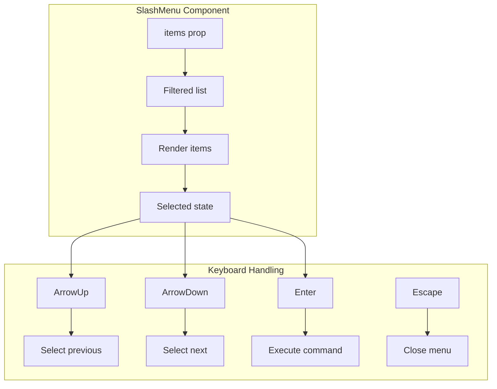

# 12: Command Menu UI

> React component for the slash command palette with keyboard navigation

**Duration:** 0.5 days  
**Dependencies:** [11-slash-extension.md](./11-slash-extension.md)

## Overview

The Command Menu is the UI component that displays available commands when the user types `/`. It supports keyboard navigation, filtering, and smooth animations.



## Implementation

### 1. SlashMenu Component

```typescript
// packages/editor/src/components/SlashMenu/index.tsx

import {
  forwardRef,
  useCallback,
  useEffect,
  useImperativeHandle,
  useRef,
  useState,
} from 'react'
import { cn } from '../../utils'
import type { SlashCommandItem } from '../../extensions/slash-command/items'
import { CommandItem } from './CommandItem'

export interface SlashMenuProps {
  items: SlashCommandItem[]
  command: (item: SlashCommandItem) => void
}

export interface SlashMenuRef {
  onKeyDown: (event: KeyboardEvent) => boolean
}

export const SlashMenu = forwardRef<SlashMenuRef, SlashMenuProps>(
  function SlashMenu({ items, command }, ref) {
    const [selectedIndex, setSelectedIndex] = useState(0)
    const containerRef = useRef<HTMLDivElement>(null)

    // Reset selection when items change
    useEffect(() => {
      setSelectedIndex(0)
    }, [items])

    // Scroll selected item into view
    useEffect(() => {
      const container = containerRef.current
      if (!container) return

      const selectedElement = container.querySelector('[data-selected="true"]')
      if (selectedElement) {
        selectedElement.scrollIntoView({
          block: 'nearest',
          behavior: 'smooth',
        })
      }
    }, [selectedIndex])

    // Handle item selection
    const selectItem = useCallback(
      (index: number) => {
        const item = items[index]
        if (item) {
          command(item)
        }
      },
      [items, command]
    )

    // Expose keyboard handler to parent (TipTap suggestion)
    useImperativeHandle(ref, () => ({
      onKeyDown: (event: KeyboardEvent) => {
        if (event.key === 'ArrowUp') {
          event.preventDefault()
          setSelectedIndex((prev) => {
            const next = prev - 1
            return next < 0 ? items.length - 1 : next
          })
          return true
        }

        if (event.key === 'ArrowDown') {
          event.preventDefault()
          setSelectedIndex((prev) => {
            const next = prev + 1
            return next >= items.length ? 0 : next
          })
          return true
        }

        if (event.key === 'Enter') {
          event.preventDefault()
          selectItem(selectedIndex)
          return true
        }

        if (event.key === 'Tab') {
          event.preventDefault()
          selectItem(selectedIndex)
          return true
        }

        return false
      },
    }))

    // Empty state
    if (items.length === 0) {
      return (
        <div
          className={cn(
            'slash-menu',
            'w-72 p-3',
            'rounded-lg border border-border bg-background',
            'shadow-lg shadow-black/10 dark:shadow-black/30'
          )}
        >
          <p className="text-sm text-muted-foreground text-center">
            No commands found
          </p>
        </div>
      )
    }

    return (
      <div
        ref={containerRef}
        className={cn(
          'slash-menu',
          'w-72 max-h-80 overflow-y-auto',
          'rounded-lg border border-border bg-background',
          'shadow-lg shadow-black/10 dark:shadow-black/30',
          'p-1',
          // Scrollbar styling
          'scrollbar-thin scrollbar-thumb-border scrollbar-track-transparent'
        )}
      >
        {items.map((item, index) => (
          <CommandItem
            key={item.title}
            item={item}
            isSelected={index === selectedIndex}
            onClick={() => selectItem(index)}
            onMouseEnter={() => setSelectedIndex(index)}
          />
        ))}
      </div>
    )
  }
)
```

### 2. CommandItem Component

```typescript
// packages/editor/src/components/SlashMenu/CommandItem.tsx

import { memo } from 'react'
import { cn } from '../../utils'
import type { SlashCommandItem } from '../../extensions/slash-command/items'

interface CommandItemProps {
  item: SlashCommandItem
  isSelected: boolean
  onClick: () => void
  onMouseEnter: () => void
}

export const CommandItem = memo(function CommandItem({
  item,
  isSelected,
  onClick,
  onMouseEnter,
}: CommandItemProps) {
  return (
    <button
      type="button"
      data-selected={isSelected}
      onClick={onClick}
      onMouseEnter={onMouseEnter}
      className={cn(
        'command-item',
        'flex items-center gap-3 w-full',
        'px-2 py-2 rounded-md',
        'text-left text-sm',
        'transition-colors duration-75',
        isSelected
          ? 'bg-accent text-accent-foreground'
          : 'hover:bg-accent/50'
      )}
    >
      {/* Icon */}
      <span
        className={cn(
          'command-icon',
          'flex items-center justify-center flex-shrink-0',
          'w-10 h-10 rounded-md',
          'bg-muted text-muted-foreground',
          'text-base font-mono'
        )}
      >
        {item.icon}
      </span>

      {/* Text */}
      <div className="flex-1 min-w-0">
        <p className="font-medium truncate">{item.title}</p>
        <p className="text-xs text-muted-foreground truncate">
          {item.description}
        </p>
      </div>
    </button>
  )
})
```

### 3. Command Group Component (Optional)

For grouping commands by category:

```typescript
// packages/editor/src/components/SlashMenu/CommandGroup.tsx

import { memo } from 'react'
import { cn } from '../../utils'
import type { SlashCommandGroup } from '../../extensions/slash-command/items'
import { CommandItem } from './CommandItem'

interface CommandGroupProps {
  group: SlashCommandGroup
  selectedIndex: number
  baseIndex: number
  onSelect: (index: number) => void
  onHover: (index: number) => void
}

export const CommandGroup = memo(function CommandGroup({
  group,
  selectedIndex,
  baseIndex,
  onSelect,
  onHover,
}: CommandGroupProps) {
  return (
    <div className="command-group">
      {/* Group header */}
      <div
        className={cn(
          'px-2 py-1.5 mt-2 first:mt-0',
          'text-xs font-medium text-muted-foreground uppercase tracking-wider'
        )}
      >
        {group.name}
      </div>

      {/* Group items */}
      <div>
        {group.items.map((item, itemIndex) => {
          const absoluteIndex = baseIndex + itemIndex
          return (
            <CommandItem
              key={item.title}
              item={item}
              isSelected={absoluteIndex === selectedIndex}
              onClick={() => onSelect(absoluteIndex)}
              onMouseEnter={() => onHover(absoluteIndex)}
            />
          )
        })}
      </div>
    </div>
  )
})
```

### 4. Grouped SlashMenu Variant

```typescript
// packages/editor/src/components/SlashMenu/SlashMenuGrouped.tsx

import {
  forwardRef,
  useCallback,
  useEffect,
  useImperativeHandle,
  useRef,
  useState,
} from 'react'
import { cn } from '../../utils'
import type { SlashCommandGroup, SlashCommandItem } from '../../extensions/slash-command/items'
import { CommandGroup } from './CommandGroup'

export interface SlashMenuGroupedProps {
  groups: SlashCommandGroup[]
  command: (item: SlashCommandItem) => void
}

export interface SlashMenuGroupedRef {
  onKeyDown: (event: KeyboardEvent) => boolean
}

export const SlashMenuGrouped = forwardRef<SlashMenuGroupedRef, SlashMenuGroupedProps>(
  function SlashMenuGrouped({ groups, command }, ref) {
    const [selectedIndex, setSelectedIndex] = useState(0)
    const containerRef = useRef<HTMLDivElement>(null)

    // Flatten items for navigation
    const allItems = groups.flatMap((g) => g.items)
    const totalItems = allItems.length

    // Reset selection when groups change
    useEffect(() => {
      setSelectedIndex(0)
    }, [groups])

    // Handle selection
    const selectItem = useCallback(
      (index: number) => {
        const item = allItems[index]
        if (item) {
          command(item)
        }
      },
      [allItems, command]
    )

    // Keyboard navigation
    useImperativeHandle(ref, () => ({
      onKeyDown: (event: KeyboardEvent) => {
        if (event.key === 'ArrowUp') {
          event.preventDefault()
          setSelectedIndex((prev) => (prev - 1 + totalItems) % totalItems)
          return true
        }

        if (event.key === 'ArrowDown') {
          event.preventDefault()
          setSelectedIndex((prev) => (prev + 1) % totalItems)
          return true
        }

        if (event.key === 'Enter' || event.key === 'Tab') {
          event.preventDefault()
          selectItem(selectedIndex)
          return true
        }

        return false
      },
    }))

    if (totalItems === 0) {
      return (
        <div className={cn(
          'slash-menu w-72 p-3',
          'rounded-lg border border-border bg-background',
          'shadow-lg'
        )}>
          <p className="text-sm text-muted-foreground text-center">
            No commands found
          </p>
        </div>
      )
    }

    // Calculate base index for each group
    let runningIndex = 0

    return (
      <div
        ref={containerRef}
        className={cn(
          'slash-menu',
          'w-72 max-h-80 overflow-y-auto',
          'rounded-lg border border-border bg-background',
          'shadow-lg shadow-black/10',
          'py-1'
        )}
      >
        {groups.map((group) => {
          const baseIndex = runningIndex
          runningIndex += group.items.length

          return (
            <CommandGroup
              key={group.name}
              group={group}
              selectedIndex={selectedIndex}
              baseIndex={baseIndex}
              onSelect={selectItem}
              onHover={setSelectedIndex}
            />
          )
        })}
      </div>
    )
  }
)
```

### 5. CSS Styles

```css
/* packages/editor/src/styles/slash-menu.css */

/* Tippy theme for slash menu */
.tippy-box[data-theme~='slash-menu'] {
  background: transparent;
  border: none;
  box-shadow: none;
}

.tippy-box[data-theme~='slash-menu'] .tippy-content {
  padding: 0;
}

/* Animation */
.tippy-box[data-animation='shift-away'][data-state='hidden'] {
  opacity: 0;
  transform: translateY(-4px);
}

.tippy-box[data-animation='shift-away'][data-state='visible'] {
  opacity: 1;
  transform: translateY(0);
}

/* Custom scrollbar for menu */
.slash-menu::-webkit-scrollbar {
  width: 6px;
}

.slash-menu::-webkit-scrollbar-track {
  background: transparent;
}

.slash-menu::-webkit-scrollbar-thumb {
  background: hsl(var(--border));
  border-radius: 3px;
}

.slash-menu::-webkit-scrollbar-thumb:hover {
  background: hsl(var(--muted-foreground) / 0.3);
}
```

## Tests

```typescript
// packages/editor/src/components/SlashMenu/SlashMenu.test.tsx

import { describe, it, expect, vi } from 'vitest'
import { render, screen, fireEvent } from '@testing-library/react'
import { SlashMenu, type SlashMenuRef } from './index'
import type { SlashCommandItem } from '../../extensions/slash-command/items'

const mockItems: SlashCommandItem[] = [
  {
    title: 'Heading 1',
    description: 'Large heading',
    icon: 'H1',
    command: vi.fn(),
  },
  {
    title: 'Heading 2',
    description: 'Medium heading',
    icon: 'H2',
    command: vi.fn(),
  },
  {
    title: 'Bullet List',
    description: 'Unordered list',
    icon: '•',
    command: vi.fn(),
  },
]

describe('SlashMenu', () => {
  describe('rendering', () => {
    it('should render all items', () => {
      render(<SlashMenu items={mockItems} command={vi.fn()} />)

      expect(screen.getByText('Heading 1')).toBeInTheDocument()
      expect(screen.getByText('Heading 2')).toBeInTheDocument()
      expect(screen.getByText('Bullet List')).toBeInTheDocument()
    })

    it('should show empty state when no items', () => {
      render(<SlashMenu items={[]} command={vi.fn()} />)

      expect(screen.getByText('No commands found')).toBeInTheDocument()
    })

    it('should render item descriptions', () => {
      render(<SlashMenu items={mockItems} command={vi.fn()} />)

      expect(screen.getByText('Large heading')).toBeInTheDocument()
    })
  })

  describe('selection', () => {
    it('should highlight first item by default', () => {
      render(<SlashMenu items={mockItems} command={vi.fn()} />)

      const firstItem = screen.getByText('Heading 1').closest('button')
      expect(firstItem).toHaveAttribute('data-selected', 'true')
    })

    it('should call command on click', () => {
      const command = vi.fn()
      render(<SlashMenu items={mockItems} command={command} />)

      fireEvent.click(screen.getByText('Heading 2'))

      expect(command).toHaveBeenCalledWith(mockItems[1])
    })

    it('should highlight on hover', () => {
      render(<SlashMenu items={mockItems} command={vi.fn()} />)

      const secondItem = screen.getByText('Heading 2').closest('button')
      fireEvent.mouseEnter(secondItem!)

      expect(secondItem).toHaveAttribute('data-selected', 'true')
    })
  })

  describe('keyboard navigation', () => {
    it('should navigate down with ArrowDown', () => {
      const ref = { current: null as SlashMenuRef | null }
      render(<SlashMenu ref={ref} items={mockItems} command={vi.fn()} />)

      ref.current?.onKeyDown(new KeyboardEvent('keydown', { key: 'ArrowDown' }))

      const secondItem = screen.getByText('Heading 2').closest('button')
      expect(secondItem).toHaveAttribute('data-selected', 'true')
    })

    it('should navigate up with ArrowUp', () => {
      const ref = { current: null as SlashMenuRef | null }
      render(<SlashMenu ref={ref} items={mockItems} command={vi.fn()} />)

      // Go down first
      ref.current?.onKeyDown(new KeyboardEvent('keydown', { key: 'ArrowDown' }))
      // Then up
      ref.current?.onKeyDown(new KeyboardEvent('keydown', { key: 'ArrowUp' }))

      const firstItem = screen.getByText('Heading 1').closest('button')
      expect(firstItem).toHaveAttribute('data-selected', 'true')
    })

    it('should wrap around at end', () => {
      const ref = { current: null as SlashMenuRef | null }
      render(<SlashMenu ref={ref} items={mockItems} command={vi.fn()} />)

      // Go down 3 times (past end)
      ref.current?.onKeyDown(new KeyboardEvent('keydown', { key: 'ArrowDown' }))
      ref.current?.onKeyDown(new KeyboardEvent('keydown', { key: 'ArrowDown' }))
      ref.current?.onKeyDown(new KeyboardEvent('keydown', { key: 'ArrowDown' }))

      // Should wrap to first
      const firstItem = screen.getByText('Heading 1').closest('button')
      expect(firstItem).toHaveAttribute('data-selected', 'true')
    })

    it('should select with Enter', () => {
      const command = vi.fn()
      const ref = { current: null as SlashMenuRef | null }
      render(<SlashMenu ref={ref} items={mockItems} command={command} />)

      ref.current?.onKeyDown(new KeyboardEvent('keydown', { key: 'Enter' }))

      expect(command).toHaveBeenCalledWith(mockItems[0])
    })
  })
})
```

## Checklist

- [ ] Create SlashMenu component
- [ ] Create CommandItem component
- [ ] Create CommandGroup component (optional)
- [ ] Implement keyboard navigation
- [ ] Handle empty state
- [ ] Auto-scroll selected into view
- [ ] Add hover highlighting
- [ ] Style with Tailwind
- [ ] Add tippy theme CSS
- [ ] Write tests
- [ ] Tests pass

---

[Back to README](./README.md) | [Previous: Slash Extension](./11-slash-extension.md) | [Next: Command Items](./13-command-items.md)
