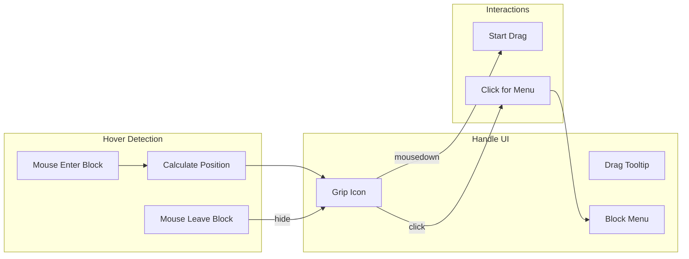

# 14: Drag Handle

> Handle appears on block hover for drag-and-drop reordering

**Duration:** 1 day  
**Dependencies:** [10-focus-detection.md](./10-focus-detection.md)

## Overview

The drag handle is a visual affordance that appears when hovering over any block-level element. It provides both a drag target and a click target for the block menu. This follows Notion's design pattern where the handle appears to the left of blocks.



## Implementation

### 1. Drag Handle Extension

```typescript
// packages/editor/src/extensions/drag-handle/DragHandle.ts

import { Extension } from '@tiptap/core'
import { Plugin, PluginKey } from '@tiptap/pm/state'
import { Decoration, DecorationSet } from '@tiptap/pm/view'

export interface DragHandleOptions {
  /**
   * CSS selector for elements that should show drag handles
   */
  draggableSelector: string
  /**
   * Offset from the left edge of the block
   */
  handleOffset: number
  /**
   * Delay before showing handle on hover (ms)
   */
  showDelay: number
}

export const DragHandlePluginKey = new PluginKey('dragHandle')

export const DragHandle = Extension.create<DragHandleOptions>({
  name: 'dragHandle',

  addOptions() {
    return {
      draggableSelector: 'p, h1, h2, h3, h4, h5, h6, ul, ol, blockquote, pre, hr',
      handleOffset: -28,
      showDelay: 50
    }
  },

  addProseMirrorPlugins() {
    const { editor, options } = this
    let dragHandleElement: HTMLElement | null = null
    let currentBlock: HTMLElement | null = null
    let showTimeout: ReturnType<typeof setTimeout> | null = null

    const createDragHandle = (): HTMLElement => {
      const handle = document.createElement('div')
      handle.className = 'xnet-drag-handle'
      handle.innerHTML = `
        <button
          type="button"
          class="xnet-drag-handle-button"
          aria-label="Drag to reorder or click for options"
          draggable="true"
        >
          <svg width="14" height="14" viewBox="0 0 14 14" fill="currentColor">
            <circle cx="4" cy="3" r="1.5" />
            <circle cx="10" cy="3" r="1.5" />
            <circle cx="4" cy="7" r="1.5" />
            <circle cx="10" cy="7" r="1.5" />
            <circle cx="4" cy="11" r="1.5" />
            <circle cx="10" cy="11" r="1.5" />
          </svg>
        </button>
      `
      handle.style.cssText = `
        position: absolute;
        opacity: 0;
        pointer-events: none;
        transition: opacity 150ms ease;
        z-index: 50;
      `
      return handle
    }

    const showHandle = (block: HTMLElement) => {
      if (!dragHandleElement) return

      const editorRect = editor.view.dom.getBoundingClientRect()
      const blockRect = block.getBoundingClientRect()

      // Position to the left of the block
      const top = blockRect.top - editorRect.top + editor.view.dom.scrollTop
      const left = options.handleOffset

      dragHandleElement.style.top = `${top}px`
      dragHandleElement.style.left = `${left}px`
      dragHandleElement.style.height = `${blockRect.height}px`
      dragHandleElement.style.opacity = '1'
      dragHandleElement.style.pointerEvents = 'auto'

      currentBlock = block
    }

    const hideHandle = () => {
      if (showTimeout) {
        clearTimeout(showTimeout)
        showTimeout = null
      }

      if (dragHandleElement) {
        dragHandleElement.style.opacity = '0'
        dragHandleElement.style.pointerEvents = 'none'
      }
      currentBlock = null
    }

    const handleMouseMove = (event: MouseEvent) => {
      const target = event.target as HTMLElement
      const block = target.closest(options.draggableSelector) as HTMLElement | null

      if (!block || !editor.view.dom.contains(block)) {
        hideHandle()
        return
      }

      if (block === currentBlock) return

      if (showTimeout) {
        clearTimeout(showTimeout)
      }

      showTimeout = setTimeout(() => {
        showHandle(block)
      }, options.showDelay)
    }

    const handleMouseLeave = () => {
      hideHandle()
    }

    return [
      new Plugin({
        key: DragHandlePluginKey,
        view: (editorView) => {
          dragHandleElement = createDragHandle()
          editorView.dom.parentElement?.appendChild(dragHandleElement)

          // Set up event listeners
          editorView.dom.addEventListener('mousemove', handleMouseMove)
          editorView.dom.addEventListener('mouseleave', handleMouseLeave)

          // Handle drag start from the handle
          dragHandleElement.addEventListener('mousedown', (e) => {
            if (!currentBlock) return

            // Find the ProseMirror position for this block
            const pos = editorView.posAtDOM(currentBlock, 0)
            if (pos === null) return

            // Store the position for the drag operation
            dragHandleElement!.dataset.dragPos = String(pos)
          })

          return {
            update: () => {
              // Recalculate position if content changes while handle is visible
              if (currentBlock && dragHandleElement?.style.opacity === '1') {
                showHandle(currentBlock)
              }
            },
            destroy: () => {
              editorView.dom.removeEventListener('mousemove', handleMouseMove)
              editorView.dom.removeEventListener('mouseleave', handleMouseLeave)
              dragHandleElement?.remove()
            }
          }
        }
      })
    ]
  }
})
```

### 2. Drag Handle Styles

```css
/* packages/editor/src/styles/drag-handle.css */

.xnet-drag-handle {
  display: flex;
  align-items: flex-start;
  padding-top: 0.25rem;
}

.xnet-drag-handle-button {
  display: flex;
  align-items: center;
  justify-content: center;
  width: 1.25rem;
  height: 1.5rem;
  border-radius: 0.25rem;
  color: var(--xnet-text-muted, #9ca3af);
  cursor: grab;
  transition:
    background-color 150ms ease,
    color 150ms ease;
}

.xnet-drag-handle-button:hover {
  background-color: var(--xnet-bg-hover, #f3f4f6);
  color: var(--xnet-text-secondary, #6b7280);
}

.xnet-drag-handle-button:active {
  cursor: grabbing;
  background-color: var(--xnet-bg-active, #e5e7eb);
}

/* Dark mode */
.dark .xnet-drag-handle-button:hover {
  background-color: var(--xnet-bg-hover-dark, #374151);
  color: var(--xnet-text-secondary-dark, #9ca3af);
}

.dark .xnet-drag-handle-button:active {
  background-color: var(--xnet-bg-active-dark, #4b5563);
}
```

### 3. Tailwind Component Version

```tsx
// packages/editor/src/components/DragHandle/DragHandle.tsx

import * as React from 'react'
import { GripVertical } from 'lucide-react'
import { cn } from '@xnet/ui/lib/utils'

export interface DragHandleProps {
  visible: boolean
  top: number
  left: number
  height: number
  onDragStart?: () => void
  onMenuClick?: () => void
}

export function DragHandle({
  visible,
  top,
  left,
  height,
  onDragStart,
  onMenuClick
}: DragHandleProps) {
  return (
    <div
      className={cn(
        'absolute z-50 flex items-start pt-1',
        'transition-opacity duration-150 ease-out',
        visible ? 'opacity-100' : 'opacity-0 pointer-events-none'
      )}
      style={{ top, left, height }}
    >
      <button
        type="button"
        draggable
        className={cn(
          'flex items-center justify-center',
          'w-5 h-6 rounded',
          'text-gray-400 hover:text-gray-600',
          'hover:bg-gray-100 active:bg-gray-200',
          'dark:text-gray-500 dark:hover:text-gray-400',
          'dark:hover:bg-gray-700 dark:active:bg-gray-600',
          'cursor-grab active:cursor-grabbing',
          'transition-colors duration-150'
        )}
        aria-label="Drag to reorder or click for options"
        onMouseDown={onDragStart}
        onClick={onMenuClick}
      >
        <GripVertical className="w-3.5 h-3.5" />
      </button>
    </div>
  )
}
```

### 4. React Hook for Drag Handle State

```typescript
// packages/editor/src/components/DragHandle/useDragHandle.ts

import { useState, useCallback, useEffect, useRef } from 'react'
import type { Editor } from '@tiptap/core'

export interface DragHandleState {
  visible: boolean
  top: number
  left: number
  height: number
  blockElement: HTMLElement | null
  blockPos: number | null
}

export interface UseDragHandleOptions {
  editor: Editor | null
  draggableSelector?: string
  handleOffset?: number
  showDelay?: number
}

export function useDragHandle({
  editor,
  draggableSelector = 'p, h1, h2, h3, h4, h5, h6, ul, ol, blockquote, pre, hr',
  handleOffset = -28,
  showDelay = 50
}: UseDragHandleOptions) {
  const [state, setState] = useState<DragHandleState>({
    visible: false,
    top: 0,
    left: handleOffset,
    height: 0,
    blockElement: null,
    blockPos: null
  })

  const showTimeoutRef = useRef<ReturnType<typeof setTimeout> | null>(null)
  const currentBlockRef = useRef<HTMLElement | null>(null)

  const showHandle = useCallback(
    (block: HTMLElement) => {
      if (!editor?.view.dom) return

      const editorRect = editor.view.dom.getBoundingClientRect()
      const blockRect = block.getBoundingClientRect()
      const pos = editor.view.posAtDOM(block, 0)

      const top = blockRect.top - editorRect.top + editor.view.dom.scrollTop
      const height = blockRect.height

      currentBlockRef.current = block

      setState({
        visible: true,
        top,
        left: handleOffset,
        height,
        blockElement: block,
        blockPos: pos
      })
    },
    [editor, handleOffset]
  )

  const hideHandle = useCallback(() => {
    if (showTimeoutRef.current) {
      clearTimeout(showTimeoutRef.current)
      showTimeoutRef.current = null
    }

    currentBlockRef.current = null

    setState((prev) => ({
      ...prev,
      visible: false,
      blockElement: null,
      blockPos: null
    }))
  }, [])

  useEffect(() => {
    if (!editor?.view.dom) return

    const handleMouseMove = (event: MouseEvent) => {
      const target = event.target as HTMLElement
      const block = target.closest(draggableSelector) as HTMLElement | null

      if (!block || !editor.view.dom.contains(block)) {
        hideHandle()
        return
      }

      if (block === currentBlockRef.current) return

      if (showTimeoutRef.current) {
        clearTimeout(showTimeoutRef.current)
      }

      showTimeoutRef.current = setTimeout(() => {
        showHandle(block)
      }, showDelay)
    }

    const handleMouseLeave = () => {
      hideHandle()
    }

    editor.view.dom.addEventListener('mousemove', handleMouseMove)
    editor.view.dom.addEventListener('mouseleave', handleMouseLeave)

    return () => {
      editor.view.dom.removeEventListener('mousemove', handleMouseMove)
      editor.view.dom.removeEventListener('mouseleave', handleMouseLeave)

      if (showTimeoutRef.current) {
        clearTimeout(showTimeoutRef.current)
      }
    }
  }, [editor, draggableSelector, showDelay, showHandle, hideHandle])

  return {
    ...state,
    hideHandle
  }
}
```

### 5. Integration with Editor

```tsx
// packages/editor/src/components/RichTextEditor.tsx (updated)

import * as React from 'react'
import { useEditor, EditorContent } from '@tiptap/react'
import { DragHandle } from './DragHandle/DragHandle'
import { useDragHandle } from './DragHandle/useDragHandle'

export function RichTextEditor(
  {
    /* ... */
  }
) {
  const editor = useEditor({
    // ... existing config
  })

  const dragHandle = useDragHandle({ editor })

  return (
    <div className="relative">
      {/* Drag handle - positioned absolutely within container */}
      <DragHandle
        visible={dragHandle.visible}
        top={dragHandle.top}
        left={dragHandle.left}
        height={dragHandle.height}
        onDragStart={() => {
          // Will be handled by 15-block-dnd.md
        }}
        onMenuClick={() => {
          // Future: open block menu
        }}
      />

      <EditorContent
        editor={editor}
        className="xnet-editor pl-8" // Add left padding for drag handle
      />
    </div>
  )
}
```

## Tests

```typescript
// packages/editor/src/components/DragHandle/useDragHandle.test.ts

import { describe, it, expect, vi, beforeEach, afterEach } from 'vitest'
import { renderHook, act } from '@testing-library/react'
import { useDragHandle } from './useDragHandle'

// Mock editor
const createMockEditor = () => {
  const dom = document.createElement('div')
  dom.innerHTML = `
    <p data-testid="block-1">Paragraph 1</p>
    <h1 data-testid="block-2">Heading</h1>
    <p data-testid="block-3">Paragraph 2</p>
  `
  document.body.appendChild(dom)

  return {
    view: {
      dom,
      posAtDOM: vi.fn().mockReturnValue(0)
    }
  }
}

describe('useDragHandle', () => {
  let mockEditor: ReturnType<typeof createMockEditor>

  beforeEach(() => {
    vi.useFakeTimers()
    mockEditor = createMockEditor()
  })

  afterEach(() => {
    vi.useRealTimers()
    document.body.innerHTML = ''
  })

  it('should start with handle hidden', () => {
    const { result } = renderHook(() => useDragHandle({ editor: mockEditor as any }))

    expect(result.current.visible).toBe(false)
  })

  it('should show handle on block hover after delay', () => {
    const { result } = renderHook(() => useDragHandle({ editor: mockEditor as any, showDelay: 50 }))

    const block = mockEditor.view.dom.querySelector('[data-testid="block-1"]')!

    act(() => {
      const event = new MouseEvent('mousemove', {
        bubbles: true,
        clientX: 100,
        clientY: 100
      })
      Object.defineProperty(event, 'target', { value: block })
      mockEditor.view.dom.dispatchEvent(event)
    })

    // Not visible yet (before delay)
    expect(result.current.visible).toBe(false)

    // Advance timer
    act(() => {
      vi.advanceTimersByTime(50)
    })

    expect(result.current.visible).toBe(true)
    expect(result.current.blockElement).toBe(block)
  })

  it('should hide handle on mouse leave', () => {
    const { result } = renderHook(() => useDragHandle({ editor: mockEditor as any, showDelay: 0 }))

    const block = mockEditor.view.dom.querySelector('[data-testid="block-1"]')!

    // Show handle
    act(() => {
      const event = new MouseEvent('mousemove', {
        bubbles: true
      })
      Object.defineProperty(event, 'target', { value: block })
      mockEditor.view.dom.dispatchEvent(event)
      vi.advanceTimersByTime(0)
    })

    expect(result.current.visible).toBe(true)

    // Hide handle
    act(() => {
      mockEditor.view.dom.dispatchEvent(new MouseEvent('mouseleave'))
    })

    expect(result.current.visible).toBe(false)
  })

  it('should not show handle for non-draggable elements', () => {
    const { result } = renderHook(() =>
      useDragHandle({
        editor: mockEditor as any,
        draggableSelector: 'h1', // Only headings
        showDelay: 0
      })
    )

    const paragraph = mockEditor.view.dom.querySelector('[data-testid="block-1"]')!

    act(() => {
      const event = new MouseEvent('mousemove', {
        bubbles: true
      })
      Object.defineProperty(event, 'target', { value: paragraph })
      mockEditor.view.dom.dispatchEvent(event)
      vi.advanceTimersByTime(0)
    })

    // Should not show for paragraph (only h1 is draggable in this test)
    expect(result.current.visible).toBe(false)
  })

  it('should calculate correct position', () => {
    const { result } = renderHook(() =>
      useDragHandle({
        editor: mockEditor as any,
        handleOffset: -28,
        showDelay: 0
      })
    )

    const block = mockEditor.view.dom.querySelector('[data-testid="block-1"]')!

    // Mock getBoundingClientRect
    vi.spyOn(block, 'getBoundingClientRect').mockReturnValue({
      top: 100,
      left: 50,
      width: 500,
      height: 24,
      bottom: 124,
      right: 550,
      x: 50,
      y: 100,
      toJSON: () => {}
    })

    vi.spyOn(mockEditor.view.dom, 'getBoundingClientRect').mockReturnValue({
      top: 50,
      left: 20,
      width: 600,
      height: 800,
      bottom: 850,
      right: 620,
      x: 20,
      y: 50,
      toJSON: () => {}
    })

    act(() => {
      const event = new MouseEvent('mousemove', {
        bubbles: true
      })
      Object.defineProperty(event, 'target', { value: block })
      mockEditor.view.dom.dispatchEvent(event)
      vi.advanceTimersByTime(0)
    })

    expect(result.current.top).toBe(50) // 100 - 50
    expect(result.current.left).toBe(-28)
    expect(result.current.height).toBe(24)
  })

  it('should get block position from editor', () => {
    mockEditor.view.posAtDOM.mockReturnValue(42)

    const { result } = renderHook(() => useDragHandle({ editor: mockEditor as any, showDelay: 0 }))

    const block = mockEditor.view.dom.querySelector('[data-testid="block-1"]')!

    act(() => {
      const event = new MouseEvent('mousemove', {
        bubbles: true
      })
      Object.defineProperty(event, 'target', { value: block })
      mockEditor.view.dom.dispatchEvent(event)
      vi.advanceTimersByTime(0)
    })

    expect(result.current.blockPos).toBe(42)
  })

  it('should cancel pending show on quick mouse movement', () => {
    const { result } = renderHook(() =>
      useDragHandle({ editor: mockEditor as any, showDelay: 100 })
    )

    const block1 = mockEditor.view.dom.querySelector('[data-testid="block-1"]')!
    const block2 = mockEditor.view.dom.querySelector('[data-testid="block-2"]')!

    // Hover block 1
    act(() => {
      const event = new MouseEvent('mousemove', { bubbles: true })
      Object.defineProperty(event, 'target', { value: block1 })
      mockEditor.view.dom.dispatchEvent(event)
    })

    // Quickly move to block 2 before delay
    act(() => {
      vi.advanceTimersByTime(50) // Half the delay

      const event = new MouseEvent('mousemove', { bubbles: true })
      Object.defineProperty(event, 'target', { value: block2 })
      mockEditor.view.dom.dispatchEvent(event)
    })

    // Complete original timer - should not show block 1
    act(() => {
      vi.advanceTimersByTime(50)
    })

    // Should not be visible yet (new timer started)
    expect(result.current.visible).toBe(false)

    // Complete new timer
    act(() => {
      vi.advanceTimersByTime(100)
    })

    // Now should show block 2
    expect(result.current.visible).toBe(true)
    expect(result.current.blockElement).toBe(block2)
  })
})
```

```typescript
// packages/editor/src/components/DragHandle/DragHandle.test.tsx

import * as React from 'react'
import { describe, it, expect, vi } from 'vitest'
import { render, screen, fireEvent } from '@testing-library/react'
import { DragHandle } from './DragHandle'

describe('DragHandle', () => {
  const defaultProps = {
    visible: true,
    top: 100,
    left: -28,
    height: 24
  }

  it('should render with correct position', () => {
    const { container } = render(<DragHandle {...defaultProps} />)
    const handle = container.firstChild as HTMLElement

    expect(handle.style.top).toBe('100px')
    expect(handle.style.left).toBe('-28px')
    expect(handle.style.height).toBe('24px')
  })

  it('should be visible when visible prop is true', () => {
    const { container } = render(<DragHandle {...defaultProps} visible={true} />)
    const handle = container.firstChild as HTMLElement

    expect(handle.classList.contains('opacity-100')).toBe(true)
    expect(handle.classList.contains('opacity-0')).toBe(false)
  })

  it('should be hidden when visible prop is false', () => {
    const { container } = render(<DragHandle {...defaultProps} visible={false} />)
    const handle = container.firstChild as HTMLElement

    expect(handle.classList.contains('opacity-0')).toBe(true)
    expect(handle.classList.contains('pointer-events-none')).toBe(true)
  })

  it('should have accessible label', () => {
    render(<DragHandle {...defaultProps} />)
    const button = screen.getByRole('button')

    expect(button).toHaveAttribute('aria-label', 'Drag to reorder or click for options')
  })

  it('should be draggable', () => {
    render(<DragHandle {...defaultProps} />)
    const button = screen.getByRole('button')

    expect(button).toHaveAttribute('draggable', 'true')
  })

  it('should call onDragStart when mousedown', () => {
    const onDragStart = vi.fn()
    render(<DragHandle {...defaultProps} onDragStart={onDragStart} />)
    const button = screen.getByRole('button')

    fireEvent.mouseDown(button)

    expect(onDragStart).toHaveBeenCalledTimes(1)
  })

  it('should call onMenuClick when clicked', () => {
    const onMenuClick = vi.fn()
    render(<DragHandle {...defaultProps} onMenuClick={onMenuClick} />)
    const button = screen.getByRole('button')

    fireEvent.click(button)

    expect(onMenuClick).toHaveBeenCalledTimes(1)
  })
})
```

## Checklist

- [ ] Create DragHandle extension
- [ ] Implement hover detection
- [ ] Calculate handle position relative to blocks
- [ ] Style drag handle with Tailwind
- [ ] Add show/hide transitions
- [ ] Support dark mode
- [ ] Create React component version
- [ ] Create useDragHandle hook
- [ ] Integrate with RichTextEditor
- [ ] Write tests
- [ ] Tests pass

---

[Back to README](./README.md) | [Previous: Command Items](./13-command-items.md) | [Next: Block Drag and Drop](./15-block-dnd.md)
