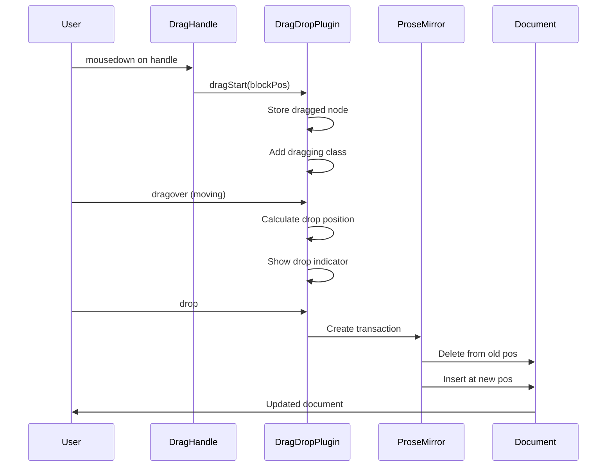

# 15: Block Drag and Drop

> Drag blocks to reorder content within the document

**Duration:** 1.5 days  
**Dependencies:** [14-drag-handle.md](./14-drag-handle.md)

## Overview

This document implements the core drag-and-drop functionality for reordering blocks. When a user drags a block via the drag handle, they can move it to a new position in the document. The system uses the HTML5 Drag and Drop API with ProseMirror transactions to maintain document integrity.



## Implementation

### 1. Drag Drop Plugin

```typescript
// packages/editor/src/extensions/drag-handle/DragDropPlugin.ts

import { Plugin, PluginKey, Transaction } from '@tiptap/pm/state'
import { EditorView } from '@tiptap/pm/view'
import { Node as PMNode, Slice, Fragment } from '@tiptap/pm/model'
import { NodeSelection } from '@tiptap/pm/state'

export const DragDropPluginKey = new PluginKey('dragDrop')

export interface DragState {
  /** Position of the node being dragged */
  draggedPos: number | null
  /** The node being dragged */
  draggedNode: PMNode | null
  /** Current drop target position */
  dropPos: number | null
  /** Whether drop is before or after the target */
  dropSide: 'before' | 'after' | null
}

const DRAG_DATA_TYPE = 'application/x-xnet-block'

export function createDragDropPlugin() {
  let dragState: DragState = {
    draggedPos: null,
    draggedNode: null,
    dropPos: null,
    dropSide: null
  }

  const resetDragState = () => {
    dragState = {
      draggedPos: null,
      draggedNode: null,
      dropPos: null,
      dropSide: null
    }
  }

  return new Plugin({
    key: DragDropPluginKey,

    state: {
      init: () => dragState,
      apply: (tr, value) => {
        const meta = tr.getMeta(DragDropPluginKey)
        if (meta) {
          return { ...value, ...meta }
        }
        return value
      }
    },

    props: {
      handleDOMEvents: {
        dragstart: (view: EditorView, event: DragEvent) => {
          const target = event.target as HTMLElement
          const dragHandle = target.closest('.xnet-drag-handle-button')

          if (!dragHandle) return false

          // Get the block position from the drag handle
          const handle = dragHandle.closest('.xnet-drag-handle')
          const posStr = handle?.getAttribute('data-drag-pos')
          if (!posStr) return false

          const pos = parseInt(posStr, 10)
          const $pos = view.state.doc.resolve(pos)

          // Get the top-level block node
          const node = $pos.nodeAfter
          if (!node) return false

          // Store drag state
          dragState.draggedPos = pos
          dragState.draggedNode = node

          // Set drag data
          event.dataTransfer?.setData(DRAG_DATA_TYPE, JSON.stringify({ pos }))
          event.dataTransfer!.effectAllowed = 'move'

          // Add dragging class to editor
          view.dom.classList.add('is-dragging')

          // Create drag image
          const dragImage = createDragImage(node, view)
          if (dragImage) {
            document.body.appendChild(dragImage)
            event.dataTransfer?.setDragImage(dragImage, 0, 0)
            requestAnimationFrame(() => dragImage.remove())
          }

          return true
        },

        dragover: (view: EditorView, event: DragEvent) => {
          if (!dragState.draggedNode) return false

          event.preventDefault()
          event.dataTransfer!.dropEffect = 'move'

          // Calculate drop position
          const coords = { left: event.clientX, top: event.clientY }
          const dropInfo = calculateDropPosition(view, coords, dragState.draggedPos!)

          if (dropInfo) {
            dragState.dropPos = dropInfo.pos
            dragState.dropSide = dropInfo.side

            // Update plugin state to trigger decoration update
            const tr = view.state.tr.setMeta(DragDropPluginKey, {
              dropPos: dropInfo.pos,
              dropSide: dropInfo.side
            })
            view.dispatch(tr)
          }

          return true
        },

        dragleave: (view: EditorView, event: DragEvent) => {
          // Only clear if actually leaving the editor
          const related = event.relatedTarget as HTMLElement | null
          if (!related || !view.dom.contains(related)) {
            const tr = view.state.tr.setMeta(DragDropPluginKey, {
              dropPos: null,
              dropSide: null
            })
            view.dispatch(tr)
          }
          return false
        },

        drop: (view: EditorView, event: DragEvent) => {
          if (!dragState.draggedNode || dragState.dropPos === null) {
            resetDragState()
            return false
          }

          event.preventDefault()

          const { draggedPos, draggedNode, dropPos, dropSide } = dragState

          // Calculate final insert position
          let insertPos = dropPos
          if (dropSide === 'after') {
            const $dropPos = view.state.doc.resolve(dropPos)
            const nodeAfter = $dropPos.nodeAfter
            if (nodeAfter) {
              insertPos = dropPos + nodeAfter.nodeSize
            }
          }

          // Adjust if dropping after original position
          if (insertPos > draggedPos!) {
            insertPos -= draggedNode.nodeSize
          }

          // Create transaction
          const tr = view.state.tr

          // Delete the original node
          tr.delete(draggedPos!, draggedPos! + draggedNode.nodeSize)

          // Insert at new position
          tr.insert(insertPos, draggedNode)

          // Clear drag state
          tr.setMeta(DragDropPluginKey, {
            draggedPos: null,
            draggedNode: null,
            dropPos: null,
            dropSide: null
          })

          view.dispatch(tr)
          view.dom.classList.remove('is-dragging')
          resetDragState()

          return true
        },

        dragend: (view: EditorView) => {
          view.dom.classList.remove('is-dragging')

          const tr = view.state.tr.setMeta(DragDropPluginKey, {
            draggedPos: null,
            draggedNode: null,
            dropPos: null,
            dropSide: null
          })
          view.dispatch(tr)

          resetDragState()
          return false
        }
      }
    }
  })
}

/**
 * Calculate where to drop the dragged block
 */
function calculateDropPosition(
  view: EditorView,
  coords: { left: number; top: number },
  draggedPos: number
): { pos: number; side: 'before' | 'after' } | null {
  const pos = view.posAtCoords(coords)
  if (!pos) return null

  const $pos = view.state.doc.resolve(pos.pos)

  // Find the closest block-level node
  let depth = $pos.depth
  while (depth > 0 && !$pos.node(depth).isBlock) {
    depth--
  }

  const blockStart = $pos.before(depth)
  const blockNode = $pos.node(depth)

  // Don't allow dropping on itself
  if (blockStart === draggedPos) return null

  // Determine if dropping before or after based on mouse position
  const dom = view.nodeDOM(blockStart)
  if (!dom || !(dom instanceof HTMLElement)) return null

  const rect = dom.getBoundingClientRect()
  const midY = rect.top + rect.height / 2
  const side = coords.top < midY ? 'before' : 'after'

  return { pos: blockStart, side }
}

/**
 * Create a drag preview image
 */
function createDragImage(node: PMNode, view: EditorView): HTMLElement | null {
  const tempContainer = document.createElement('div')
  tempContainer.className = 'xnet-drag-preview'
  tempContainer.style.cssText = `
    position: absolute;
    left: -9999px;
    background: white;
    padding: 8px 12px;
    border-radius: 4px;
    box-shadow: 0 4px 12px rgba(0, 0, 0, 0.15);
    max-width: 300px;
    overflow: hidden;
    white-space: nowrap;
    text-overflow: ellipsis;
  `

  // Get text content preview
  const text = node.textContent.slice(0, 50)
  tempContainer.textContent = text + (node.textContent.length > 50 ? '...' : '')

  return tempContainer
}
```

### 2. Extension Integration

```typescript
// packages/editor/src/extensions/drag-handle/index.ts

import { Extension } from '@tiptap/core'
import { DragHandle, DragHandleOptions } from './DragHandle'
import { createDragDropPlugin, DragDropPluginKey } from './DragDropPlugin'

export interface DragHandleExtensionOptions extends DragHandleOptions {
  /** Enable drag and drop */
  enableDragDrop: boolean
}

export const DragHandleExtension = Extension.create<DragHandleExtensionOptions>({
  name: 'dragHandleExtension',

  addOptions() {
    return {
      draggableSelector: 'p, h1, h2, h3, h4, h5, h6, ul, ol, blockquote, pre, hr',
      handleOffset: -28,
      showDelay: 50,
      enableDragDrop: true
    }
  },

  addExtensions() {
    return [
      DragHandle.configure({
        draggableSelector: this.options.draggableSelector,
        handleOffset: this.options.handleOffset,
        showDelay: this.options.showDelay
      })
    ]
  },

  addProseMirrorPlugins() {
    if (!this.options.enableDragDrop) return []
    return [createDragDropPlugin()]
  }
})

export { DragDropPluginKey } from './DragDropPlugin'
export type { DragState } from './DragDropPlugin'
```

### 3. React Integration

```typescript
// packages/editor/src/components/DragHandle/useDragDrop.ts

import { useEffect, useState, useCallback } from 'react'
import type { Editor } from '@tiptap/core'
import { DragDropPluginKey, type DragState } from '../../extensions/drag-handle/DragDropPlugin'

export interface UseDragDropOptions {
  editor: Editor | null
}

export function useDragDrop({ editor }: UseDragDropOptions) {
  const [isDragging, setIsDragging] = useState(false)
  const [dragState, setDragState] = useState<DragState>({
    draggedPos: null,
    draggedNode: null,
    dropPos: null,
    dropSide: null
  })

  useEffect(() => {
    if (!editor) return

    const updateState = () => {
      const state = DragDropPluginKey.getState(editor.state)
      if (state) {
        setDragState(state)
        setIsDragging(state.draggedNode !== null)
      }
    }

    // Subscribe to editor updates
    editor.on('transaction', updateState)

    return () => {
      editor.off('transaction', updateState)
    }
  }, [editor])

  const startDrag = useCallback(
    (pos: number) => {
      if (!editor) return

      // This will be triggered by the drag handle
      const handle = editor.view.dom.querySelector('.xnet-drag-handle')
      if (handle) {
        handle.setAttribute('data-drag-pos', String(pos))
      }
    },
    [editor]
  )

  return {
    isDragging,
    dragState,
    startDrag
  }
}
```

### 4. Styles for Dragging State

```css
/* packages/editor/src/styles/drag-drop.css */

/* Editor state while dragging */
.xnet-editor.is-dragging {
  cursor: grabbing !important;
}

.xnet-editor.is-dragging * {
  cursor: grabbing !important;
}

/* Hide the dragged block slightly */
.xnet-editor.is-dragging .ProseMirror-selectednode {
  opacity: 0.4;
}

/* Drag preview */
.xnet-drag-preview {
  font-family: inherit;
  font-size: 14px;
  color: #374151;
}

.dark .xnet-drag-preview {
  background: #1f2937;
  color: #e5e7eb;
}
```

### 5. Tailwind Classes for Dragging State

```tsx
// packages/editor/src/components/RichTextEditor.tsx (drag state classes)

import * as React from 'react'
import { cn } from '@xnet/ui/lib/utils'
import { useDragDrop } from './DragHandle/useDragDrop'

export function RichTextEditor(
  {
    /* ... */
  }
) {
  const editor = useEditor({
    /* ... */
  })
  const { isDragging } = useDragDrop({ editor })

  return (
    <div className={cn('relative', isDragging && 'cursor-grabbing [&_*]:cursor-grabbing')}>
      <EditorContent
        editor={editor}
        className={cn('xnet-editor pl-8', isDragging && '[&_.ProseMirror-selectednode]:opacity-40')}
      />
    </div>
  )
}
```

## Tests

```typescript
// packages/editor/src/extensions/drag-handle/DragDropPlugin.test.ts

import { describe, it, expect, vi, beforeEach, afterEach } from 'vitest'
import { EditorState } from '@tiptap/pm/state'
import { EditorView } from '@tiptap/pm/view'
import { Schema, Node as PMNode } from '@tiptap/pm/model'
import { schema } from '@tiptap/pm/schema-basic'
import { createDragDropPlugin, DragDropPluginKey } from './DragDropPlugin'

describe('DragDropPlugin', () => {
  let view: EditorView
  let container: HTMLElement

  beforeEach(() => {
    container = document.createElement('div')
    document.body.appendChild(container)

    const doc = schema.node('doc', null, [
      schema.node('paragraph', null, [schema.text('First paragraph')]),
      schema.node('paragraph', null, [schema.text('Second paragraph')]),
      schema.node('paragraph', null, [schema.text('Third paragraph')])
    ])

    const state = EditorState.create({
      doc,
      schema,
      plugins: [createDragDropPlugin()]
    })

    view = new EditorView(container, { state })
  })

  afterEach(() => {
    view.destroy()
    container.remove()
  })

  describe('initial state', () => {
    it('should have null drag state', () => {
      const state = DragDropPluginKey.getState(view.state)

      expect(state.draggedPos).toBeNull()
      expect(state.draggedNode).toBeNull()
      expect(state.dropPos).toBeNull()
      expect(state.dropSide).toBeNull()
    })
  })

  describe('drag operations', () => {
    it('should update state on drag start', () => {
      // Create a mock drag handle
      const handle = document.createElement('div')
      handle.className = 'xnet-drag-handle'
      handle.setAttribute('data-drag-pos', '0')

      const button = document.createElement('button')
      button.className = 'xnet-drag-handle-button'
      handle.appendChild(button)
      view.dom.appendChild(handle)

      const dragEvent = new DragEvent('dragstart', {
        bubbles: true,
        dataTransfer: new DataTransfer()
      })
      Object.defineProperty(dragEvent, 'target', { value: button })

      view.dom.dispatchEvent(dragEvent)

      expect(view.dom.classList.contains('is-dragging')).toBe(true)
    })

    it('should clean up on drag end', () => {
      view.dom.classList.add('is-dragging')

      const dragEvent = new DragEvent('dragend', { bubbles: true })
      view.dom.dispatchEvent(dragEvent)

      expect(view.dom.classList.contains('is-dragging')).toBe(false)

      const state = DragDropPluginKey.getState(view.state)
      expect(state.dropPos).toBeNull()
    })
  })

  describe('drop position calculation', () => {
    it('should prevent dropping on the same block', () => {
      // This would be tested with more complete DOM mocking
      // The actual implementation prevents this in calculateDropPosition
    })
  })
})
```

```typescript
// packages/editor/src/components/DragHandle/useDragDrop.test.ts

import { describe, it, expect, vi, beforeEach, afterEach } from 'vitest'
import { renderHook, act } from '@testing-library/react'
import { useDragDrop } from './useDragDrop'
import { DragDropPluginKey } from '../../extensions/drag-handle/DragDropPlugin'

describe('useDragDrop', () => {
  const createMockEditor = (initialState = {}) => {
    const listeners: Record<string, Function[]> = {}

    return {
      state: {
        [DragDropPluginKey as any]: initialState
      },
      on: vi.fn((event, callback) => {
        listeners[event] = listeners[event] || []
        listeners[event].push(callback)
      }),
      off: vi.fn((event, callback) => {
        if (listeners[event]) {
          listeners[event] = listeners[event].filter((cb) => cb !== callback)
        }
      }),
      view: {
        dom: document.createElement('div')
      },
      // Trigger a transaction event
      emitTransaction: () => {
        listeners['transaction']?.forEach((cb) => cb())
      }
    }
  }

  it('should return initial state when no editor', () => {
    const { result } = renderHook(() => useDragDrop({ editor: null }))

    expect(result.current.isDragging).toBe(false)
    expect(result.current.dragState.draggedNode).toBeNull()
  })

  it('should subscribe to editor transactions', () => {
    const mockEditor = createMockEditor()

    renderHook(() => useDragDrop({ editor: mockEditor as any }))

    expect(mockEditor.on).toHaveBeenCalledWith('transaction', expect.any(Function))
  })

  it('should unsubscribe on unmount', () => {
    const mockEditor = createMockEditor()

    const { unmount } = renderHook(() => useDragDrop({ editor: mockEditor as any }))
    unmount()

    expect(mockEditor.off).toHaveBeenCalledWith('transaction', expect.any(Function))
  })
})
```

## Integration Test

```typescript
// packages/editor/src/extensions/drag-handle/integration.test.ts

import { describe, it, expect, beforeEach, afterEach } from 'vitest'
import { Editor } from '@tiptap/core'
import StarterKit from '@tiptap/starter-kit'
import { DragHandleExtension } from './index'

describe('DragHandle Integration', () => {
  let editor: Editor
  let container: HTMLElement

  beforeEach(() => {
    container = document.createElement('div')
    document.body.appendChild(container)

    editor = new Editor({
      element: container,
      extensions: [
        StarterKit,
        DragHandleExtension.configure({
          enableDragDrop: true
        })
      ],
      content: `
        <p>First paragraph</p>
        <p>Second paragraph</p>
        <p>Third paragraph</p>
      `
    })
  })

  afterEach(() => {
    editor.destroy()
    container.remove()
  })

  it('should initialize with drag handle extension', () => {
    const extension = editor.extensionManager.extensions.find(
      (ext) => ext.name === 'dragHandleExtension'
    )
    expect(extension).toBeDefined()
  })

  it('should have drag drop plugin when enabled', () => {
    const plugins = editor.state.plugins
    const dragDropPlugin = plugins.find((p) => p.spec.key?.key === 'dragDrop$')
    expect(dragDropPlugin).toBeDefined()
  })

  it('should reorder blocks on successful drag and drop', () => {
    // Initial order
    const initialContent = editor.getHTML()
    expect(initialContent).toContain('First paragraph')

    // Simulate drag and drop programmatically
    // This would need more complete DOM event simulation in a real test
  })
})
```

## Checklist

- [ ] Create DragDropPlugin
- [ ] Implement dragstart handler
- [ ] Implement dragover handler
- [ ] Implement drop handler
- [ ] Calculate drop position correctly
- [ ] Handle position adjustment after drop
- [ ] Create drag preview image
- [ ] Add dragging CSS classes
- [ ] Integrate with DragHandle extension
- [ ] Create useDragDrop hook
- [ ] Prevent dropping on same block
- [ ] Write tests
- [ ] Tests pass

---

[Back to README](./README.md) | [Previous: Drag Handle](./14-drag-handle.md) | [Next: Drop Indicator](./16-drop-indicator.md)
