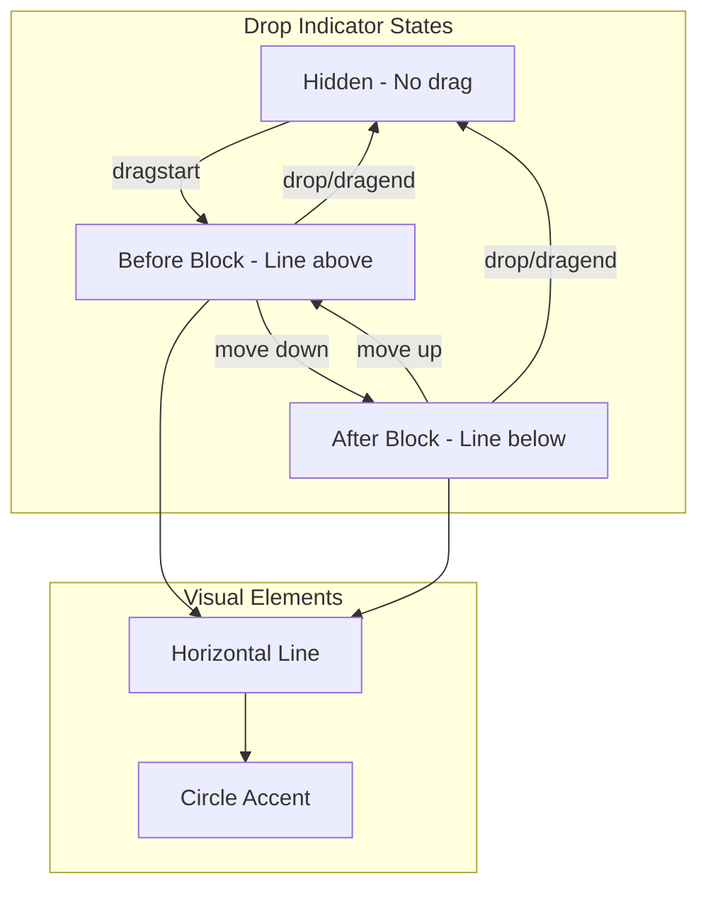

# 16: Drop Indicator

> Visual feedback showing where blocks will be dropped during drag operations

**Duration:** 0.5 days  
**Dependencies:** [15-block-dnd.md](./15-block-dnd.md)

## Overview

The drop indicator is a visual line that appears during drag operations to show where the dragged block will be inserted. It provides clear feedback about the drop target position, appearing either above or below blocks based on the cursor position.



## Implementation

### 1. Drop Indicator Decoration Plugin

```typescript
// packages/editor/src/extensions/drag-handle/DropIndicatorPlugin.ts

import { Plugin, PluginKey } from '@tiptap/pm/state'
import { Decoration, DecorationSet } from '@tiptap/pm/view'
import { DragDropPluginKey, type DragState } from './DragDropPlugin'

export const DropIndicatorPluginKey = new PluginKey('dropIndicator')

export function createDropIndicatorPlugin() {
  return new Plugin({
    key: DropIndicatorPluginKey,

    props: {
      decorations(state) {
        const dragState = DragDropPluginKey.getState(state) as DragState | undefined

        if (!dragState?.dropPos || !dragState.dropSide) {
          return DecorationSet.empty
        }

        const { dropPos, dropSide } = dragState

        // Create a widget decoration for the drop indicator
        const decoration = Decoration.widget(
          dropPos,
          () => {
            const indicator = document.createElement('div')
            indicator.className = `xnet-drop-indicator xnet-drop-indicator--${dropSide}`
            indicator.setAttribute('data-side', dropSide)

            // Add circle accent
            const dot = document.createElement('div')
            dot.className = 'xnet-drop-indicator-dot'
            indicator.appendChild(dot)

            return indicator
          },
          {
            side: dropSide === 'before' ? -1 : 1,
            key: 'drop-indicator'
          }
        )

        return DecorationSet.create(state.doc, [decoration])
      }
    }
  })
}
```

### 2. Drop Indicator Styles

```css
/* packages/editor/src/styles/drop-indicator.css */

.xnet-drop-indicator {
  position: absolute;
  left: 0;
  right: 0;
  height: 2px;
  background-color: var(--xnet-primary, #3b82f6);
  border-radius: 1px;
  pointer-events: none;
  z-index: 100;

  /* Animation */
  animation: drop-indicator-appear 150ms ease-out;
}

.xnet-drop-indicator--before {
  transform: translateY(-1px);
  margin-top: -4px;
}

.xnet-drop-indicator--after {
  transform: translateY(1px);
  margin-bottom: -4px;
}

.xnet-drop-indicator-dot {
  position: absolute;
  left: -4px;
  top: 50%;
  transform: translateY(-50%);
  width: 8px;
  height: 8px;
  background-color: var(--xnet-primary, #3b82f6);
  border-radius: 50%;
  border: 2px solid var(--xnet-bg, white);
}

/* Animation keyframes */
@keyframes drop-indicator-appear {
  from {
    opacity: 0;
    transform: scaleX(0.9);
  }
  to {
    opacity: 1;
    transform: scaleX(1);
  }
}

/* Dark mode */
.dark .xnet-drop-indicator {
  background-color: var(--xnet-primary-dark, #60a5fa);
}

.dark .xnet-drop-indicator-dot {
  background-color: var(--xnet-primary-dark, #60a5fa);
  border-color: var(--xnet-bg-dark, #1f2937);
}
```

### 3. Tailwind React Component

```tsx
// packages/editor/src/components/DragHandle/DropIndicator.tsx

import * as React from 'react'
import { cn } from '@xnet/ui/lib/utils'

export interface DropIndicatorProps {
  visible: boolean
  top: number
  side: 'before' | 'after'
}

export function DropIndicator({ visible, top, side }: DropIndicatorProps) {
  if (!visible) return null

  return (
    <div
      className={cn(
        'absolute left-0 right-0 h-0.5 rounded-full pointer-events-none z-50',
        'bg-blue-500 dark:bg-blue-400',
        'animate-in fade-in zoom-in-95 duration-150',
        side === 'before' ? '-translate-y-px -mt-1' : 'translate-y-px -mb-1'
      )}
      style={{ top }}
    >
      {/* Circle accent on left */}
      <div
        className={cn(
          'absolute -left-1 top-1/2 -translate-y-1/2',
          'w-2 h-2 rounded-full',
          'bg-blue-500 dark:bg-blue-400',
          'border-2 border-white dark:border-gray-900'
        )}
      />
    </div>
  )
}
```

### 4. Hook for Drop Indicator State

```typescript
// packages/editor/src/components/DragHandle/useDropIndicator.ts

import { useState, useEffect, useMemo } from 'react'
import type { Editor } from '@tiptap/core'
import { DragDropPluginKey, type DragState } from '../../extensions/drag-handle/DragDropPlugin'

export interface DropIndicatorState {
  visible: boolean
  top: number
  side: 'before' | 'after'
}

export interface UseDropIndicatorOptions {
  editor: Editor | null
}

export function useDropIndicator({ editor }: UseDropIndicatorOptions): DropIndicatorState {
  const [state, setState] = useState<DropIndicatorState>({
    visible: false,
    top: 0,
    side: 'before'
  })

  useEffect(() => {
    if (!editor) return

    const updateIndicator = () => {
      const dragState = DragDropPluginKey.getState(editor.state) as DragState | undefined

      if (!dragState?.dropPos || !dragState.dropSide) {
        setState((prev) => ({ ...prev, visible: false }))
        return
      }

      const { dropPos, dropSide } = dragState

      // Get the DOM position for the drop target
      try {
        const coords = editor.view.coordsAtPos(dropPos)
        const editorRect = editor.view.dom.getBoundingClientRect()

        const top = coords.top - editorRect.top + editor.view.dom.scrollTop

        setState({
          visible: true,
          top: dropSide === 'after' ? top + coords.bottom - coords.top : top,
          side: dropSide
        })
      } catch {
        setState((prev) => ({ ...prev, visible: false }))
      }
    }

    editor.on('transaction', updateIndicator)

    return () => {
      editor.off('transaction', updateIndicator)
    }
  }, [editor])

  return state
}
```

### 5. Alternative: Pure Decoration Approach

For better performance, we can use ProseMirror decorations instead of a React component:

```typescript
// packages/editor/src/extensions/drag-handle/DropIndicatorDecoration.ts

import { Plugin, PluginKey } from '@tiptap/pm/state'
import { Decoration, DecorationSet } from '@tiptap/pm/view'
import { DragDropPluginKey, type DragState } from './DragDropPlugin'

export const DropIndicatorPluginKey = new PluginKey('dropIndicator')

/**
 * Creates drop indicator decorations based on drag state
 */
export function createDropIndicatorPlugin() {
  return new Plugin({
    key: DropIndicatorPluginKey,

    props: {
      decorations(state) {
        const dragState = DragDropPluginKey.getState(state) as DragState | undefined

        if (!dragState?.dropPos || !dragState.dropSide) {
          return DecorationSet.empty
        }

        const { dropPos, dropSide } = dragState
        const $pos = state.doc.resolve(dropPos)

        // Find the block node at this position
        let nodePos = dropPos
        if (dropSide === 'after') {
          const nodeAfter = $pos.nodeAfter
          if (nodeAfter) {
            nodePos = dropPos + nodeAfter.nodeSize
          }
        }

        // Create inline decoration that inserts the indicator
        const indicatorHTML = `
          <div class="xnet-drop-indicator xnet-drop-indicator--${dropSide}">
            <div class="xnet-drop-indicator-dot"></div>
          </div>
        `

        const decoration = Decoration.widget(
          nodePos,
          (view, getPos) => {
            const wrapper = document.createElement('div')
            wrapper.innerHTML = indicatorHTML
            return wrapper.firstElementChild as HTMLElement
          },
          {
            side: dropSide === 'before' ? -1 : 1,
            key: `drop-indicator-${nodePos}`
          }
        )

        return DecorationSet.create(state.doc, [decoration])
      }
    }
  })
}
```

### 6. Integration with Editor

```tsx
// packages/editor/src/components/RichTextEditor.tsx (with drop indicator)

import * as React from 'react'
import { useEditor, EditorContent } from '@tiptap/react'
import { DragHandle } from './DragHandle/DragHandle'
import { DropIndicator } from './DragHandle/DropIndicator'
import { useDragHandle } from './DragHandle/useDragHandle'
import { useDropIndicator } from './DragHandle/useDropIndicator'
import { cn } from '@xnet/ui/lib/utils'

export function RichTextEditor(
  {
    /* ... */
  }
) {
  const editor = useEditor({
    // ... config
  })

  const dragHandle = useDragHandle({ editor })
  const dropIndicator = useDropIndicator({ editor })

  return (
    <div className="relative">
      <DragHandle
        visible={dragHandle.visible}
        top={dragHandle.top}
        left={dragHandle.left}
        height={dragHandle.height}
      />

      <DropIndicator
        visible={dropIndicator.visible}
        top={dropIndicator.top}
        side={dropIndicator.side}
      />

      <EditorContent editor={editor} className="xnet-editor pl-8" />
    </div>
  )
}
```

### 7. Extension Bundle Update

```typescript
// packages/editor/src/extensions/drag-handle/index.ts

import { Extension } from '@tiptap/core'
import { DragHandle, DragHandleOptions } from './DragHandle'
import { createDragDropPlugin } from './DragDropPlugin'
import { createDropIndicatorPlugin } from './DropIndicatorDecoration'

export interface DragHandleExtensionOptions extends DragHandleOptions {
  enableDragDrop: boolean
  showDropIndicator: boolean
}

export const DragHandleExtension = Extension.create<DragHandleExtensionOptions>({
  name: 'dragHandleExtension',

  addOptions() {
    return {
      draggableSelector: 'p, h1, h2, h3, h4, h5, h6, ul, ol, blockquote, pre, hr',
      handleOffset: -28,
      showDelay: 50,
      enableDragDrop: true,
      showDropIndicator: true
    }
  },

  addExtensions() {
    return [
      DragHandle.configure({
        draggableSelector: this.options.draggableSelector,
        handleOffset: this.options.handleOffset,
        showDelay: this.options.showDelay
      })
    ]
  },

  addProseMirrorPlugins() {
    const plugins = []

    if (this.options.enableDragDrop) {
      plugins.push(createDragDropPlugin())
    }

    if (this.options.showDropIndicator) {
      plugins.push(createDropIndicatorPlugin())
    }

    return plugins
  }
})
```

## Tests

```typescript
// packages/editor/src/components/DragHandle/DropIndicator.test.tsx

import * as React from 'react'
import { describe, it, expect } from 'vitest'
import { render } from '@testing-library/react'
import { DropIndicator } from './DropIndicator'

describe('DropIndicator', () => {
  it('should not render when not visible', () => {
    const { container } = render(
      <DropIndicator visible={false} top={100} side="before" />
    )

    expect(container.firstChild).toBeNull()
  })

  it('should render when visible', () => {
    const { container } = render(
      <DropIndicator visible={true} top={100} side="before" />
    )

    expect(container.firstChild).not.toBeNull()
  })

  it('should position correctly', () => {
    const { container } = render(
      <DropIndicator visible={true} top={150} side="before" />
    )

    const indicator = container.firstChild as HTMLElement
    expect(indicator.style.top).toBe('150px')
  })

  it('should apply before class for before side', () => {
    const { container } = render(
      <DropIndicator visible={true} top={100} side="before" />
    )

    const indicator = container.firstChild as HTMLElement
    expect(indicator.classList.contains('-translate-y-px')).toBe(true)
    expect(indicator.classList.contains('-mt-1')).toBe(true)
  })

  it('should apply after class for after side', () => {
    const { container } = render(
      <DropIndicator visible={true} top={100} side="after" />
    )

    const indicator = container.firstChild as HTMLElement
    expect(indicator.classList.contains('translate-y-px')).toBe(true)
    expect(indicator.classList.contains('-mb-1')).toBe(true)
  })

  it('should have circle accent', () => {
    const { container } = render(
      <DropIndicator visible={true} top={100} side="before" />
    )

    const dot = container.querySelector('.rounded-full')
    expect(dot).not.toBeNull()
  })
})
```

```typescript
// packages/editor/src/extensions/drag-handle/DropIndicatorPlugin.test.ts

import { describe, it, expect, beforeEach, afterEach } from 'vitest'
import { EditorState } from '@tiptap/pm/state'
import { EditorView } from '@tiptap/pm/view'
import { schema } from '@tiptap/pm/schema-basic'
import { createDropIndicatorPlugin, DropIndicatorPluginKey } from './DropIndicatorDecoration'
import { createDragDropPlugin, DragDropPluginKey } from './DragDropPlugin'

describe('DropIndicatorPlugin', () => {
  let view: EditorView
  let container: HTMLElement

  beforeEach(() => {
    container = document.createElement('div')
    document.body.appendChild(container)

    const doc = schema.node('doc', null, [
      schema.node('paragraph', null, [schema.text('First')]),
      schema.node('paragraph', null, [schema.text('Second')])
    ])

    const state = EditorState.create({
      doc,
      schema,
      plugins: [createDragDropPlugin(), createDropIndicatorPlugin()]
    })

    view = new EditorView(container, { state })
  })

  afterEach(() => {
    view.destroy()
    container.remove()
  })

  it('should not show indicator when not dragging', () => {
    const decorations = DropIndicatorPluginKey.getState(view.state)
    // When using props.decorations, we check the view
    const indicator = view.dom.querySelector('.xnet-drop-indicator')
    expect(indicator).toBeNull()
  })

  it('should show indicator when drop position is set', () => {
    // Set drag state with drop position
    const tr = view.state.tr.setMeta(DragDropPluginKey, {
      draggedPos: 0,
      draggedNode: view.state.doc.firstChild,
      dropPos: 10,
      dropSide: 'before'
    })

    view.dispatch(tr)

    // Check if decoration was created
    const indicator = view.dom.querySelector('.xnet-drop-indicator')
    // Note: This may not work in JSDOM, would need integration test
  })
})
```

```typescript
// packages/editor/src/components/DragHandle/useDropIndicator.test.ts

import { describe, it, expect, vi, beforeEach, afterEach } from 'vitest'
import { renderHook, act } from '@testing-library/react'
import { useDropIndicator } from './useDropIndicator'
import { DragDropPluginKey } from '../../extensions/drag-handle/DragDropPlugin'

describe('useDropIndicator', () => {
  const createMockEditor = (dragState: any = {}) => {
    const listeners: Record<string, Function[]> = {}

    return {
      state: {
        [DragDropPluginKey as any]: dragState
      },
      view: {
        dom: document.createElement('div'),
        coordsAtPos: vi.fn().mockReturnValue({ top: 100, bottom: 120 })
      },
      on: vi.fn((event, callback) => {
        listeners[event] = listeners[event] || []
        listeners[event].push(callback)
      }),
      off: vi.fn((event, callback) => {
        if (listeners[event]) {
          listeners[event] = listeners[event].filter((cb) => cb !== callback)
        }
      }),
      emitTransaction: () => {
        listeners['transaction']?.forEach((cb) => cb())
      }
    }
  }

  it('should return invisible state when no editor', () => {
    const { result } = renderHook(() => useDropIndicator({ editor: null }))

    expect(result.current.visible).toBe(false)
  })

  it('should return invisible state when no drop position', () => {
    const mockEditor = createMockEditor({
      dropPos: null,
      dropSide: null
    })

    const { result } = renderHook(() => useDropIndicator({ editor: mockEditor as any }))

    expect(result.current.visible).toBe(false)
  })

  it('should subscribe to editor transactions', () => {
    const mockEditor = createMockEditor()

    renderHook(() => useDropIndicator({ editor: mockEditor as any }))

    expect(mockEditor.on).toHaveBeenCalledWith('transaction', expect.any(Function))
  })

  it('should unsubscribe on unmount', () => {
    const mockEditor = createMockEditor()

    const { unmount } = renderHook(() => useDropIndicator({ editor: mockEditor as any }))
    unmount()

    expect(mockEditor.off).toHaveBeenCalledWith('transaction', expect.any(Function))
  })
})
```

## Checklist

- [ ] Create DropIndicatorPlugin
- [ ] Style indicator with CSS
- [ ] Create Tailwind React component
- [ ] Create useDropIndicator hook
- [ ] Add appear animation
- [ ] Support before/after positions
- [ ] Add circle accent on left
- [ ] Support dark mode
- [ ] Integrate with DragHandleExtension
- [ ] Write tests
- [ ] Tests pass

---

[Back to README](./README.md) | [Previous: Block Drag and Drop](./15-block-dnd.md) | [Next: Keyboard Shortcuts](./17-keyboard-shortcuts.md)
