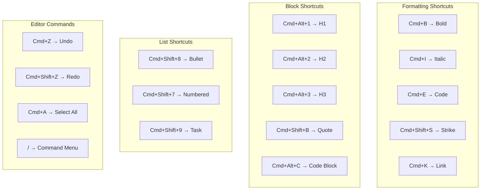

# 17: Keyboard Shortcuts

> Comprehensive keyboard support for efficient editing

**Duration:** 1 day  
**Dependencies:** [13-command-items.md](./13-command-items.md)

## Overview

This document defines all keyboard shortcuts for the editor, providing a complete keyboard-driven editing experience. The shortcuts follow platform conventions (Cmd on macOS, Ctrl on Windows/Linux) and cover formatting, navigation, block operations, and editor commands.



## Implementation

### 1. Keyboard Shortcut Types

```typescript
// packages/editor/src/extensions/keyboard-shortcuts/types.ts

import type { Editor } from '@tiptap/core'

/**
 * A keyboard shortcut definition
 */
export interface KeyboardShortcut {
  /** Unique identifier */
  id: string
  /** Human-readable name */
  name: string
  /** Description of what the shortcut does */
  description: string
  /** Key combination (e.g., 'Mod-b', 'Mod-Shift-1') */
  keys: string
  /** Display string for the shortcut */
  display: {
    mac: string
    windows: string
  }
  /** Category for grouping */
  category: 'formatting' | 'blocks' | 'lists' | 'navigation' | 'editor'
  /** The command to execute */
  command: (editor: Editor) => boolean
}

/**
 * Platform-specific modifier key
 * 'Mod' becomes 'Cmd' on Mac, 'Ctrl' on Windows/Linux
 */
export type ModifierKey = 'Mod' | 'Ctrl' | 'Alt' | 'Shift' | 'Meta'

/**
 * Check if running on macOS
 */
export const isMac =
  typeof navigator !== 'undefined' ? /Mac|iPod|iPhone|iPad/.test(navigator.platform) : false

/**
 * Format a shortcut for display
 */
export function formatShortcut(keys: string): { mac: string; windows: string } {
  const parts = keys.split('-')

  const macParts = parts.map((part) => {
    switch (part) {
      case 'Mod':
        return '⌘'
      case 'Ctrl':
        return '⌃'
      case 'Alt':
        return '⌥'
      case 'Shift':
        return '⇧'
      default:
        return part.toUpperCase()
    }
  })

  const winParts = parts.map((part) => {
    switch (part) {
      case 'Mod':
        return 'Ctrl'
      case 'Ctrl':
        return 'Ctrl'
      case 'Alt':
        return 'Alt'
      case 'Shift':
        return 'Shift'
      default:
        return part.toUpperCase()
    }
  })

  return {
    mac: macParts.join(''),
    windows: winParts.join('+')
  }
}
```

### 2. Shortcut Definitions

```typescript
// packages/editor/src/extensions/keyboard-shortcuts/shortcuts.ts

import type { KeyboardShortcut } from './types'
import { formatShortcut } from './types'

/**
 * All keyboard shortcuts organized by category
 */
export const KEYBOARD_SHORTCUTS: KeyboardShortcut[] = [
  // ========================================
  // Formatting
  // ========================================
  {
    id: 'bold',
    name: 'Bold',
    description: 'Toggle bold formatting',
    keys: 'Mod-b',
    display: formatShortcut('Mod-b'),
    category: 'formatting',
    command: (editor) => editor.chain().focus().toggleBold().run()
  },
  {
    id: 'italic',
    name: 'Italic',
    description: 'Toggle italic formatting',
    keys: 'Mod-i',
    display: formatShortcut('Mod-i'),
    category: 'formatting',
    command: (editor) => editor.chain().focus().toggleItalic().run()
  },
  {
    id: 'underline',
    name: 'Underline',
    description: 'Toggle underline formatting',
    keys: 'Mod-u',
    display: formatShortcut('Mod-u'),
    category: 'formatting',
    command: (editor) => editor.chain().focus().toggleUnderline().run()
  },
  {
    id: 'strikethrough',
    name: 'Strikethrough',
    description: 'Toggle strikethrough formatting',
    keys: 'Mod-Shift-s',
    display: formatShortcut('Mod-Shift-s'),
    category: 'formatting',
    command: (editor) => editor.chain().focus().toggleStrike().run()
  },
  {
    id: 'code',
    name: 'Inline Code',
    description: 'Toggle inline code formatting',
    keys: 'Mod-e',
    display: formatShortcut('Mod-e'),
    category: 'formatting',
    command: (editor) => editor.chain().focus().toggleCode().run()
  },
  {
    id: 'link',
    name: 'Link',
    description: 'Add or edit link',
    keys: 'Mod-k',
    display: formatShortcut('Mod-k'),
    category: 'formatting',
    command: (editor) => {
      // This will be handled by the link toolbar
      // For now, just trigger the mark
      const previousUrl = editor.getAttributes('link').href
      const url = window.prompt('URL', previousUrl)
      if (url === null) return false
      if (url === '') {
        return editor.chain().focus().unsetLink().run()
      }
      return editor.chain().focus().setLink({ href: url }).run()
    }
  },
  {
    id: 'clear-formatting',
    name: 'Clear Formatting',
    description: 'Remove all formatting from selection',
    keys: 'Mod-\\',
    display: formatShortcut('Mod-\\'),
    category: 'formatting',
    command: (editor) => editor.chain().focus().clearNodes().unsetAllMarks().run()
  },

  // ========================================
  // Blocks
  // ========================================
  {
    id: 'heading-1',
    name: 'Heading 1',
    description: 'Convert to heading 1',
    keys: 'Mod-Alt-1',
    display: formatShortcut('Mod-Alt-1'),
    category: 'blocks',
    command: (editor) => editor.chain().focus().toggleHeading({ level: 1 }).run()
  },
  {
    id: 'heading-2',
    name: 'Heading 2',
    description: 'Convert to heading 2',
    keys: 'Mod-Alt-2',
    display: formatShortcut('Mod-Alt-2'),
    category: 'blocks',
    command: (editor) => editor.chain().focus().toggleHeading({ level: 2 }).run()
  },
  {
    id: 'heading-3',
    name: 'Heading 3',
    description: 'Convert to heading 3',
    keys: 'Mod-Alt-3',
    display: formatShortcut('Mod-Alt-3'),
    category: 'blocks',
    command: (editor) => editor.chain().focus().toggleHeading({ level: 3 }).run()
  },
  {
    id: 'paragraph',
    name: 'Paragraph',
    description: 'Convert to paragraph',
    keys: 'Mod-Alt-0',
    display: formatShortcut('Mod-Alt-0'),
    category: 'blocks',
    command: (editor) => editor.chain().focus().setParagraph().run()
  },
  {
    id: 'blockquote',
    name: 'Blockquote',
    description: 'Toggle blockquote',
    keys: 'Mod-Shift-b',
    display: formatShortcut('Mod-Shift-b'),
    category: 'blocks',
    command: (editor) => editor.chain().focus().toggleBlockquote().run()
  },
  {
    id: 'code-block',
    name: 'Code Block',
    description: 'Toggle code block',
    keys: 'Mod-Alt-c',
    display: formatShortcut('Mod-Alt-c'),
    category: 'blocks',
    command: (editor) => editor.chain().focus().toggleCodeBlock().run()
  },
  {
    id: 'horizontal-rule',
    name: 'Divider',
    description: 'Insert horizontal rule',
    keys: 'Mod-Alt--',
    display: formatShortcut('Mod-Alt--'),
    category: 'blocks',
    command: (editor) => editor.chain().focus().setHorizontalRule().run()
  },

  // ========================================
  // Lists
  // ========================================
  {
    id: 'bullet-list',
    name: 'Bullet List',
    description: 'Toggle bullet list',
    keys: 'Mod-Shift-8',
    display: formatShortcut('Mod-Shift-8'),
    category: 'lists',
    command: (editor) => editor.chain().focus().toggleBulletList().run()
  },
  {
    id: 'ordered-list',
    name: 'Numbered List',
    description: 'Toggle numbered list',
    keys: 'Mod-Shift-7',
    display: formatShortcut('Mod-Shift-7'),
    category: 'lists',
    command: (editor) => editor.chain().focus().toggleOrderedList().run()
  },
  {
    id: 'task-list',
    name: 'Task List',
    description: 'Toggle task list',
    keys: 'Mod-Shift-9',
    display: formatShortcut('Mod-Shift-9'),
    category: 'lists',
    command: (editor) => editor.chain().focus().toggleTaskList().run()
  },
  {
    id: 'indent',
    name: 'Indent',
    description: 'Indent list item',
    keys: 'Tab',
    display: { mac: 'Tab', windows: 'Tab' },
    category: 'lists',
    command: (editor) => {
      if (editor.can().sinkListItem('listItem')) {
        return editor.chain().focus().sinkListItem('listItem').run()
      }
      return false
    }
  },
  {
    id: 'outdent',
    name: 'Outdent',
    description: 'Outdent list item',
    keys: 'Shift-Tab',
    display: { mac: '⇧Tab', windows: 'Shift+Tab' },
    category: 'lists',
    command: (editor) => {
      if (editor.can().liftListItem('listItem')) {
        return editor.chain().focus().liftListItem('listItem').run()
      }
      return false
    }
  },

  // ========================================
  // Navigation
  // ========================================
  {
    id: 'move-to-start',
    name: 'Move to Start',
    description: 'Move cursor to document start',
    keys: 'Mod-Home',
    display: formatShortcut('Mod-Home'),
    category: 'navigation',
    command: (editor) => editor.chain().focus().setTextSelection(0).run()
  },
  {
    id: 'move-to-end',
    name: 'Move to End',
    description: 'Move cursor to document end',
    keys: 'Mod-End',
    display: formatShortcut('Mod-End'),
    category: 'navigation',
    command: (editor) => {
      const endPos = editor.state.doc.content.size
      return editor.chain().focus().setTextSelection(endPos).run()
    }
  },

  // ========================================
  // Editor Commands
  // ========================================
  {
    id: 'undo',
    name: 'Undo',
    description: 'Undo last action',
    keys: 'Mod-z',
    display: formatShortcut('Mod-z'),
    category: 'editor',
    command: (editor) => editor.chain().focus().undo().run()
  },
  {
    id: 'redo',
    name: 'Redo',
    description: 'Redo last undone action',
    keys: 'Mod-Shift-z',
    display: formatShortcut('Mod-Shift-z'),
    category: 'editor',
    command: (editor) => editor.chain().focus().redo().run()
  },
  {
    id: 'select-all',
    name: 'Select All',
    description: 'Select all content',
    keys: 'Mod-a',
    display: formatShortcut('Mod-a'),
    category: 'editor',
    command: (editor) => editor.chain().focus().selectAll().run()
  },
  {
    id: 'hard-break',
    name: 'Line Break',
    description: 'Insert line break (soft return)',
    keys: 'Shift-Enter',
    display: { mac: '⇧↵', windows: 'Shift+Enter' },
    category: 'editor',
    command: (editor) => editor.chain().focus().setHardBreak().run()
  }
]

/**
 * Get shortcuts by category
 */
export function getShortcutsByCategory(category: KeyboardShortcut['category']): KeyboardShortcut[] {
  return KEYBOARD_SHORTCUTS.filter((s) => s.category === category)
}

/**
 * Get a shortcut by ID
 */
export function getShortcutById(id: string): KeyboardShortcut | undefined {
  return KEYBOARD_SHORTCUTS.find((s) => s.id === id)
}

/**
 * Get all shortcuts as a map for quick lookup
 */
export function getShortcutsMap(): Map<string, KeyboardShortcut> {
  return new Map(KEYBOARD_SHORTCUTS.map((s) => [s.keys, s]))
}
```

### 3. Keyboard Shortcuts Extension

```typescript
// packages/editor/src/extensions/keyboard-shortcuts/KeyboardShortcuts.ts

import { Extension } from '@tiptap/core'
import { KEYBOARD_SHORTCUTS, type KeyboardShortcut } from './shortcuts'

export interface KeyboardShortcutsOptions {
  /** Additional custom shortcuts */
  customShortcuts?: KeyboardShortcut[]
  /** Shortcuts to disable (by ID) */
  disabledShortcuts?: string[]
}

export const KeyboardShortcuts = Extension.create<KeyboardShortcutsOptions>({
  name: 'keyboardShortcuts',

  addOptions() {
    return {
      customShortcuts: [],
      disabledShortcuts: []
    }
  },

  addKeyboardShortcuts() {
    const { customShortcuts, disabledShortcuts } = this.options
    const editor = this.editor

    // Combine default and custom shortcuts
    const allShortcuts = [...KEYBOARD_SHORTCUTS, ...(customShortcuts || [])]

    // Filter out disabled shortcuts
    const enabledShortcuts = allShortcuts.filter((s) => !disabledShortcuts?.includes(s.id))

    // Convert to TipTap format
    const shortcuts: Record<string, () => boolean> = {}

    for (const shortcut of enabledShortcuts) {
      shortcuts[shortcut.keys] = () => shortcut.command(editor)
    }

    return shortcuts
  }
})
```

### 4. Keyboard Shortcuts Help Modal

```tsx
// packages/editor/src/components/KeyboardShortcuts/ShortcutsHelp.tsx

import * as React from 'react'
import { cn } from '@xnet/ui/lib/utils'
import {
  KEYBOARD_SHORTCUTS,
  type KeyboardShortcut
} from '../../extensions/keyboard-shortcuts/shortcuts'
import { isMac } from '../../extensions/keyboard-shortcuts/types'

export interface ShortcutsHelpProps {
  open: boolean
  onClose: () => void
}

const CATEGORY_LABELS: Record<KeyboardShortcut['category'], string> = {
  formatting: 'Formatting',
  blocks: 'Blocks',
  lists: 'Lists',
  navigation: 'Navigation',
  editor: 'Editor'
}

export function ShortcutsHelp({ open, onClose }: ShortcutsHelpProps) {
  const shortcutsByCategory = React.useMemo(() => {
    const grouped: Record<string, KeyboardShortcut[]> = {}
    for (const shortcut of KEYBOARD_SHORTCUTS) {
      if (!grouped[shortcut.category]) {
        grouped[shortcut.category] = []
      }
      grouped[shortcut.category].push(shortcut)
    }
    return grouped
  }, [])

  if (!open) return null

  return (
    <div
      className="fixed inset-0 z-50 flex items-center justify-center bg-black/50"
      onClick={onClose}
    >
      <div
        className={cn(
          'bg-white dark:bg-gray-800 rounded-lg shadow-xl',
          'max-w-2xl max-h-[80vh] overflow-auto',
          'p-6'
        )}
        onClick={(e) => e.stopPropagation()}
      >
        <div className="flex items-center justify-between mb-4">
          <h2 className="text-xl font-semibold text-gray-900 dark:text-gray-100">
            Keyboard Shortcuts
          </h2>
          <button
            onClick={onClose}
            className={cn(
              'p-1 rounded hover:bg-gray-100 dark:hover:bg-gray-700',
              'text-gray-500 dark:text-gray-400'
            )}
          >
            <span className="sr-only">Close</span>
            <svg className="w-5 h-5" fill="none" stroke="currentColor" viewBox="0 0 24 24">
              <path
                strokeLinecap="round"
                strokeLinejoin="round"
                strokeWidth={2}
                d="M6 18L18 6M6 6l12 12"
              />
            </svg>
          </button>
        </div>

        <div className="grid grid-cols-1 md:grid-cols-2 gap-6">
          {Object.entries(shortcutsByCategory).map(([category, shortcuts]) => (
            <div key={category}>
              <h3 className="text-sm font-medium text-gray-500 dark:text-gray-400 uppercase tracking-wide mb-2">
                {CATEGORY_LABELS[category as KeyboardShortcut['category']]}
              </h3>
              <ul className="space-y-1">
                {shortcuts.map((shortcut) => (
                  <li key={shortcut.id} className="flex items-center justify-between py-1">
                    <span className="text-sm text-gray-700 dark:text-gray-300">
                      {shortcut.name}
                    </span>
                    <kbd
                      className={cn(
                        'px-2 py-0.5 text-xs font-mono',
                        'bg-gray-100 dark:bg-gray-700',
                        'border border-gray-200 dark:border-gray-600',
                        'rounded'
                      )}
                    >
                      {isMac ? shortcut.display.mac : shortcut.display.windows}
                    </kbd>
                  </li>
                ))}
              </ul>
            </div>
          ))}
        </div>

        <div className="mt-6 pt-4 border-t border-gray-200 dark:border-gray-700">
          <p className="text-xs text-gray-500 dark:text-gray-400 text-center">
            Press <kbd className="px-1 py-0.5 text-xs bg-gray-100 dark:bg-gray-700 rounded">?</kbd>{' '}
            or{' '}
            <kbd className="px-1 py-0.5 text-xs bg-gray-100 dark:bg-gray-700 rounded">
              {isMac ? '⌘' : 'Ctrl'}+/
            </kbd>{' '}
            to toggle this panel
          </p>
        </div>
      </div>
    </div>
  )
}
```

### 5. Hook for Shortcuts Help

```typescript
// packages/editor/src/components/KeyboardShortcuts/useShortcutsHelp.ts

import { useState, useEffect, useCallback } from 'react'
import type { Editor } from '@tiptap/core'

export interface UseShortcutsHelpOptions {
  editor: Editor | null
}

export function useShortcutsHelp({ editor }: UseShortcutsHelpOptions) {
  const [open, setOpen] = useState(false)

  const toggle = useCallback(() => {
    setOpen((prev) => !prev)
  }, [])

  const close = useCallback(() => {
    setOpen(false)
  }, [])

  useEffect(() => {
    const handleKeyDown = (event: KeyboardEvent) => {
      // ? key or Cmd/Ctrl + /
      if (event.key === '?' || ((event.metaKey || event.ctrlKey) && event.key === '/')) {
        event.preventDefault()
        toggle()
      }

      // Escape to close
      if (event.key === 'Escape' && open) {
        close()
      }
    }

    document.addEventListener('keydown', handleKeyDown)

    return () => {
      document.removeEventListener('keydown', handleKeyDown)
    }
  }, [open, toggle, close])

  return {
    open,
    toggle,
    close
  }
}
```

### 6. Integration with Editor

```tsx
// packages/editor/src/components/RichTextEditor.tsx (with shortcuts help)

import * as React from 'react'
import { useEditor, EditorContent } from '@tiptap/react'
import { KeyboardShortcuts } from '../extensions/keyboard-shortcuts/KeyboardShortcuts'
import { ShortcutsHelp } from './KeyboardShortcuts/ShortcutsHelp'
import { useShortcutsHelp } from './KeyboardShortcuts/useShortcutsHelp'

export function RichTextEditor(
  {
    /* ... */
  }
) {
  const editor = useEditor({
    extensions: [
      // ... other extensions
      KeyboardShortcuts.configure({
        customShortcuts: [],
        disabledShortcuts: []
      })
    ]
  })

  const shortcutsHelp = useShortcutsHelp({ editor })

  return (
    <div className="relative">
      <EditorContent editor={editor} />

      <ShortcutsHelp open={shortcutsHelp.open} onClose={shortcutsHelp.close} />
    </div>
  )
}
```

## Tests

```typescript
// packages/editor/src/extensions/keyboard-shortcuts/shortcuts.test.ts

import { describe, it, expect } from 'vitest'
import {
  KEYBOARD_SHORTCUTS,
  getShortcutsByCategory,
  getShortcutById,
  getShortcutsMap
} from './shortcuts'
import { formatShortcut } from './types'

describe('keyboard shortcuts', () => {
  describe('KEYBOARD_SHORTCUTS', () => {
    it('should have unique IDs', () => {
      const ids = KEYBOARD_SHORTCUTS.map((s) => s.id)
      const uniqueIds = new Set(ids)
      expect(uniqueIds.size).toBe(ids.length)
    })

    it('should have unique keys', () => {
      const keys = KEYBOARD_SHORTCUTS.map((s) => s.keys)
      const uniqueKeys = new Set(keys)
      expect(uniqueKeys.size).toBe(keys.length)
    })

    it('should have required properties', () => {
      KEYBOARD_SHORTCUTS.forEach((shortcut) => {
        expect(shortcut.id).toBeTruthy()
        expect(shortcut.name).toBeTruthy()
        expect(shortcut.description).toBeTruthy()
        expect(shortcut.keys).toBeTruthy()
        expect(shortcut.display.mac).toBeTruthy()
        expect(shortcut.display.windows).toBeTruthy()
        expect(shortcut.category).toBeTruthy()
        expect(typeof shortcut.command).toBe('function')
      })
    })

    it('should cover all categories', () => {
      const categories = new Set(KEYBOARD_SHORTCUTS.map((s) => s.category))
      expect(categories.has('formatting')).toBe(true)
      expect(categories.has('blocks')).toBe(true)
      expect(categories.has('lists')).toBe(true)
      expect(categories.has('editor')).toBe(true)
    })
  })

  describe('getShortcutsByCategory', () => {
    it('should return only shortcuts from specified category', () => {
      const formatting = getShortcutsByCategory('formatting')
      expect(formatting.every((s) => s.category === 'formatting')).toBe(true)
    })

    it('should return empty array for unknown category', () => {
      const result = getShortcutsByCategory('unknown' as any)
      expect(result).toEqual([])
    })
  })

  describe('getShortcutById', () => {
    it('should return shortcut by ID', () => {
      const bold = getShortcutById('bold')
      expect(bold).toBeDefined()
      expect(bold?.name).toBe('Bold')
    })

    it('should return undefined for unknown ID', () => {
      const result = getShortcutById('nonexistent')
      expect(result).toBeUndefined()
    })
  })

  describe('getShortcutsMap', () => {
    it('should return map keyed by shortcut keys', () => {
      const map = getShortcutsMap()
      expect(map.get('Mod-b')?.id).toBe('bold')
      expect(map.get('Mod-i')?.id).toBe('italic')
    })
  })

  describe('formatShortcut', () => {
    it('should format Mod correctly', () => {
      const result = formatShortcut('Mod-b')
      expect(result.mac).toBe('⌘B')
      expect(result.windows).toBe('Ctrl+B')
    })

    it('should format Shift correctly', () => {
      const result = formatShortcut('Mod-Shift-s')
      expect(result.mac).toBe('⌘⇧S')
      expect(result.windows).toBe('Ctrl+Shift+S')
    })

    it('should format Alt correctly', () => {
      const result = formatShortcut('Mod-Alt-1')
      expect(result.mac).toBe('⌘⌥1')
      expect(result.windows).toBe('Ctrl+Alt+1')
    })
  })
})
```

```tsx
// packages/editor/src/components/KeyboardShortcuts/ShortcutsHelp.test.tsx

import * as React from 'react'
import { describe, it, expect, vi } from 'vitest'
import { render, screen, fireEvent } from '@testing-library/react'
import { ShortcutsHelp } from './ShortcutsHelp'

describe('ShortcutsHelp', () => {
  it('should not render when closed', () => {
    const { container } = render(<ShortcutsHelp open={false} onClose={() => {}} />)
    expect(container.firstChild).toBeNull()
  })

  it('should render when open', () => {
    render(<ShortcutsHelp open={true} onClose={() => {}} />)

    expect(screen.getByText('Keyboard Shortcuts')).toBeInTheDocument()
  })

  it('should show all categories', () => {
    render(<ShortcutsHelp open={true} onClose={() => {}} />)

    expect(screen.getByText('Formatting')).toBeInTheDocument()
    expect(screen.getByText('Blocks')).toBeInTheDocument()
    expect(screen.getByText('Lists')).toBeInTheDocument()
    expect(screen.getByText('Editor')).toBeInTheDocument()
  })

  it('should call onClose when clicking backdrop', () => {
    const onClose = vi.fn()
    render(<ShortcutsHelp open={true} onClose={onClose} />)

    const backdrop = document.querySelector('.fixed.inset-0')
    fireEvent.click(backdrop!)

    expect(onClose).toHaveBeenCalledTimes(1)
  })

  it('should not call onClose when clicking modal content', () => {
    const onClose = vi.fn()
    render(<ShortcutsHelp open={true} onClose={onClose} />)

    const content = screen.getByText('Keyboard Shortcuts').closest('div')
    fireEvent.click(content!)

    expect(onClose).not.toHaveBeenCalled()
  })

  it('should call onClose when clicking close button', () => {
    const onClose = vi.fn()
    render(<ShortcutsHelp open={true} onClose={onClose} />)

    const closeButton = screen.getByRole('button', { name: /close/i })
    fireEvent.click(closeButton)

    expect(onClose).toHaveBeenCalledTimes(1)
  })
})
```

## Checklist

- [ ] Define shortcut types
- [ ] Create all shortcut definitions
- [ ] Organize by category
- [ ] Add platform-specific display strings
- [ ] Create KeyboardShortcuts extension
- [ ] Support custom shortcuts
- [ ] Support disabling shortcuts
- [ ] Create shortcuts help modal
- [ ] Create useShortcutsHelp hook
- [ ] Add ? and Cmd+/ to toggle help
- [ ] Write tests
- [ ] Tests pass

---

[Back to README](./README.md) | [Previous: Drop Indicator](./16-drop-indicator.md) | [Next: Mobile Toolbar](./18-mobile-toolbar.md)
