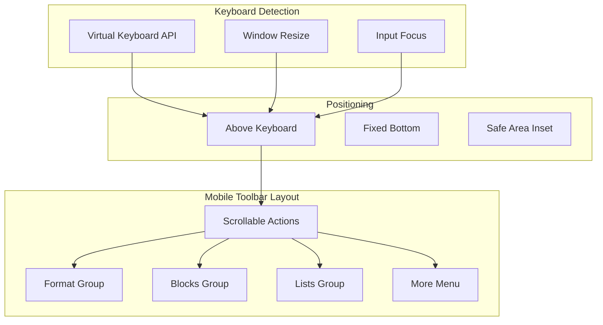

# 18: Mobile Toolbar

> Enhanced mobile experience with touch-friendly toolbar

**Duration:** 1 day  
**Dependencies:** [03-toolbar-polish.md](./03-toolbar-polish.md)

## Overview

Mobile editing requires a different approach than desktop. This document implements a touch-friendly toolbar that appears above the virtual keyboard, providing quick access to formatting options without obscuring the editing area. The toolbar handles iOS and Android keyboard differences and provides haptic feedback for interactions.



## Implementation

### 1. Mobile Detection Utilities

```typescript
// packages/editor/src/utils/mobile.ts

/**
 * Check if the device is mobile/touch
 */
export function isMobile(): boolean {
  if (typeof window === 'undefined') return false

  return (
    'ontouchstart' in window ||
    navigator.maxTouchPoints > 0 ||
    /Android|iPhone|iPad|iPod|webOS|BlackBerry|IEMobile|Opera Mini/i.test(navigator.userAgent)
  )
}

/**
 * Check if iOS device
 */
export function isIOS(): boolean {
  if (typeof navigator === 'undefined') return false

  return (
    /iPad|iPhone|iPod/.test(navigator.userAgent) ||
    (navigator.platform === 'MacIntel' && navigator.maxTouchPoints > 1)
  )
}

/**
 * Check if Android device
 */
export function isAndroid(): boolean {
  if (typeof navigator === 'undefined') return false

  return /Android/i.test(navigator.userAgent)
}

/**
 * Trigger haptic feedback if available
 */
export function hapticFeedback(style: 'light' | 'medium' | 'heavy' = 'light'): void {
  if (typeof navigator === 'undefined') return

  // iOS Haptic Feedback
  if ('vibrate' in navigator) {
    const patterns = {
      light: 10,
      medium: 20,
      heavy: 30
    }
    navigator.vibrate(patterns[style])
  }
}
```

### 2. Virtual Keyboard Hook

```typescript
// packages/editor/src/components/MobileToolbar/useVirtualKeyboard.ts

import { useState, useEffect, useCallback } from 'react'
import { isIOS, isAndroid } from '../../utils/mobile'

export interface VirtualKeyboardState {
  /** Whether the keyboard is visible */
  isVisible: boolean
  /** Height of the keyboard in pixels */
  height: number
  /** Whether the keyboard API is supported */
  isSupported: boolean
}

export function useVirtualKeyboard(): VirtualKeyboardState {
  const [state, setState] = useState<VirtualKeyboardState>({
    isVisible: false,
    height: 0,
    isSupported: false
  })

  useEffect(() => {
    if (typeof window === 'undefined') return

    // Check for VirtualKeyboard API (Chrome 94+)
    if ('virtualKeyboard' in navigator) {
      const vk = (navigator as any).virtualKeyboard

      // Opt-in to manual keyboard control
      vk.overlaysContent = true

      const handleGeometryChange = () => {
        const { height } = vk.boundingRect
        setState({
          isVisible: height > 0,
          height,
          isSupported: true
        })
      }

      vk.addEventListener('geometrychange', handleGeometryChange)

      return () => {
        vk.removeEventListener('geometrychange', handleGeometryChange)
      }
    }

    // Fallback: Use window resize and visualViewport
    const visualViewport = window.visualViewport

    if (visualViewport) {
      let initialHeight = visualViewport.height

      const handleResize = () => {
        const currentHeight = visualViewport.height
        const keyboardHeight = initialHeight - currentHeight

        // Consider keyboard visible if height difference > 150px
        const isVisible = keyboardHeight > 150

        setState({
          isVisible,
          height: isVisible ? keyboardHeight : 0,
          isSupported: true
        })
      }

      // Update initial height on orientation change
      const handleOrientationChange = () => {
        setTimeout(() => {
          initialHeight = visualViewport.height
        }, 100)
      }

      visualViewport.addEventListener('resize', handleResize)
      window.addEventListener('orientationchange', handleOrientationChange)

      return () => {
        visualViewport.removeEventListener('resize', handleResize)
        window.removeEventListener('orientationchange', handleOrientationChange)
      }
    }

    // No support
    setState((prev) => ({ ...prev, isSupported: false }))
  }, [])

  return state
}
```

### 3. Mobile Toolbar Component

```tsx
// packages/editor/src/components/MobileToolbar/MobileToolbar.tsx

import * as React from 'react'
import type { Editor } from '@tiptap/core'
import { cn } from '@xnet/ui/lib/utils'
import {
  Bold,
  Italic,
  Underline,
  Strikethrough,
  Code,
  Link,
  Heading1,
  Heading2,
  List,
  ListOrdered,
  CheckSquare,
  Quote,
  Minus,
  Undo,
  Redo,
  MoreHorizontal
} from 'lucide-react'
import { useVirtualKeyboard } from './useVirtualKeyboard'
import { hapticFeedback, isMobile } from '../../utils/mobile'

export interface MobileToolbarProps {
  editor: Editor | null
  className?: string
}

interface ToolbarAction {
  id: string
  icon: React.ComponentType<{ className?: string }>
  label: string
  isActive?: (editor: Editor) => boolean
  action: (editor: Editor) => void
  group: 'format' | 'blocks' | 'lists' | 'editor'
}

const TOOLBAR_ACTIONS: ToolbarAction[] = [
  // Format group
  {
    id: 'bold',
    icon: Bold,
    label: 'Bold',
    group: 'format',
    isActive: (editor) => editor.isActive('bold'),
    action: (editor) => editor.chain().focus().toggleBold().run()
  },
  {
    id: 'italic',
    icon: Italic,
    label: 'Italic',
    group: 'format',
    isActive: (editor) => editor.isActive('italic'),
    action: (editor) => editor.chain().focus().toggleItalic().run()
  },
  {
    id: 'underline',
    icon: Underline,
    label: 'Underline',
    group: 'format',
    isActive: (editor) => editor.isActive('underline'),
    action: (editor) => editor.chain().focus().toggleUnderline().run()
  },
  {
    id: 'strike',
    icon: Strikethrough,
    label: 'Strikethrough',
    group: 'format',
    isActive: (editor) => editor.isActive('strike'),
    action: (editor) => editor.chain().focus().toggleStrike().run()
  },
  {
    id: 'code',
    icon: Code,
    label: 'Code',
    group: 'format',
    isActive: (editor) => editor.isActive('code'),
    action: (editor) => editor.chain().focus().toggleCode().run()
  },
  {
    id: 'link',
    icon: Link,
    label: 'Link',
    group: 'format',
    isActive: (editor) => editor.isActive('link'),
    action: (editor) => {
      const url = window.prompt('URL')
      if (url) {
        editor.chain().focus().setLink({ href: url }).run()
      }
    }
  },

  // Blocks group
  {
    id: 'heading1',
    icon: Heading1,
    label: 'Heading 1',
    group: 'blocks',
    isActive: (editor) => editor.isActive('heading', { level: 1 }),
    action: (editor) => editor.chain().focus().toggleHeading({ level: 1 }).run()
  },
  {
    id: 'heading2',
    icon: Heading2,
    label: 'Heading 2',
    group: 'blocks',
    isActive: (editor) => editor.isActive('heading', { level: 2 }),
    action: (editor) => editor.chain().focus().toggleHeading({ level: 2 }).run()
  },
  {
    id: 'quote',
    icon: Quote,
    label: 'Quote',
    group: 'blocks',
    isActive: (editor) => editor.isActive('blockquote'),
    action: (editor) => editor.chain().focus().toggleBlockquote().run()
  },
  {
    id: 'divider',
    icon: Minus,
    label: 'Divider',
    group: 'blocks',
    action: (editor) => editor.chain().focus().setHorizontalRule().run()
  },

  // Lists group
  {
    id: 'bulletList',
    icon: List,
    label: 'Bullet List',
    group: 'lists',
    isActive: (editor) => editor.isActive('bulletList'),
    action: (editor) => editor.chain().focus().toggleBulletList().run()
  },
  {
    id: 'orderedList',
    icon: ListOrdered,
    label: 'Numbered List',
    group: 'lists',
    isActive: (editor) => editor.isActive('orderedList'),
    action: (editor) => editor.chain().focus().toggleOrderedList().run()
  },
  {
    id: 'taskList',
    icon: CheckSquare,
    label: 'Task List',
    group: 'lists',
    isActive: (editor) => editor.isActive('taskList'),
    action: (editor) => editor.chain().focus().toggleTaskList().run()
  },

  // Editor group
  {
    id: 'undo',
    icon: Undo,
    label: 'Undo',
    group: 'editor',
    action: (editor) => editor.chain().focus().undo().run()
  },
  {
    id: 'redo',
    icon: Redo,
    label: 'Redo',
    group: 'editor',
    action: (editor) => editor.chain().focus().redo().run()
  }
]

export function MobileToolbar({ editor, className }: MobileToolbarProps) {
  const keyboard = useVirtualKeyboard()
  const scrollRef = React.useRef<HTMLDivElement>(null)
  const [showMore, setShowMore] = React.useState(false)

  // Only show on mobile when keyboard is visible
  const shouldShow = isMobile() && keyboard.isVisible && editor

  const handleAction = React.useCallback(
    (action: ToolbarAction) => {
      if (!editor) return

      hapticFeedback('light')
      action.action(editor)
    },
    [editor]
  )

  if (!shouldShow) return null

  return (
    <div
      className={cn(
        'fixed left-0 right-0 z-50',
        'bg-white dark:bg-gray-800',
        'border-t border-gray-200 dark:border-gray-700',
        'safe-area-pb', // Tailwind plugin for safe area
        className
      )}
      style={{
        bottom: keyboard.height,
        paddingBottom: 'env(safe-area-inset-bottom, 0px)'
      }}
    >
      <div
        ref={scrollRef}
        className={cn(
          'flex items-center gap-0.5 px-2 py-1.5',
          'overflow-x-auto scrollbar-none',
          '-webkit-overflow-scrolling: touch'
        )}
      >
        {TOOLBAR_ACTIONS.map((action) => {
          const Icon = action.icon
          const isActive = action.isActive?.(editor!) ?? false

          return (
            <button
              key={action.id}
              type="button"
              onClick={() => handleAction(action)}
              className={cn(
                'flex-shrink-0 p-2.5 rounded-lg',
                'transition-colors duration-150',
                'active:scale-95 active:bg-gray-200 dark:active:bg-gray-600',
                isActive
                  ? 'bg-blue-100 text-blue-600 dark:bg-blue-900/50 dark:text-blue-400'
                  : 'text-gray-600 dark:text-gray-400'
              )}
              aria-label={action.label}
              aria-pressed={isActive}
            >
              <Icon className="w-5 h-5" />
            </button>
          )
        })}

        {/* Separator */}
        <div className="flex-shrink-0 w-px h-6 bg-gray-200 dark:bg-gray-700 mx-1" />

        {/* More button */}
        <button
          type="button"
          onClick={() => {
            hapticFeedback('medium')
            setShowMore(!showMore)
          }}
          className={cn(
            'flex-shrink-0 p-2.5 rounded-lg',
            'text-gray-600 dark:text-gray-400',
            'active:scale-95 active:bg-gray-200 dark:active:bg-gray-600'
          )}
          aria-label="More options"
          aria-expanded={showMore}
        >
          <MoreHorizontal className="w-5 h-5" />
        </button>
      </div>
    </div>
  )
}
```

### 4. Toolbar Button Component

```tsx
// packages/editor/src/components/MobileToolbar/ToolbarButton.tsx

import * as React from 'react'
import { cn } from '@xnet/ui/lib/utils'
import { hapticFeedback } from '../../utils/mobile'

export interface ToolbarButtonProps {
  icon: React.ComponentType<{ className?: string }>
  label: string
  isActive?: boolean
  disabled?: boolean
  onClick: () => void
}

export function ToolbarButton({
  icon: Icon,
  label,
  isActive = false,
  disabled = false,
  onClick
}: ToolbarButtonProps) {
  const handleClick = () => {
    if (disabled) return
    hapticFeedback('light')
    onClick()
  }

  return (
    <button
      type="button"
      onClick={handleClick}
      disabled={disabled}
      className={cn(
        'flex-shrink-0 p-2.5 rounded-lg',
        'transition-colors duration-150',
        'touch-manipulation', // Prevent double-tap zoom
        'active:scale-95',
        disabled && 'opacity-40 cursor-not-allowed',
        !disabled && 'active:bg-gray-200 dark:active:bg-gray-600',
        isActive
          ? 'bg-blue-100 text-blue-600 dark:bg-blue-900/50 dark:text-blue-400'
          : 'text-gray-600 dark:text-gray-400'
      )}
      aria-label={label}
      aria-pressed={isActive}
    >
      <Icon className="w-5 h-5" />
    </button>
  )
}
```

### 5. Safe Area CSS

```css
/* packages/editor/src/styles/mobile.css */

/* Safe area padding utilities */
.safe-area-pb {
  padding-bottom: env(safe-area-inset-bottom, 0px);
}

.safe-area-pt {
  padding-top: env(safe-area-inset-top, 0px);
}

/* Hide scrollbar but keep functionality */
.scrollbar-none {
  -ms-overflow-style: none;
  scrollbar-width: none;
}

.scrollbar-none::-webkit-scrollbar {
  display: none;
}

/* Touch optimizations */
.touch-manipulation {
  touch-action: manipulation;
}

/* Prevent text selection on toolbar */
.mobile-toolbar {
  user-select: none;
  -webkit-user-select: none;
}

/* iOS-specific keyboard handling */
@supports (-webkit-touch-callout: none) {
  .mobile-toolbar {
    /* Account for iOS toolbar */
    padding-bottom: calc(env(safe-area-inset-bottom) + 44px);
  }
}
```

### 6. Integration with Editor

```tsx
// packages/editor/src/components/RichTextEditor.tsx (with mobile toolbar)

import * as React from 'react'
import { useEditor, EditorContent } from '@tiptap/react'
import { MobileToolbar } from './MobileToolbar/MobileToolbar'
import { isMobile } from '../utils/mobile'

export function RichTextEditor(
  {
    /* ... */
  }
) {
  const editor = useEditor({
    // ... config
  })

  return (
    <div className="relative">
      <EditorContent
        editor={editor}
        className={cn(
          'xnet-editor',
          // Add bottom padding on mobile to account for toolbar
          isMobile() && 'pb-14'
        )}
      />

      {/* Mobile toolbar - only renders on mobile with keyboard visible */}
      <MobileToolbar editor={editor} />
    </div>
  )
}
```

## Tests

```typescript
// packages/editor/src/utils/mobile.test.ts

import { describe, it, expect, vi, beforeEach, afterEach } from 'vitest'
import { isMobile, isIOS, isAndroid, hapticFeedback } from './mobile'

describe('mobile utilities', () => {
  const originalNavigator = global.navigator
  const originalWindow = global.window

  afterEach(() => {
    vi.restoreAllMocks()
  })

  describe('isMobile', () => {
    it('should return true for touch devices', () => {
      Object.defineProperty(window, 'ontouchstart', {
        value: true,
        writable: true
      })

      expect(isMobile()).toBe(true)
    })

    it('should return true for mobile user agents', () => {
      Object.defineProperty(navigator, 'userAgent', {
        value: 'Mozilla/5.0 (iPhone; CPU iPhone OS 14_0 like Mac OS X)',
        writable: true
      })

      expect(isMobile()).toBe(true)
    })
  })

  describe('isIOS', () => {
    it('should return true for iPhone', () => {
      Object.defineProperty(navigator, 'userAgent', {
        value: 'Mozilla/5.0 (iPhone; CPU iPhone OS 14_0 like Mac OS X)',
        writable: true
      })

      expect(isIOS()).toBe(true)
    })

    it('should return true for iPad', () => {
      Object.defineProperty(navigator, 'userAgent', {
        value: 'Mozilla/5.0 (iPad; CPU OS 14_0 like Mac OS X)',
        writable: true
      })

      expect(isIOS()).toBe(true)
    })
  })

  describe('isAndroid', () => {
    it('should return true for Android', () => {
      Object.defineProperty(navigator, 'userAgent', {
        value: 'Mozilla/5.0 (Linux; Android 11; Pixel 5)',
        writable: true
      })

      expect(isAndroid()).toBe(true)
    })
  })

  describe('hapticFeedback', () => {
    it('should call navigator.vibrate with correct pattern', () => {
      const vibrateMock = vi.fn()
      Object.defineProperty(navigator, 'vibrate', {
        value: vibrateMock,
        writable: true
      })

      hapticFeedback('light')
      expect(vibrateMock).toHaveBeenCalledWith(10)

      hapticFeedback('medium')
      expect(vibrateMock).toHaveBeenCalledWith(20)

      hapticFeedback('heavy')
      expect(vibrateMock).toHaveBeenCalledWith(30)
    })
  })
})
```

```typescript
// packages/editor/src/components/MobileToolbar/useVirtualKeyboard.test.ts

import { describe, it, expect, vi, beforeEach, afterEach } from 'vitest'
import { renderHook, act } from '@testing-library/react'
import { useVirtualKeyboard } from './useVirtualKeyboard'

describe('useVirtualKeyboard', () => {
  beforeEach(() => {
    vi.stubGlobal('window', {
      ...window,
      visualViewport: {
        height: 800,
        addEventListener: vi.fn(),
        removeEventListener: vi.fn()
      }
    })
  })

  afterEach(() => {
    vi.unstubAllGlobals()
  })

  it('should return initial state', () => {
    const { result } = renderHook(() => useVirtualKeyboard())

    expect(result.current.isVisible).toBe(false)
    expect(result.current.height).toBe(0)
  })

  it('should detect keyboard visibility from viewport resize', () => {
    const listeners: Record<string, Function> = {}

    vi.stubGlobal('window', {
      ...window,
      visualViewport: {
        height: 800,
        addEventListener: (event: string, callback: Function) => {
          listeners[event] = callback
        },
        removeEventListener: vi.fn()
      }
    })

    const { result } = renderHook(() => useVirtualKeyboard())

    // Simulate keyboard appearing (viewport shrinks)
    act(() => {
      ;(window.visualViewport as any).height = 500
      listeners['resize']?.()
    })

    expect(result.current.isVisible).toBe(true)
    expect(result.current.height).toBe(300)
  })
})
```

```tsx
// packages/editor/src/components/MobileToolbar/MobileToolbar.test.tsx

import * as React from 'react'
import { describe, it, expect, vi, beforeEach } from 'vitest'
import { render, screen, fireEvent } from '@testing-library/react'
import { MobileToolbar } from './MobileToolbar'
import * as mobileUtils from '../../utils/mobile'
import * as keyboardHook from './useVirtualKeyboard'

vi.mock('../../utils/mobile', () => ({
  isMobile: vi.fn(),
  hapticFeedback: vi.fn()
}))

vi.mock('./useVirtualKeyboard', () => ({
  useVirtualKeyboard: vi.fn()
}))

describe('MobileToolbar', () => {
  const mockEditor = {
    chain: vi.fn(() => ({
      focus: vi.fn(() => ({
        toggleBold: vi.fn(() => ({ run: vi.fn() })),
        toggleItalic: vi.fn(() => ({ run: vi.fn() })),
        undo: vi.fn(() => ({ run: vi.fn() })),
        redo: vi.fn(() => ({ run: vi.fn() }))
      }))
    })),
    isActive: vi.fn()
  }

  beforeEach(() => {
    vi.clearAllMocks()
  })

  it('should not render on desktop', () => {
    vi.mocked(mobileUtils.isMobile).mockReturnValue(false)
    vi.mocked(keyboardHook.useVirtualKeyboard).mockReturnValue({
      isVisible: true,
      height: 300,
      isSupported: true
    })

    const { container } = render(<MobileToolbar editor={mockEditor as any} />)

    expect(container.firstChild).toBeNull()
  })

  it('should not render when keyboard is hidden', () => {
    vi.mocked(mobileUtils.isMobile).mockReturnValue(true)
    vi.mocked(keyboardHook.useVirtualKeyboard).mockReturnValue({
      isVisible: false,
      height: 0,
      isSupported: true
    })

    const { container } = render(<MobileToolbar editor={mockEditor as any} />)

    expect(container.firstChild).toBeNull()
  })

  it('should render on mobile with visible keyboard', () => {
    vi.mocked(mobileUtils.isMobile).mockReturnValue(true)
    vi.mocked(keyboardHook.useVirtualKeyboard).mockReturnValue({
      isVisible: true,
      height: 300,
      isSupported: true
    })

    render(<MobileToolbar editor={mockEditor as any} />)

    expect(screen.getByLabelText('Bold')).toBeInTheDocument()
    expect(screen.getByLabelText('Italic')).toBeInTheDocument()
  })

  it('should trigger haptic feedback on button press', () => {
    vi.mocked(mobileUtils.isMobile).mockReturnValue(true)
    vi.mocked(keyboardHook.useVirtualKeyboard).mockReturnValue({
      isVisible: true,
      height: 300,
      isSupported: true
    })

    render(<MobileToolbar editor={mockEditor as any} />)

    fireEvent.click(screen.getByLabelText('Bold'))

    expect(mobileUtils.hapticFeedback).toHaveBeenCalledWith('light')
  })

  it('should position above keyboard', () => {
    vi.mocked(mobileUtils.isMobile).mockReturnValue(true)
    vi.mocked(keyboardHook.useVirtualKeyboard).mockReturnValue({
      isVisible: true,
      height: 300,
      isSupported: true
    })

    const { container } = render(<MobileToolbar editor={mockEditor as any} />)

    const toolbar = container.firstChild as HTMLElement
    expect(toolbar.style.bottom).toBe('300px')
  })
})
```

## Checklist

- [ ] Create mobile detection utilities
- [ ] Implement useVirtualKeyboard hook
- [ ] Create MobileToolbar component
- [ ] Add all formatting actions
- [ ] Add haptic feedback
- [ ] Handle safe area insets
- [ ] Support iOS keyboard
- [ ] Support Android keyboard
- [ ] Add horizontal scrolling
- [ ] Style with Tailwind
- [ ] Add dark mode support
- [ ] Write tests
- [ ] Tests pass

---

[Back to README](./README.md) | [Previous: Keyboard Shortcuts](./17-keyboard-shortcuts.md) | [Next: Accessibility](./19-accessibility.md)
