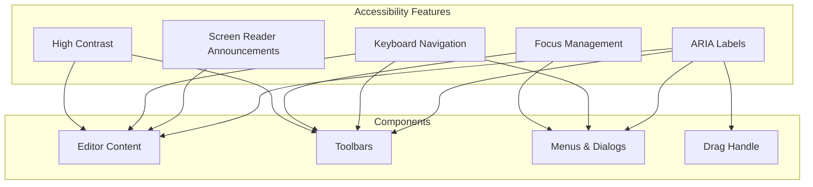

# 19: Accessibility

> ARIA labels, screen reader support, and keyboard navigation

**Duration:** 1 day  
**Dependencies:** [17-keyboard-shortcuts.md](./17-keyboard-shortcuts.md), [18-mobile-toolbar.md](./18-mobile-toolbar.md)

## Overview

Accessibility is essential for an inclusive editor experience. This document implements comprehensive accessibility support including ARIA labels, screen reader announcements, keyboard navigation, focus management, and high contrast mode support. The implementation follows WCAG 2.1 AA guidelines.



## Implementation

### 1. ARIA Live Region for Announcements

```typescript
// packages/editor/src/accessibility/announcer.ts

/**
 * Screen reader announcer for dynamic content changes
 */
class ScreenReaderAnnouncer {
  private container: HTMLElement | null = null
  private timeout: ReturnType<typeof setTimeout> | null = null

  /**
   * Initialize the announcer
   * Should be called once when the app loads
   */
  init(): void {
    if (typeof document === 'undefined') return
    if (this.container) return

    this.container = document.createElement('div')
    this.container.setAttribute('role', 'status')
    this.container.setAttribute('aria-live', 'polite')
    this.container.setAttribute('aria-atomic', 'true')
    this.container.className = 'sr-only'
    this.container.style.cssText = `
      position: absolute;
      width: 1px;
      height: 1px;
      padding: 0;
      margin: -1px;
      overflow: hidden;
      clip: rect(0, 0, 0, 0);
      white-space: nowrap;
      border: 0;
    `

    document.body.appendChild(this.container)
  }

  /**
   * Announce a message to screen readers
   */
  announce(message: string, priority: 'polite' | 'assertive' = 'polite'): void {
    if (!this.container) {
      this.init()
    }

    if (!this.container) return

    // Clear any pending announcements
    if (this.timeout) {
      clearTimeout(this.timeout)
    }

    // Set priority
    this.container.setAttribute('aria-live', priority)

    // Clear and set message (triggers announcement)
    this.container.textContent = ''

    this.timeout = setTimeout(() => {
      if (this.container) {
        this.container.textContent = message
      }
    }, 100)
  }

  /**
   * Clean up the announcer
   */
  destroy(): void {
    if (this.timeout) {
      clearTimeout(this.timeout)
    }
    this.container?.remove()
    this.container = null
  }
}

export const announcer = new ScreenReaderAnnouncer()

/**
 * Announce a message to screen readers
 */
export function announce(message: string, priority: 'polite' | 'assertive' = 'polite'): void {
  announcer.announce(message, priority)
}
```

### 2. Accessible Editor Wrapper

```tsx
// packages/editor/src/components/AccessibleEditor/AccessibleEditor.tsx

import * as React from 'react'
import type { Editor } from '@tiptap/core'
import { EditorContent } from '@tiptap/react'
import { cn } from '@xnet/ui/lib/utils'
import { announce } from '../../accessibility/announcer'

export interface AccessibleEditorProps {
  editor: Editor | null
  label: string
  description?: string
  className?: string
}

export function AccessibleEditor({ editor, label, description, className }: AccessibleEditorProps) {
  const editorId = React.useId()
  const descriptionId = React.useId()

  // Announce formatting changes
  React.useEffect(() => {
    if (!editor) return

    const handleSelectionUpdate = () => {
      const marks: string[] = []

      if (editor.isActive('bold')) marks.push('bold')
      if (editor.isActive('italic')) marks.push('italic')
      if (editor.isActive('underline')) marks.push('underline')
      if (editor.isActive('strike')) marks.push('strikethrough')
      if (editor.isActive('code')) marks.push('code')

      if (marks.length > 0) {
        // Only announce on explicit format changes, not every selection
        // This would need more sophisticated tracking
      }
    }

    editor.on('selectionUpdate', handleSelectionUpdate)

    return () => {
      editor.off('selectionUpdate', handleSelectionUpdate)
    }
  }, [editor])

  // Announce block type changes
  React.useEffect(() => {
    if (!editor) return

    const handleUpdate = () => {
      // Track block type changes for announcements
    }

    editor.on('update', handleUpdate)

    return () => {
      editor.off('update', handleUpdate)
    }
  }, [editor])

  return (
    <div className={cn('relative', className)}>
      {/* Hidden label for screen readers */}
      <label id={editorId} className="sr-only">
        {label}
      </label>

      {/* Hidden description */}
      {description && (
        <p id={descriptionId} className="sr-only">
          {description}
        </p>
      )}

      {/* Editor content with ARIA attributes */}
      <EditorContent
        editor={editor}
        aria-labelledby={editorId}
        aria-describedby={description ? descriptionId : undefined}
        aria-multiline="true"
        role="textbox"
      />
    </div>
  )
}
```

### 3. Accessible Toolbar

```tsx
// packages/editor/src/components/AccessibleToolbar/AccessibleToolbar.tsx

import * as React from 'react'
import type { Editor } from '@tiptap/core'
import { cn } from '@xnet/ui/lib/utils'
import { announce } from '../../accessibility/announcer'

export interface AccessibleToolbarProps {
  editor: Editor | null
  children: React.ReactNode
  label?: string
  className?: string
}

export function AccessibleToolbar({
  editor,
  children,
  label = 'Formatting toolbar',
  className
}: AccessibleToolbarProps) {
  const toolbarRef = React.useRef<HTMLDivElement>(null)
  const [focusIndex, setFocusIndex] = React.useState(0)

  // Get all focusable buttons
  const getButtons = (): HTMLButtonElement[] => {
    if (!toolbarRef.current) return []
    return Array.from(toolbarRef.current.querySelectorAll('button:not([disabled])'))
  }

  // Handle keyboard navigation within toolbar
  const handleKeyDown = (event: React.KeyboardEvent) => {
    const buttons = getButtons()
    if (buttons.length === 0) return

    switch (event.key) {
      case 'ArrowRight':
      case 'ArrowDown': {
        event.preventDefault()
        const nextIndex = (focusIndex + 1) % buttons.length
        setFocusIndex(nextIndex)
        buttons[nextIndex]?.focus()
        break
      }

      case 'ArrowLeft':
      case 'ArrowUp': {
        event.preventDefault()
        const prevIndex = (focusIndex - 1 + buttons.length) % buttons.length
        setFocusIndex(prevIndex)
        buttons[prevIndex]?.focus()
        break
      }

      case 'Home': {
        event.preventDefault()
        setFocusIndex(0)
        buttons[0]?.focus()
        break
      }

      case 'End': {
        event.preventDefault()
        const lastIndex = buttons.length - 1
        setFocusIndex(lastIndex)
        buttons[lastIndex]?.focus()
        break
      }
    }
  }

  return (
    <div
      ref={toolbarRef}
      role="toolbar"
      aria-label={label}
      aria-orientation="horizontal"
      className={cn('flex items-center gap-1', className)}
      onKeyDown={handleKeyDown}
    >
      {children}
    </div>
  )
}
```

### 4. Accessible Toolbar Button

```tsx
// packages/editor/src/components/AccessibleToolbar/ToolbarButton.tsx

import * as React from 'react'
import { cn } from '@xnet/ui/lib/utils'
import { announce } from '../../accessibility/announcer'

export interface ToolbarButtonProps {
  icon: React.ComponentType<{ className?: string }>
  label: string
  shortcut?: string
  isActive?: boolean
  disabled?: boolean
  onClick: () => void
  tabIndex?: number
}

export function ToolbarButton({
  icon: Icon,
  label,
  shortcut,
  isActive = false,
  disabled = false,
  onClick,
  tabIndex = -1
}: ToolbarButtonProps) {
  const handleClick = () => {
    if (disabled) return

    onClick()

    // Announce the action
    const action = isActive ? 'removed' : 'applied'
    announce(`${label} ${action}`)
  }

  const handleKeyDown = (event: React.KeyboardEvent) => {
    if (event.key === 'Enter' || event.key === ' ') {
      event.preventDefault()
      handleClick()
    }
  }

  // Build accessible label with shortcut
  const accessibleLabel = shortcut ? `${label} (${shortcut})` : label

  return (
    <button
      type="button"
      onClick={handleClick}
      onKeyDown={handleKeyDown}
      disabled={disabled}
      tabIndex={tabIndex}
      aria-label={accessibleLabel}
      aria-pressed={isActive}
      aria-disabled={disabled}
      className={cn(
        'p-2 rounded-md',
        'transition-colors duration-150',
        'focus:outline-none focus-visible:ring-2 focus-visible:ring-blue-500',
        disabled && 'opacity-40 cursor-not-allowed',
        isActive
          ? 'bg-blue-100 text-blue-700 dark:bg-blue-900/50 dark:text-blue-300'
          : 'text-gray-600 hover:bg-gray-100 dark:text-gray-400 dark:hover:bg-gray-700'
      )}
    >
      <Icon className="w-4 h-4" aria-hidden="true" />
    </button>
  )
}
```

### 5. Focus Trap for Modals

```typescript
// packages/editor/src/accessibility/focus-trap.ts

/**
 * Trap focus within an element
 */
export function createFocusTrap(element: HTMLElement) {
  const focusableSelectors = [
    'a[href]',
    'button:not([disabled])',
    'input:not([disabled])',
    'select:not([disabled])',
    'textarea:not([disabled])',
    '[tabindex]:not([tabindex="-1"])'
  ].join(', ')

  let previousActiveElement: Element | null = null

  const getFocusableElements = (): HTMLElement[] => {
    return Array.from(element.querySelectorAll(focusableSelectors))
  }

  const handleKeyDown = (event: KeyboardEvent) => {
    if (event.key !== 'Tab') return

    const focusableElements = getFocusableElements()
    if (focusableElements.length === 0) return

    const firstElement = focusableElements[0]
    const lastElement = focusableElements[focusableElements.length - 1]

    if (event.shiftKey) {
      // Shift + Tab
      if (document.activeElement === firstElement) {
        event.preventDefault()
        lastElement.focus()
      }
    } else {
      // Tab
      if (document.activeElement === lastElement) {
        event.preventDefault()
        firstElement.focus()
      }
    }
  }

  return {
    activate() {
      previousActiveElement = document.activeElement

      // Focus first focusable element
      const focusableElements = getFocusableElements()
      if (focusableElements.length > 0) {
        focusableElements[0].focus()
      }

      element.addEventListener('keydown', handleKeyDown)
    },

    deactivate() {
      element.removeEventListener('keydown', handleKeyDown)

      // Restore focus
      if (previousActiveElement instanceof HTMLElement) {
        previousActiveElement.focus()
      }
    }
  }
}
```

### 6. React Hook for Focus Trap

```typescript
// packages/editor/src/accessibility/useFocusTrap.ts

import { useEffect, useRef } from 'react'
import { createFocusTrap } from './focus-trap'

export interface UseFocusTrapOptions {
  enabled?: boolean
}

export function useFocusTrap<T extends HTMLElement>(options: UseFocusTrapOptions = {}) {
  const { enabled = true } = options
  const ref = useRef<T>(null)
  const trapRef = useRef<ReturnType<typeof createFocusTrap> | null>(null)

  useEffect(() => {
    if (!enabled || !ref.current) return

    trapRef.current = createFocusTrap(ref.current)
    trapRef.current.activate()

    return () => {
      trapRef.current?.deactivate()
    }
  }, [enabled])

  return ref
}
```

### 7. High Contrast Mode Support

```css
/* packages/editor/src/styles/accessibility.css */

/* Screen reader only utility */
.sr-only {
  position: absolute;
  width: 1px;
  height: 1px;
  padding: 0;
  margin: -1px;
  overflow: hidden;
  clip: rect(0, 0, 0, 0);
  white-space: nowrap;
  border: 0;
}

/* Focus visible styles */
.focus-visible:focus {
  outline: 2px solid var(--xnet-focus-ring, #3b82f6);
  outline-offset: 2px;
}

/* High contrast mode */
@media (prefers-contrast: high) {
  .xnet-editor {
    border: 2px solid currentColor;
  }

  .xnet-toolbar button {
    border: 1px solid currentColor;
  }

  .xnet-toolbar button[aria-pressed='true'] {
    background-color: currentColor;
    color: Canvas;
  }

  .xnet-drop-indicator {
    background-color: currentColor;
    height: 3px;
  }

  /* Ensure sufficient color contrast */
  .xnet-syntax {
    opacity: 0.8;
  }
}

/* Reduced motion */
@media (prefers-reduced-motion: reduce) {
  .xnet-editor,
  .xnet-editor * {
    animation-duration: 0.01ms !important;
    animation-iteration-count: 1 !important;
    transition-duration: 0.01ms !important;
  }
}

/* Windows High Contrast Mode */
@media (forced-colors: active) {
  .xnet-toolbar button {
    border: 1px solid ButtonText;
  }

  .xnet-toolbar button[aria-pressed='true'] {
    background-color: Highlight;
    color: HighlightText;
  }

  .xnet-drop-indicator {
    background-color: Highlight;
  }

  .xnet-drag-handle {
    color: ButtonText;
  }
}
```

### 8. Accessible Slash Command Menu

```tsx
// packages/editor/src/components/SlashMenu/AccessibleSlashMenu.tsx

import * as React from 'react'
import { cn } from '@xnet/ui/lib/utils'
import { useFocusTrap } from '../../accessibility/useFocusTrap'
import { announce } from '../../accessibility/announcer'
import type { SlashCommandItem } from '../../extensions/slash-command/types'

export interface AccessibleSlashMenuProps {
  items: SlashCommandItem[]
  selectedIndex: number
  onSelect: (item: SlashCommandItem) => void
  onClose: () => void
}

export function AccessibleSlashMenu({
  items,
  selectedIndex,
  onSelect,
  onClose
}: AccessibleSlashMenuProps) {
  const menuRef = useFocusTrap<HTMLDivElement>({ enabled: true })
  const listRef = React.useRef<HTMLUListElement>(null)

  // Announce when menu opens
  React.useEffect(() => {
    announce(`Command menu opened. ${items.length} items available. Use arrow keys to navigate.`)

    return () => {
      announce('Command menu closed')
    }
  }, [items.length])

  // Announce selected item
  React.useEffect(() => {
    if (items[selectedIndex]) {
      announce(items[selectedIndex].title, 'assertive')
    }
  }, [selectedIndex, items])

  // Scroll selected item into view
  React.useEffect(() => {
    const list = listRef.current
    if (!list) return

    const selectedElement = list.children[selectedIndex] as HTMLElement
    if (selectedElement) {
      selectedElement.scrollIntoView({ block: 'nearest' })
    }
  }, [selectedIndex])

  const handleKeyDown = (event: React.KeyboardEvent) => {
    switch (event.key) {
      case 'Escape':
        event.preventDefault()
        onClose()
        break

      case 'Enter':
        event.preventDefault()
        if (items[selectedIndex]) {
          onSelect(items[selectedIndex])
        }
        break
    }
  }

  return (
    <div
      ref={menuRef}
      role="listbox"
      aria-label="Editor commands"
      aria-activedescendant={items[selectedIndex]?.id}
      className={cn(
        'bg-white dark:bg-gray-800 rounded-lg shadow-lg',
        'border border-gray-200 dark:border-gray-700',
        'max-h-64 overflow-y-auto',
        'focus:outline-none'
      )}
      onKeyDown={handleKeyDown}
      tabIndex={0}
    >
      <ul ref={listRef} role="presentation">
        {items.map((item, index) => (
          <li
            key={item.id}
            id={item.id}
            role="option"
            aria-selected={index === selectedIndex}
            className={cn(
              'flex items-center gap-3 px-3 py-2 cursor-pointer',
              'transition-colors duration-75',
              index === selectedIndex
                ? 'bg-blue-50 dark:bg-blue-900/30'
                : 'hover:bg-gray-50 dark:hover:bg-gray-700/50'
            )}
            onClick={() => onSelect(item)}
          >
            <span className="text-lg" aria-hidden="true">
              {typeof item.icon === 'string' ? item.icon : null}
            </span>
            <div>
              <div className="font-medium text-gray-900 dark:text-gray-100">{item.title}</div>
              <div className="text-sm text-gray-500 dark:text-gray-400">{item.description}</div>
            </div>
            {item.shortcut && (
              <kbd
                className="ml-auto text-xs text-gray-400 dark:text-gray-500"
                aria-label={`Keyboard shortcut: ${item.shortcut}`}
              >
                {item.shortcut}
              </kbd>
            )}
          </li>
        ))}
      </ul>

      {items.length === 0 && (
        <div className="px-3 py-4 text-center text-gray-500 dark:text-gray-400" role="status">
          No commands found
        </div>
      )}
    </div>
  )
}
```

## Tests

```typescript
// packages/editor/src/accessibility/announcer.test.ts

import { describe, it, expect, vi, beforeEach, afterEach } from 'vitest'
import { announcer, announce } from './announcer'

describe('Screen Reader Announcer', () => {
  beforeEach(() => {
    announcer.init()
  })

  afterEach(() => {
    announcer.destroy()
  })

  it('should create a live region element', () => {
    const liveRegion = document.querySelector('[role="status"]')
    expect(liveRegion).not.toBeNull()
  })

  it('should have correct ARIA attributes', () => {
    const liveRegion = document.querySelector('[role="status"]')
    expect(liveRegion?.getAttribute('aria-live')).toBe('polite')
    expect(liveRegion?.getAttribute('aria-atomic')).toBe('true')
  })

  it('should be visually hidden', () => {
    const liveRegion = document.querySelector('[role="status"]') as HTMLElement
    expect(liveRegion?.style.position).toBe('absolute')
    expect(liveRegion?.style.width).toBe('1px')
  })

  it('should announce messages', async () => {
    vi.useFakeTimers()

    announce('Test message')

    vi.advanceTimersByTime(100)

    const liveRegion = document.querySelector('[role="status"]')
    expect(liveRegion?.textContent).toBe('Test message')

    vi.useRealTimers()
  })

  it('should support assertive priority', () => {
    announce('Urgent message', 'assertive')

    const liveRegion = document.querySelector('[role="status"]')
    expect(liveRegion?.getAttribute('aria-live')).toBe('assertive')
  })
})
```

```typescript
// packages/editor/src/accessibility/focus-trap.test.ts

import { describe, it, expect, vi, beforeEach, afterEach } from 'vitest'
import { createFocusTrap } from './focus-trap'

describe('Focus Trap', () => {
  let container: HTMLElement

  beforeEach(() => {
    container = document.createElement('div')
    container.innerHTML = `
      <button id="btn1">Button 1</button>
      <button id="btn2">Button 2</button>
      <button id="btn3">Button 3</button>
    `
    document.body.appendChild(container)
  })

  afterEach(() => {
    container.remove()
  })

  it('should focus first element on activate', () => {
    const trap = createFocusTrap(container)
    trap.activate()

    expect(document.activeElement?.id).toBe('btn1')

    trap.deactivate()
  })

  it('should restore focus on deactivate', () => {
    const outsideButton = document.createElement('button')
    outsideButton.id = 'outside'
    document.body.appendChild(outsideButton)
    outsideButton.focus()

    const trap = createFocusTrap(container)
    trap.activate()

    expect(document.activeElement?.id).toBe('btn1')

    trap.deactivate()

    expect(document.activeElement?.id).toBe('outside')

    outsideButton.remove()
  })

  it('should trap Tab at end', () => {
    const trap = createFocusTrap(container)
    trap.activate()

    const btn3 = container.querySelector('#btn3') as HTMLElement
    btn3.focus()

    const event = new KeyboardEvent('keydown', {
      key: 'Tab',
      bubbles: true
    })
    const preventDefault = vi.spyOn(event, 'preventDefault')

    container.dispatchEvent(event)

    expect(preventDefault).toHaveBeenCalled()
    expect(document.activeElement?.id).toBe('btn1')

    trap.deactivate()
  })

  it('should trap Shift+Tab at start', () => {
    const trap = createFocusTrap(container)
    trap.activate()

    const event = new KeyboardEvent('keydown', {
      key: 'Tab',
      shiftKey: true,
      bubbles: true
    })
    const preventDefault = vi.spyOn(event, 'preventDefault')

    container.dispatchEvent(event)

    expect(preventDefault).toHaveBeenCalled()
    expect(document.activeElement?.id).toBe('btn3')

    trap.deactivate()
  })
})
```

```tsx
// packages/editor/src/components/AccessibleToolbar/ToolbarButton.test.tsx

import * as React from 'react'
import { describe, it, expect, vi } from 'vitest'
import { render, screen, fireEvent } from '@testing-library/react'
import { ToolbarButton } from './ToolbarButton'
import { Bold } from 'lucide-react'

vi.mock('../../accessibility/announcer', () => ({
  announce: vi.fn()
}))

import { announce } from '../../accessibility/announcer'

describe('ToolbarButton', () => {
  it('should render with accessible label', () => {
    render(<ToolbarButton icon={Bold} label="Bold" onClick={() => {}} />)

    expect(screen.getByLabelText('Bold')).toBeInTheDocument()
  })

  it('should include shortcut in label', () => {
    render(<ToolbarButton icon={Bold} label="Bold" shortcut="Cmd+B" onClick={() => {}} />)

    expect(screen.getByLabelText('Bold (Cmd+B)')).toBeInTheDocument()
  })

  it('should have aria-pressed for toggle buttons', () => {
    const { rerender } = render(
      <ToolbarButton icon={Bold} label="Bold" isActive={false} onClick={() => {}} />
    )

    expect(screen.getByRole('button')).toHaveAttribute('aria-pressed', 'false')

    rerender(<ToolbarButton icon={Bold} label="Bold" isActive={true} onClick={() => {}} />)

    expect(screen.getByRole('button')).toHaveAttribute('aria-pressed', 'true')
  })

  it('should announce action on click', () => {
    render(<ToolbarButton icon={Bold} label="Bold" isActive={false} onClick={() => {}} />)

    fireEvent.click(screen.getByRole('button'))

    expect(announce).toHaveBeenCalledWith('Bold applied')
  })

  it('should announce removal when deactivating', () => {
    render(<ToolbarButton icon={Bold} label="Bold" isActive={true} onClick={() => {}} />)

    fireEvent.click(screen.getByRole('button'))

    expect(announce).toHaveBeenCalledWith('Bold removed')
  })

  it('should be keyboard accessible', () => {
    const onClick = vi.fn()
    render(<ToolbarButton icon={Bold} label="Bold" onClick={onClick} />)

    const button = screen.getByRole('button')
    fireEvent.keyDown(button, { key: 'Enter' })

    expect(onClick).toHaveBeenCalled()
  })

  it('should support Space key', () => {
    const onClick = vi.fn()
    render(<ToolbarButton icon={Bold} label="Bold" onClick={onClick} />)

    const button = screen.getByRole('button')
    fireEvent.keyDown(button, { key: ' ' })

    expect(onClick).toHaveBeenCalled()
  })
})
```

## Checklist

- [ ] Create screen reader announcer
- [ ] Add ARIA labels to editor
- [ ] Add ARIA labels to toolbars
- [ ] Implement keyboard navigation for toolbar
- [ ] Create focus trap utility
- [ ] Add focus trap to modals
- [ ] Support high contrast mode
- [ ] Support reduced motion
- [ ] Support Windows High Contrast Mode
- [ ] Add accessible slash command menu
- [ ] Announce format changes
- [ ] Announce menu open/close
- [ ] Write tests
- [ ] Tests pass

---

[Back to README](./README.md) | [Previous: Mobile Toolbar](./18-mobile-toolbar.md) | [Next: Performance](./20-performance.md)
